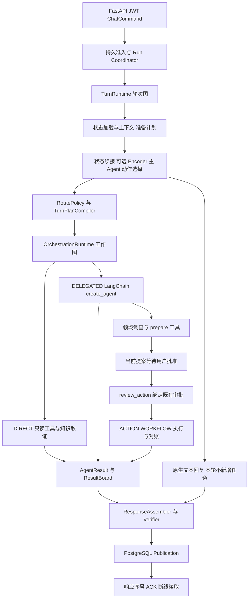

# DialogPilot 架构边界

> 校准日期：2026-09-09。源码冻结于 `89feac2`，包含 `d8e8933` 主 Agent 职责调整和本轮 task22 结果。本页更新网页，不代表 main 的应用代码同步部署。源码链接固定到该提交；并行工作区的未提交修改单列在[源码快照]({{ '/assets/handbook/source-snapshot.json' | relative_url }})，不作为已交付能力。

## 快速导航

[按简历五条经历串联本页实现、选型和验证]({{ '/project-pitch.html#resume-map' | relative_url }})；已补充61a9b88审批交付修复与操作集合的进行中边界，详见[当前工作]({{ '/project-pitch.html#resume-current-work' | relative_url }})。

框架原理、防循环和后端准备见[LangChain / LangGraph / FastAPI / Redis / SQL专题]({{ '/framework-backend.html' | relative_url }})。

先读本页把调用链串起来，再用[详细面试追问]({{ '/interview-guide.html' | relative_url }})练原理、取舍与反问，最后用[项目讲述与简历]({{ '/project-pitch.html' | relative_url }})组织开场。RAG 专题见[离线在线与评测手册]({{ '/rag-study.html' | relative_url }})，外部依据见[来源与证据]({{ '/handbook-evidence.html' | relative_url }})。

本文有意区分三层：模型负责判断要做什么；应用合同决定什么可以执行；持久业务记录决定实际上发生了什么。会说“退款完成”的模型、已跑完的图、数据库中的退款回执是三个不同事实。

## 1. 用一件客服任务解释整个系统

用户说：“查一下订单配送，如果已经签收，看看这个产品拆封后还能不能退，先别提交退款。”系统需要识别三个信息：订单是谁、配送是否完成、退货政策适用什么条件；同时保留“先别提交”的限制。

入口先从 JWT 得到可信用户，保存请求身份，才开始模型工作。ConversationAgent 可以选择直接订单查询，也可以把政策咨询交给领域 Worker；明确依赖时，政策任务等订单事实到达再执行，独立的产品说明可以并行。每个任务带自己的 Owner、允许工具、依赖和预算。Worker 获得订单回执和知识证据后返回类型化结果。ResultBoard 判断各项是否完成、缺什么；ResponseAssembler 把结果组织成自然语言，Verifier 检查结论是否受证据支持、是否回答了需求。最终回答持久化后交付。

即使发现可退，也不能把“可以退”变成“已经退”。领域 Agent 若准备退款，只能生成待审批动作；用户批准后还要核对操作绑定和目标版本。若请求中断，恢复图位置不等于重做退款，已提交回执可以重放，结果未知先对账。这就是项目的主线：理解、执行和交付都保留可以核查的状态。

## 2. 当前代码与旧介绍的关键差异

| 问题 | 当前可以讲的事实 | 不应继续沿用的旧结论 |
|---|---|---|
| 是否使用框架 | LangChain `create_agent` 承载领域工具循环，LangGraph 管任务图和恢复 | “全部手写循环、没有使用 LangChain/LangGraph” |
| Encoder | 六域加 DEFER 的上下文分类入口，默认关闭；候选未通过采用门槛 | “高精度 Encoder 已常态绕过模型”“分类直接批准写操作” |
| 主规划接口 | 原生文本回复、直接只读、知识查询、领域委派与已绑定交互决策；新写操作由领域准备 | “主 Agent 直接选择 cancel_order/change_address/execute_refund/freeze_account 准备快捷动作” |
| 角色上下文 | 主 Agent 看简短领域卡片与适用业务政策，领域 Worker 看操作前置条件和可调用准备工具 | “把全部写操作协议塞进主规划更完整” |
| 待补信息 | 模型看到语义字段名，程序私下保存任务与字段绑定 | “模型自己填写 target_work_item_id 就能续接” |
| 回答范围 | requested_objective、observed_segment、pending_actions 与 turn_execution 分开表达 | “一个 Worker 段结束就表示整个诉求已完成或正在后台继续” |
| 知识词法排序 | Knowledge generation 声明 `PG_BM25_ZH_V1`，底层仍支持 FTS 排序路径 | “ts_rank_cd 就是 BM25” |
| Dense | 可选 hash_baseline/BGE-M3；示例环境默认 hash，语义实验明确选择 BGE | “所有本地默认都是训练好的 BGE” |
| 索引 | Knowledge 导入创建 generation 级 HNSW；查询是否实际使用须看执行计划 | “有 HNSW 配置就等于所有请求都走 ANN” |
| 融合 | Dense/Lexical 启动默认 0.5/0.5，在线受 Bundle/环境覆盖影响 | “当前唯一权重是 0.25/0.75” |
| 核验效果 | 有 PASS/REJECT/UNKNOWN 合同，也有误通过的开发证据 | “verified=true 就是正确率”“已达生产质量” |

源码：[infrastructure/target_runtime_composition.py](https://github.com/Garrulus21yyx/DialogPilot/blob/89feac2e63b31113530864814188f0a4a61708bc/infrastructure/target_runtime_composition.py)、[application/target_encoder_understanding.py](https://github.com/Garrulus21yyx/DialogPilot/blob/89feac2e63b31113530864814188f0a4a61708bc/application/target_encoder_understanding.py)、[infrastructure/target_conversation_provider.py](https://github.com/Garrulus21yyx/DialogPilot/blob/89feac2e63b31113530864814188f0a4a61708bc/infrastructure/target_conversation_provider.py)、[infrastructure/postgres_knowledge_store.py](https://github.com/Garrulus21yyx/DialogPilot/blob/89feac2e63b31113530864814188f0a4a61708bc/infrastructure/postgres_knowledge_store.py)、[core/rag_policy.py](https://github.com/Garrulus21yyx/DialogPilot/blob/89feac2e63b31113530864814188f0a4a61708bc/core/rag_policy.py)。

## 3. 代码库怎么读：目录是分工，不是流水线顺序

| 目录 | 具体职责与起点 | 修改一个需求时应想到谁 |
|---|---|---|
| `api/` | `main.py` 启动装配、鉴权依赖、HTTP 请求和结果映射 | 新增接口字段、上传或响应协议 |
| `application/` | `target_run.py`、`turn_runtime.py`、`turn_planning.py`、`write_workflow.py`、`result_board.py` | 业务状态、合法转移、任务和返回值的含义 |
| `infrastructure/` | PG 存储、LangChain/LangGraph 绑定、模型和检索适配 | 框架协议、数据库 SQL、外部依赖失败 |
| `core/` | identity、auth、model_policy、输入安全、结构化调用、预算和 trace | 跨模块身份与公共运行约束 |
| `mcp/` | ToolManager、业务工具包装、query transformer、packer、evidence pack | 工具输入输出、检索证据转换；目录名不等于全部走远端 MCP |
| `services/` | customer_operations、claim_verification、answer_verifier、ticket、commitment | 业务行为与候选答复语义评审 |
| `memory/` | 会话窗口与上下文兼容层；长期事实由 application/infrastructure 实现 | 窗口、摘要与持久来源如何拼接 |
| `agents/`、`skills/` | 媒体需求与可选复合能力资源 | 领域策略和按需复合工具；不是六套复制的 Agent 类 |
| `evaluation/` | 数据合同、scorer、τ³ adapter、纯 RAG、训练与校准 | 输入与 gold 隔离、指标分母、模型评估 |
| `scripts/` | 可复现运行、导入、评测、恢复、汇总入口 | 固定一次实验的命令与产物 |
| `migrations/` | PostgreSQL schema 演进 | 新字段、约束、索引和恢复兼容 |
| `tests/` | 合同、性质、状态转移、真实 PG 与 HTTP 回归 | 某个设计到底保证什么 |
| `data/`、`artifacts/` | 数据 manifest、分组 split、运行记录与模型产物 | 结果能否对应同一输入/代码/预算 |
| `docs/`、`plans/` | 解释、证据、活动状态 | 历史结果不能覆盖最新未完成状态 |

阅读顺序是 `api/main.py → target_runtime_composition.py → target_run.py → turn_runtime.py → target_conversation_manager.py → orchestration_runtime.py → 具体 executor → response_assembly.py → publication`。找一个类名不等于确定它在线使用；必须确认启动时的装配和调用点。

## 4. 三层图与实际调用链

第一层是 durable run：负责请求被接收后谁执行、租约是否仍属于它、什么时候选择终态。第二层是 TurnRuntime：准备当前轮、执行任务、提交进度、处理后续、组织回答。第三层是工作图，按依赖调度 WorkItem；其中一个领域 Worker 内部还有框架模型—工具循环。它们不是三次重复规划：每层的状态粒度不同。

`TargetRunCoordinator.handle` 准入请求；`TargetRunWorker` claim/renew/assert_owned，避免失去租约的旧 worker 随意写终态。`TurnRuntime` 使用 checkpointer 保存轮次阶段。`TargetConversationManager` 负责状态解释、接受计划和工作流生命周期。`OrchestrationRuntime` 根据 ResultBoard 的 ready_items 分发 `Send`。领域执行器统一由 `TargetFrameworkAgent` 装配 `create_agent`，直接调用与受控写则走独立执行边界。

源码：[application/target_run.py](https://github.com/Garrulus21yyx/DialogPilot/blob/89feac2e63b31113530864814188f0a4a61708bc/application/target_run.py)、[application/turn_runtime.py](https://github.com/Garrulus21yyx/DialogPilot/blob/89feac2e63b31113530864814188f0a4a61708bc/application/turn_runtime.py)、[application/target_conversation_manager.py](https://github.com/Garrulus21yyx/DialogPilot/blob/89feac2e63b31113530864814188f0a4a61708bc/application/target_conversation_manager.py)、[application/orchestration_runtime.py](https://github.com/Garrulus21yyx/DialogPilot/blob/89feac2e63b31113530864814188f0a4a61708bc/application/orchestration_runtime.py)。

## 5. 意图、规划、授权为何分开

意图分类回答“属于哪个领域”，主 Agent 判断“直接回答、读取信息还是交给专家”，领域 Agent 判断“怎样完成业务目标”，Runtime 决定“准备好的动作能否执行”。比如“帮我改地址”足够触发委派，但不等于已经选定订单、满足修改条件或批准一次具体写操作。

可选 TargetDomainEncoder 仍是六领域加 DEFER 的 Transformers 序列分类器，检查模型制品身份、置信度与 margin。示例默认关闭；已有失败候选不能作为线上收益。接受的领域判断也只是进入相同 Policy 的委派提案。

本次核心变化是主规划职责收缩。`planning_actions(payload)` 只暴露本轮可用的读取、知识、委派和状态续接能力；取消订单、修改地址、退款、冻结账户不再是主 Agent 的直接新动作快捷入口。对应业务能力仍存在，由 `delegate_task(target_agent, objective, allow_action_proposals)` 交给领域 Worker。objective 要保留已知信息、条件、否定和相关目标；不能把原请求改写成只查一次前置条件。

普通对话与真正的意图澄清使用模型原生文本；有工作时使用原生 tool calls。Provider 经 `bind_tools(..., tool_choice='auto')` 接收调用，`action_proposal` 转成内部提案，Policy 和 Compiler 校验后产生 WorkPlan。没有另造“回复工具”，也没有新增第二个规划模型。工具调用前的说明文字不当作业务结果发布。

主 Agent 仍拿到领域路由卡片和适用业务政策，因为政策也可能约束读取与委派；它不再拿到原始写操作语义目录。领域 Worker 保留操作前置条件、效果和准备工具协议。这是按职责配置可见上下文，不是把业务规则删掉。

已有等待状态走原来的 `review_action`、`supply_input`、`continue_active_work` 等绑定接口：批准当前提案不重新生成提案；拒绝一个动作不等于取消全部目标。只有需要新业务调查或改变范围时，才委派或修订对应工作。

源码：[application/conversation_agent.py](https://github.com/Garrulus21yyx/DialogPilot/blob/89feac2e63b31113530864814188f0a4a61708bc/application/conversation_agent.py)、[application/conversation_actions.py](https://github.com/Garrulus21yyx/DialogPilot/blob/89feac2e63b31113530864814188f0a4a61708bc/application/conversation_actions.py)、[application/agent_instructions.py](https://github.com/Garrulus21yyx/DialogPilot/blob/89feac2e63b31113530864814188f0a4a61708bc/application/agent_instructions.py)、[infrastructure/target_conversation_provider.py](https://github.com/Garrulus21yyx/DialogPilot/blob/89feac2e63b31113530864814188f0a4a61708bc/infrastructure/target_conversation_provider.py)、[docs/conversation-responsibility-boundary.md](https://github.com/Garrulus21yyx/DialogPilot/blob/89feac2e63b31113530864814188f0a4a61708bc/docs/conversation-responsibility-boundary.md)。

## 6. 多 Agent 具体怎么协作

这里是“主规划＋领域 Worker＋依赖调度”，不是多个角色自由辩论。每个 Worker 的 `AgentContextView` 包含自己的 WorkItem、用户当前请求、可用事实、相关历史、声明的依赖结果、预算和可信身份。工具集合按领域 principal 与任务 allowed_tools 求交，另可暴露允许的 Skill、动作提案和归档读取。

调度器只派发依赖就绪任务，独立只读任务可以同一波运行。当前一个会话只有一个待审批槽位，因此同波最多放行一个可提案/可写任务，避免互相覆盖审批。某节点失败，依赖它的任务 BLOCKED；其他独立任务的成功留在 ResultBoard。跨任务事实需要 requirement 匹配，不能把产品信息冒充退款状态。

相关业务修改应作为完整目标委派。例如修改账户地址和待处理订单地址，需要领域 Worker 检查两种操作是否相互影响；不要让主 Agent 先拆成两个假定独立的写任务。领域使用 `operation_plan` 表达剩余目标和依赖，但无环只证明顺序关系，没有证明前置条件、状态效果和最终目标可同时满足。每段最多准备一个动作，获得回执后再评估剩余目标。

工作图对 `NEEDS_EVIDENCE` 有界补充证据，记录已请求的 requirement/provider 组合；若新增事实没有进展就返回类型化缺证据，避免无限“再找一次”。测试对并行结果的全部完成顺序排列进行比较，验证 ResultBoard 不依赖哪个 Worker 先结束。

源码：[application/orchestration_runtime.py](https://github.com/Garrulus21yyx/DialogPilot/blob/89feac2e63b31113530864814188f0a4a61708bc/application/orchestration_runtime.py)、[application/result_board.py](https://github.com/Garrulus21yyx/DialogPilot/blob/89feac2e63b31113530864814188f0a4a61708bc/application/result_board.py)、[tests/test_target_orchestration_runtime.py](https://github.com/Garrulus21yyx/DialogPilot/blob/89feac2e63b31113530864814188f0a4a61708bc/tests/test_target_orchestration_runtime.py)。

## 7. LangChain 与 LangGraph 各用到哪里

LangChain 复用模型适配、StructuredTool、消息结构、create_agent 和 middleware。LangGraph 复用 StateGraph、条件边、Send、interrupt/resume、checkpointer 和流式状态。项目自研的是上述组件周围的业务合同、权限、状态、证据和发布规则。`create_agent` 本身基于 LangGraph，因此两者不是并列的两个竞争引擎。

Worker middleware 处理工作版本检查、工具结果归档、交互边界、进展检查、上下文压缩、输入预算、模型/工具步数限制与异常转换。执行使用 `astream(stream_mode='values')` 保存最后完成的状态，以便后续模型失败时仍知道已有工具结果。超时、步数耗尽、模型故障、结果归档不可用分别转换为类型化失败。

框架提供恢复设施但不会自动证明退款只执行一次。`interrupt` 恢复涉及节点重入，所以副作用必须在项目写操作边界用幂等标识和回执保护。也不能把 `recursion_limit` 当模型调用预算，两者粒度不同。框架官方机制见[LangGraph persistence](https://docs.langchain.com/oss/python/langgraph/persistence)及[interrupts](https://docs.langchain.com/oss/python/langgraph/interrupts)。

源码：[infrastructure/target_framework_agent.py](https://github.com/Garrulus21yyx/DialogPilot/blob/89feac2e63b31113530864814188f0a4a61708bc/infrastructure/target_framework_agent.py)、[infrastructure/target_agent_middleware.py](https://github.com/Garrulus21yyx/DialogPilot/blob/89feac2e63b31113530864814188f0a4a61708bc/infrastructure/target_agent_middleware.py)、[infrastructure/langgraph_checkpoint.py](https://github.com/Garrulus21yyx/DialogPilot/blob/89feac2e63b31113530864814188f0a4a61708bc/infrastructure/langgraph_checkpoint.py)。

## 8. 上下文与记忆不是一个大字符串

会话状态存审批、活动目标和控制版本；最近消息和摘要帮助理解表达；业务事实带来源与版本；知识证据带 revision 和原文位置；执行历史帮助 Worker 继续工作。历史助手一句“可以退款”不是当前政策，用户说“已经到账”也不是支付系统回执。`TargetTurnContext` 保留 role、source_ref、seq、watermark、projection_status；读取投影失败明确降级，不造“空历史代表无任务”的结论。

预算按实际模型调用计入 system、工具 schema、任务输入、历史、输出预留和协议开销。工具结果先存 TargetResultArchive；接近预算时清理旧 ToolMessage，保留可回读引用；再触发语义摘要，保留目标、否定、未完成事项、已执行操作和不确定性。最新工具调用批次整体保护，避免 AI tool_call 与 ToolMessage 对不上。只有受保护后缀本身也装不下，才卸载其中大结果并让模型分页回读。

回读原始快照是读取存储，不重新查订单。归档失败保留当前原始消息并停止该段，避免丢了唯一证据后继续回答。摘要也需要预算，失败不能悄悄用伪摘要替代。压缩日志保存 before/after token、原始引用、是否摘要和卸载调用，可从 Trace 查成本与信息损失。

当前主 Agent 的模型输入还明确分为 native user/assistant 历史、当前用户原文、runtime_context 与配置合同。历史帮助理解指代，运行状态提供待处理工作，二者不能伪装成当前用户批准。领域 Worker 使用 delegated_task 限定自己的任务，source_context 只是相关背景。

`pending_input_view.py` 把内部 requested_fields 投影成 requested_information：模型看到字段名和对应目标描述；supply_input 参数再由程序映射回原 target_work_item_id 和 field_name。同名字段使用消歧别名，并避开已有字段名冲突。只有展示文本、没有权威绑定时拒绝构造续接，不能由模型猜任务 ID。这个投影不修改持久状态，也不是新的意图识别器。

长期 ServiceEpisode 保存一次服务经历，MemoryFact 保存带来源的用户事实；它们帮助跨会话回忆，不可覆盖实时订单状态。检索历史经历还要检查身份、范围、有效性及删除状态。详细追问见 Q25—Q30。

源码：[infrastructure/target_turn_context.py](https://github.com/Garrulus21yyx/DialogPilot/blob/89feac2e63b31113530864814188f0a4a61708bc/infrastructure/target_turn_context.py)、[application/context_budget.py](https://github.com/Garrulus21yyx/DialogPilot/blob/89feac2e63b31113530864814188f0a4a61708bc/application/context_budget.py)、[infrastructure/target_context_compaction.py](https://github.com/Garrulus21yyx/DialogPilot/blob/89feac2e63b31113530864814188f0a4a61708bc/infrastructure/target_context_compaction.py)、[infrastructure/target_result_archive.py](https://github.com/Garrulus21yyx/DialogPilot/blob/89feac2e63b31113530864814188f0a4a61708bc/infrastructure/target_result_archive.py)、[application/service_episode.py](https://github.com/Garrulus21yyx/DialogPilot/blob/89feac2e63b31113530864814188f0a4a61708bc/application/service_episode.py)。

## 9. RAG 的离线在线边界

离线从结构化文本资料导入 SourceRevision、切块并保存原文偏移，产生 embedding、词法项、retrieval projection 和 generation；构建 HNSW 后使 generation READY，再激活。替换 embedding 需要新的匹配维度与处理方式的 generation，不能把同维度不同模型的向量混用。

在线从完整查询和系统注入的身份/范围出发，多路召回、RRF 融合、去重、截候选、精排、预算打包，产出 EvidencePack。原文 checksum、revision、chunk offset 和 generation 用来验证证据仍可用。查询变换、候选、精排和 pack 有不同缓存身份，模型版本、语料版本、范围或预算变化都可能使缓存失效。

KnowledgeRetriever 区分 HISTORY 与 RESOLVED：前者允许改写，后者表示主 Agent 已经给出完整问题，不再无条件二次改写。Dense/Lexical 权重与 raw/standalone 查询权重是两个维度。当前 defaults 里 raw=.20、standalone=.60；无扩展时归一化相当于 .25/.75，示例环境直接写 .25/.75。若两条 query 一样会合并权重，不把重复文本当独立证据。

默认示例保留 hash embedding 方便启动；BGE-M3 是明确配置的语义模型路径。Knowledge 使用 PG 内 BM25 SQL，基础 backend 同时支持 ts_rank_cd，两者不要混说。完整原理、权重实验与 HNSW 在[RAG 专题]({{ '/rag-study.html' | relative_url }})。

源码：[infrastructure/postgres_knowledge_store.py](https://github.com/Garrulus21yyx/DialogPilot/blob/89feac2e63b31113530864814188f0a4a61708bc/infrastructure/postgres_knowledge_store.py)、[infrastructure/hybrid_retrieval_backend.py](https://github.com/Garrulus21yyx/DialogPilot/blob/89feac2e63b31113530864814188f0a4a61708bc/infrastructure/hybrid_retrieval_backend.py)、[application/knowledge_retriever.py](https://github.com/Garrulus21yyx/DialogPilot/blob/89feac2e63b31113530864814188f0a4a61708bc/application/knowledge_retriever.py)、[core/rag_policy.py](https://github.com/Garrulus21yyx/DialogPilot/blob/89feac2e63b31113530864814188f0a4a61708bc/core/rag_policy.py)。

## 10. Synthesizer、Verifier 和发布各管什么

ResponseAssembler 根据结果选择模板、适用的直通路径或 ConversationProvider.compose。Synthesizer 是组织回答的角色，不是重新执行任务的 Agent；Verifier 评估候选是否有据、是否回应需求、审批条款是否完整，Runtime 仍拥有审批和发布的决定权。

最新设计把同一份回答证据快照传给作者和核验器。`requested_objective` 表示用户想达到什么，`observed_segment` 表示当前 Worker 段实际返回什么，`pending_actions` 只包含本轮选中、已准备的动作，业务回执另列。内部评审 accepted=true 不是业务成功事实，不再混入客户证据。核验器不额外拿一份重复 agent_outcomes 来重新解释同一事实。

以“改账户地址，同时改待处理订单地址”为例：当前只准备了账户地址修改，就只能请求批准该项；订单修改可说明为剩余工作。完整诉求必须被回应，但不能因此把尚未准备的订单修改一起称为“已准备，确认后马上执行”。候选回答要兼顾需求覆盖和准确的审批范围。

TurnRuntime 在回答阶段写入 `turn_execution.phase=REPLY`、`continues_after_reply=false`，并说明是否等待补充输入或审批。这个节点接下来提交状态并结束当前轮，所以不能把“目标未完成”写成“我正在后台继续”。未来可恢复不等于现在已有后台任务。已展示审批作为 retained_approval 保留，新的旁支问题不应自动再次索取批准。补充61a9b88：未成功发布的审批由approval_presentation_due重新判定是否应展示，不能被普通回复分支吞掉；失败降级保留持久等待，不仅依赖当前ResultBoard。

核验结果绑定具体问题、正文和证据指纹；修改候选或证据后要重新核验。失败可在同一事实快照上修订一次，不重新执行业务工具。普通补充问题有自己的完整性路径；正常事实回答、审批展示、服务提示不能统称为同一种发布合同。

这些边界已经进入实现，但模型质量仍未闭环：最新 task22 在成功准备一个账户修改提案后，审批答复被拒绝，后续核验又出现结构化输出不符合 schema；最终未发生写入。既要评估误放行，也要评估误拒绝和流程阻塞，不能把“有 Verifier”说成“批准展示已可靠”。

源码：[application/response_assembly.py](https://github.com/Garrulus21yyx/DialogPilot/blob/89feac2e63b31113530864814188f0a4a61708bc/application/response_assembly.py)、[application/turn_runtime.py](https://github.com/Garrulus21yyx/DialogPilot/blob/89feac2e63b31113530864814188f0a4a61708bc/application/turn_runtime.py)、[application/action_approval.py](https://github.com/Garrulus21yyx/DialogPilot/blob/89feac2e63b31113530864814188f0a4a61708bc/application/action_approval.py)、[services/answer_verifier.py](https://github.com/Garrulus21yyx/DialogPilot/blob/89feac2e63b31113530864814188f0a4a61708bc/services/answer_verifier.py)。

## 11. 写操作、审批与恢复

`TargetActionPreparation` 校验提案是否在任务允许范围，必要时调用只读准备工具获得业务 readiness 和目标版本，再生成 operation_key 与审批绑定。审批针对准备好的动作与参数，用户改变金额、商品或目标版本后不能沿用之前许可。

`GovernedWriteRuntime` acquire 操作记录，已 COMMITTED 返回回执；EXECUTING、OUTCOME_UNKNOWN、RECONCILING 先进入对账；待批准则暂停。执行异常不能证明未提交，因此转 OUTCOME_UNKNOWN。业务工具明确报告 NOT_COMMITTED 才有安全重试依据。PostgreSQL ledger 的 CAS 阻止两个执行者同时取得同一状态转移的权利。恢复策略的次数、时间退避和人工复核边界应按固定源码核对，不据此推导恢复率成绩。

准备工具的 operation_plan 字段也采用任务作用域内实际可调用的准备工具枚举，模型看到的名称与验证器接收的名称一致。例如执行接口 `modify_pending_order_address` 与准备接口 `prepare_modify_pending_order_address` 不能混填；修复调用协议应保留剩余目标，不能通过删掉用户目标让错误消失。

职责收缩修改了默认 Registry 的规划快捷项，因此 fingerprint 会变化。旧版本挂起任务仍受版本不匹配检查约束；不能静默替换其审批身份。部署时需要排空或明确迁移等待中的工作，这次网页发布不执行这类迁移。

Checkpoint 存图的运行位置，OperationLedger 存业务操作状态，业务系统/沙箱回执证明实际提交；三者不能互换。Publication 存正式答复，response_seq 支持客户端断线续取，ACK 的 delivered/read 单调推进。HTTP 连接断开不能回滚已经提交的退款，也不能靠重新生成一段话代替响应重放。

源码：[infrastructure/target_action_preparation.py](https://github.com/Garrulus21yyx/DialogPilot/blob/89feac2e63b31113530864814188f0a4a61708bc/infrastructure/target_action_preparation.py)、[application/write_workflow.py](https://github.com/Garrulus21yyx/DialogPilot/blob/89feac2e63b31113530864814188f0a4a61708bc/application/write_workflow.py)、[infrastructure/target_workflow_execution.py](https://github.com/Garrulus21yyx/DialogPilot/blob/89feac2e63b31113530864814188f0a4a61708bc/infrastructure/target_workflow_execution.py)、[infrastructure/postgres_response_delivery.py](https://github.com/Garrulus21yyx/DialogPilot/blob/89feac2e63b31113530864814188f0a4a61708bc/infrastructure/postgres_response_delivery.py)。

## 12. 多模态、工具、安全与可观测

附件通过认证上传、大小/格式/安全检查及本轮绑定后，Agent 按任务决定 L0 不读取、L1 OCR、L2 视觉增强。OCR/VLM 结果保存 checksum、page/bbox、producer/model/version，作为派生观察进入声明需要它的任务。截图中的“已付款”可帮助理解，但订单是否付款仍应查业务事实，附件内容也不能修改 system 指令。

ToolManager 负责工具注册、schema、领域权限、可信身份注入、审批约束和审计；业务服务提供订单、退款、账号等能力。并非每个工具都经远端 MCP 网络；可选 Skill 是复合能力组织方式，不等于新的全局决策框架。

PostgreSQL span 是本地持久 Trace，Langfuse 是可选 exporter，Prometheus 记录运行指标。Trace 应串起 invocation、work item、模型调用、检索阶段、工具回执、核验和 publication。原始日志不能无差别导出用户敏感数据；脱敏链与可选 exporter 失败不能变成业务是否成功的第二个裁判。

源码：[api/main.py](https://github.com/Garrulus21yyx/DialogPilot/blob/89feac2e63b31113530864814188f0a4a61708bc/api/main.py)、[application/media_requirement.py](https://github.com/Garrulus21yyx/DialogPilot/blob/89feac2e63b31113530864814188f0a4a61708bc/application/media_requirement.py)、[infrastructure/tesseract_ocr_provider.py](https://github.com/Garrulus21yyx/DialogPilot/blob/89feac2e63b31113530864814188f0a4a61708bc/infrastructure/tesseract_ocr_provider.py)、[infrastructure/deepseek_vision_provider.py](https://github.com/Garrulus21yyx/DialogPilot/blob/89feac2e63b31113530864814188f0a4a61708bc/infrastructure/deepseek_vision_provider.py)、[mcp/tool_manager.py](https://github.com/Garrulus21yyx/DialogPilot/blob/89feac2e63b31113530864814188f0a4a61708bc/mcp/tool_manager.py)、[infrastructure/postgres_trace_sink.py](https://github.com/Garrulus21yyx/DialogPilot/blob/89feac2e63b31113530864814188f0a4a61708bc/infrastructure/postgres_trace_sink.py)、[infrastructure/langfuse_trace_sink.py](https://github.com/Garrulus21yyx/DialogPilot/blob/89feac2e63b31113530864814188f0a4a61708bc/infrastructure/langfuse_trace_sink.py)。

## 13. 评测怎样形成优化闭环

首先选问题：候选没召回、Top5 丢必要证据、Agent 没发检索、改写丢否定、生成漏条件，还是工具提交状态误判。然后冻结数据、split、代码/模型/索引身份和预算，只改变待验证变量；保存原始失败，逐题统计救回和误伤。采用标准在实验前确定，开发结果好才进入未见验收，不能反复看 heldout 再称盲测。

外部 RAG 数据分别承担文档依据、多轮查询和产品支持问答的能力检查；中文电商模拟集用于政策条件和跨来源必要证据；混合订单取证需真实 Agent 与业务 fixture；τ³ 用环境工具和原生评估检验交互任务。纯检索、完整问答、业务完成是三个分母。

当前报告提供了反例驱动的真实闭环：扩大候选池曾让最终 pack 更差，因此不采用；均衡融合在三个已消费集方向一致，采用为实用默认；复杂中文小库完整证据率 62.5%→77.5%，但全库只有17 chunks，不能证明大库召回。早期扩库6287文档完整覆盖30%→32.5%，双臂均OK的39题没有净增；后来贯通 Metadata 范围，在80题上完整可见覆盖32.5%→77.5%，错误范围来源73→0题。这80题现已消费为回归，不能继续称未见留存。原生FTS候选在另一批Wix20题上最终Recall67.5%→60%，未采用；性能改善与排序质量不能混算。Encoder 未通过独立复核保持关闭。正负结果同时保留，才叫可解释的选型。

完整数字和边界在[RAG 专题]({{ '/rag-study.html' | relative_url }})与[来源记录]({{ '/handbook-evidence.html' | relative_url }})。本轮只更新文档，没有运行新模型实验。最新 task22 在缩小主 Agent 职责后仍为 ENV/ACTION/ALL 均0，且无地址写入：读取和准备成功并没有转化为完整任务成功，审批展示与续接仍需进一步验证。

## 14. 怎样完整讲十五分钟

前两分钟用“查配送＋问退货但先别执行”的例子讲目标。第三到第五分钟讲三层运行链和主 Agent/领域 Worker 边界。第六到第八分钟展开一个最熟的技术点：压缩可回读、RAG 权重与证据覆盖，或未知结果对账。第九到第十一分钟讲一次失败及如何用逐层指标定位，必须包括未采用的方案。最后讲验证边界：本地运行、开发集、模拟业务、候选未启用，以及下一步如何做独立验收。

面试官若追问某个类，就从输入、输出、持有的事实、失败状态、一个测试五个角度讲。不要背所有目录；记住你能沿一个真实请求找到对应 Owner，并说明为什么修复必须在那里。
