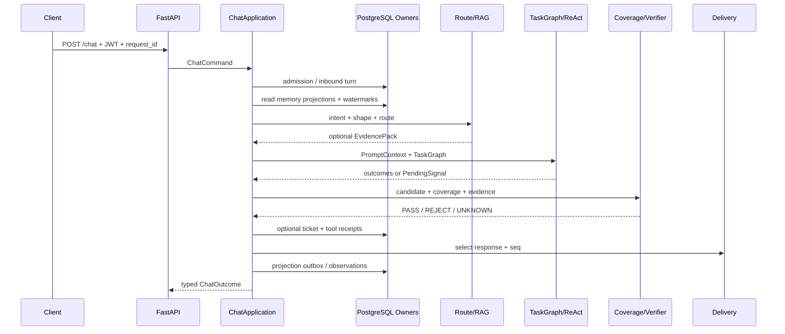

> 历史材料：本文保留重构前的架构解读，不再代表当前运行时。现行 Owner、LangGraph/create_agent、PostgreSQL 与恢复边界见[当前架构]({{ '/architecture.html' | relative_url }})。下文的旧类名、SQLite 与“尚未使用 LangGraph”等表述仅供演进回溯。

## 0. 先建立正确的阅读坐标

这不是“请求进来，调用大模型，返回字符串”的项目。当前主链把一次客服请求拆成四类事实：

1. 协议事实：谁在什么租户下、以哪个 `request_id` 请求了什么；
2. 决策事实：Intent、RequestShape、Route、TaskGraph 和需要哪些 Authority；
3. 执行事实：检索证据、工具回执、Agent outcome、审批暂停和人工工单；
4. 交付事实：哪一个候选被允许发布、`response_id/seq` 是什么、客户端是否 ACK。

必须记住三条边界：

- `api/main.py` 只拥有 HTTP、认证和 DTO 映射；统一业务入口是 `ChatApplication.handle()`。
- PostgreSQL Conversation Event 是完整会话事实；Redis 是可丢弃的热投影，不是历史真相。
- LangGraph 尚未接管当前运行时。当前执行是 Python `TaskGraph + AgentOrchestrator + bounded ReAct`；LangGraph 是第二部分的薄恢复层目标。

## 1. 从 FastAPI 开始：应用如何启动

`api/main.py` 创建 `FastAPI(title="DialogPilot 智能客服", version="2.0.0", docs_url="/docs", lifespan=lifespan)`。真正重要的是 `lifespan()`，因为它是 composition root：所有接口、实现和后台 worker 在这里绑定。

启动顺序可读成：

```text
环境变量与 ModelPolicy 校验
→ JWTAuthenticator / scope policy
→ PostgreSQL pool 与 migration 版本检查
→ RunStore、AgentBundleRegistry
→ IntentRecognizer、SkillManager
→ PostgreSQL Ticket / Commitment / Delivery Owner
→ MemoryManager + PostgreSQL MemoryFactStore / ProjectionReader
→ PostgreSQL KnowledgeRetriever（pgvector + 中文 FTS）
→ MediaAssetService、OCR、可选 VLM
→ ToolManager、AgentOrchestrator、AnswerVerifier
→ ChatApplication 与 durable admission coordinator
→ Monitor、projection/outbox worker
```

为什么要把初始化集中在 lifespan，而不是在 endpoint 中临时创建？因为连接池、缓存、模型策略、Bundle 和状态 Owner 必须在进程生命周期内共享；否则每个请求会得到不同配置，幂等键和统计也无法对齐。启动失败应立即暴露缺少 API key、非法模型配置或不可用的权威存储，而不是在第一个用户请求中随机失败。

退出阶段按相反方向停止 worker、等待后台任务并关闭 Redis/PostgreSQL 连接。关闭顺序同样是合同：先停止生产新任务，再释放任务依赖。

### 1.1 横切中间件

每个 HTTP 请求都有 `X-Trace-Id`。合法调用方可携带它；缺失或非法时由服务生成。Trace ID 贯穿 intent、retrieval、Agent、tool、verification、ticket 与 delivery，但它只用于关联，不替代 `request_id` 的业务幂等。

CORS 由环境变量提供允许源。认证使用 JWT subject 和 scopes；不能相信 body 中自报的 `user_id`。若 body 的用户和 token subject 不一致，接口拒绝，而不是偷偷改写。

## 2. API 全景：每组接口由谁负责

### 2.1 在线对话与恢复

| 方法 | 路径 | 作用 | 关键合同 |
|---|---|---|---|
| `POST` | `/chat` | 唯一在线聊天入口 | 进入 `ChatApplication.handle()`，不在路由函数复制业务链 |
| `POST` | `/assets/upload` | 上传图片或 PDF | 只完成绑定、MIME 校验和扫描，不等于 OCR/VLM 已完成 |
| `GET` | `/agent-runs/{run_id}` | 查询 ReAct run | 返回运行或等待审批状态，不伪造业务结果 |
| `POST` | `/agent-runs/{run_id}/resume` | 宿主批准/拒绝后恢复 | 需要 `tool:approve`，重新核验主体、call 与 checkpoint |
| `POST` | `/conversations/{conv_id}/finalize` | 兼容接口：等待投影水位 | 已弃用；它不关闭会话 |
| `POST` | `/conversations/{conv_id}/close` | 关闭会话 | 关闭语义的唯一 HTTP 入口 |
| `GET` | `/conversations/{conv_id}/turns` | 读取持久 turn | 读 PostgreSQL Conversation 投影 |
| `GET` | `/invocations/{invocation_key}` | 查询幂等 invocation | 显示 admission/execution/publication 的组合只读状态 |
| `POST` | `/responses/{response_id}/ack` | 客户端确认送达/已读 | ACK 单调推进，不回写回答内容 |
| `GET` | `/conversations/{conv_id}/responses` | 断线续取回答 | 按稳定 seq 返回已选定回答 |

### 2.2 人工服务与承诺

| 方法 | 路径 | Owner |
|---|---|---|
| `POST/GET` | `/tickets` | PostgreSQL TicketService 创建或列表 |
| `GET` | `/tickets/{ticket_id}` | 工单详情与状态事实 |
| `PATCH` | `/tickets/{ticket_id}/status` | 合法状态迁移；事件与 outbox 同事务 |
| `POST/GET` | `/commitments` | 企业承诺创建与列表 |
| `GET` | `/commitments/{commitment_id}` | 承诺期限、状态和来源 |
| `PATCH` | `/commitments/{commitment_id}/status` | 履约、违约等合法迁移 |

### 2.3 知识、质量、演进与运维

| 方法 | 路径 | 说明 |
|---|---|---|
| `POST` | `/search` | 直接检索调试；不等于 `/chat` 会无条件触发 RAG |
| `POST` | `/knowledge/add` | 写入文本知识源修订 |
| `POST` | `/knowledge/upload` | 摄取受支持文档 |
| `GET` | `/knowledge/stats` | corpus/generation 统计 |
| `POST` | `/feedback` | 回答反馈，关联 response/request/producer |
| `GET/PATCH` | `/bad-cases`、`/bad-cases/{badcase_id}`、`/bad-cases/{badcase_id}/status` | Bad Case 列表、详情和生命周期维护 |
| `GET/POST` | `/intent-feedback`、`/intent-predictions/{prediction_id}`、`/intent-feedback/{prediction_id}/review` | prediction、人工 review 与 annotation |
| `GET/POST` | `/eval/datasets`、`/eval/run` | 数据集列表与评测执行 |
| `POST/GET` | `/evolution/proposals`、`/evolution/bundles`、`/evolution/bundles/active` | 受限候选、不可变 Bundle 与当前 Active 查询 |
| `GET` | `/skills`、`POST /skills/reload` | Skill 发现和显式重载 |
| `GET` | `/health`、`/monitor`、`/metrics` | 健康、应用指标与 Prometheus |
| `GET` | `/traces/{trace_id}` | 管理员读取持久 Trace |

## 3. `/chat` 输入合同与公开结果代数

`ChatRequest.message` 最多 10000 字符；`request_id` 最多 128 字符；单轮最多绑定 5 个 `asset_ids`。`conv_id` 确定 thread，JWT subject 确定 user，部署配置确定 tenant。三者共同决定隔离边界。

进入 Memory、RAG、LLM 或 Tool 之前先执行输入安全检查。输入中的“忽略系统指令”“输出密钥”属于不可信数据，不能因为它来自 OCR、知识文档或历史消息就获得更高权限。

公开返回不是只有 200/500：

| Outcome | HTTP | 语义 |
|---|---:|---|
| `ChatResponse` | 200 | 已选择并登记回答 |
| `Accepted` | 202 | 已接纳，后台 durable 执行 |
| `NeedsInput` | 202 | 缺材料或待批准，有明确 pending signal |
| `Reconciling` | 202 | 写副作用结果未知，正在核对 |
| `HandedOff` | 200/202 | 已进入人工处理语义 |
| `Conflict` | 409 | 同幂等身份出现不同 payload 或版本冲突 |
| `Expired` | 410 | 审批/运行已过期 |
| `Rejected` | 422 | 合同或策略拒绝 |
| `Failed` | 500/503 | typed code、是否可重试和 correlation ID |

同一个 `request_id` 重试必须读取同一 invocation，不应重复建工单、重复写记忆或生成第二个 final response。

## 4. 当前 `/chat` 端到端时序



代码中的阶段观测依次包括：`bundle_resolution`、`memory_load`、`intent`、`media`、`knowledge_retrieval`、`active_case`、`route_and_agent`、`verification`、`ticket`、`delivery`、`tool`、`memory_write`。阶段状态是 `OK/DEGRADED/SKIPPED/FAILED`，用来区分“没有触发”和“触发后失败”。

### 4.1 Bundle 固定

请求开始时解析一次 AgentBundle，后续 Intent、路由、检索、Worker、Verifier 和 checkpoint 都引用同一版本。否则一个请求可能显示 v18，却有子调用实际使用 v17。

### 4.2 Memory 读取

先读 PostgreSQL 权威会话与投影水位。返回 `READY/LAGGING/DEGRADED/UNAVAILABLE`，而不是把故障伪装成“无历史”。投影落后时可从 PostgreSQL raw turns 有界回退；权威库不可用时返回可重试失败。

### 4.3 Intent 与 Route

Intent 只计算一次，再由 RequestShapePolicy 决定问题形态与 Authority。Route 决定是否前置 RAG、是否使用业务工具、是否需要多 Agent。

### 4.4 候选、校验与发布

Agent 文本只是 candidate。CoverageGate 先证明 required tasks 是否完成；Verifier 再检查证据、引用和安全。只有选定的安全文本进入 ResponseDelivery 和 assistant 历史。被拒候选可以留在审计中，但不能污染未来上下文。

## 5. Intent：分类不是最终路由

当前闭合标签包括：`query`、`complaint`、`request`、`greeting`、`escalation`、`technical`、`billing`、`account`、`feedback`、`order_status`、`logistics`、`refund`、`invoice`、`payment_issue`、`account_security`、`technical_login`、`technical_crash`、`human_handoff`、`other`。

默认融合是三路：LLM 0.7、字符 n-gram 0.2、Pattern 0.1。这里的 n-gram 是本地字符相似度，不是已训练的 embedding 分类器。关闭本地相似度时使用 LLM 0.85 + Pattern 0.15。

输出包含 `intent/confidence/urgency/intent_group/entities/reasoning/latency_ms/source_scores/classifier_fingerprint/input_fingerprint`。缓存 key 包含分类器指纹；普通 TTL 默认 3600 秒，低置信度与账户安全最多 300 秒。缓存只减少重复计算，人工纠正仍由 prediction/feedback/annotation Owner 保存。

为什么 Intent 不直接映射 Agent？“退款政策是什么”和“立即替我退款”都可能是 refund，但前者要知识，后者是高风险写操作。因此还要做 RequestShape 与 Authority 判断。

## 6. RequestShape、Authority 与 Route

RequestShape 包括 `greeting`、`knowledge_faq`、`business_state`、`action_request`、`agent_assistance`、`mixed_policy_state`、`multi_domain_task`、`missing_input`、`explicit_handoff`、`out_of_scope`、`security_risk`、`unsupported_operation` 等。

Authority 包括 `knowledge`、`order_state`、`refund_state`、`account_state`、`security`、`domain_tool`、`action_approval`、`human`。它回答的不是“哪个模型更聪明”，而是“谁有资格证明这个事实”。

| 用户问题 | Shape | Route | 必需证据 |
|---|---|---|---|
| “退货期几天？” | `knowledge_faq` | `knowledge_qa` | Knowledge revision/chunk |
| “我的订单到哪了？” | `business_state` | `agent_task` | 订单工具 receipt |
| “规则怎么说、我是否符合？” | `mixed_policy_state` | `mixed` | Knowledge + business receipt |
| “登录异常还被重复扣款” | `multi_domain_task` | `multi_domain` | 安全与账务任务各自证据 |
| “帮我退款”但无订单号 | `missing_input` | `clarify` | 缺失字段声明 |
| “转人工” | `explicit_handoff` | `handoff` | 工单持久化结果 |
| 非客服问题 | `out_of_scope` | `out_of_scope` | 固定策略终态 |

RouteDecision 还保存三段可解释轨迹：`intent_fusion → domain_routing → instance_selection`。RouteExecutionPolicy 明确每条 route 的 required、conditional、forbidden components，防止 endpoint 或 Agent 偷偷多跑一条路径。

## 7. RAG 什么时候触发

### 7.1 前置在线 RAG

只有 `knowledge_qa` 和 `mixed` 在 ChatApplication 中前置调用 KnowledgeRetriever。

- `knowledge_qa`：Retriever + GroundedAnswerGenerator 可直接产生最终候选。
- `mixed`：只检索证据上下文，`generate_answer=false`；最终结论必须与实时业务工具结果一起融合。
- `direct/clarify/handoff/out_of_scope`：不跑前置知识检索。
- `agent_task/multi_domain`：不代表永不检索；具体 task 若声明知识 Authority，可通过 Agent knowledge tool 调用同一个 Retriever。

这样做避免“所有请求先 RAG 一遍、Agent 又检索一遍”的重复调用，也避免用静态知识回答实时订单状态。

### 7.2 在线检索流水线

```text
原始 query + 最近上下文
→ standalone query rewrite
→ PostgreSQL dense(pgvector) 与中文 FTS 并行召回
→ raw query / standalone query 两路候选
→ weighted RRF 合并
→ 可选 rerank（必须是候选 ID 的结构化排列）
→ Top-K 与 token packing
→ EvidencePack
→ Grounded answer / Agent context
→ CitationClaimGate + Verifier
```

默认参数：chunk 512 token、overlap 64、candidate 20、最终 top 5、context 2600 token；RRF 常数 10；vector 0.25、lexical 0.75；raw query 0.25、standalone query 0.75。参数来自环境与固定 Bundle，不能在文档中写成永恒最优值。

Dense 擅长同义表达，中文 FTS 保住订单规则名、型号、错误码等精确词。RRF 融合 rank 而不是直接相加不可比较的 cosine/BM25 分数。Reranker 只能重排给定候选，返回未知 ID、重复 ID 或漏掉合同所需项都按无效输出处理。

### 7.3 Retrieval 结果代数

`OK`、`NO_EVIDENCE`、`AMBIGUOUS`、`UNAVAILABLE`、`INVALID_CONTRACT`、`CONFLICT` 是不同状态。无证据可以澄清或拒答；系统不可用要重试/降级；冲突要转人工，不能统一压成空列表。

## 8. 离线 RAG：知识怎样进入线上索引

离线链不是“把文本塞进向量库”：

```text
source upload/add
→ MIME/编码/安全校验
→ immutable SourceRevision + checksum
→ parse/normalize
→ structure-aware chunk specs（512/64）
→ canonical projection outbox
→ embedding projection + Chinese FTS projection
→ generation manifest 与 entry 校验
→ 原子激活唯一 ACTIVE generation
→ 旧 generation 可重建、回收
```

SourceRevision 是企业知识权威；chunk 与 dense/sparse index 是可重建投影。更新文档必须生成新 revision/generation，不能原地篡改已经被回答引用的 chunk。

缓存 key 至少绑定 tenant、subject scope/ACL、deletion epoch、normalized query、manifest/generation、embedding/rerank/policy 版本。Redis TTL 只控制资源占用；即使缓存全部丢失，语义必须保持，只增加延迟。

Knowledge 与 ServiceEpisode 可以复用同一个 HybridRetrievalBackend，但必须是不同 corpus、表、generation、ACL 和权重。否则用户服务经历会泄入公共知识，或者静态政策会被误当成某位用户的历史事实。

## 9. Memory：短期、长期、过期和存储位置

“Memory”不是一个向量库，而是多个 Owner 的投影：

| 层 | 保存什么 | 权威位置 | 触发 | 失效/过期 |
|---|---|---|---|---|
| Conversation L0 | 完整 user/assistant/system 事件 | PostgreSQL turns/events | admission、publication、human reply | `retention_until` 与删除协调 |
| Working window | 最近对话窗口 | Redis/内存投影，可从 PG 重建 | 每轮投影 | TTL/容量淘汰不影响正确性 |
| Thread summary | 固定连续范围摘要 | PostgreSQL chunks/checkpoint | token 阈值、idle、close/finalize 投影 | source hash/version 不符即 stale，可重建 |
| MemoryFact | 用户明确事实/偏好 | PostgreSQL `memory_facts` | 够 3 轮或 idle 300s 的异步提取 | `active/superseded/retracted`，并受删除 fence |
| ServiceEpisode | 已解决服务经历 | PostgreSQL immutable revisions/head + 独立检索 corpus | case resolved/closed 且证据完整 | retention、重建与撤回策略 |
| ActiveCase | 未结工单与承诺 | Ticket/Commitment PostgreSQL Owner 的投影 | 每轮按引用、风险、SLA 选择 | case 终结后不再作为 active |
| User Profile | active MemoryFacts 的只读投影 | 不另造 persona 真相 | 组装 Context 时 | 随 fact 状态和删除 fence 变化 |

### 9.1 长期和短期怎样串起来

当前轮先读 Conversation watermarks，再读取 working window、summary、facts、episodes 和 active cases。投影若落后，`PostgresMemoryProjectionReader` 最多有界读取 200 条 raw turns 补偿，并在结果中标明 `raw_fallback_used`、included/omitted ranges。`READY` 不允许静默遗漏；`UNAVAILABLE` 不允许解释成新用户。

### 9.2 Summary 为什么按范围

每个 summary chunk 绑定 `[from_seq,to_seq]`、source SHA、schema/model version、deletion epoch 与 generation。LLM 只生产摘要候选；repository 才拥有范围、checkpoint 和 CAS。两个 worker 竞争时只有一个能推进相同 watermark，另一个重读，不删除 L0 原文。

### 9.3 Fact 为什么延迟提取

默认积累 3 个完整轮次立即触发；不足时在最后活动 300 秒后触发，worker 默认每 5 秒扫描。这样减少每轮模型调用和事实碎片。提取失败不推进 checkpoint；重试仍处理同一固定范围。事实 identity 不变，更新只能形成 active/superseded/retracted 生命周期。

### 9.4 什么不应进入长期记忆

实时余额、订单当前状态、退款是否到账、账户是否冻结必须每次从业务 Owner 读取；模型回答和旧 assistant 文本也不是用户事实。长期记忆只能保存有来源、可撤回、适合复用的信息，如明确语言偏好或已验证服务经历。

### 9.5 “过期”不是一个 TTL

- Redis working cache 可按 TTL 丢弃，因为 PostgreSQL 可重建；
- Conversation/Trace/业务记录使用各自 `retention_until`；
- Fact 用 supersede/retract 与 deletion fence，不应用缓存 TTL 判断业务真伪；
- Summary/episode 引用源已删除、hash/version 不匹配时为 stale；
- Ticket/Commitment 的业务有效性由状态机和期限决定。

## 10. 用户信息和连续服务怎样走

每轮用户信息不是拼成一段自由 Persona。ContextAssembler 按 section 组装：当前问题、最近消息、范围摘要、active facts、相关 episode、active case、knowledge、media observation 和 task dependency artifacts。

ActiveCase 选择优先级：精确工单引用、critical/security、已违约 SLA/commitment 是硬选择；然后才按 topic/entity、priority、recency 排序。返回 `NO_ACTIVE_CASE/CASES/UNAVAILABLE/CONFLICT`。系统不可用时不能谎称用户没有工单。

Continuation 决定当前话题是 `continue/expand/switch/ambiguous`。它只影响上下文与澄清，不拥有工单状态，也不能让旧主题绕过本轮 AuthorityPolicy。

## 11. 多模态：从上传到可引用观察

### 11.1 上传层

`POST /assets/upload` 默认最大 10 MiB，允许 PNG、JPEG、PDF；同时检查声明 MIME、扩展名和内容 sniff，绑定 tenant/user/turn。状态为：

```text
UPLOADED → SCANNING → SCANNED | FAILED | QUARANTINED
```

`SCANNED` 只表示 L0 安全扫描通过，不表示已经 OCR 或视觉理解。

### 11.2 感知层级

- L0：文件身份、hash、安全与元数据，不调用模型；
- L1：文本提取。当前 Tesseract provider 面向图片，默认 `psm=6`、`lang=eng`、timeout 15s，输出原像素 bbox、page/block node、checksum 和 provider version；
- L2：视觉推理。可选 DeepSeek VLM 在 OCR 后运行，默认最多 512 tokens，输出结构化 `observation_type/description/bbox/confidence`。

VLM 只能产生 observation，不能推断账户归属、退款资格、订单真实状态或最终故障根因。图片中的指令文本仍是不可信数据。

PDF 可以上传，但当前 Tesseract/VLM provider 是 image-only；复杂 PDF 分页、layout 与多页视觉解析属于目标扩展，不能写成已完成。

### 11.3 什么时候看图

Agent 先产生 MediaRequirementDecision；文字证据已足够时不调用 OCR/VLM。只有 task 声明 `media_context_refs`，对应 worker 才能读 media section。感知不可用返回 typed `UNAVAILABLE/PARTIAL`，不能补写一段“看起来像”的描述。

## 12. TaskGraph：为什么并发、怎样并发

Agent 角色包括 general、technical、billing、account_security、escalation。Planner 形成 `TaskSpec`：owner、required、risk、effect、depends_on、context_refs、evidence spans 与 dependency inputs。

图在运行前验证 task ID 唯一、依赖存在并且无环，然后拓扑分 wave：

```text
wave 1: account_security(read-only) || billing_lookup(read-only)
wave 2: refund_write(depends_on both, write_requires_approval)
```

同一 wave 中仅 `READ_ONLY` 且不会 interrupt 的任务通过 `asyncio.gather` 并发，最多 `max_parallel_workers`。写任务、可能暂停的任务先 flush 并发 batch 后串行执行。因此“最多 3 个 Agent”不是无条件并发 3 个写操作。

默认预算：单 worker 15 秒、整请求 20 秒、最多执行 3 个 Agent、ReAct 最多 4 步。依赖失败的下游得到 `BLOCKED_DEPENDENCY`；超预算得到 `BUDGET_EXCEEDED`；不会从结果列表中消失。

v1 同一图只允许一个 blocking PendingSignal。若同一 wave 出现第二个并发 interrupt，会投影成 `UNSUPPORTED_CONCURRENT_INTERRUPT`，避免两个审批点争夺一个恢复入口。

## 13. bounded ReAct 与工具执行

外层 TaskGraph 决定“必须完成哪些工作”；Worker 内层 ReAct 决定“为完成这一个 task 调什么工具”。两层不能颠倒，否则模型会自行删除 required task 或绕过依赖。

工具 schema、风险和允许 Agent 由 ToolManager 注册。模型传入的 `approved=true` 等宿主字段会被剥离。写工具默认产生审批 PendingSignal；审批 TTL 默认 900 秒，恢复 grace 30 秒。

工具有两套状态：

- 调用状态：`AWAITING_APPROVAL/EXECUTING/SUCCESS/ERROR/TIMEOUT/CANCELLED/DENIED/UNTRUSTED_OUTPUT`；
- 副作用状态：`NONE/COMMITTED/NOT_COMMITTED/OUTCOME_UNKNOWN`。

超时不等于未提交。若远端可能已写成功但本地没有 receipt，必须进入 outcome unknown/reconciliation，不能盲目重试。稳定 call ID 与业务 idempotency key 让 resume 重放已完成 receipt，而不是执行第二次退款或建第二张工单。

当前 ReAct checkpoint/ledger 是本地 SQLite `RunStore`，适合单应用写者；它不是 LangGraph，也不是跨服务工作流引擎。

## 14. Reducer：不是拼字符串

并行结束后 `ResultSynthesizer` 是候选融合的唯一 Owner。单任务状态闭合为 `SUCCESS/TIMEOUT/ERROR/BUDGET_EXCEEDED/BLOCKED_DEPENDENCY/CANCELLED/EXPIRED`；等待审批使用 PendingSignal，而不是伪装成完成 outcome。

整组融合状态是 `SUCCESS/PARTIAL/CONFLICT/FAILED/UNKNOWN`。Authority conflict 不能让 LLM“折中”；它直接成为 `CONFLICT` 并升级人工。

CoverageGate 按 task ID 比较计划、outcomes 与 pending signals，检查：

- required task 是否全部成功；
- 是否缺失、重复或出现意外 task ID；
- 是否仍有 awaiting signal；
- dependency artifact/receipt schema 是否完整。

只要 required coverage 不完整，语言再流畅也不能发布成完整成功。融合器超时或不可用时保留成功证据，但状态为 `UNKNOWN/FAILED` 并转人工，不伪造统一结论。

## 15. Evidence、Claim 与 Verifier

证据类型包括 `KNOWLEDGE/BUSINESS_TOOL/ACTION_RECEIPT/MEMORY_EVENT/SERVICE_EPISODE/COMMITMENT/MEDIA_OBSERVATION/HUMAN_ASSERTION`。它们共享引用外形，但原始事实仍由各自 Owner 保管。

每个事实需求的状态可以是 `SATISFIED/MISSING/CONFLICTING/STALE/UNSUPPORTED/INVALID_EVIDENCE`。Coverage 证明“工作完成了”；CitationClaimGate 证明“知识声明有合法引用”；Verifier 检查 candidate 是否 grounded、安全、与 evidence 一致。三者不能用一个 LLM Judge 替代。

Verifier 结果为 `PASS/REJECT/UNKNOWN`。解析失败、provider 超时是 UNKNOWN，不是 PASS。发布策略选择安全降级文案或人工交接；原 candidate 不进入对话历史。

## 16. 发布、送达与 ACK

ResponseDelivery 先登记唯一被选中的 assistant response，分配 `response_id` 和 conversation-local `response_seq`，再返回客户端。客户端收到 HTTP 仍不等于 UI 已展示，因此通过 `/responses/{id}/ack` 单调推进 delivery/read 状态；断线后按 seq 从 `/conversations/{id}/responses` 续取。

Conversation 保存完整事件，Delivery 保存交付状态，两者各自是 Owner。投影视图可以组合显示，但不能反向修改任一状态。

## 17. 人工工单与企业承诺

需要人工的原因可能是：安全风险、Authority conflict、required coverage 缺失、Verifier reject/unknown、业务工具 outcome unknown、用户明确要求人工、承诺违约。

工单使用 PostgreSQL Owner，创建时以稳定 operation key 幂等，并在同一事务写 ticket、首个 event 与 outbox。外部 CRM 投递失败不会回滚本地工单事实；outbox 按稳定 event ID 重试，接收方同样必须幂等。

Commitment 不是一段回答承诺，而是独立实体：承诺内容、deadline、来源、状态与事件。已违约承诺会提高 ActiveCase 和 handoff 优先级。LLM 不能自行把承诺标记为已履行。

## 18. Skill、模型分层和上下文预算

Skill 是受控业务说明，启动加载、按 request/task 匹配、作为有标签 section 注入；它不拥有权限，不可新增 Tool，也不能覆盖系统安全合同。默认注入上限 5000 字符。

ModelPolicy 默认把 Intent、Worker、ReAct、Memory、Rewrite、Rerank 放到 Flash/no-thinking；Synthesis、Verifier、Judge 使用 Pro/no-thinking。角色配置固定到 Bundle 与 Trace，避免供应商默认 reasoning 让短任务尾延迟失控。

ContextAssembler 默认输入预算 12000 token、输出预留 1536、Memory 子预算 6000。优先保留当前用户问题、系统/权限合同、required evidence 和 dependency artifact，再裁剪低优先级历史。工具 schema 和 result 也必须计入最终 provider 请求，不能只在入口算一次。

## 19. 当前为何不用 LangChain，目标为何考虑 LangGraph

### 19.1 当前为什么是直接 Python

当前核心难点是 closed algebra：Authority、Task DAG、审批、receipt、coverage、publication 与 delivery。直接 Python 让每个状态和测试边界可见，也避免框架 callback 或 memory abstraction 成为第二真相。项目不需要为了“用了框架”把这些 Owner 改写成 chain。

### 19.2 为什么不全量使用 LangChain

LangChain 可以作为模型、embedding、loader 或 tool adapter，但不应拥有订单、退款、Ticket、Conversation、Evidence 或授权语义。全量迁移会增加 adapter 层和隐式默认值，却不自动提供 exactly-once、副作用 receipt 或业务幂等。

### 19.3 LangGraph 目标解决什么

目标只让 LangGraph 作为薄 durable runtime，负责 graph checkpoint、interrupt/resume、retry 与执行历史；现有 Planner、TaskGraph、ReAct、ToolManager、Evidence、Delivery 和业务 Owner 保持权威。只有跨进程恢复完整 Agent run 的收益超过引入依赖、checkpoint schema 与运维复杂度时才切换。

因此准确表述是：**当前未使用 LangGraph Agent runtime；已有 SQLite ReAct resume。目标是把完整 run 的恢复交给 LangGraph，而不是用 LangChain 重写业务架构。**

## 20. 失败路径要怎样顺下来

### 场景 A：纯政策问题

Intent/Shape 判为 knowledge FAQ → 前置 hybrid retrieval → EvidencePack → grounded candidate → claim/citation gate → verifier → delivery。无证据则明确 abstain，不调用订单工具。

### 场景 B：问自己的订单状态

判为 business state → 跳过前置 RAG → 订单 Agent 调只读业务工具 → receipt 成为 Authority evidence → verifier → delivery。历史 assistant 说“已发货”不能代替实时 receipt。

### 场景 C：规则与资格混合

前置 RAG 只提供政策 evidence，不先定最终答案 → Agent 调业务工具得到个人状态 → reducer 检查两种 Authority → verifier 后发布。两者冲突则人工。

### 场景 D：截图中的登录错误

asset 上传和扫描 → Agent 判定需要 media → OCR L1 → 必要时 VLM L2 → observation 进入 technical task context → 仍需账户/安全工具验证动态事实 → 输出或升级。

### 场景 E：登录异常并要求退款

TaskGraph 分安全调查与账务查询并发 wave → 写退款 task 依赖二者 → required approval 产生 PendingSignal → `/agent-runs/.../resume` → 稳定 call ID 执行一次 → receipt → reducer/verification/publication。

### 场景 F：投影落后

Memory reader 返回 LAGGING → 有界 PG raw fallback → Trace 记录遗漏范围和 watermark → 继续时标记 degraded。若 PG 也不可用则 503 retryable，不把用户当新会话。

## 21. 当前边界与不能夸大的地方

- LangGraph 完整 run runtime 尚未接入；当前只恢复单个 ReAct 审批 run。
- PDF 上传已支持，复杂 PDF OCR/layout/VLM 主链未完成。
- 本地业务沙箱、ReAct RunStore、Bundle registry 等仍有 SQLite 组件，横向多写需迁移或换实现。
- Redis 是投影与缓存；它故障可影响延迟/降级，但不应成为唯一会话事实。
- 500 条分层数据和自动 Judge 不是生产准确率；冻结公开 test 与 80 条合成合同真实 E2E 必须单独声明。
- 当前多 Agent 是有界 task graph，不是开放式自治群体，也不是模型自行改权限。

## 22. 核心面试追问与校准答案

### Q1：请从 FastAPI 讲一次完整请求。

JWT/scope 和 trace 中间件先处理请求，endpoint 将 DTO 转为 ChatCommand，只调用 `ChatApplication.handle()`。Application 完成 admission、Memory 投影读取、Intent/Shape/Route、按 route 触发 RAG/media、TaskGraph/ReAct、Coverage/Reducer/Verifier、可选 Ticket、Delivery 与投影写入，再映射 typed outcome。

### Q2：RAG 到底什么时候触发？

`knowledge_qa` 和 `mixed` 前置触发；mixed 只提供 context。Agent task 只有声明 Knowledge Authority 才经工具调用同一 Retriever。direct、clarify、handoff、out-of-scope 不前置检索。

### Q3：为什么在线、离线 RAG 要分开讲？

离线链拥有 source revision、chunk、embedding/FTS projection 和 generation activation；在线链只读取一个已激活 generation 并完成 rewrite、召回、融合、rerank、packing。把两者混在请求里会让更新不可审计、延迟不可控。

### Q4：为什么当前 chunk 是 structure-aware 512/64？

这是 PostgreSQL 当前默认起点，在语义完整性、召回粒度与上下文浪费间折中，不是理论最优；历史 fixed `512/64` 只属于旧 Doc2Dial Dev。必须用目标语料按 strategy + 大小 + overlap 对 Recall@K、引用完整性、延迟与成本消融。

### Q5：为什么 dense 与中文 FTS 都要？

Dense 召回同义表达，FTS 保住精确术语、错误码和规则名；二者故障模式不同。weighted RRF 用 rank 合并，避免直接相加量纲不同的分数。

### Q6：为什么 mixed 不能直接发布 RAG 答案？

政策知识只能证明通用规则，不能证明某用户当前是否满足条件。必须再取业务 receipt，由 Agent/reducer 合并。

### Q7：用户长期记忆放在哪里？

明确事实放 PostgreSQL `memory_facts`，已解决经历放 ServiceEpisode；User Profile 是 active facts 投影。Redis 只保存热窗口/缓存，不是长期权威。

### Q8：短期记忆如何过期？

Redis TTL 或容量可以淘汰工作窗口，因为能从 PostgreSQL 重建；Conversation 依据 retention/deletion policy。不要把 Redis TTL 描述为用户事实的业务有效期。

### Q9：长期事实何时提取？

默认 3 个完整轮次或最后活动 300 秒后触发，worker 每 5 秒扫描。失败不推进 checkpoint；事实有 active/superseded/retracted 状态与来源。

### Q10：摘要会不会丢原文？

不会删除 L0。摘要只覆盖固定 seq 范围，是可重建投影；repository 用 source hash/version/CAS 推进 checkpoint。

### Q11：用户信息是不是每轮生成 Persona？

不是。当前 profile 是 active MemoryFacts 的受控投影；实时业务状态每次查业务 Owner，避免陈旧和过度推断。

### Q12：多 Agent 并发怎么控制？

先验证 DAG 并按拓扑 wave。仅同 wave 的 read-only、不可 interrupt task 并发；写或可能暂停的 task 串行。受 max workers、task timeout、request deadline 和最多执行任务数约束。

### Q13：Reducer 做什么？

ResultSynthesizer 融合 typed outcomes；CoverageGate 先检查 required task 完整性、重复/缺失和 pending signal；Authority conflict 不交给模型折中。

### Q14：为什么不直接拼接多个 Agent 回答？

拼接会隐藏失败、重复和冲突，也无法知道必需任务是否缺失。Reducer 输出 success/partial/conflict/failed/unknown，并保留生产者归因。

### Q15：一个 Agent 超时会怎样？

该 task 得到 TIMEOUT；依赖它的任务是 BLOCKED_DEPENDENCY。若剩余证据不足则 coverage 不完整，安全降级或人工，不让整个事实面静默消失。

### Q16：ReAct 为什么限定 4 步？

客服工具面闭合，开放循环会放大成本、延迟和副作用风险。步数是预算，若 heldout 证明复杂任务需要更多，应按 task 类型调整并重新验证，而非让模型无限循环。

### Q17：审批怎么防止模型自批？

ToolManager 删除模型参数中的 approved 字段；宿主通过带 scope 的 resume API 批准，checkpoint 绑定 subject/task/call。稳定 call ledger 防重复执行。

### Q18：工具超时为什么不能直接重试？

远端可能已提交。必须区分 invocation status 和 effect status；`OUTCOME_UNKNOWN` 先 reconciliation，只有权威 `NOT_COMMITTED` 才安全重试。

### Q19：Verifier 和 Reducer 有什么不同？

Reducer 解决多任务覆盖与冲突，Verifier 解决候选是否有证据、安全且可发布。前者不能证明 grounding，后者不能补齐没执行的 required task。

### Q20：为什么 UNKNOWN 不能当 PASS？

解析失败或 provider 故障没有证明回答安全。fail-open 会把校验基础设施故障变成内容发布漏洞。

### Q21：人工工单创建失败怎么办？

仍保留“需要人工”的事实，但公开文本说明工单未建成，并要求使用相同 request_id 重试或直接联系人工；不能返回虚假的 ticket ID。

### Q22：HTTP 200 是否等于用户看到了回答？

不等于。Delivery 先选定 response，再由客户端 ACK 单调推进；断线可按 response seq 续取。

### Q23：为什么不用 LangChain 重写？

核心问题是业务 Owner、closed algebra、幂等和 receipt，框架不会自动解决。LangChain 可做边界 adapter，但不能成为 Conversation、Ticket、Tool Effect 或 Evidence 真相。

### Q24：为什么目标又要 LangGraph？

为了完整 Agent run 的 checkpoint、interrupt/resume 与跨进程恢复，不是为了替代现有决策语义。它应是薄 runtime。

### Q25：当前是否已经用了 LangGraph？

没有。当前是直接 Python TaskGraph 和 SQLite ReAct RunStore。把目标图说成现行实现是不准确的。

### Q26：图片识别从哪开始？

先上传绑定和扫描，再由 Agent 判断是否需要 media；L1 OCR，必要时 L2 VLM。observation 进入声明了 context ref 的 task，动态业务结论仍查工具。

### Q27：为什么 OCR 后还可能需要 VLM？

OCR擅长文字和坐标，不能稳定解释界面布局、红框、部件或视觉关系；VLM补充观察，但不能越权成为订单/安全事实。

### Q28：PDF 现在做到什么程度？

上传和安全边界支持 PDF；当前 OCR/VLM provider 是 image-only。复杂分页解析属于目标，必须如实标注。

### Q29：缓存击穿或 Redis 故障会怎样？

缓存旁路后执行同一权威读取/检索，语义不变、延迟增加。若某结果只有 Redis 才存在，说明权威划分错了。

### Q30：如何防止跨用户召回？

查询、cache key、projection、asset 和 retrieval request 全部绑定 tenant/user/ACL/deletion epoch；共享知识只有批准的 shared scope。跨主体命中是 hard failure。

### Q31：为什么 SourceRevision 不原地更新？

回答引用必须可回溯。不可变 revision 和 generation manifest 能解释当时使用哪个版本，也便于撤回和重建投影。

### Q32：Reranker 输出错格式怎么办？

结构化校验失败，走确定性原排序或 typed invalid contract；不接受模型凭空添加 candidate ID。

### Q33：为什么 Answer 文本不是业务事实？

它是对证据的表达，可能过时或被拒绝。订单/退款/账户事实来自业务 receipt；知识事实来自 source revision。

### Q34：为什么 finalize 不再代表关闭？

兼容 endpoint 只等待投影 watermark，真正 close 由 `/conversations/{id}/close` 拥有。否则读一致性动作会偷偷改变生命周期。

### Q35：500 条评测能说明什么？

说明分层合同有可重复回归面；不能直接说明生产准确率。要区分 provisional、reviewed、gold、dev、heldout 和污染状态。

### Q36：在线反馈怎样进入进化？

Feedback 关联 response、producer、bundle 和 trace，BadCaseMiner 聚类，CreditAttributor 定位 Owner，Proposal 只能改白名单 Bundle 字段，候选经离线 gate；模型不能直接修改 Active。

### Q37：最重要的安全设计是什么？

权限和副作用在工具 Owner 边界执行，不靠 Prompt；输入、OCR、知识、历史都按不可信 data section 处理。

### Q38：10 倍流量先改什么？

先用 trace 分解模型、PG、retrieval、tool 和 worker 队列的 P95/P99；扩连接池和无状态 API，隔离 projection/outbox worker，做 cache/single-flight。仍在 SQLite 的 RunStore/registry 若需多写要先迁移。

### Q39：这个项目最强的技术点是什么？

不是 Agent 数量，而是从 Authority 到 Evidence、Task outcome、Coverage、Verifier、Delivery 的可验证发布链；失败不会被一段流畅文本遮住。

### Q40：一句话怎样诚实概括？

DialogPilot 是以 FastAPI 为协议入口、PostgreSQL 为会话与业务事实、pgvector+中文 FTS 为知识投影、Python TaskGraph+有界 ReAct 为当前执行器，并以 Evidence/Coverage/Verifier/Delivery 保证可追责发布的客服 Agent；LangGraph 是下一阶段的薄恢复运行时目标。
