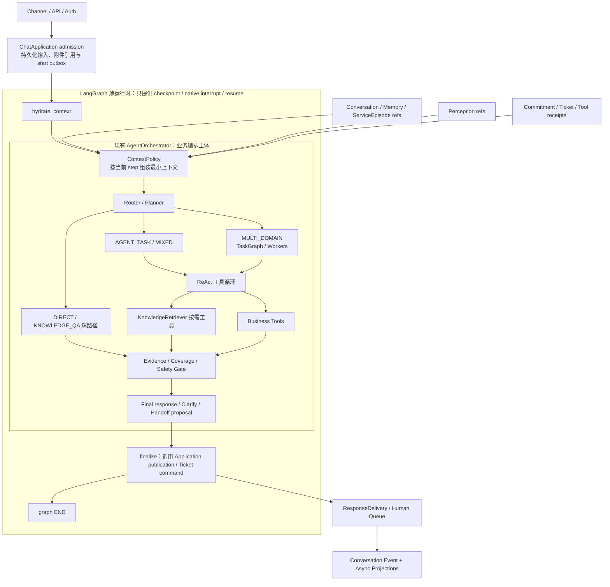
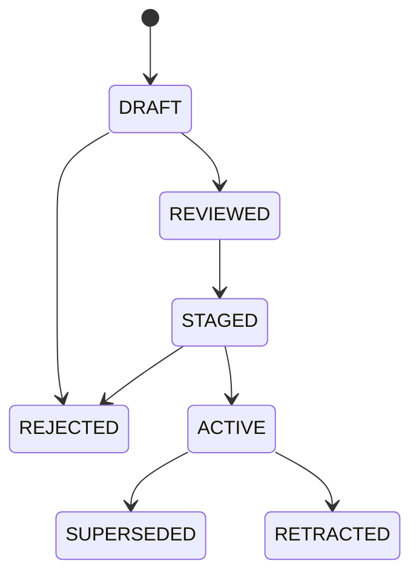

# DialogPilot 客服 Agent 总体目标架构

> 状态：历史目标架构提案（运行时设计已替代）
>
> 运行时更新（2026-09-05）：本文的 `CURRENT_ACTIVE`、`PLANNED` 和 ReAct/SQLite
> 描述属于当时的设计基线，不代表当前装配。当前主链、职责和验证边界见
> [架构边界与职责归属]({{ '/architecture.html' | relative_url }})。
> 当前开放式领域 Agent 共用 `create_agent`，执行恢复使用 LangGraph/PostgreSQL；
> 旧 ReAct、SQLite 和兼容执行链已删除。本文保留设计演进，不作为重建旧路径的实施要求。
> 下文“当前”“现有”“当前 HEAD”及状态标签均按历史提案语境阅读；冲突时以当前架构页和源码为准。
>
> 版本：v1.1
>
> 日期：2026-09-02
>
> 配套实施文档：[DialogPilot 客服 Agent 颗粒度实施计划]({{ '/customer-service-agent-implementation-plan.html' | relative_url }})

> 实施前提：当前是个人开发分支，没有线上流量，也没有必须保留的旧运行数据。本文采用
> **clean rebuild + direct cutover**：新链从 source/fixture 重建并通过本地/CI 验收后，各领域 Owner
> 逐 slice 直接切换自己的唯一 binding，并在同一原子交付中删除对应旧 reader、writer、adapter、配置与依赖；
> 最终 composition root 只聚合已经完成的目标 binding。本文不设计
> backfill、双写、shadow、canary、cohort、运行时旧链 fallback 或 rollback window。Git 历史用于
> 开发回退，不在运行时保留第二条架构路径。若未来出现真实不可丢数据或线上流量，必须另立迁移 ADR，
> 不能把那套复杂度预埋进当前架构。

## 1. 执行摘要

DialogPilot 下一阶段的目标不是把现有系统改造成一个更复杂的 RAG 聊天机器人，而是建设一套**可恢复、可追责、可交接的客服服务连续性系统**。

目标组合为：

```text
自研领域 Owner 与安全合同
+ 统一 ChatApplication
+ LangGraph 薄可恢复 Agent Runtime
+ PostgreSQL 领域事实与 LangGraph Checkpoint 持久化
+ PostgreSQL pgvector + 版本化中文 FTS 的分语料检索投影
+ Redis 热缓存 / 租约 / debounce
+ 多模态 Evidence Layer
+ 真实 /chat 服务链评测
```

本提案作出以下核心决策：

1. **不全量迁移 LangChain。** LangChain 只作为可选模型、工具或文档解析适配层，不拥有业务语义。
2. **采用 LangGraph 薄运行时。** 先在当前分支按依赖顺序完成 checkpoint、interrupt、resume、retry 与执行历史适配，验收后一次切换唯一 runtime binding；Planner、TaskGraph、ReAct 与各业务 Owner 继续拥有编排语义、事实、安全和副作用。
3. **建立唯一的完整会话事实。** 用户输入必须在推理前持久化；正常回复、越域回复、审批恢复、人工回复和送达回执统一进入同一会话生命周期。
4. **重新划分 Memory。** 工作现场、短期会话、服务经历、用户偏好和企业承诺分别建模；实时订单、退款和账户状态不进入长期记忆。
5. **统一证据合同。** 知识片段、业务工具回执、记忆事件、图片观察和人工确认统一投影为 `EvidenceReceipt`，但各自仍保留原始权威 Owner。
6. **路由先确定任务形态和权威来源。** 纯知识问题走短路径，实时业务问题走工具路径，混合问题同时获取知识和业务证据，复杂跨域问题才启用多 Agent。
7. **多模态不是“给模型看图”。** 商品识别、说明书检索、错误截图理解和维修诊断必须分别拥有输入、检索、证据坐标、置信度与安全升级合同。
8. **评测真实服务链。** HTTP 服务入口与评测必须共用同一个 `ChatApplication.handle()`，以确定性状态和权威回执验证服务结果，而不是只比较最终文本。

首要架构收敛目标是形成一个薄、持久、可恢复的 `AgentRunState`，让 `/chat`、resume、eval 和 handoff 共用同一个 Agent graph；Conversation、Memory、Tool、Delivery 和 Ticket 仍由领域 Owner 通过引用接入。当前 `/chat → ChatApplication.handle()` 边界已经存在，实施顺序是先核验并加固该边界、补齐 admission/idempotency 与完整会话事实，再接入 LangGraph；不能把“首要目标”误解为重复抽取 Application、先做框架迁移或自研重型流程引擎。

## 2. 背景与根因

### 2.1 当前系统并非缺少组件

仓库已经具备多项值得保留的能力：

- 带依赖校验、拓扑波次和副作用感知并发的 `TaskGraph`；
- Agent 工具白名单、宿主审批、工具调用绑定和业务幂等回执；
- 工单状态机、审计事件和事务 outbox；
- 回答选择、送达和已读的单调状态；
- 有序原始消息、范围摘要、CAS checkpoint、版本化用户事实；
- BM25、Dense、RRF、Rerank、Packing 和 EvidencePack；
- fail-closed 的发布前 Verifier；
- 版本化 Bundle、离线候选评测和 provisional Bad Case 生命周期。

现状证据地图用于区分“已实现”与“目标”：

| 当前事实 | 当前代码 Owner | 主要验证 |
|---|---|---|
| TaskGraph、依赖/并发与 Worker 编排 | [agent_orchestrator.py](https://github.com/garrulus21yyx/DialogPilot/blob/main/agents/agent_orchestrator.py)、[orchestration_contracts.py](https://github.com/garrulus21yyx/DialogPilot/blob/main/agents/orchestration_contracts.py) | [test_agent_orchestration.py](https://github.com/garrulus21yyx/DialogPilot/blob/main/tests/test_agent_orchestration.py) |
| Target 审批恢复与工具执行账本 | [write_workflow.py](https://github.com/garrulus21yyx/DialogPilot/blob/main/application/write_workflow.py)、[langgraph_checkpoint.py](https://github.com/garrulus21yyx/DialogPilot/blob/main/infrastructure/langgraph_checkpoint.py) | [test_write_workflow.py](https://github.com/garrulus21yyx/DialogPilot/blob/main/tests/test_write_workflow.py)、[test_target_framework_agent.py](https://github.com/garrulus21yyx/DialogPilot/blob/main/tests/test_target_framework_agent.py) |
| Response 选择与 ACK | [response_delivery.py](https://github.com/garrulus21yyx/DialogPilot/blob/main/services/response_delivery.py) | [test_response_delivery.py](https://github.com/garrulus21yyx/DialogPilot/blob/main/tests/test_response_delivery.py) |
| Ticket 状态与 outbox | [postgres_ticket_service.py](https://github.com/garrulus21yyx/DialogPilot/blob/main/infrastructure/postgres_ticket_service.py) | [test_postgres_ticket_service.py](https://github.com/garrulus21yyx/DialogPilot/blob/main/tests/test_postgres_ticket_service.py) |
| Memory/summary/context | [conversation_memory.py](https://github.com/garrulus21yyx/DialogPilot/blob/main/memory/conversation_memory.py)、[context.py](https://github.com/garrulus21yyx/DialogPilot/blob/main/memory/context.py) | [test_context_memory.py](https://github.com/garrulus21yyx/DialogPilot/blob/main/tests/test_context_memory.py) |
| Knowledge/RAG | [knowledge_base.py](https://github.com/garrulus21yyx/DialogPilot/blob/main/mcp/knowledge_base.py)、[evidence_pack.py](https://github.com/garrulus21yyx/DialogPilot/blob/main/mcp/evidence_pack.py) | [test_knowledge_base_retrieval.py](https://github.com/garrulus21yyx/DialogPilot/blob/main/tests/test_knowledge_base_retrieval.py)、[test_rag_pipeline_evaluation.py](https://github.com/garrulus21yyx/DialogPilot/blob/main/tests/test_rag_pipeline_evaluation.py) |
| 发布前 Verifier | [answer_verifier.py](https://github.com/garrulus21yyx/DialogPilot/blob/main/services/answer_verifier.py) | [test_answer_verifier.py](https://github.com/garrulus21yyx/DialogPilot/blob/main/tests/test_answer_verifier.py) |
| 受限 Bundle 候选/评测 | [proposal_generator.py](https://github.com/garrulus21yyx/DialogPilot/blob/main/services/evolution/proposal_generator.py)、[candidate_runner.py](https://github.com/garrulus21yyx/DialogPilot/blob/main/evaluation/candidate_runner.py) | [test_evolution_pipeline.py](https://github.com/garrulus21yyx/DialogPilot/blob/main/tests/test_evolution_pipeline.py)；当前是 GEPA-inspired 候选生成，不是完整 GEPA/在线自进化；既有 rollout 代码不属于目标运行链，直接替换完成后删除 |
| 持久 Trace / 可选 Langfuse | [tracing.py](https://github.com/garrulus21yyx/DialogPilot/blob/main/core/tracing.py)、[postgres_trace_sink.py](https://github.com/garrulus21yyx/DialogPilot/blob/main/infrastructure/postgres_trace_sink.py)、[langfuse_trace_sink.py](https://github.com/garrulus21yyx/DialogPilot/blob/main/infrastructure/langfuse_trace_sink.py) | [test_persistent_tracing.py](https://github.com/garrulus21yyx/DialogPilot/blob/main/tests/test_persistent_tracing.py)；本地持久与 AI observation 已完成，生产 Collector/W3C outbox 传播仍未实现 |

该表证明组件能力存在，不证明完整 `/chat` 已具备目标架构性质；后者必须由真实主链 Eval 和故障注入验证。

在本提案的历史基线中，实施状态按下面四类区分；这些标签不是当前 HEAD 的验收状态：

| 状态 | 当前范围 |
|---|---|
| `CURRENT_ACTIVE` | `/chat` 是调用 `ChatApplication.handle()` 的薄 HTTP adapter；PostgreSQL Admission/Conversation/Publication/Delivery、canonical Route/Authority、PostgreSQL KnowledgeRetriever、Memory ProjectionReader、Ticket、Commitment、多模态和持久 Trace 已在 composition root 绑定；Agent 执行仍是直接 Python TaskGraph + bounded ReAct |
| `CURRENT_LOCAL_BOUNDARY` | ReAct RunStore、Agent Bundle registry、BadCase 和本地业务操作沙箱仍含 SQLite 实现；Redis 只作 working projection/cache/lease，不是 Conversation、Knowledge 或 MemoryFact 权威 |
| `PLANNED` | LangGraph 薄 runtime、完整 Profile/ServiceContinuity、复杂 PDF/layout 摄取、生产 Collector/W3C outbox 传播、fresh human-reviewed Gold 与生产容量治理仍需完成 |
| `SUPERSEDED_TO_REMOVE` | 当前分支里已经写出的旧数据迁移、双路径比较、流量试运行和运行时回退辅助代码；它们保留实施历史，但不属于目标架构，直接切换完成时删除 |

因此本文描述的是从当前分支继续完成并直接替换的目标，不宣称新链已经全部启用，也不把已实现能力倒写成待开发。

问题不在于组件数量不够，而在于现有 Agent 主链缺少统一 invocation 身份、持久恢复边界和端到端发布合同。修复点是给现有 Agent 加薄的 durable shell，而不是另造一个覆盖所有业务因果关系的流程引擎。

### 2.2 历史提案执行链

当前 `/chat` 已经是薄 HTTP adapter；`ChatApplication` 的已绑定执行链近似为：

```text
PostgreSQL admission / inbound turn
→ MemoryProjectionReader（必要时 raw PostgreSQL fallback）
→ Intent
→ RequestShape / RouteDecision
→ 按 route 前置 Knowledge RAG 与 Media
→ ActiveCase / Commitment 投影
→ ContextAssembler
→ AgentOrchestrator / TaskGraph / ReAct
→ Synthesizer
→ Coverage / CitationClaimGate / Verifier
→ TicketService
→ ResponseDelivery
→ Conversation projection outbox / Memory workers
```

其中：

- [API 主链](https://github.com/garrulus21yyx/DialogPilot/blob/main/api/main.py) 已把协议映射收敛到 `ChatApplication.handle()`；当前 durable gap 是完整 Agent run 仍由直接 Python/本地 ReAct checkpoint 执行，尚未接入 LangGraph checkpoint，而不是 HTTP、Admission 或 Publication 尚未绑定；
- Agent 工作消息与执行步骤由 LangGraph PostgreSQL checkpoint 保存；审批绑定归属 ConversationState，业务写入凭证归属 OperationLedger。旧 SQLite RunStore 已删除；
- [ResponseDeliveryService](https://github.com/garrulus21yyx/DialogPilot/blob/main/services/response_delivery.py) 只拥有被选择的 assistant 回复及 ACK；
- [MemoryManager](https://github.com/garrulus21yyx/DialogPilot/blob/main/memory/conversation_memory.py) 只保存部分 in-scope 对话投影；
- [TicketService](https://github.com/garrulus21yyx/DialogPilot/blob/main/services/ticket_service.py) 定义人工工单领域端口，[PostgresTicketService](https://github.com/garrulus21yyx/DialogPilot/blob/main/infrastructure/postgres_ticket_service.py) 是唯一持久 Owner；
- 外层 TaskGraph、其他 Agent outcome、Synthesizer、发布、Memory 写入没有统一恢复入口。

### 2.3 根因归纳（用于诊断，不是运行时状态图）

| 观察到的症状 | 触发条件 | 直接机制 | 共享根因 |
|---|---|---|---|
| 崩溃后丢失当前用户问题 | 回答生成前进程退出 | 用户消息在回答选定后才写 Memory | 没有同步 inbound turn Owner |
| 审批完成后下一轮失忆 | 从 `/agent-runs/.../resume` 恢复 | 恢复路径不进入原 delivery/memory 链 | Resume 没有继续原完整 Agent run |
| 普通执行不能恢复 | ReAct 工具执行中崩溃 | 恢复只接受审批状态 | Checkpoint Owner 仅覆盖 ReAct 子循环 |
| 同 request 重试可能重复回复/写记忆 | HTTP 重试 | 没有完整 invocation 幂等状态 | 没有 `TurnKey` 和 invocation 幂等合同 |
| Eval 通过但真实链仍有缺口 | 运行 `full_execution` | Eval 直接调用 Orchestrator | 服务入口与评测没有共用应用服务 |
| Context 入口未超限但 provider 输入膨胀 | 多步 ReAct、工具多 | Skill、tool schema、tool result 在入口预算后追加 | 最终调用边界没有 Token Owner |
| 旧回复重新影响当前决策 | 跨会话检索命中 assistant 文本 | 历史用户原话与 assistant 输出同权归档 | 记忆来源权威未分层 |
| RAG、Memory、Tool 可能重复调用 | 每次请求统一前置检索且 Agent 仍可调用 | 两个调用位置共享或分叉能力 | RouteDecision 没有拥有调用时机 |

因此，本提案不以增加某个 caller 侧判断作为最终修复，而是让一次 Agent invocation 具有稳定身份、可恢复执行位置、可验证证据和幂等终局；业务过程仍由 Agent 与领域工具协作完成。

## 3. 目标与非目标

### 3.1 目标

1. 同一个 `request_id` 在进程重启、网络重试和重复 resume 后，最多形成一个 final response；interaction request 与 human reply 各以自己的 publication key 幂等，不重复投递。
2. 业务写副作用必须至多一次；无法确认时进入 `OUTCOME_UNKNOWN/RECONCILING`，不能盲目重试。
3. 每个动态事实声明都能指向权威业务回执，每个知识声明都能指向有效知识修订和来源坐标。
4. 当前用户问题、未完成事项、已验证事实、用户修正、企业承诺和人工交接在正确时刻进入上下文。
5. 每种 Memory 均有明确写入门槛、来源、有效期、冲突和删除合同。
6. 同一运行可暂停等待审批、用户补充材料或人工处理，并从原状态继续。
7. 图片、扫描文档和故障截图进入可追溯的多模态检索与诊断链。
8. HTTP 服务入口和评测共用真实服务链；评测可以定位是感知、路由、记忆、检索、工具、生成、交接还是送达失败。
9. 支持按 route 观测质量、延迟、成本、恢复和业务结果。

### 3.2 非目标

1. 不把所有请求强制变成多 Agent。
2. 不用 LangGraph Store 取代订单、退款、账户、工单和承诺数据库。
3. 不假设 checkpoint 自动提供 exactly-once。
4. 不因技术栈简历中出现 Elasticsearch、LightRAG 或知识图谱就直接引入。
5. 不把 VLM 观察当成商品型号、故障根因或安全结论的最终权威。
6. 不把历史聊天全部永久保存为“长期记忆”。
7. 不把 provisional、auto-mapped 或已参与修复的数据声明为最终 heldout 准确率。
8. 不在 Agent graph 之外再造一套覆盖全部业务阶段的中央因果链状态机。

## 4. 架构原则与必须保持的不变量

### 4.1 单一权威，派生投影可重建

- PostgreSQL Conversation Event 是完整会话事实；Redis 最近窗口、摘要和向量索引都是投影。
- 业务服务 receipt 是实时业务事实；回答文本和 Memory 只能引用。
- Knowledge Source Revision 是企业知识事实；chunk、排名、rerank 和 packed context 是版本化投影。
- Agent Checkpoint 是执行位置事实；ToolExecutionLedger 是调用意图/claim/receipt 引用事实，业务系统 receipt 才是副作用是否发生的权威事实，三者不得由同一模糊字段兼任。

### 4.2 输入先于推理持久化

`ConversationTurnStore` 通过同一应用事务拥有 admission/idempotency 事实。请求进入系统后，必须先完成：

```text
认证身份
→ TurnKey 幂等校验
→ inbound message / attachments 持久化
→ deterministic inbound disposition（不调用 LLM）
   ├─ 无 resume binding：写 workflow_invocation admission + WorkflowStartRequested outbox
   ├─ 显式 signal/reply binding 合法：写 ResumeRequested(existing_run, signal, version) outbox
   └─ 显式 binding 非法：写拒绝事件并返回 typed RESUME_REJECTED，不启动 run
→ 与 inbound 同事务提交
→ worker 幂等 start 新 run，或消费 ResumeRequested 恢复原 run
→ 才允许 Memory、RAG、LLM 或 Tool 调用
```

`resume binding` 只能来自客户端显式 `signal_id`，或认证渠道携带且可由 `publication_id→signal_id` 确定性解引用的 reply metadata。没有 binding 的普通自由文本属于新 invocation；不能因为“当前只有一个开放 signal”把它改成 resume。`ResumeRequested` 以 `(signal_id,signal_version,inbound_turn_id)` 唯一，只引用既有 `workflow_run_id`，绝不创建新的 `workflow_invocation` 或 `WorkflowStartRequested`。

`workflow_invocations` 只拥有 admission、幂等键、固定 Bundle/Index/代码版本和不透明 `execution_pointer`；LangGraph checkpointer 拥有执行位置。目标 composition root 只写
`runtime_kind=LANGGRAPH/runtime_version/runtime_run_id`。开发期间可以用测试 adapter 验证端口，但不形成第二个
可服务 execution Owner；切换时直接删除兼容 executor 的 reader、writer、状态投影和配置。

graph checkpoint 无法与应用事务原子提交时，使用 start outbox 关闭崩溃窗口。`WorkflowStartRequested` 以 `invocation_key` 唯一，worker claim 带 lease；重复消费必须读取同一个 opaque graph thread，而不是创建第二个 run。回答选择则在应用事务中同时写入唯一 `response_id`、outbound conversation event 和 delivery outbox；事务提交后 Agent run 可以结束，实际送达及可选已读回执由 `ResponseDelivery` 独立推进。

| 崩溃位置 | 权威状态 | 重试结果 |
|---|---|---|
| admission 事务提交前 | 无已接受 invocation | 客户端可安全重试完整事务 |
| inbound/outbox 提交后、graph 创建前 | `START_QUEUED` + 未消费 outbox | worker 继续创建同一 graph thread |
| graph 创建后、状态投影前 | checkpointer 已有 thread，outbox 可能重投 | 按 `invocation_key` 读取既有 thread，不重复执行 |
| inbound/ResumeRequested 提交后、resume 前 | 原 run 仍 `WAITING` + 未消费 resume outbox | dispatcher 校验同一 signal/version 后恢复原 thread，不创建新 run |
| 原 run 已恢复、resume outbox ACK 前 | PendingSignal consume event/checkpoint 已存在 | 重投读取既有 consume 结果，不第二次恢复或生成 outcome |
| response 选择后、实际送达前 | 唯一 response + delivery outbox | 重放同一 response，不重新生成 |
| 写工具提交后、checkpoint 前 | ToolExecutionLedger receipt 或 `OUTCOME_UNKNOWN` | 读取 receipt；无法确认则进入 reconciliation，禁止盲重试 |

### 4.3 证据按来源分权威

`EvidenceReceipt` 只统一“如何被消费和验证”，不抹平来源差异：

- `BUSINESS_TOOL` 可以证明实时状态；
- `ACTION_RECEIPT` 可以证明副作用是否提交；
- `KNOWLEDGE` 可以证明当前企业规则；
- `MEMORY_EVENT` 可以证明用户或客服曾说过什么；
- `COMMITMENT` 可以证明企业承诺的状态；
- `MEDIA_OBSERVATION` 只能证明模型在某个附件区域观察到了什么；
- `HUMAN_ASSERTION` 必须携带操作者身份和时间。

### 4.4 不支持状态必须有类型地失败

所有关键边界至少支持：

```text
OK
NO_MATCH / NO_EVIDENCE
UNAVAILABLE
INVALID_CONTRACT
CONFLICT
OUTCOME_UNKNOWN
UNSUPPORTED_AUTHORITY
```

不得把诊断字符串作为成功结果，也不得把存储异常投影成“没有记忆”或“没有知识”。

### 4.5 上下文按当前节点选择

Context Engineering 的目标不是把所有内容塞入模型，而是让每个节点只看到完成当前职责所需的最小高信号信息：

- Router：当前输入、最近未解决事项、必要实体和风险信号；
- Knowledge QA：查询、产品/版本/地区条件、知识证据；
- Business Agent：认证身份、实时实体、业务回执和任务合同；
- Verifier：claims、requirements、receipts 和冲突，不需要全部聊天原文；
- Handoff：问题摘要、已验证事实、已执行动作、缺失材料、情绪诉求、SLA 和下一 Owner。

## 5. 总体逻辑架构

下图只展示主干路径，省略自环、通用取消和错误边；它是说明性投影，不是状态合同：



图中的 LangGraph 不判断“该查订单还是该查知识”，也不拥有 Memory、Ticket 或退款状态；它只让同一个 Agent 主循环能在正确边界暂停、重试和恢复。`DIRECT/KNOWLEDGE_QA` 是 Agent 内部可预测短路径，复杂任务才进入 TaskGraph/ReAct。

## 6. 运行身份与薄持久边界

### 6.1 稳定身份

| 身份 | 语义 |
|---|---|
| `tenant_id` | 数据、工具和知识隔离边界 |
| `user_id` | 经认证的客户身份 |
| `conversation_id` | 完整客服对话身份；由 ConversationTurnStore 拥有，不直接充当运行时键 |
| `continuation_id` | 同一会话内一个有界目标/问题段的关联身份；可跨多个正常 invocation 复用，但不是 run、Ticket 或 LangGraph thread |
| `request_id` | 一次用户 invocation 的幂等身份 |
| `turn_id` | 一条 inbound/outbound/human 消息身份 |
| `workflow_run_id` | 一次可恢复执行实例；通常由 request 派生，并映射到 LangGraph `thread_id` |
| `task_id` | TaskGraph 中稳定子任务身份 |
| `tool_call_id` | 一次工具调用绑定身份 |
| `operation_key` | 业务副作用的幂等身份 |
| `response_id` | 用户可见回答的选择和送达身份 |
| `publication_id` | 任一用户可见消息（最终答复、交互请求、人工回复）的发布/送达身份 |
| `ticket_id` | 人工服务事项身份 |
| `commitment_id` | 企业承诺身份 |

建议使用：

```text
invocation_key = tenant_id : user_id : conversation_id : request_id
operation_key = invocation_key : task_id : operation_type
langgraph_thread_id = opaque_id(workflow_run_id)
```

`langgraph_thread_id` 必须是不透明、稳定且不含 PII 的 UUID/哈希，由 `workflow_invocations` 保存其与 tenant、conversation、request、Agent run 的映射。每次 durable Agent invocation 使用独立 thread；等待用户补充、审批或人工结果时，用当前 native interrupt 对应的 `PendingSignal.signal_id` 恢复原 thread，不另建自研 interrupt 路由表。普通追问创建新 invocation；Agent-owned ContinuationGate 只判断是否续接旧目标，Application 的稳定 `ContinuationIdFactory` 在校验该 decision 后沿用旧 `continuation_id` 或生成新 opaque ID。完整对话连续性由 ConversationTurnStore、ContinuationGate 和 ContextPolicy 提供，不能靠模型铸造 identity 或长期复用同一 graph thread。

这样既避免一个长期 conversation thread 累积无界 checkpoint，也避免旧 task outcome 泄漏到新请求。LangGraph 当前官方 PostgresSaver 文档还明确提醒 `thread_id` 存储列存在长度约束，因此不能直接拼接任意长度的业务身份。同一会话内并发 invocation 仍须通过 conversation version/CAS 或显式队列处理共享 working state，不能让两个 run 无序覆盖。

### 6.2 Agent-first 的薄持久外壳

本项目不自研覆盖 route、RAG、Memory、Tool、Media、Delivery、Ticket 的中央业务状态机。**LangGraph 的 graph、`next/tasks`、native interrupt、checkpoint history 和 conditional edge 是编排事实**；DialogPilot 只提供 admission、领域命令和公开投影。

边界必须保持简单：Agent 用自然语言推理和 typed tool contract 动态决定下一步；LangGraph 只保存“执行到哪里”；确定性 Gate 只检查证据、权限和风险；Delivery、Tool effect、Ticket、Commitment 等小型生命周期各自在领域 Owner 内闭合，不能串接成一张全局因果链状态表。

admission 由 Application 负责，因为输入必须先于 Agent 持久化：

```text
AdmissionStatus = START_QUEUED | EXECUTION_BOUND | EXPIRED_BEFORE_START
```

`REQUEST_ACCEPTED` 是与 inbound turn、invocation=`START_QUEUED`、start outbox 同事务写入的不可变 event，不是可停留状态。dispatcher 创建/找到当前 runtime run 后写不透明 `execution_pointer` 并 CAS 为 `EXECUTION_BOUND`；重复 bind 返回原 pointer，冲突 fail closed。

对外的运行状态只是只读 `ExecutionView`，不落成第二个可写状态机：

```text
ExecutionView = RUNNING | WAITING | COMPLETED |
                HANDED_OFF | CANCELLED | FAILED
```

| 投影来源 | ExecutionView |
|---|---|
| checkpointer 有 runnable `next/tasks` | `RUNNING` |
| checkpointer 有当前 native interrupt | `WAITING` |
| final response selection receipt | `COMPLETED` |
| Handoff/Ticket receipt | `HANDED_OFF` |
| immutable cancellation event | `CANCELLED` |
| graph terminal error/expiry 且无 unknown effect | `FAILED` |

投影冲突、未知 schema 或无法确认的工具副作用 fail closed；工具 effect 未知由 ToolExecutionLedger/ServiceCase 继续对账，不能被投影成确定失败。route、candidate、coverage、media、tool 和 retry 都是 Agent node 的 typed value/edge，不新增全局 status。

v1 每个 run 同时最多只有一个 blocking external interrupt，直接使用 LangGraph native interrupt/resume。payload 只含：

```python
PendingSignal:
    signal_id
    workflow_run_id
    task_id
    signal_version
    kind: USER_INPUT | APPROVAL | HUMAN_RESULT | MEDIA_RESOLVED | RECONCILIATION_RESULT
    producer_kind: AUTHENTICATED_PRINCIPAL | AUTHORIZED_SERVICE
    authorization_scope
    payload_schema_version
    expires_at
```

用户/审批/专家校验 Principal；Media/Reconciliation 校验 service identity、invocation/task binding、schema/version 和幂等 key。每次 consume/decline/expire 写不可变 event；无权、重复、过期或错 schema 返回 typed `RESUME_REJECTED`，不恢复 graph。成功 consume 只恢复原 task，task 真正结束后才写 terminal TaskOutcome；decline/unsupported 写 `ERROR + reason_code`，expire/cancel 分别写 `EXPIRED/CANCELLED`。并行多 interrupt 不在 v1 自建 ID map/barrier FSM；若评测证明必要，再用 LangGraph 子图和框架原生 task semantics 扩展。

ResponseDelivery 是独立的小领域状态机。每个 publication 使用稳定 `delivery_operation_key=(publication_id, channel)`，connector 声明 `IDEMPOTENT_SEND/QUERY_RECEIPT/NONE` 能力：

```text
DeliveryStatus =
  SELECTED | DELIVERING | RETRY_SCHEDULED |
  OUTCOME_UNKNOWN | RECONCILING |
  DELIVERED | READ | DELIVERY_FAILED | DELIVERY_UNCERTAIN
```

该状态只属于 ResponseDelivery，不是 Agent graph 节点。canonical transition 为：

| from | event / guard | to |
|---|---|---|
| `SELECTED` | `SEND_CLAIMED`，固定 operation key/attempt/policy version | `DELIVERING` |
| `DELIVERING` | 权威 `DELIVERED` receipt | `DELIVERED` |
| `DELIVERING` | 权威 `NOT_DELIVERED`，可重试且预算未耗尽 | `RETRY_SCHEDULED` |
| `DELIVERING` | 权威 `NOT_DELIVERED`，永久失败或预算耗尽 | `DELIVERY_FAILED` |
| `DELIVERING` | timeout/断链且结果不可知 | `OUTCOME_UNKNOWN` |
| `OUTCOME_UNKNOWN` | 启动 receipt query/reconciliation | `RECONCILING` |
| `OUTCOME_UNKNOWN/RECONCILING` | 权威 `DELIVERED` receipt | `DELIVERED` |
| `OUTCOME_UNKNOWN/RECONCILING` | 权威 `NOT_DELIVERED`，可重试且预算未耗尽 | `RETRY_SCHEDULED` |
| `OUTCOME_UNKNOWN/RECONCILING` | 无权威 receipt，connector=`IDEMPOTENT_SEND`，retry policy 到期且预算未耗尽 | `RETRY_SCHEDULED` |
| `OUTCOME_UNKNOWN/RECONCILING` | 权威 `NOT_DELIVERED` 且永久失败/预算耗尽 | `DELIVERY_FAILED` |
| `OUTCOME_UNKNOWN/RECONCILING` | 无幂等 send、无 receipt query，或对账期限耗尽 | `DELIVERY_UNCERTAIN` |
| `RETRY_SCHEDULED` | 到期，复用同一 operation key，且已证明未送达或 connector 支持幂等 send | `DELIVERING` |
| `DELIVERED` | 权威 `READ` receipt | `READ` |
| `DELIVERY_FAILED/DELIVERY_UNCERTAIN` | 迟到且绑定同 operation/message 的权威 `DELIVERED` receipt | `DELIVERED` |
| `DELIVERY_FAILED/DELIVERY_UNCERTAIN/DELIVERED` | 迟到且绑定同 operation/message 的权威 `READ` receipt | `READ` |

ResponseDelivery 拥有 `attempt/max_attempts/next_attempt_at/retry_policy_version/reconcile_deadline`。`READ > DELIVERED > NOT_DELIVERED > UNKNOWN` 是同一 operation 的事实优先级：迟到的高优先级权威 receipt 可以修正 automation-stopped 的 failed/uncertain 投影；低优先级或重复 receipt 只记审计，不回退状态。互相矛盾或无法绑定 operation/message 的 receipt 返回 typed `RECEIPT_CONFLICT/INVALID_RECEIPT` 并告警，未知或未列 transition 返回 `INVALID_TRANSITION`。人工决定重新发送不同内容时创建新的 publication/revision，不能改 operation key 绕过幂等。

发送前持久化 intent；发送后断链先进入 `OUTCOME_UNKNOWN`。只有权威 `NOT_DELIVERED` 或 connector 对同一 operation key 提供幂等发送时才能重发。重复 ACK/READ 单调幂等；Delivery 不重新打开 Agent run。
### 6.3 薄 `AgentRunState`

```python
class DependencyInputBinding(TypedDict):
    upstream_task_id: str
    artifact_kind: str | None
    receipt_schema: str | None

class AgentTaskRef(TypedDict):
    task_id: str
    owner: str
    dependency_ids: tuple[str, ...]
    dependency_inputs: tuple[DependencyInputBinding, ...]
    required: bool
    effect_class: str
    may_interrupt: bool
    task_input_ref: str

class TaskOutcomeKind(str, Enum):
    SUCCESS = "success"
    TIMEOUT = "timeout"
    ERROR = "error"
    BUDGET_EXCEEDED = "budget_exceeded"
    BLOCKED_DEPENDENCY = "blocked_dependency"
    CANCELLED = "cancelled"
    EXPIRED = "expired"

class AgentTaskOutcomeRef(TypedDict):
    task_id: str
    outcome: TaskOutcomeKind
    reason_code: str | None
    artifact_ref: str | None
    evidence_receipt_refs: tuple[str, ...]

class AgentWorkspace(TypedDict):
    plan_fingerprint: str
    tasks: tuple[AgentTaskRef, ...]
    task_outcomes: tuple[AgentTaskOutcomeRef, ...]
    child_run_refs: tuple[str, ...]
    synthesis_input_refs: tuple[str, ...]
    candidate_result_ref: str | None

class AgentRunState(TypedDict):
    schema_version: str
    workflow_code_version: str
    invocation_ref: str
    inbound_turn_id: str
    pinned_config_ref: str       # Bundle / policy / knowledge manifest
    context_refs: tuple[str, ...]# Conversation / Memory / asset refs
    step_message_refs: tuple[str, ...]
    agent_workspace: AgentWorkspace
    receipt_refs: tuple[str, ...]
    final_result_ref: str | None
```

`AgentWorkspace` 只保存现有 Agent TaskGraph 的有界执行引用：完整 `tasks` 数量不超过本次固定的 `max_planned_tasks`；`task_id` 唯一；`task_outcomes` 只保存终态且每个 task 最多一个，写入后不可改写。等待审批、用户补充、媒体、人工或对账结果时不伪造 task outcome，而由 checkpointer 的 native `PendingSignal(kind, signal_id, task_id, version)` 表示；旧 `AWAITING_APPROVAL` 仅是该投影在兼容 API 上的别名。执行预算只决定哪些 task 本轮运行，超过 `max_executed_tasks_per_request` 的 required task 仍留在 plan，并立即得到 `BUDGET_EXCEEDED` outcome。下游必须按 `dependency_inputs` 把上游 `artifact_ref/evidence_receipt_refs` 绑定进 scoped input，不能只引用一个 dependency ID 或成功文本。`step_message_refs` 只指向当前 ReAct step 所需的受控 artifact，不复制整段 transcript；完整会话仍由 Conversation Event Store 拥有并由 ContextPolicy 选择窗口。未知字段、重复 outcome、悬空 dependency/binding 或超过 `max_planned_tasks` 均 typed `PLAN_TOO_LARGE/INVALID_CONTRACT`，不得截断计划。

`PendingSignal` 作为 LangGraph native interrupt payload 存在于 checkpointer 的 task/interrupt 记录中，不再复制进 `AgentRunState`。`AgentRunState` 不拥有订单、退款、Media、Delivery、Ticket、Commitment 或长期 Memory 状态，也不复制一套 runtime status；这些信息按 Agent step 由 ContextPolicy 读取，必要时只缓存稳定 ref。Checkpoint 必须保存敏感数据最小化后的状态，不应无差别复制完整 system prompt、工具结果和用户隐私。

## 7. 自适应路由与权威需求

### 7.1 RouteDecision

```python
class RouteMode(str, Enum):
    DIRECT = "direct"
    KNOWLEDGE_QA = "knowledge_qa"
    AGENT_TASK = "agent_task"
    MIXED = "mixed"
    MULTI_DOMAIN = "multi_domain"
    CLARIFY = "clarify"
    HANDOFF = "handoff"
    OUT_OF_SCOPE = "out_of_scope"

@dataclass(frozen=True)
class RouteDecision:
    mode: RouteMode
    intent: str
    confidence: float
    required_authorities: tuple[str, ...]
    risk: str
    reason_codes: tuple[str, ...]
    missing_inputs: tuple[str, ...]
```

### 7.2 路由表

| 用户请求 | RouteMode | 必要能力 |
|---|---|---|
| 寒暄、感谢、明确越域 | `DIRECT/OUT_OF_SCOPE` | 规则回复，无 Memory/RAG 跨会话检索 |
| 静态政策、FAQ、说明书 | `KNOWLEDGE_QA` | KnowledgeRetriever + Grounded Answer |
| 订单、退款、账户实时状态 | `AGENT_TASK` | 必须调用对应业务工具 |
| “我的状态 + 一般政策” | `MIXED` | 业务工具 + KnowledgeRetriever |
| 独立跨域问题 | `MULTI_DOMAIN` | TaskGraph / 多个 Owner；按依赖执行 |
| 高风险操作 | `AGENT_TASK` | 业务验证 + 审批 + action receipt |
| 用户明确要求人工、权限不足、证据冲突 | `HANDOFF` | HandoffContract + Ticket |

#### RouterInvocationPolicy：昂贵路由按需调用

`RouteDecision` 是已有确定性规则、Continuation、Intent 与 Domain 决策的单一规范化输出，
**不是第二次 LLM 路由调用**。一次 inbound 按以下顺序调用，前一层已经确定结果时，后面的
昂贵组件必须显式 `SKIPPED(reason_code)`，不得为了补齐 Trace 而继续运行：

```text
admission / security / authenticated PendingSignal dispatch
→ ContinuationGate（仅普通追问且存在 READY Frame）
→ hard rules + AuthorityPolicy 的 request-shape 判断
→ 仅剩余语义歧义：IntentFusion
→ 仅需要 Worker：DomainRouting
→ 仅选定 Owner 且该 Owner 有多个健康实例：InstanceSelection
→ RouteDecision（规范化，不再调用模型）
```

| 已确定的请求形态 | IntentFusion | DomainRouting | InstanceSelection |
|---|---|---|---|
| 匹配的 PendingSignal reply | 跳过 | 跳过 | 跳过，恢复原 child/run |
| 硬规则命中的 `DIRECT/OUT_OF_SCOPE/CLARIFY/HANDOFF` | 跳过 | 跳过 | 跳过 |
| `CONTINUE` | 跳过完整 Intent；只校验 hard invalidation | 沿用有效 Owner，不重算 | 沿用 pinned child；失效才重选 |
| `EXPAND` | 只判断新增 goal/requirement 的歧义 | 只为新增 Worker requirement 选择 Owner | 只为新增 Owner/失效实例执行 |
| 明确 `KNOWLEDGE_QA` | 无歧义时跳过 | 跳过 | 跳过 |
| `AGENT_TASK/MIXED/MULTI_DOMAIN` | 仅 hard rule 与已有证据不能确定时执行一次 | 执行一次，输出所需 Owner | pool size=`1` 时返回 `NOT_APPLICABLE` |
| `SWITCH/AMBIGUOUS` | 执行一次强 Intent/Router 或澄清 | 仅在最终需要 Worker 时执行 | 同上 |

同一 invocation 不允许 Application、Agent 与 Retriever 分别再次解释用户意图。Trace 必须记录
每个可选组件的 `INVOKED|SKIPPED|NOT_APPLICABLE`、reason code、输入 fingerprint 和 policy
version；Eval 分别统计强 Router avoided rate、错误跳过率和由错误复用造成的安全失败，不能只追求少调用。

### 7.3 保留现有多 Agent 和版本化决策策略

`RouteDecision` 只决定任务形态和必需权威来源，不代替现有的意图融合、领域 Agent 路由、`TaskGraph` 或检索排序。这些策略语义不同，不得合并成一个“客服总分”：

1. **硬约束**：明确转人工、安全风险、必查业务状态、精确引用的未结工单和 SLA 违约，直接改变允许路径，不能被任何软分数抵消。
2. **排序/选择分数**：意图证据融合、领域 Owner 选择、同类 Worker 实例选择、Knowledge RAG 和 Memory 检索各用各的版本化策略。
3. **预算**：`max_planned_tasks` 是计划合同的安全边界；`max_executed_tasks_per_request`、`max_parallel_workers`、ReAct step、candidate K 和 Token 上限只限制本次执行资源，不改写任务、证据或工单事实。

当前仓库必须作为迁移起点被冻结的基线如下。表中“当前基线”是现状事实，不表示数值已被证明全局最优：

| 策略 Owner | 当前基线 | 目标合同 |
|---|---|---|
| `IntentRecognizer / IntentFusionPolicyRegistry` | LLM / n-gram / Pattern = `.70/.20/.10`，accept=`.50`；关闭 n-gram 时 `.85/.15` | 现有 V1 作为离线对照；typed V2 通过 fresh heldout 与本地服务链验收后，在唯一 composition root 中直接接管 |
| `AgentOrchestrator.RouterPlanner / DomainRoutingPolicyRegistry` | General 先验 `.10`；意图加分 General `.55`、Technical/Billing `.75`、Security `.85`；supporting=`.45`，clarify=`.50` | 意图、肯定关键词和实体证据保留可追踪分项；硬规则先于分数；消除未使用的第二套 `_route/_INTENT_ROUTING` 权威 |
| `AgentOrchestrator.TaskGraphExecutor / MultiAgentExecutionPolicy` | legacy Planner 最多形成 `4` 个领域 Task；request/Worker timeout=`20s/15s`，实际最多执行 `3` 个 Task，Worker ReAct 最多 `4` step | 独立 `max_planned_tasks/max_executed_tasks_per_request/max_parallel_workers`；执行超额 Task 保留 typed outcome，不从计划中消失 |
| `AgentOrchestrator.WorkerSelector / InstanceSelectionPolicy` | success/verified-quality/latency=`.35/.45/.20`，再乘 health penalty；当前每领域只有一个实例，因此不会真正改选 | 只在同 Owner 多实例时生效，与“选哪个领域”分开命名、评测和版本化 |
| `KnowledgeRetriever / KnowledgeRetrievalPolicy` | legacy Raw/Standalone=`.25/.75`，Dense/BM25=`.25/.75`，RRF `k=10`，`20→5`，pack=`2600` Token | 由唯一 Retriever 持有；经 Bundle 固定后同一 invocation 不变；换 PG FTS 必须新 fingerprint；详见 10.1/10.4 |
| `ServiceEpisodeRetriever / MemoryRetrievalPolicy` | legacy Vector/BM25/Recency=`.30/.60/.10`，RRF `k=60`，lexical pool=`20` | 由 Memory Retriever 独立持有；不与 Knowledge RAG 共用权重，换 corpus/provider 独立 Gate |
| `TicketService + ContextPolicy / ActiveCaseContextPolicy` | 最多 `3` 张非 `CLOSED` Ticket，按 `updated_at` 倒序，整个 section 的裁剪优先级=`90` | `90` 只是 Token 保留级，不是单工单相关度；Ticket 拥有事实，ContextPolicy 只做硬包含与有界选择 |

现有 `DomainRoutingPolicy` 的其余分项也要冻结进基线：Technical/Billing 首个肯定关键词 `+.45`、每多一个 `+.10`、该关键词项封顶 `.65`；Security 对应为 `+.55/+.10`、封顶 `.75`；General 每个 `+.12`、封顶 `.35`；`error_code/amount/order_id` 分别为 Technical `+.20`、Billing `+.15`、General `+.10`。这些是待校准的 legacy heuristic，不是 AuthorityPolicy；现有肯定/否定证据分项和最终选择必须进 Trace，才能做可重放消融。

现有 `InstanceSelectionPolicy` 的 health penalty 基线为：成功率低于 `.90` 最多降 `.50`，延迟高于 `3000ms` 最多降 `.40`，总 penalty 最多 `.90`。当前每领域只有一个实例，所以该策略应明确投影为 `NOT_APPLICABLE`，不得在简历或评测中写成已实现多实例自适应路由。

为了能精确重放，完整基线公式也必须进入 policy version：`quality_ewma` 初值/先验均为 `.50`、更新 `alpha=.25`，样本置信度 `min(1, quality_samples/10)`；`quality_score=(1-confidence)*.50+confidence*quality_ewma`；`latency_score=1/(1+avg_ms/1000)`；`base=.35*success_rate+.45*quality_score+.20*latency_score`。Monitor penalty 为 `min(.90, success_penalty+latency_penalty)`，其中成功率低于 `.90` 时 `success_penalty=min(.50,(.90-success_rate)*2)`，延迟高于 `3000ms` 时 `latency_penalty=min(.40,(avg_ms-3000)/10000)`；最终分为 `base*(1-penalty)`。任何公式、先验、样本收缩或 health snapshot 变化都生成新 fingerprint。

一次 invocation 必须固定有效策略快照。`AgentRunState.pinned_config_ref` 指向 Bundle、intent contract、Knowledge manifest 及上表策略版本，不把每个权重复制进 LangGraph state。调整必须经过同数据的离线重放、不可补偿安全门禁、fresh heldout 与真实 `ChatApplication` 本地验收；通过后直接更新唯一配置绑定。反馈不得直接改当前权重。

`max_executed_tasks_per_request=3` 的 legacy 选择也属于策略，不得由容器遍历偶然决定：先按 TaskGraph 生成稳定拓扑 waves，wave 内保持 immutable `TaskPlan.tasks` 原顺序，再展平并取前 3 个执行；其余 task 依原顺序写 `BUDGET_EXCEEDED`。因此选中前缀天然包含其依赖；plan fingerprint 必须覆盖 task 顺序与依赖。目标若改为 value/risk-aware allocation，必须作为新的 `MultiAgentExecutionPolicy` 候选评测，不能在 LangGraph 迁移时暗改。

#### TaskFormationPolicy：先合并，再决定 TaskGraph / Multi-Agent

`FactRequirement` 不是天然的 Task。Planner 必须先通过版本化 `TaskFormationPolicy` 将
requirements 合并成最小、可独立验收的 Task，再生成 immutable TaskPlan：

```text
FactRequirements
→ authority / owner / risk / effect / dependency / interrupt boundary
→ coalesce or split
→ task_count=1：Single Worker
→ task_count>1：TaskGraph
→ distinct_owner_count>1：Multi-Agent 观测属性
```

满足以下条件时，默认合并为同一 Task：同一 Owner、权限与风险边界相同、无独立数据依赖、
不需要隔离写动作或 interrupt、可在同一 ReAct 上下文和预算内完成。对于同一 Owner 的多个
只读查询，优先级固定为：业务 batch API → 单 Worker 内 parallel-safe tool calls → 多 Task
Worker 并发；不得为了并发收益未经评测就增加 LLM/Worker 调用。

只有以下边界之一成立时才拆 Task：不同权威 Owner；存在明确 dependency input；读写、审批或
幂等 operation 边界需要隔离；可能独立 interrupt；权限/上下文必须隔离；或者冻结评测证明拆分
并发在质量非劣前提下有稳定延迟收益。同一 Owner 的多个拆分 Task 可以在同一只读 wave 并发，
但这属于同一 Agent 类型的多个 Worker invocation，不得统计为 Multi-Agent。

`TaskFormationPolicy` 的 coalesce key、split reason、Task 顺序和版本必须进入 plan fingerprint 与
Trace；未知边界 fail closed 为单 Task 或串行执行，不能猜测为可并行写操作。

#### 多 Agent 执行合同

现有 `Planner → TaskGraph → Worker/ReAct → CoverageGate → conditional synthesis` 是 Agent 业务编排主体，必须保留；是否实际调用 LLM Synthesizer 由下述 `SynthesisInvocationPolicy` 决定：

1. 单任务走一个 Worker；多个可独立验收的 requirement/task（可同 Owner，也可跨 Owner）才构建 TaskGraph，不为展示“多 Agent”强行 fan-out。
2. 是否执行 TaskGraph 由 `len(tasks) > 1` 决定；“distinct owner 数”只是观测指标。同一 Owner 的多个必需 Task 也不得被静默丢弃。
3. 同一拓扑波次的只读 Task 可并行；写动作、需审批动作和存在依赖的 Task 按 effect/dependency 执行。
4. 依赖不仅表示“先后”：TaskSpec 用 `dependency_inputs(upstream_task_id, artifact_kind, receipt_schema)` 声明需要什么，运行时再从上游 terminal outcome 的 `artifact_ref/evidence_receipt_refs` 解析并绑定给下游；不允许只看 `SUCCESS` 却不消费结果。
5. 每个 required Task 最终都必须有闭合 terminal outcome。`BUDGET_EXCEEDED/TIMEOUT/BLOCKED_DEPENDENCY/ERROR/CANCELLED/EXPIRED` 都保留在 Coverage 中；存在 native PendingSignal 时 Coverage 只投影 `AWAITING_SIGNAL(kind)` 并禁止发布，流畅文本不能覆盖缺失或等待中的任务。
6. 子 Task 从审批/interrupt 恢复后必须回到原 `workflow_run_id`，继续剩余 wave，再执行全图 Coverage/Synthesis/Gate；禁止子 Task 单独宣称 parent coverage complete 并发布。

#### SynthesisInvocationPolicy：按结果形态触发

Coverage 先按 requirement/receipt 判断结果是否可用，随后才由版本化
`SynthesisInvocationPolicy` 决定是否需要额外生成：

| 可用结果形态 | 发布/合并方式 | LLM Synthesizer |
|---|---|---|
| 0 个成功 outcome，或仍有 required waiting/missing | typed clarify/fail/Handoff | 禁止 |
| 1 个成功 outcome，且已给出合规 candidate | 直接进入 publication gate | 跳过 |
| 多个 outcome，可按固定字段/模板无损拼装 | DeterministicAssembler | 跳过 |
| 多个 outcome，需要跨来源组织表达且无权威冲突 | 只接收 typed outcome/evidence refs 后综合 | 允许一次 |
| 存在 authority/evidence 冲突 | 保留 `CONFLICT`，澄清/复核/Handoff | 禁止模型自行消解事实冲突 |

`MIXED` 不自动意味着多 Agent 或额外 Synthesizer：一个领域 Worker 可以同时消费 Tool receipt 与
Knowledge Evidence 并产出一份 candidate。Synthesizer 不能补齐缺失 requirement、把失败 outcome
改写为成功，或生成第二份独立事实。Trace 必须记录 `DIRECT_CANDIDATE|DETERMINISTIC_ASSEMBLY|
LLM_SYNTHESIS|SKIPPED` 及触发理由。

LangGraph 只 checkpoint 这个 Agent 编排的执行位置和引用，不重新定义上述路由分数、TaskGraph 依赖、Coverage 或 Synthesizer 语义。

v1 同时只支持一个 blocking interrupt，因此“只读”不自动等于“可并行”。Planner 必须给 TaskSpec 标注 `may_interrupt`；只有 `effect=READ_ONLY && may_interrupt=false` 且无依赖冲突的 task 才可进入同一并行 wave。漏标但运行时仍产生第二个并发 interrupt 时，signal claim 以 CAS 只接受一个，另一个返回 typed `UNSUPPORTED_CONCURRENT_INTERRUPT` 并停止该 wave，不建立自研 barrier 状态机。

#### Agent 局部恢复边界

把整个多 Agent 执行永久封装成一个不可见的 `agent_loop` 节点，无法在非主 Worker 审批或 wave 中途崩溃后准确续跑。首次切到 LangGraph composition root 前，只为**现有 TaskGraph**增加最小恢复壳：

```text
agent_loop subgraph
  plan_once
  → execute_ready_wave
      └─ each child completion → durable task pending-write/outcome ref
  → wave barrier validates/aggregates outcomes
  → next_wave | native_interrupt | conditional_synthesize
```

这不是跨领域服务状态机：它不新增订单、退款、工单、Memory、RAG、Delivery 或 Commitment 状态，只持久化 Agent 已有的 plan fingerprint、task/outcome/child/receipt refs。`(workflow_run_id, task_id)` 是 outcome 的稳定幂等键；同一 wave 中每个 child 完成时就通过经实测的 LangGraph task pending-write/checkpointer 形成 durable outcome，barrier 只聚合，不等整个 wave 成功才第一次落盘。节点重入跳过已有合法终态 outcome，只执行未完成 task。下一 wave 必须在上游 outcome 与声明的 dependency receipt refs 已 durable 后才可运行；写工具仍由 ToolExecutionLedger/业务 receipt 保证副作用安全。DIRECT、KNOWLEDGE_QA 和无需中断的单 Worker 路径可以继续保持一个短节点。

### 7.4 AuthorityPolicyRegistry

Planner 不能单独决定“哪些权威事实是必需的”，否则漏报 requirement 会让 CoverageGate 对空集合错误成功。DialogPilot 必须拥有版本化、确定性的 `AuthorityPolicyRegistry`：

```python
AuthorityPolicy:
    policy_version
    intent_or_claim_type
    route_modes
    risk_levels
    minimum_requirements
    allowed_tools
    forbidden_tools
    receipt_schema_versions
```

执行规则：

1. Planner/模型可以提出 route、claim 和额外 requirement；
2. Registry 根据 intent、风险、租户能力和动作类型补齐最低 requirement；
3. Planner 无权删除 Registry 产生的 requirement；
4. 除显式 `DIRECT/OUT_OF_SCOPE/CLARIFY/HANDOFF` 合同外，空 requirement 集合必须 fail closed；
5. `EvidenceReceipt` 只能由注册的 producer adapter 按指定 schema/version 铸造；
6. CoverageGate 拒绝未知 authority、未知 producer、schema 不匹配、过期或伪造 receipt。

Registry 是业务安全策略，不是 Prompt 内容；它必须有版本、代码审查、回归数据和确定性的直接切换合同。

### 7.5 FactRequirement

```python
@dataclass(frozen=True)
class FactRequirement:
    requirement_id: str
    claim_type: str
    authority: str
    required_tool: str | None
    required_output_fields: tuple[str, ...]
    freshness_seconds: int | None
    required_effect: str | None
```

示例：

```text
“退款是否到账”
→ authority=REFUND_SYSTEM
→ required_tool=refund_status
→ fields=(refund_id,status,updated_at,expected_at)

“退款期限是多久”
→ authority=KNOWLEDGE
→ active policy revision + cited span

“已经帮您申请退款”
→ authority=ACTION_RECEIPT
→ effect=COMMITTED
```

如果系统缺少所需 API，结果必须是 `UNSUPPORTED_AUTHORITY` 并澄清或转人工，不能让模型用一般政策补出个人状态。

### 7.6 连续对话续接与增量 TaskGraph

连续对话不应每轮从零执行完整意图、检索和多模态链路，也不能因为“话题相似”就盲目复用旧结论。目标是先做一个便宜、可解释的增量判断，再让现有 Agent 编排只补本轮缺口；这里不增加 `ContinuationAgent`、全局会话状态机或第二套 Planner。

每个已持久化 inbound 按以下顺序进入 Agent：

```text
MEM_L0 inbound event
→ deterministic PendingSignal dispatch
   ├─ 显式 signal_id，或 authenticated reply_to_publication_id 可确定性映射到 signal_id
   │    且 principal + expected version + kind/schema 全部匹配
   │    → Command(resume=...) 恢复原 LangGraph run
   └─ 不是 signal reply
        → 新 invocation
        → 读取 TaskContinuationFrame + ServiceContinuityBrief
        → Agent-owned ContinuationGate
           ├─ CONTINUE：沿用 owner/有效 requirements，只执行缺口
           ├─ EXPAND：保留有效部分，新增 requirement/Worker
           ├─ SWITCH：完整 Intent/Domain/Route/Plan
           └─ AMBIGUOUS：调用现有强 Router 或提出澄清
        → immutable delta TaskPlan
        → existing Worker/ReAct → Coverage → conditional synthesis/publication
```

`RESUME` 不是模型可选的第五种 continuation mode。只有认证主体、显式 `signal_id`（或认证渠道携带、可唯一解引用的 `reply_to_publication_id`）、expected version、kind 和 payload schema 均匹配时才能恢复原 run。缺少显式绑定时，即使 conversation 中只有一个开放 signal，也只能澄清或创建新 invocation；自由文本相似度不能消费旧等待。

```python
class ContinuationMode(str, Enum):
    CONTINUE = "continue"
    EXPAND = "expand"
    SWITCH = "switch"
    AMBIGUOUS = "ambiguous"

class ContinuationTarget(str, Enum):
    REUSE_PRIOR_FRAME = "reuse_prior_frame"
    START_NEW = "start_new"

@dataclass(frozen=True)
class ContinuationDecision:
    mode: ContinuationMode
    target: ContinuationTarget
    prior_frame_ref: str | None
    prior_frame_version: int | None
    goal_delta: GoalDelta
    requirement_delta: tuple[FactRequirementRef, ...]
    entity_delta: tuple[EntityDelta, ...]
    primary_owner_hint: str | None
    non_media_per_ref_reuse: tuple[PerRefReuseDecision, ...]
    candidate_media_artifact_refs: tuple[str, ...]
    reason_codes: tuple[str, ...]
    policy_version: str
```

`ContinuationGate` 由 `AgentOrchestrator.RouterPlanner` 拥有。Application 只在 admission 后加载候选引用并调用该端口；它不判断领域、修改 TaskPlan 或产生业务事实。Gate 返回的是 `REUSE_PRIOR_FRAME(frame_ref, version)` 或 `START_NEW` 语义，不能返回自造 ID。Application 的 `ContinuationIdFactory` 校验 frame 属于当前 tenant/user/conversation 后，前者沿用 frame 中的 ID，后者生成新 opaque ID。Gate 先执行确定性 hard invalidation，再对剩余歧义使用现有 Intent/Domain 模型。它可以裁定 Knowledge、Tool receipt 等非媒体 ref，但对 `media_artifact_refs` 只输出受 scope/ACL/deletion fence 约束的候选与当前 requirement delta，不能先宣称 `REUSE_VALID`；媒体复用必须等待 §13.3 的唯一 `MediaReusePolicy` 结果。下列变化必须重跑相应路由或权威读取，不能被 owner stickiness、相似度或缓存命中抵消：

- 用户明确纠正、否定或切换目标；
- `order_id/SKU/device/account/ticket` 等关键实体改变或互相冲突；
- Authority、风险、权限、Handoff 或安全策略发生变化；
- `ServiceContinuityBrief` 新增 mandatory ref、变为 `LAGGING/UNAVAILABLE/CONFLICT`；
- Knowledge SourceRevision/manifest、retrieval generation、policy、producer/schema 变化；
- 业务 read receipt 超过 freshness，或 Tool effect 为 `OUTCOME_UNKNOWN/RECONCILING`；
- 媒体 checksum、目标 region、任务 schema 或用户描述的现场状态发生变化；Gate 只把变化写入 requirement/candidate delta，不能自行决定重用、局部处理或重算。

`TaskContinuationFrame` 是上一 invocation 产物的**非权威、可重建引用投影**，不是长期 Memory、服务债务表或 workflow 状态：

```python
TaskContinuationFrame:
    frame_ref
    frame_version
    continuation_id
    conversation_id
    through_event_seq
    prior_invocation_ref
    prior_route_ref
    goal_ref
    primary_owner_hint
    entity_refs
    covered_requirement_refs
    prior_task_outcome_refs
    evidence_pack_refs
    fresh_read_receipt_refs
    media_artifact_refs
    source_watermarks
    policy_and_producer_fingerprints
    valid_until
```

Frame 不复制 Evidence、图片、工具结果、Ticket 或 Commitment；它只保存可解引用 ID、版本、水位和有效性依赖。Agent-owned `TaskContinuationProjector` 是唯一 producer：它只消费已经完成 Coverage、选定 publication 且写入 `InvocationFinalized` outbox 的 invocation，写入其中被明确标记为可复用且 Coverage-valid 的 refs。为直接适配 LangGraph Store 的成熟 `put/search` 合同而不假设其具有 CAS，namespace 固定为 `(tenant_id,user_id,conversation_id,continuation_id)`，item key 使用不可变内容地址 `through_event_seq:prior_invocation_id:source_hash`；同一 key 同内容幂等，同一逻辑身份异 hash 为 `CONFLICT`，从不原地覆盖。迟到旧 invocation 可以保留为历史 item，但 Reader 只选择最大 `through_event_seq`，因此它不能覆盖较新 Frame。

```text
FrameReadStatus = READY | NO_FRAME | STALE | CORRUPT |
                  UNAVAILABLE | CONFLICT | DELETED
```

只有 `READY` Frame 可进入 ContinuationGate。Reader 对同一最大 `through_event_seq` 出现多份逻辑身份或异 hash item 时返回 `CONFLICT`，未知 schema/hash 返回 `CORRUPT`。其他结果记录 reason 后走完整现有 Router；若 Conversation、ServiceContinuity 或必需领域 Owner 本身不可用，仍遵循各自 typed failure，而不是把 Frame 缺失解释成“没有历史”。v1 使用 LangGraph `AsyncPostgresStore` 的上述 exact namespace 保存跨 thread Frame，Redis 只作同键热缓存；Store 丢失时可从尚在 retention 内的 Conversation、TaskOutcome、Evidence 和领域 Owner重建为新的 content-addressed item，Store 与重建同时失败则返回 `UNAVAILABLE`。Frame 的 `valid_until` 不得晚于任一被引用 outcome/artifact 的 retention；source 被删除、清理或 deletion fence 前移时立即返回 `STALE/DELETED`。`AsyncPostgresSaver` 仍只保存 thread-scoped graph checkpoint，两者不得混用。

每个旧结果必须得到本轮显式复用判断。Knowledge、Tool receipt 等非媒体引用由 ContinuationGate 直接产生；媒体引用先保持 candidate，经过当前 Agent 的 `MediaRequirementDecision` 和 §13.3 的 `MediaReusePolicy` 后，才由一个确定性 adapter 归一成同一代数：

```text
ReuseMode = REUSE_VALID | RETRIEVE_MISSING | RECOMPUTE |
            NOT_APPLICABLE | INVALID_CONTRACT | UNAVAILABLE

PerRefReuseDecision =
  reuse_binding_id + ref_id? + requirement_id + necessity(REQUIRED|OPTIONAL) + mode +
  reused_ref_ids + missing_input_refs + invalidated_ref_ids +
  omission_ref? + reason_codes
```

`reuse_binding_id` 不是媒体专用 ID，也不由模型生成。Agent-owned `ReuseBindingIdFactory` 对 canonical `(requirement_id, subject_kind, subject_ref, scope_key, authority_policy_version)` 取稳定 hash；Knowledge 的 `subject_ref` 是 EvidencePack/source ref，Tool 是 receipt/operation ref，Task 是 prior outcome ref，Media 则是 `media_binding_id`。同 key 异内容为 `INVALID_CONTRACT`，从而让重试、去重和 DeltaPlanner 对所有 ref 使用同一稳定身份。

- Knowledge Evidence 只有 requirement、scope/entity、active manifest、retrieval/packing policy 与 source revision 都匹配时才可 `REUSE_VALID`；只缺新字段时 `EXPAND + RETRIEVE_MISSING`，而不是重复全量检索。
- 只读业务 receipt 必须满足字段覆盖与 freshness；当前状态易变时标记 `RECOMPUTE` 并回查 Tool，不能缓存“还在退款中”之类结论。
- 写动作永不因 continuation/cache 重放；已提交动作只引用 `operation_key + COMMITTED receipt`，未知 effect 进入对账。
- `INVALID_CONTRACT/UNAVAILABLE` 不能变成 miss 或成功复用；它们按 requirement 进入澄清、重算、降级或 Handoff 的既有 typed 分支。
- 旧 TaskOutcome 只作为 `PriorOutcomeBinding` 输入新 plan，不能冒充新 Task 的 terminal outcome。新 plan 保持 immutable、dependency-closed，Coverage 仍逐本轮 requirement 验收。
- primary owner 在 Authority/实体/风险未变时可沿用；只有新 requirement 需要独立 Owner 才增量 fan-out。一个 Technical 安装追问不启动多个 Agent；“不装了，能退吗”才在新 plan 中增加 Billing/Knowledge/Order requirements。

媒体的调用与归一顺序固定为：

```text
FrameReader
→ ContinuationGate（只给 candidate_media_artifact_refs + requirement delta）
→ 当前 Agent/RouterPlanner 产 MediaRequirementDecision.bindings
→ Multimodal MediaReusePolicy 逐 media binding 产 MediaArtifactReuseDecision
→ 既有 readiness aggregator 产 MediaBindingResolution（含 optional omission）
→ MediaReuseBindingAdapter 逐 media binding 产唯一的媒体 PerRefReuseDecision
→ DeltaPlanner → TaskGraph
```

映射不可由调用者改写：`SATISFIED_BY_REUSE→REUSE_VALID`、`NEEDS_DELTA→RETRIEVE_MISSING`、`NEEDS_RECOMPUTE→RECOMPUTE`、`OMITTED_OPTIONAL→NOT_APPLICABLE + omission_ref`、`BLOCKING_INVALID→INVALID_CONTRACT`、`BLOCKING_UNAVAILABLE→UNAVAILABLE`。`MediaReuseBindingAdapter` 是 Agent receiving-side adapter；Multimodal Owner 只产 resolution，无权解释或改写通用 reuse 代数。Adapter 以 `media_binding_id` 作为 subject ref，通过同一 `ReuseBindingIdFactory` 生成 `reuse_binding_id`。因此 Gate 与 Media policy 不会对同一 media binding 各自产生可冲突的最终判定；多附件也不会被压成一个丢失局部差异的总 outcome。Optional omission 不算 required evidence success，Coverage 仍能看到其 aggregation/omission ref。

Gate 携带的旧媒体候选也必须逐项闭合，但不能为了凑齐 `PerRefReuseDecision` 而伪造 requirement 或 binding。确定性的 `MediaCandidateBindingAdapter` 在同一 decision snapshot 上输出：

```text
MediaCandidateDisposition =
  candidate_ref + decision_id +
  mode(USED_BY_BINDINGS | NOT_APPLICABLE | INVALIDATED | INVALID_CONTRACT) +
  media_binding_ids + reason_codes
```

每个 `candidate_media_artifact_ref` 恰好一项 disposition；被一个或多个 `MediaArtifactReuseDecision.artifact_ref` 选择时为 `USED_BY_BINDINGS` 并列出 binding IDs，未被选择时必须以 Agent decision reason 或 hard invalidation 形成 `NOT_APPLICABLE/INVALIDATED`。`MediaCandidateBindingAdapter` 同样属于 Agent receiving side，只做集合闭合。`NO_MEDIA_REQUIRED` 是 bindings 为空、全部候选均 `NOT_APPLICABLE` 的特例，Policy、job、PendingSignal 与媒体 `PerRefReuseDecision` 数量均为零。DeltaPlanner 只接受已闭合的 candidate dispositions 与 binding decisions；候选集合有遗漏、未知引用或同一候选出现互斥 disposition 时为 `INVALID_CONTRACT`。

因此多 Agent 的复用单位是 requirement/outcome/evidence ref，而不是“复活上次 Agent”。单一续接任务仍走一个 Worker；`EXPAND` 后只有两个以上未满足且可独立验收的 Task 才进入现有 TaskGraph。上一 TaskPlan 永不原地修改。

#### 服务连续性与续接的边界

`ServiceContinuityBrief` 回答“企业现在还欠用户什么”，只组合 ActiveCase、Commitment、Handoff、PendingSignal 和 ToolLedger 等权威 refs；`TaskContinuationFrame` 回答“上一轮已经做过什么仍可复用”，Frame 本身绝不进入 Brief。普通的 FAQ、商品咨询或安装步骤续接可以有 Frame，但不因此形成服务债务。ActiveCase/未完成工单只是 Brief 中的一类服务义务来源；统一的是只读义务视图，不合并任何领域存储、生命周期或 Owner。

#### 成熟原语与自研边界

- 使用 LangGraph `AsyncPostgresSaver`、pending writes、`interrupt()` 和 `Command(resume=...)` 处理 checkpoint、并行节点恢复和同 run 等待；不再自研 checkpoint/replay/interrupt 引擎。
- 使用 LangGraph `AsyncPostgresStore` 保存 exact-key、可重建的 continuation frame；不把它当 Ticket、Commitment、Transcript 或业务状态库。
- 使用 LangMem `SummarizationNode/RunningSummary` 作为 Thread range summary（不属于 MEM_L0–L3）的 candidate adapter，`ThreadSummaryProjector` 仍是唯一 producer；typed memory manager 也只产候选。MEM_L1 始终是 MemoryAtom，不自研通用 rolling-summary 算法，也不让 LangMem 判定服务债务或权威事实。
- 使用 LangChain `CacheBackedEmbeddings` 加 Redis ByteStore 复用 exact embedding，并封装在版本化 `EmbeddingProvider` 后；当前 Python v1 实现位于 `langchain-classic`，必须 pin/compatibility test，不让业务代码直接依赖其 import path；不自研 embedding hash/cache 协议。
- 使用模型供应商原生 prompt/context cache 加速完全一致的稳定前缀和媒体输入；它是机会型算力缓存，不是 Evidence、Memory 或业务缓存。`ProviderCachePolicy` 必须固定 tenant/region、允许的数据类别、retention/TTL、no-training/zero-retention 能力与删除处理；不满足租户合同或敏感数据策略时禁用 provider cache，而不是自行实现替代 KV 层。
- v1 不启用 semantic final-answer cache。混合、个性化、实时状态和高风险回答一律重新综合；仅缓存可验证的 query/embedding/candidate/evidence/media artifacts。

成熟组件不能替代 DialogPilot 必须拥有的薄业务合同：ContinuationDecision、Frame schema、requirement/evidence/receipt/media 失效规则、Task scope、ServiceContinuity 组合、tenant/ACL、retention 和删除传播。

能力依据以官方文档为准：[LangGraph Persistence/Store](https://docs.langchain.com/oss/python/langgraph/persistence)、
[LangGraph Interrupts](https://docs.langchain.com/oss/python/langgraph/interrupts)、
[LangMem Summarization](https://langchain-ai.github.io/langmem/guides/summarization/)、
[LangChain CacheBackedEmbeddings](https://docs.langchain.com/oss/python/integrations/embeddings) 和
[OpenAI Prompt Caching](https://developers.openai.com/api/docs/guides/prompt-caching)、
[Claude Prompt Caching](https://platform.claude.com/docs/en/build-with-claude/prompt-caching)、
[Gemini Context Caching](https://ai.google.dev/gemini-api/docs/caching)。这些材料证明的是可复用原语，
不是 DialogPilot 已完成实现；具体版本仍须 lock、compatibility test 和本地服务链验收。

## 8. Evidence Layer

### 8.1 统一投影

不同领域保留各自闭合的 outcome 代数，不能把一个 `status: str` 任意复用于所有 producer：

| 合同 | canonical values |
|---|---|
| `EvidenceKind` | `KNOWLEDGE / BUSINESS_TOOL / ACTION_RECEIPT / MEMORY_EVENT / COMMITMENT / MEDIA_OBSERVATION / HUMAN_ASSERTION` |
| `RetrievalStatus` | `OK / NO_EVIDENCE / AMBIGUOUS / UNAVAILABLE / INVALID_CONTRACT / CONFLICT` |
| `ToolCallStatus` | `OK / NOT_FOUND / UNAVAILABLE / INVALID_CONTRACT / UNAUTHORIZED / OUTCOME_UNKNOWN` |
| `ToolEffectStatus` | `NOT_APPLICABLE / NOT_COMMITTED / COMMITTED / OUTCOME_UNKNOWN` |
| `RequirementStatus` | `SATISFIED / MISSING / STALE / CONFLICTING / UNSUPPORTED / INVALID_EVIDENCE` |

未知枚举值在边界 fail closed。`EvidenceReceipt.status` 必须引用与 `kind` 对应的 typed status，而不是接受自由字符串。

```python
@dataclass(frozen=True)
class EvidenceReceipt:
    evidence_id: str
    kind: str
    authority: str
    status: str
    source_id: str
    source_version: str
    observed_at: str
    expires_at: str | None
    fields: dict
    locator: dict
    confidence: float | None
    producer: dict
    content_hash: str
```

`locator` 随来源变化：

- Knowledge：`source_id/checksum/start/end/page/bbox`；
- Tool：`tool_call_id/receipt_id/output_field`；
- Memory：`turn_id/event_seq/summary_range`；
- Commitment：`commitment_id/status_version`；
- Media：统一 `MediaLocator(asset_id/asset_checksum/page_index/coordinate_space/bbox/crop_artifact_id/crop_transform_version)`；
- Human：`actor_id/ticket_event_id`。

`MediaLocator` 是 MediaObservation、EvidenceNode、EvidencePack 与缓存共同使用的唯一坐标合同：`page_index` 固定 zero-based；`coordinate_space` 只能是 `ORIGINAL_PAGE_PIXELS` 或 `NORMALIZED_0_1`；`bbox=[x0,y0,x1,y1]` 且边界/方向合法；crop 必须保存可回到原页的 artifact ID 与 transform version。未知坐标空间、丢失 checksum 或不可逆 crop 不能进入可发布 EvidencePack。

### 8.2 Claim 与 Evidence 的确定性门禁

最终答案拆成可验证 claim：

```python
AnswerClaim:
    claim_id
    claim_type
    text
    evidence_ids
```

发布前至少检查：

1. 知识 claim 是否绑定有效 source revision；
2. 动态业务 claim 是否绑定成功工具字段；
3. 动作完成 claim 是否绑定 `COMMITTED` receipt；
4. 承诺 claim 是否绑定 CommitmentLedger 当前版本；
5. 图片 claim 是否保留 asset region 和 producer version；
6. 是否存在冲突、过期或不可用证据；
7. 所有 required requirements 是否被满足。

LLM Verifier 可以补充语义蕴含和完整性判断，但不能替代上述确定性约束。

### 8.3 VerificationProfile：按路径选择验证成本

每个 `RouteDecision` 必须绑定一个版本化 `VerificationProfile`。确定性 authority、schema、freshness、
effect、Coverage 与安全门禁在适用路径始终执行；LLM Verifier 只在 profile 明确要求且出现语义不确定性时
调用，不能作为所有回答的统一尾节点。

| RouteMode | 必须执行的确定性验证 | 条件语义验证 | 明确禁止 |
|---|---|---|---|
| `DIRECT/OUT_OF_SCOPE` | 输入安全、模板/范围合同 | 无 | RAG、Agent、通用 LLM Verifier |
| `CLARIFY` | missing-input schema、PendingSignal/publication 合同 | 无 | RAG、业务工具、答案 Verifier |
| `KNOWLEDGE_QA` | source revision/freshness、claim-citation/span、Coverage、冲突 | claim 与证据无法确定性判定蕴含，或 policy 标记的高风险知识 claim 时一次 | 通用 Agent Verifier、第二份答案 |
| `AGENT_TASK` | tool/receipt schema、字段覆盖、freshness、effect/approval、Coverage | Worker 对 receipt 做了非平凡语义改写且规则无法验证时一次 | RAG Verifier 验证实时业务事实 |
| `MIXED` | 每个 claim 分别绑定 Knowledge/Tool/Commitment/Media authority，逐 requirement Coverage | 跨来源表达存在蕴含/完整性歧义时只验证最终 candidate 一次 | 对每个 Worker 和最终答案重复全量验证 |
| `MULTI_DOMAIN` | 每个 TaskOutcome/receipt、dependency、Coverage、冲突、Synthesis policy | 多 outcome 的最终表达存在语义歧义时一次 | 用 Verifier 填补失败 Task 或消解权威冲突 |
| `HANDOFF` | HandoffContract、已验证事实/缺失材料/责任/SLA 完整性 | 无；必要时人工复核 | Grounded-answer Verifier |

若 profile 要求的语义验证不可用或返回未知，结果必须 typed fail closed、澄清或 Handoff；若 profile
没有要求，则直接记录 `NOT_APPLICABLE`，不能为了统一流水线额外调用模型。低风险、确定性 receipt 的
模板化呈现不运行 LLM Verifier。验证指标必须区分 deterministic gate failure、semantic verifier failure、
unnecessary verifier call 和 false skip。

## 9. Memory 与 Context Engineering

### 9.1 四级 Memory 与两类运行上下文

本文使用 `MEM_L0..MEM_L3` 表示客服 Memory 的语义层级。它们不是
`Raw → L0 → L1 → L2 → L3` 的连续 LLM 摘要流水线：**原始 transcript 就是
`MEM_L0`**；L1、L2、L3 都是从 L0 与权威业务 receipt 独立生成、可修订、可删除、
可重建的投影。Thread Summary 只解决当前 thread 的 Token 压缩，不是 L1，也不能
成为后续长期事实的唯一来源。

```text
MEM_L0 ConversationEvent（权威原文）
  ├─ ThreadSummaryProjector → 连续范围摘要（上下文压缩投影）
  ├─ AtomProjector → MEM_L1 MemoryAtom candidate
  │                    ├─ ProfileViewProjector → MEM_L3 Profile
  │                    └─ 与 Case/receipt 汇合，不直接宣称业务事实
  └─ Case closed/resolved + authoritative receipts
                       → EpisodeProjector → MEM_L2 ServiceEpisode

Ticket / Commitment / Handoff / Tool effect
  └─ ServiceContinuityReader → 当前服务债务 brief（权威只读组合，不是 Memory 层）
```

| 层/视图 | 唯一 Owner 与 producer | 权威存储 | 触发与写入门槛 | 更新、幂等与失效 |
|---|---|---|---|---|
| `MEM_L0 ConversationEvent` | Application 的 `ConversationTurnStore` | PostgreSQL `conversation_events`；附件只保存 Asset ref | 认证 inbound 在任何 LLM/RAG/Tool 前同步写；只有已发布 assistant/human 才追加 outbound | `TurnKey + event_id + event_seq` 幂等且单调；同键异文冲突；按 retention/delete fence 处理 |
| Thread recent window / range summary（非 Memory level） | Memory 的 `ThreadSummaryProjector` | PostgreSQL `thread_summary_chunks/checkpoints`；Redis 只是最近窗口 cache | Token 阈值、idle 或 conversation finalize；只摘要固定连续 `[from_seq,to_seq]` | `source_hash + summarizer/schema version`；CAS 推进 watermark；损坏可从 L0 重建，摘要不能替代 L0 |
| `MEM_L1 MemoryAtom` | Memory 的 `AtomProjector`；LangMem/LLM 只产 typed candidate | PostgreSQL `memory_atom_revisions`；检索索引只是投影 | 内容资格 + durable debounce；必须带 source event/range。显式偏好可立即提议，动态订单状态、即时位置和情绪不得晋升为长期 atom | `MemoryAtomStatus=ACTIVE|SUPERSEDED|RETRACTED|EXPIRED|REJECTED`；`ACTIVE` 唯一表示 validator 已接受且当前有效；稳定 canonical key、revision/CAS、source refs、extractor/schema version，提交后才推进 watermark |
| `MEM_L2 ServiceEpisode` | Memory 的 `EpisodeProjector`；Case/Tool/Human Owner 提供结果 | PostgreSQL `service_episode_revisions`；pgvector/词法表是检索投影 | v1 只在 Case resolved/closed **且**存在由 Case Owner 接受的权威 outcome verification 时生成；无 Case 的自助对话保留在 L0，不自动晋升 Episode | `episode_id=case_id`；append revision/CAS；记录 conversation/case/receipt watermark；旧 assistant 文本、用户反馈或单个工具成功不能自行成为 resolution/root cause |
| `MEM_L3 CustomerServiceProfile` | Memory 的 `ProfileViewProjector` 是唯一 row writer；Privacy 拥有允许字段、retention/delete policy 与用户控制门禁 | PostgreSQL `profile_fact_revisions` + materialized read view | 只消费 `status=ACTIVE` 且属于 supported preference 的显式稳定 Atom；默认不生成 Persona、性格、风险或长期情绪画像 | 字段级 revision/CAS、TTL、source atom revision；用户可见、可改、可撤回，删除 fence 阻止迟到 worker 复活 |
| Working Context（非 Memory level） | `ContextPolicy` 每个 Agent step 临时组装 | 不建独立事实表；checkpoint 只存 refs/workspace | 从 L0、summary、ActiveCase、L2/L3、Evidence/receipt 按当前 task 选择 | 每次 provider 调用重建并预算；事项终止时清理临时字段，不整体写回长期 Memory |
| Commitment Ledger（并行领域账本） | Product/Support Ops + 业务动作 Owner | PostgreSQL `commitments` | 人工记录或业务 action receipt；禁止从模型话术静默创建 | 独立小型生命周期与 receipt；Memory/Agent 只保存引用，不复制或推进状态 |

多 Agent Worker 没有长期 Memory 写权限。Worker 只能在 `TaskOutcome` 中返回带
`source/evidence/receipt refs` 的 `MemoryWriteProposal(ATOM_CANDIDATE|EPISODE_CANDIDATE)`；
对应 Projector 重新检查写入门槛后才写 L1/L2。Profile 只能由 `status=ACTIVE` 的 supported preference Atom 经
`ProfileViewProjector` 派生，没有 direct profile proposal/write path。Synthesizer、CoverageGate、LangGraph checkpoint 和向量检索后端均不是
Memory 事实 Owner。LangMem 作为进程内/worker 内可替换的摘要与 typed extraction library，
不作为 sidecar、存储或在线 Agent 工具。

CommitmentLedger 是企业未来责任的唯一 Owner，使用 canonical 状态：

```text
CommitmentStatus = SCHEDULED | FULFILLED | LATE_FULFILLED |
                   CANCELLED | BREACHED | ESCALATED | ARCHIVED

SCHEDULED → FULFILLED | CANCELLED | BREACHED
BREACHED → LATE_FULFILLED | ESCALATED
ESCALATED → LATE_FULFILLED
FULFILLED | LATE_FULFILLED | CANCELLED | ESCALATED → ARCHIVED
```

创建必须来自人工记录或业务动作 receipt；履约必须绑定权威完成 receipt；违约由到期 worker 与当前版本 CAS 决定。若 deadline CAS 先于履约 receipt，后者进入 `LATE_FULFILLED`，并永久保留 `breached_at/fulfilled_at/escalation_ref`，不能把迟到履约改写成准时完成；若履约 CAS 先赢，到期 worker 不得再标违约。未知或未列 transition 返回 `INVALID_TRANSITION`，不修改 Ledger。`COMMITMENT` EvidenceReceipt 只引用 `commitment_id/status_version`，Memory/AgentRunState 不复制或推进状态。归档保留 `archived_at/retention_class`，删除按 retention registry 与合法保留例外处理。

### 9.2 完整会话事实

三类状态不能混成一条模糊 lifecycle：

```text
ConversationTurnStore
  TurnKey = (tenant_id, user_id, conversation_id, request_id)
  immutable inbound/outbound/human/system events

workflow_invocations
  admission/idempotency + pinned versions + execution pointer
  execution_view = checkpointer/event 的只读可重建 projection

ResponseDelivery
  publication_id + publication_kind + delivery_operation_key
  SELECTED → DELIVERING → DELIVERED / OUTCOME_UNKNOWN
  OUTCOME_UNKNOWN → RECONCILING → DELIVERED / RETRY_SCHEDULED
```

用户可见发布分三种，不能用一个“选最终答案”命令混写：

| publication kind | 命令与幂等身份 | 对 Agent execution 的影响 |
|---|---|---|
| `FINAL_RESPONSE` | `select_final_response(invocation_key, response_id, ...)`；每个 invocation 至多一个 | 原子写 outbound turn + delivery outbox；`ExecutionView=COMPLETED` |
| `INTERACTION_REQUEST` | `publish_interaction_request(signal_id, publication_id, challenge, resume_schema)`；每个 signal/version 至多一个 | 写 outbound turn + delivery outbox；`ExecutionView` 仍为 `WAITING` |
| `HUMAN_REPLY` | `publish_human_reply(ticket_id, handoff_id, human_message_id, publication_id, ...)` | 写 human outbound turn + delivery outbox，不修改已 `HANDED_OFF` 的 invocation |

人工处理后若确需自动化继续，必须创建带 `caused_by_ticket_id/handoff_id` 的新 invocation；只有先前明确约定“等待专家结果后恢复同一 run”时，才消费原 `HUMAN_RESULT` signal。不得隐式复活终态 run。

同 TurnKey 同内容返回已有 invocation/response；同键不同输入返回 `IDEMPOTENCY_CONFLICT`。越域、澄清、审批等待和审批恢复都必须进入 transcript，但可以通过 projection policy 决定是否进入跨会话情景记忆和用户画像。candidate answer、未验证模型输出和工具诊断不得进入用户可见 transcript；只有通过对应 publication gate 的 assistant/human message 才形成 outbound turn。

公开 `invocation_status` 是 `AdmissionStatus + ExecutionView? + PendingSignal? + DeliveryStatus? + TicketStatus?` 的只读组合视图；尚未绑定 execution 时 `ExecutionView` 为空。它可以显示“等待补充材料且提示消息投递中”或“回答已选定、渠道结果未知”，但不能反向写入任一 Owner，也不能因为缺少 `READ` ACK 把已完成 invocation 显示为仍在执行。

### 9.3 Working Context

```python
WorkingContext:
    current_goal
    current_intent_candidates
    confirmed_facts
    user_assertions
    unresolved_questions
    entities
    media_observations
    tool_receipts
    pending_actions
    pending_approval
    emotion_signal
    urgency
    open_commitment_refs
    next_owner
```

`emotion_signal` 是短期服务信号，来源可以是当前语言、连续未解决次数、重复联系、明确投诉和 SLA 违约；它不应形成永久用户标签。显式转人工、安全风险、重复失败和承诺违约应有确定性 hard rule，不能完全依赖情绪模型。

Working Context 是 ContextPolicy 在每个 Agent step 组装的临时视图，不是新的业务事实库，也没有独立持久表或全局 reducer。AgentRunState 只缓存必要 source refs 和当前 workspace；下次调用可从 Conversation、Memory projection 与领域 receipt 重建：

| 字段组 | 权威来源 | 重建方式 | 终态处理 |
|---|---|---|---|
| `user_assertions/current_goal` | inbound Conversation Event | 按 turn/event sequence 重放 | 保留原始事件；不自动提升为 verified fact |
| `confirmed_facts/tool_receipts` | 业务 receipt、Knowledge revision、Human assertion | 按 EvidenceReceipt locator 回读 | 只有已验证结果可进入 ServiceEpisode |
| `entities/media_observations` | 当前输入、Asset/Parse projection | 按 source ID/checksum 重建 | observation 可归档引用，不提升为业务事实 |
| `unresolved_questions/pending_actions` | Agent workspace / task outcome | checkpoint scratch + source refs | resolved/cancelled/handed-off 时闭合 |
| `pending_approval` | ApprovalEvent + native interrupt | 按 signal/approval ID 重建 | 保留审计，不写入用户画像 |
| `emotion_signal/urgency` | 当前轮派生信号 + SLA/重复联系事实 | 每轮重算或读取稳定事件 | 默认过期，不形成永久标签 |
| `open_commitment_refs` | CommitmentLedger | 按 commitment ID/version 回读；包含 `SCHEDULED/BREACHED/ESCALATED`，并标出 due/breach risk | 终态或归档后从当前视图移出；Memory 只留引用 |

`candidate_answer` 只存在于 checkpoint；`RESPONSE_SELECTED` 或 human-published event 才能进入 Thread Memory。旧 assistant 文本只能证明“曾经发布过”，不能证明其中业务陈述为真。

#### ServiceContinuity：服务债务的确定性读取面

“企业当前还欠用户什么”不进入 MEM_L1/L2/L3，也不依赖向量召回。
`ServiceContinuityReader` 从各领域 Owner 构造有界、只读、可重建的
`ServiceContinuityBrief`：

```python
ServiceContinuityBrief:
    active_case_refs
    open_commitment_refs  # SCHEDULED | BREACHED | ESCALATED + due/risk
    open_pending_signal_refs  # prior invocation signal/task/version/kind/expiry
    awaited_material_refs     # only from typed PendingSignal or Case WAITING_CUSTOMER
    active_handoff_ref
    outcome_unknown_tool_operation_refs  # ToolExecutionLedger operation_id/version
    repeat_contact_count
    reopen_count
    current_owner
    source_watermarks
    obligation_status  # OPEN | NO_OPEN_OBLIGATION
    read_status        # READY | LAGGING | DEGRADED | UNAVAILABLE | CONFLICT
```

权威来源分别是 `ServiceCaseStore/TicketService`、`CommitmentLedger`、
`HandoffContract`、`ToolExecutionLedger`、Agent Runtime 的 typed `PendingSignalReadPort` 和
Conversation Event。`awaited_material_refs` 只能引用尚未消费/过期的 `USER_INPUT` PendingSignal
challenge，或 `ServiceCaseStatus=WAITING_CUSTOMER` 的结构化 missing-material field；原始 transcript、
摘要或 LLM 判断不能创建“仍未解决/仍待材料”事实。signal consume/decline/expire/cancel 与 Case
transition 是其唯一闭合依据，不再新增 OpenItem 状态机。可以在 PostgreSQL
建立 `service_continuity_projection` 加速读取，但它只是 projection；执行写动作或发布
动态状态 claim 前仍按 ref/version 回读对应 Owner。

若启用该 projection，Application 的 `ServiceContinuityProjectionUpdater` 是唯一 updater：只消费
各领域 outbox，保存 source/projection watermark、policy version 与 deletion-fence epoch。projection
adapter 返回 `READY/LAGGING/DEGRADED/UNAVAILABLE/CONFLICT`，Reader 再保留为 brief 的
`read_status`；`obligation_status` 只表达已知义务是否开放。只有
`read_status=READY + obligation_status=NO_OPEN_OBLIGATION` 才能解释为“无服务债务”；
lag/adapter failure 不能投影成空债务；
mandatory claim 必须直接回读 Owner 或 fail closed。未达到性能阈值时 v1 直接 bounded read，
不为“架构完整”额外创建 projection。

```text
persist MEM_L0 inbound event
→ ServiceContinuityReader
→ Router / Planner
→ existing single Worker or TaskGraph
   ├─ Tool/API：当前业务事实
   ├─ KnowledgeRetriever：企业规则
   ├─ ServiceEpisodeRetriever：已验证历史案例
   └─ Media Skill：仅 MediaNeed=L1/L2
→ CoverageGate
```

精确 case/ticket 引用、已违约 SLA/承诺、critical/security case、active handoff、
`OUTCOME_UNKNOWN/RECONCILING` 工具副作用和用户刚补交的待收材料属于 hard include，
不参与向量或软相关度竞争。Router 只读取有界 brief；子 Agent 只得到 task-scoped refs；
Synthesizer 只接收 typed `TaskOutcome`。不创建 `ServiceDebtAgent`，也不把这些领域状态
合并成全局服务债务状态机。

“服务债务”是这组开放义务的产品语义，不是新的持久实体。未完成工单/ActiveCase 是其中一个
有明确 Owner 的子集；开放承诺、已交接事项、待用户补充的 typed signal 和未知工具副作用也可在没有
工单时形成义务。统一发生在 `ServiceObligationRef + ServiceContinuityBrief` 读模型：每个 ref 至少携带
`kind/owner/source_id/source_version/risk/due_at/mandatory`，关闭仍由原领域事件决定。不得把不同领域
记录迁成一张 `service_debt` 主表，也不得让一次普通 conversation continuation 自动创建 Ticket。

`ServiceContinuityReader` 是**跨 invocation** 服务连续性 refs 的唯一组合 provider：Application 在
Router 前只生成一次带 source watermark 的 brief/ref，Router 读取同一份 brief 做任务选择，
ContextPolicy 再把其中允许的 refs 投影到各 task 的 WorkingContext。本次 invocation 新产生或闭合的
`current_run_unresolved_questions/pending_actions` 仍来自 Agent workspace；它们与 brief 中的
`open_pending_signal_refs` 使用不同 namespace。下一次 invocation 只有仍为 open 的 typed
PendingSignal 或 ServiceCase blocker 才进入 brief；单纯“上一轮模型说没解决”不会被提升为服务债务。

职责也只保留一层：`ActiveCaseContextPolicy` 唯一决定 case 的 hard include 与有界软排序；
Authority/Commitment/Handoff/Tool-effect policy 标记各自 mandatory ref；`ServiceContinuityReader`
只执行这些版本化规则并组合 `mandatory_refs/optional_refs`，不发明第二套分数。ContextPolicy 不并行
回查 Owner、不重算责任归属或 hard-include，只负责 task scope 与 Token 装配；mandatory refs 超限时
返回 typed overflow，不能静默丢弃。这样领域 policy 拥有选择语义，Reader 拥有确定性组合，
ContextPolicy 只拥有上下文装配。

#### 未结工单与上下文权重

当前实现将 `active_tickets` 整个 section 设为 `priority=90`，高于 Knowledge `85`、User Profile `75`、Relevant History `65` 和 Conversation Summary `55`。`ContextAssembler` 按该优先级在 Token 不足时选择保留顺序；因此 `90` 是**section 裁剪优先级**，不是每张工单的相关度或业务优先级权重。

迁移时先保留这组基线以防行为漂移，再由 `ActiveCaseProjection + ContextPolicy` 收敛成正向合同：

```text
ServiceCaseStore / TicketService
  → ActiveCaseProjection(
      case_id/ticket_id, issue_summary, intent/topic tags,
      product/order/entity refs, status, business_priority,
      SLA/commitment refs, assignee, created_at, updated_at, version)
  → ActiveCaseContextPolicy（case hard include + bounded selection）
  → ServiceContinuityReader（与其他领域 refs 合并为同一 brief）
      ├─ Router/Planner：读取 bounded brief/ref
      └─ ContextPolicy → task-scoped Worker：只装配当前任务所需 evidence

Closed/verified Case
  → ServiceEpisode
  → historical Memory retrieval
```

具体规则：

- 当前轮精确引用 `ticket_id`、已违约 SLA/承诺、安全/critical case 是 hard include，不参与软分数竞争；
- 超过上下文上限的其余 case 才按当前任务相关度、业务 priority/SLA 和新鲜度的版本化策略排序；未经 heldout 校准前不虚构新数值；
- 当前“排除仅 `CLOSED`（所以 `RESOLVED` 仍会进入）、最多 3 张、按 `updated_at DESC, created_at DESC, ticket_id ASC`”是 legacy 基线，应记录在 policy version 和 Trace 中；
- `NO_ACTIVE_CASE/CASES/UNAVAILABLE/CONFLICT` 必须是 typed 结果，读取失败不得伪装成“没有工单”；
- `status/assignee/business_priority/SLA` 来自 Ticket Owner；旧 `published_response` 只是“曾发布的文本”，不得被整体标成权威业务事实；
- 不再将所有未结工单无差别交给所有 Worker；ContextPolicy 按 route/task 选取，Router 在规划前已能看到有界的相关事项投影。
- 当前 TicketService 选择规则作为离线 baseline；“工单连续性” heldout、同分 tie-break 与
  `UNAVAILABLE/CONFLICT` 合同通过后，唯一 `ActiveCaseContextPolicy` binding 直接替换旧选择路径，并删除旧 reader/config。`RESOLVED` 是否仍视为当前事项必须是显式 policy/version 变化，不能在 projection 重写时暗改。

### 9.4 长期服务经历

跨会话检索对象应从“任意聊天片段”逐步升级为：

```text
ServiceEpisode
  problem
  product/version/environment
  symptoms/error codes
  material submitted
  actions attempted
  authoritative results
  resolution/root cause
  outcome verification
  escalation path
```

历史 assistant 文本只能作为“曾经回复过什么”，不能作为业务事实。召回结果需要 `role/provenance/freshness/index_watermark`，并支持：

```text
NOT_NEEDED / NO_MATCH / HITS / UNAVAILABLE / CONFLICT
```

跨会话检索由 Route Planner 或 Agent 按需触发；当前会话窗口固定读取，避免每轮前置检索后 Agent 再次调用 `memory_search`。

当前 Memory 检索基线为 Vector/BM25/Recency=`.30/.60/.10`、RRF `k=60`、lexical pool=`20`。时间信号只重排已被 Vector/BM25 召回的相关候选，不能独立把“新但无关”的记忆推进上下文。该组参数属于 `MemoryRetrievalPolicy`，与 Knowledge RAG 分开固定、追踪和校准。

把同一组参数用于新的 ServiceEpisode corpus 只是 comparison profile，不代表新旧语料或 ranker 等价。
目标数据由 canonical Conversation、resolved/closed Case 与 Case Owner 接受的 outcome-verification refs
重新投影；不从旧 raw-memory/assistant 文本导入运行数据。旧数据若仍有诊断价值，只能转成脱敏、
固定 checksum 的 regression fixture。新 ServiceEpisode corpus 通过离线 paired replay、来源/权限/删除性质
和真实 `ChatApplication` E2E 后直接成为唯一跨会话检索源，同时删除旧 raw-memory writer、reader、索引与配置。

### 9.5 Thread Summary 的 Owner、触发与完整性

Thread Summary 是 `MEM_L0 ConversationEvent` 的**连续范围投影**，只为当前 thread
节省 Token；它不是 `MEM_L1`，也不能成为 ServiceEpisode、Profile、承诺或工单状态的
唯一输入。唯一 producer 是 `ThreadSummaryProjector`：它通过 Conversation outbox 增量消费
L0，调用可替换的摘要 adapter（LangChain `SummarizationMiddleware`、LangMem
`summarize_messages` 或项目模型 adapter），再由 DialogPilot 校验范围并写 PostgreSQL。

```text
thread_summary_chunks:
  tenant_id / user_id / conversation_id
  from_seq / to_seq / source_hash
  summary / included_ranges / omitted_ranges
  summarizer_version / schema_version / created_at

thread_summary_checkpoints:
  conversation_id / source_watermark / projection_watermark
  last_summary_id / expected_version / state
```

触发策略属于版本化 `ThreadSummaryPolicy`：达到 Token/消息阈值、thread idle、显式
finalize 或 Handoff 前可以触发；不是每条消息都调 LLM。一个 job 只处理固定连续
`[from_seq,to_seq]`，幂等键包含 range、`source_hash`、summarizer/schema version；提交摘要与
CAS 推进 checkpoint 是同一事务。失败只使该 projection `LAGGING/DEGRADED`，不推进
watermark，也不修改 L0。默认从原始 L0 范围重建，禁止形成无法回到原文的无限
summary-of-summary 链。

摘要 projection 必须暴露：

```text
source_watermark
projection_watermark
included_ranges
omitted_ranges
state=READY|LAGGING|DEGRADED|UNAVAILABLE
```

读取时验证：

- chunk range 连续；
- checkpoint 对应 chunk 存在；
- source hash 与原始事件一致；
- 未覆盖事件没有因为读取上限静默消失。

验证失败时回退原始事件或返回 typed degradation，不能继续用 checkpoint 隐藏原文。

### 9.6 最终 Token Budget Owner

预算必须位于每一次真实 provider 调用边界，计算：

```text
system
+ bundle / few-shot / skills / task contract / entities
+ selected context
+ history
+ tool schemas
+ accumulated tool calls and results
+ output reserve
```

每个 ReAct step 重新预算。超限时按信息类型压缩：

1. 丢弃过期、低权威、低相关 projection；
2. 工具结果保留 receipt、关键字段和可回读 locator；
3. 历史保留未解决事项、修正和承诺；
4. 旧消息形成可追源范围摘要；
5. 强制保留当前输入、任务合同和安全策略；
6. mandatory 内容仍超限时返回 typed failure，而不是截断成错误语义。

## 10. Knowledge 与 RAG

### 10.1 唯一 Retriever Owner

目标链路：

```text
KnowledgeRetriever
  input: query, context constraints, modality, top_k
  output: EvidencePackResult

EvidencePackResult.status: RetrievalStatus
RetrievalStatus = OK | NO_EVIDENCE | AMBIGUOUS |
                  UNAVAILABLE | INVALID_CONTRACT | CONFLICT
```

前置知识快路径和 Agent `knowledge_search` 必须调用同一 Retriever，统一：

- Raw/Standalone query；
- versioned lexical（legacy BM25 或 `PG_FTS_ZH_V1`）/Dense/visual candidate generation；
- RRF 或已校准融合；
- rerank；
- packing；
- active index manifest；
- cache freshness；
- EvidencePack；
- trace。

Retriever 内部使用分层的**精确键缓存**，三个入口不得再在 ToolManager/API 外层各建一份语义不同的缓存：

| 层 | 可缓存内容 | identity / 失效条件 |
|---|---|---|
| Query transform | Raw/Standalone/decomposition 结果 | tenant/user-or-approved-shared-scope + normalized requirement + conversation range hash + transformer/prompt/model version |
| Embedding | query/source embedding | tenant + subject scope 或 approved shared-corpus scope + deletion-fence epoch + normalized text/content hash + embedding model/revision/dimension + normalizer version；用 `CacheBackedEmbeddings + Redis ByteStore` |
| Candidate | stable candidate IDs/ranks | tenant/user-or-approved-shared-scope + authorization-set/ACL-policy fingerprint + corpus/filter + query variants + backend/corpus generation + lexical/dense policy |
| Rerank | stable-ID permutation | candidate-set hash + reranker/model/prompt/policy version |
| EvidencePack | packed evidence refs/coverage | tenant/user-or-approved-shared-scope + authorization-set/ACL-policy fingerprint + deletion-fence epoch + requirement signature + manifest/source revisions + packer policy + 全部上游 fingerprint |

`RetrievalCacheKey` 至少包含 `tenant/user-or-approved-shared-scope/authorization-set/ACL-policy/deletion-fence-epoch/locale/product`、规范化 requirement、query variants/filter、active
SourceRevision manifest、backend/corpus generation，以及 query-transform、embedding、fusion、reranker 和 packer
版本。manifest/generation/version 进入 key 才是 correctness invalidation；TTL+jitter 只用于资源治理。命中后仍须
校验 source revision 可解引用、freshness、ACL 与 required-field coverage；任何不匹配只使对应层 miss，不允许把
`UNAVAILABLE` 投影成 `NO_EVIDENCE`。

Redis 故障时 Retriever 旁路缓存并执行同一计算，结果语义不变；并发同键可用 `SET NX`/single-flight 降低击穿，
但 lease 丢失不能改变唯一 EvidencePack 合同。低风险静态 FAQ 的最终答案语义缓存可作为未来实验，首版不启用；
混合、个性化、实时状态、高风险和带动作的问题只复用证据，最终回答必须按本轮 Context/receipt 重新生成。

`GroundedAnswerGenerator` 只在 `KNOWLEDGE_QA` 路径拥有最终回答；混合任务中 Retriever 只返回证据，不提前生成第二份最终答案。

`CONFLICT` 表示同一适用条件下存在无法由确定性版本/范围规则消解的证据冲突；它只能进入澄清、运营复核或 Handoff，相关 claim 不得发布。

当前 legacy profile 必须可重放到这个唯一 Owner，但**后端算法切换不得伪装成无损**：

| 层 | 参数 | 当前值 |
|---|---|---:|
| Query variants | Raw / Standalone | `.25 / .75` |
| Candidate retrievers | Dense / legacy BM25 | `.25 / .75` |
| Rank fusion | weighted RRF `k` | `10` |
| Candidate budget | first stage | `20` |
| Rerank | listwise 完整排列后取 | `5` |
| Packing | context budget | `2600 tokens` |

改写成功时四路 RRF 质量为 `raw:BM25=.1875`、`raw:Dense=.0625`、`standalone:BM25=.5625`、`standalone:Dense=.1875`，公式为 `Σ weight/(k+rank)`。Reranker 没有额外“rerank weight”：它必须返回 Top-20 候选的完整、唯一排列，合同失败则整体保留 first-stage 顺序。无历史或 rewrite 失败时 Raw 以 `1.0` 单路执行。

这些数值必须随 `KnowledgeRetrievalPolicy/AgentBundle` 固定并进入 EvidencePack trace；环境变量只用于构造启动时 bootstrap policy，不允许同一 invocation 内在线自调。`.25/.75` 固定的是现有 Dense/BM25 离线 comparison profile；若 lexical provider 从 Python BM25 换成 PostgreSQL FTS，即使继续使用同一融合数值，也必须产生新的 backend/policy fingerprint 并独立评测。任何新权重、查询分解、视觉候选融合或 cross-encoder 只能作为候选，在同一 capture 上做 paired ablation，通过 fresh heldout 和 harmful/safety gate 后再写入唯一目标配置。

### 10.2 知识生命周期



Source revision 至少包含：

```text
source_id / revision_id / checksum
owner / scope / locale / product / region
effective_from / effective_to
review_status / supersedes
active_manifest
```

目标知识库从 canonical source documents 直接按 `SourceRevision` schema ingest，生成不可变 revision、
chunk 与 PostgreSQL retrieval generation；不从旧 chunk/index 迁移元数据。最小读合同与完整
owner/reviewer、draft/review、supersede/retract、候选提炼合同可以分任务实现，但首次绑定到
`ChatApplication` 前必须一起通过引用、有效期、删除和 heldout 验收。

点踩、未回答问题和人工工单只生成脱敏 `KnowledgeCandidate`；候选经人工审核、Dev + fresh heldout
后，以一次原子 manifest 更新进入唯一知识读路径。这里的 `ACTIVE/SUPERSEDED/RETRACTED` 是知识
内容生命周期，不是软件流量灰度。

### 10.3 知识图谱边界

优先将历史工单建模为结构化 ServiceEpisode：

```text
Issue → Product/Version → Symptom/ErrorCode
      → RootCause → DiagnosticStep → Action → Outcome
```

先建立 SQL/实体关系与 hybrid baseline，再通过 paired ablation 判断是否需要 Graph DB/LightRAG。知识图谱适合相似故障、跨工单根因和多跳检索，不负责实时订单、承诺或账户事实。

### 10.4 PostgreSQL + pgvector 的统一检索内核

目标默认后端是 `PostgreSQL + pgvector + 经过评测的中文词法层`，而不是因为参考项目写了
Elasticsearch 就照搬 Elasticsearch。Knowledge 与 ServiceEpisode 复用同一 PostgreSQL 平台、
generation registry、embedding/lexical adapter、可观测与删除基础设施，但**不共享语料、
ACL、融合权重或当前 manifest**：

```text
HybridRetrievalBackend（Platform）
  ├─ dense_candidates(query, corpus, generation, scope)
  └─ lexical_candidates(query, corpus, generation, scope)

KnowledgeRetriever（Knowledge）
  └─ retrieval.knowledge_chunk_search → KnowledgeRetrievalPolicy → EvidencePack

ServiceEpisodeRetriever（Memory）
  └─ retrieval.service_episode_search → MemoryRetrievalPolicy → episode refs

MediaRetriever（Multimodal）
  └─ retrieval.asset_region_search → MediaRetrievalPolicy → MediaLocator refs
```

共享 backend 只返回两路有序候选和
`OK/NO_EVIDENCE/AMBIGUOUS/UNAVAILABLE/INVALID_CONTRACT/CONFLICT`；RRF、recency、
rerank、packing 与“是否足够”仍由各 Retriever Owner 决定。不同 corpus 禁止跨表共排；
Profile、当前 Thread、ActiveCase 和 `ServiceContinuityBrief` 使用确定性 PostgreSQL 查询，
不进入向量召回。

目标表按 corpus/generation 分离：

| 表 | 最小身份与过滤 | 检索列 | 来源约束 |
|---|---|---|---|
| `retrieval.knowledge_chunk_search` | tenant、scope、locale、product、generation | `embedding vector`、`search_tsv` | active SourceRevision、source/span/checksum |
| `retrieval.service_episode_search` | tenant、user/entity、episode generation | `embedding vector`、`search_tsv`、verified time | canonical ServiceEpisode revision 与 outcome receipt |
| `retrieval.asset_region_search` | tenant、asset、page/region、media generation | text/image embedding、OCR lexeme | canonical MediaLocator 与 producer version |

`retrieval_generation_registry` 固定 corpus、backend、schema、source watermark、embedding
model/dimension/digest、distance metric、vector extension/index method+params、中文 tokenizer、
lexical ranker与 manifest hash。
embedding 变更必须创建新 generation，不能在同一 vector 列混维；每个 invocation 在 admission
时固定所需 corpus 的 backend/generation/policy，resume 与重试不漂移。

初期可以与领域 PostgreSQL 同集群，但 retrieval 使用独立 schema、role、连接池、statement
timeout、并发预算与慢查询/SLO；写入由 outbox worker 限速。检索负载持续伤害 OLTP 时，先在
同一合同下迁往 PostgreSQL read replica/独立 retrieval cluster，再判断是否需要更换搜索引擎，
不能用“共用成熟技术”作为共享故障域和无限资源竞争的理由。

中文词法首个目标 candidate 为版本化 `PG_FTS_ZH_V1`：复用并冻结现有
`ascii-cjk-unigram-bigram-v1` 归一化/切词，将预分词 lexeme 写入
`to_tsvector('simple', ...)` 并以 GIN 检索。PostgreSQL 的 `ts_rank_cd` **不是 BM25**，所以
`LEGACY_BM25_V1` 与 `PG_FTS_ZH_V1` 必须是两个 backend fingerprint；在相同 frozen corpus、
query capture 和 filters 上分别报告 Recall@K/MRR/nDCG、P95/P99、index lag 与 harmful cases，
通过 Gate 后才能切换。Weighted RRF 继续由应用侧 policy 拥有，不能把 ranker 的原始分数
跨 provider 直接相加。

Chroma + SQLite/Python BM25 不属于目标运行拓扑。Knowledge 从 canonical SourceRevision、Episode
从 canonical ServiceEpisode、Media 从 canonical Asset/Parse revision 直接重建 PostgreSQL projection；
旧、新实现只在离线 runner 上使用同一 frozen corpus/query/filter 做 paired comparison，不进入同一
请求。通过检索、引用、权限、删除、重建与性能验收后，composition root 一次绑定 PostgreSQL backend，
并删除 Chroma/SQLite reader、writer、外层 cache、开关、fallback 与依赖。目标 backend 不可用时返回
typed `UNAVAILABLE`，不偷偷回到旧后端。只有 PostgreSQL 在约定调优预算后仍无法满足过滤召回、
中文检索质量、OLTP 隔离、规模或重建 RTO，才通过同一 `HybridRetrievalBackend` port 离线比较
Elasticsearch/OpenSearch；若未来替换，Knowledge、Episode 与 Media 仍分 index/policy。

## 11. Tool、动作安全与 Handoff

### 11.1 Tool 保持领域 Owner

每个工具定义必须包含：

```text
purpose
input schema
authority
read/write effect
preconditions
approval policy
idempotency semantics
timeout semantics
retry safety
typed outcomes
receipt schema
examples and boundaries
```

读取工具可以按异常类别重试；写工具必须先计算稳定 `operation_key`。遇到 timeout 但无法确认是否提交时，进入 `OUTCOME_UNKNOWN → RECONCILING/HANDOFF`。

业务系统是“副作用是否发生”的权威 Owner；`ToolExecutionLedger` 只拥有稳定 `operation_key` 的调用意图、claim/lease、参数 binding、attempt、调度状态和业务 receipt 引用。Ledger 不能自行铸造 `COMMITTED/NOT_COMMITTED` 事实。

```text
ToolOperationStatus = PLANNED | CLAIMED | INVOKING |
                      RETRY_SCHEDULED | SUCCEEDED |
                      OUTCOME_UNKNOWN | RECONCILING |
                      FAILED_TERMINAL
```

| 当前状态 | event/guard | 下一状态 |
|---|---|---|
| `PLANNED` | `CLAIM_CAS_OK` | `CLAIMED` |
| `CLAIMED` | `CALL_INTENT_DURABLE` | `INVOKING` |
| `CLAIMED` | `LEASE_EXPIRED` 且从未进入调用 | `PLANNED` |
| `CLAIMED` | `PRECALL_REJECTED` 且 schema/auth/policy 校验证明调用尚未开始 | `FAILED_TERMINAL` |
| `INVOKING` | 权威 receipt=`COMMITTED` | `SUCCEEDED` |
| `INVOKING` | 权威 receipt=`NOT_COMMITTED` 且 policy 可重试 | `RETRY_SCHEDULED` |
| `INVOKING` | 权威 receipt=`NOT_COMMITTED` 且 failure 永久或 policy 不可重试 | `FAILED_TERMINAL` |
| `INVOKING` | timeout/断链且无权威结论 | `OUTCOME_UNKNOWN` |
| `OUTCOME_UNKNOWN` | `RECONCILE_STARTED` | `RECONCILING` |
| `RECONCILING` | 权威 receipt=`COMMITTED` | `SUCCEEDED` |
| `RECONCILING` | 权威 receipt=`NOT_COMMITTED` 且 policy 可重试 | `RETRY_SCHEDULED` |
| `RECONCILING` | 权威 receipt=`NOT_COMMITTED` 且 failure 永久或 policy 不可重试 | `FAILED_TERMINAL` |
| `RECONCILING` | `ESCALATION_LINKED` 且 effect 仍未知 | `RECONCILING`（保存 service_case/handoff ref，继续接受迟到 receipt） |
| `RETRY_SCHEDULED` | 到期且复用同一 operation key | `CLAIMED` |
| `RETRY_SCHEDULED` | `RETRY_BUDGET_EXHAUSTED` 且最后一个权威 receipt=`NOT_COMMITTED` | `FAILED_TERMINAL` |

该状态机只覆盖可能产生副作用的写操作；只读调用用 `ToolCallStatus`，可按 retry policy 终结。任何进入过 `INVOKING` 的 stale/过期写 attempt 都必须先读权威 receipt 或进入 reconciliation；只有权威 `NOT_COMMITTED` 才允许再次调用或以“未发生副作用”终结。`PRECALL_REJECTED` 必须证明调用尚未开始；自由文本异常、timeout、本地推断或“已经转人工”都不能生成 `FAILED_TERMINAL`。effect 未知时 Ledger 保持 `RECONCILING` 并可关联 service case，迟到权威 receipt 仍能推进；未知 transition fail closed，`SUCCEEDED/FAILED_TERMINAL` 为确定性终态。

### 11.2 HandoffContract

Handoff 是服务控制权转移，不是失败提示。目标合同：

```python
HandoffContract:
    handoff_id
    reason_codes
    target_queue_or_owner
    problem_summary
    user_goal
    verified_facts
    user_assertions
    actions_attempted
    action_receipts
    missing_materials
    media_evidence
    emotion_and_user_request
    commitments_and_sla
    risk
    recommended_next_action
```

人工接管后，本次自动 invocation 以 `HANDED_OFF` 终止。`TicketService/ServiceCaseStore` 是人工事项状态唯一 Owner，使用：

```text
ServiceCaseStatus = QUEUED | ACCEPTED_BY_HUMAN | IN_PROGRESS |
                    WAITING_CUSTOMER | RESOLVED | CLOSED | REOPENED
```

| 当前状态 | event/guard | 下一状态 |
|---|---|---|
| `QUEUED` | `HUMAN_ACCEPTED` 且 actor/queue scope 有效 | `ACCEPTED_BY_HUMAN` |
| `QUEUED` | `CLOSE_WITH_REASON` 且无在途承诺 | `CLOSED` |
| `ACCEPTED_BY_HUMAN` | `WORK_STARTED` | `IN_PROGRESS` |
| `ACCEPTED_BY_HUMAN/IN_PROGRESS` | `CUSTOMER_INPUT_REQUIRED` | `WAITING_CUSTOMER` |
| `WAITING_CUSTOMER` | `CUSTOMER_REPLIED` 且 turn 已持久化 | `IN_PROGRESS` |
| `IN_PROGRESS` | `RESOLUTION_RECORDED` 且有结果/证据 | `RESOLVED` |
| `RESOLVED` | `CONFIRMED_OR_AUTO_CLOSE` 且承诺已处理 | `CLOSED` |
| `RESOLVED/CLOSED` | `VALID_REOPEN` 且关联原 case | `REOPENED` |
| `REOPENED` | `OWNER_ASSIGNED` | `IN_PROGRESS` |

未列 transition 返回 `INVALID_TRANSITION`。`CLOSED` 对当前处理版本是终态，显式 reopen 产生新审计版本，不覆盖旧终态。现有 Ticket `OPEN` 在迁移时按事实映射：未分配且无处理事件为 `QUEUED`，已分配为 `ACCEPTED_BY_HUMAN`；`IN_PROGRESS/WAITING_CUSTOMER/RESOLVED/CLOSED` 保持同义并核对 event history。

人工回复、状态更新和新承诺必须继续写入同一 conversation/service case，并携带 `handoff_id/ticket_id`。如果人工处理结果需要再次启动自动化，则创建或恢复明确关联的 Agent invocation，而不是让已终止 run 隐式复活。

## 12. LangGraph 运行时决策

截至 2026-09-02，当前仓库尚未引入 LangGraph Agent runtime；`langchain-classic` 只在 `CacheBackedEmbeddings` adapter 边界使用，不拥有 Agent 编排。本节描述的是 LangGraph 目标选型，不把现有缓存依赖误写成 Agent runtime。官方能力核对依据如下：

- [LangGraph Persistence](https://docs.langchain.com/oss/python/langgraph/persistence)：checkpointer 管 thread-scoped graph state，Store 面向跨 thread 应用数据；本项目仍由领域数据库拥有长期客服事实。
- [LangGraph Checkpointers](https://docs.langchain.com/oss/python/langgraph/checkpointers)：checkpoint 位于 super-step 边界，并区分 `exit/async/sync` durability；PostgresSaver 适合生产持久化。
- [LangGraph Interrupts](https://docs.langchain.com/oss/python/langgraph/interrupts)：resume 会从包含 `interrupt()` 的节点开头重跑，因此 interrupt 前代码和外部副作用必须幂等。
- [LangGraph Time Travel](https://docs.langchain.com/oss/python/langgraph/use-time-travel)：checkpoint replay 会重新执行后续 LLM/API/interrupt，不能视为业务副作用回滚或结果缓存。

这些能力支持采用 LangGraph 作为薄 Agent 运行时，但也证明 checkpoint 不能替代 Conversation、Tool receipt、Commitment、Handoff 等领域 Owner。

| 方案 | 主要代价 | 决策 |
|---|---|---|
| 继续全自研 runtime | checkpoint、interrupt、resume、history、stream 与版本迁移长期自维护 | 不推荐作为目标 |
| 全量迁移 LangChain Agent / 重写现有编排 | 丢失现有 TaskGraph/ReAct、Tool 安全合同并扩大一次性迁移面 | 不采用 |
| LangGraph 薄 runtime 包裹现有 Orchestrator | 需要 state adapter、Postgres checkpointer 与单主切换，但保留业务语义 | **推荐** |

这里替换的是运行时机制，不是 Agent 的“脑”。在分支内先用一个 `agent_loop` 业务节点包住现有
Orchestrator，再把多 Task、审批和故障恢复需要的 plan/wave/outcome/resume 边界暴露为 7.3 所述的
Agent 局部子图。真实 `ChatApplication`、checkpoint 恢复和故障注入全部通过后，一次切换唯一 runtime
binding 并删除旧 RunStore workflow/resume 路径。除此之外是否继续拆节点，必须由故障恢复或 Eval 收益证明。

### 12.1 职责划分

| 能力 | LangGraph | DialogPilot |
|---|---|---|
| Agent 执行位置与 checkpoint 历史 | Owner | 定义薄状态 schema |
| interrupt/resume/stream | Owner | 定义权限和业务 payload |
| 节点 retry 调度 | Owner | 定义哪些异常可重试 |
| Planner、TaskGraph、任务与权威要求 | 仅承载节点执行 | Owner |
| JWT、tenant、scope | 不拥有 | Owner |
| Tool allowlist 与参数边界 | 不拥有 | Owner |
| 外部副作用幂等 | 不保证 | Owner |
| `OUTCOME_UNKNOWN` 与对账 | 不判断 | Owner |
| RAG、Memory、Commitment 语义 | 不拥有 | Owner |
| 发布、Handoff、Delivery 合同 | 仅调用命令 | Owner |

### 12.2 Graph 拓扑

```text
hydrate_context
→ agent_loop
   ├─ direct/knowledge short path
   ├─ existing TaskGraph/ReAct workspace
   ├─ retriever/read-tool
   ├─ write-tool effect boundary → receipt/reconciliation
   ├─ native interrupt → resume same run
   ├─ refresh context/media refs → agent_loop
   └─ proposed final answer / handoff
→ deterministic coverage + safety gate
→ finalize response or Handoff command
→ END
```

先把当前 `AgentOrchestrator.run()` 整体包成 `agent_loop`，验证状态适配；随后在切换唯一 runtime
binding 前，按 7.3 的最小 Agent 子图持久化既有 TaskGraph wave 与 typed outcome。Planner、Worker、
ReAct、Coverage 和 Synthesizer 的业务合同不变。只在 checkpoint、外部副作用、interrupt 和 finalize
等真正恢复边界拆节点；评测没有证明收益前，不把每个业务阶段拆成一条重型自研流程链。

`accept_turn` 只校验并加载已经由 admission 事务持久化的 `inbound_turn_id/invocation_key`，不再次拥有或补写用户输入；如果 start outbox 被重复消费，它必须绑定既有 graph thread。

`finalize` 是 Agent run 与领域 Owner 的提交边界：它调用 Application 的幂等发布/交接命令，取得 `response_id` 或 `handoff_id/ticket_id` 后结束本次 run。Delivery、Conversation projection 和 Memory projection worker 消费各自 outbox；它们的延迟、重试或失败不反向重开 graph。

### 12.3 Checkpoint 和恢复要求

- 目标运行链使用共享 PostgreSQL checkpointer；内存 checkpointer 仅用于单元测试。
- `sync`/强持久模式用于审批和高风险写动作前后；低风险只读路径可按 SLO 选择异步持久。
- checkpoint 保存 `workflow_schema_version` 和 `workflow_code_version`。
- 多 Task checkpoint 保存固定 plan fingerprint、每个 task 唯一 outcome ref、dependency receipt refs 与 child run refs；重入按稳定 task ID 跳过已完成项，并回到 parent run 完成全图 Coverage/Synthesis。
- 恢复旧版本状态必须显式迁移或 fail closed。
- interrupt 前的副作用和随机/外部调用必须拆为独立幂等任务。
- time travel/replay 默认禁止写工具；需要管理权限和 dry-run/sandbox。
- HTTP 断开不应直接取消 durable run；API 可返回 `202 + workflow_run_id`，客户端使用 SSE/WebSocket/轮询读取脱敏状态。

### 12.4 RunStore 迁移边界

目标合同不保留“继续复用或另建”的二选一：`ToolExecutionLedger` 是工具调用意图、claim/lease、binding、attempt、reconciliation 状态和权威 receipt 引用的永久 Owner；业务系统仍拥有 effect fact。初期可以在现有 RunStore 表之上实现该接口，最终删除其中的 workflow status 语义。`ApprovalEventStore` 保存不可变审批事实，LangGraph checkpointer 保存执行位置。

直接替换顺序：

1. 实现 LangGraph `AsyncPostgresSaver`、薄 `AgentRunState`、`ApprovalEventStore` 与独立
   `ToolExecutionLedger`，并让现有 Orchestrator 作为 Agent 节点运行。
2. 使用真实 `ChatApplication` 验证单 Task、多 Task、审批、崩溃恢复、重复 resume 与工具副作用；
   旧 runtime 只作为离线 expected-output fixture，不参与同一次请求。
3. 一次切换 execution composition root；同一变更删除旧 RunStore 的 workflow status、resume API、
   adapter、配置与 fallback。目标依赖缺失或 checkpoint 不兼容时 typed fail closed。

迁移完成后：

- LangGraph checkpointer 是 Agent 执行位置唯一 Owner；
- `workflow_invocations` 只保留 admission/pointer/pinned version，状态 API 从 checkpoint/event 投影；
- 现有 RunStore 的工具执行 claim/terminal receipt 通过独立 `ToolExecutionLedger` 合同迁移；
- 不允许 LangGraph 与 RunStore 同时拥有同一个 ReAct run 的执行位置；
- 审批 actor/decision 进入不可变 ApprovalEvent，不能在终态 checkpoint 中清空。
- replay/time travel 默认经过 effect guard：写工具硬阻断；只有授权 principal 在 dry-run/sandbox 中才能重放写节点。

## 13. 多模态客服架构

本节同时包含当前多模态基线和目标扩展。当前已经实现 asset upload/binding、安全扫描、图片 Tesseract L1、可选 DeepSeek Vision L2、带 provenance 的 observation，以及 TaskGraph 显式 `media_observations` 消费；复杂 PDF/layout、跨页证据、完整 MediaRequirementBinding 聚合与生产对象存储治理仍是目标能力。后文凡超出这条基线的合同不能倒写成当前完成状态。

### 13.1 文本默认、按需升级

多模态是现有 Agent 的一项按需能力，不是独立 Vision Agent，也不是另一套编排状态机。业务 `RouteMode` 决定当前任务需要知识、业务工具还是交接；与其正交的 `MediaNeed` 只决定本轮是否需要解析附件：

```text
MediaNeed = L0_TEXT_ONLY | L1_TEXT_EXTRACTION | L2_VISUAL_REASONING

默认值：L0_TEXT_ONLY
attachment_present != vision_required
```

| 级别 | 允许的处理 | 典型客服任务 | 停止/升级条件 |
|---|---|---|---|
| `L0_TEXT_ONLY` | 附件只做 MIME/checksum/恶意内容等安全处理；回答使用文本 RAG 与业务 Tool/API | 政策、订单、物流、余额、库存；已有结构化商品参数 | 文本/权威 Tool 证据充分就停止；不能因当前或历史消息带图而自动调用 OCR/VLM |
| `L1_TEXT_EXTRACTION` | OCR、表格与阅读顺序解析；禁止调用通用 VLM | 发票、快递单、尺码表、简单截图中的订单号/错误码 | 提取结果完整、坐标可追溯就停止；只有缺口涉及版式或视觉语义才可升级 |
| `L2_VISUAL_REASONING` | 视觉语义、布局关系、局部外观、损坏/UI 状态理解及多模态检索/rerank | “红框这里”、破损/少件/错发照片、按钮位置、复杂界面或图示步骤 | 只处理解决当前任务所需的页面/区域；不把观察升级为订单、资格或故障根因事实 |

在线选择遵循最小充分能力：

```text
当前输入 + task/authority requirement
  ├─ 实时业务事实                    → L0 + Tool/API
  ├─ 文本知识证据充分                → L0 + text RAG
  ├─ 只缺附件中的字符/表格           → L1 OCR/layout
  ├─ 必须理解外观/位置/关系/复杂版式 → L2 visual skill
  └─ 证据仍不足                      → clarify / handoff
```

确定性规则可以识别显式的“红框、图里、破损、按钮位置”等触发词；其余由当前 Agent 输出 typed `MediaRequirementDecision`。L1/L2 是能力级别与 Skill 参数，不是全局 workflow 状态；异步等待仍复用一个 native `MEDIA_RESOLVED` interrupt。文本 RAG 找到完整证据后，不得只因候选文档存在原始页面图而继续升级；反之，OCR 阅读顺序错误或文本证据不足且存在相关视觉页时，才允许从 L1/L0 升到 L2。

### 13.2 输入合同

```python
ContentPart = TextPart | ImagePart | DocumentPart

AttachmentRef:
    asset_id
    mime_type
    checksum
    size
    tenant_id
    uploader_id
    storage_uri
```

v1 只支持文本、图片和文档；音频、视频返回 `UNSUPPORTED_MODALITY`。只有后续补齐 ASR/时间坐标、producer version、安全、检索和评测合同后，才能扩展该 union。

`AssetStore` 是附件 identity、checksum、tenant、storage ref、retention 与安全扫描状态的唯一 Owner；`PerceptionJobStore` 是按需 OCR/layout/VLM/index job、聚合 readiness 与 producer version Owner。AgentRunState 只保存稳定的 asset/decision ref，恢复时回读最新聚合结果。

附件状态：

```text
AttachmentStatus = UPLOADED | SCANNING | SCANNED |
                   FAILED | QUARANTINED | UNSUPPORTED

UPLOADED → SCANNING → SCANNED
UPLOADED/SCANNING → FAILED | QUARANTINED
UPLOADED → UNSUPPORTED

PerceptionJobStatus = QUEUED | RUNNING | SUCCEEDED | FAILED | CANCELLED

QUEUED → RUNNING → SUCCEEDED | FAILED
QUEUED/RUNNING → CANCELLED
```

`SCANNED` 只表示附件可安全引用，是 L0 的充分条件，不会自动排队 OCR/VLM/index。L1/L2 的每个 producer job 独立按 decision 创建，完成后写派生 artifact；因此无需把所有附件推进同一条 `PARSED→INDEXED` 流程。

Perception job 记录 `job_id/decision_id/decision_generation/asset_id/stage/target_media_binding_ids/attempt/input_fingerprint/producer_version`。`target_media_binding_ids` 是 claim 时冻结的非空集合；retry 必须继承该集合，结果只能在 locator、region 与 required-stage coverage 逐 binding 校验通过后推进这些 binding。一个共享 job 可覆盖多个显式 binding，但不得根据 asset/stage 在回调时重新猜绑定关系；部分覆盖只推进已验证 binding，其余创建缺口 job或形成 typed terminal deficit。`SUCCEEDED/FAILED/CANCELLED` 对该 attempt 终态不可改；可重试失败必须按版本化 retry policy 创建 `attempt+1`，不能把旧 attempt 改回 QUEUED。新 Agent decision 以 CAS 递增 generation 并 supersede 旧 decision；取消后迟到的 producer 结果或旧 generation signal 不得更新当前 readiness、不得覆盖新结果、不得唤醒 Agent，只有 retention/deletion fence 仍允许时才可作为普通缓存 artifact 保存，否则立即丢弃/清除。`MEDIA_RESOLVED` 以 `decision_id+generation+resolution_set_hash` 幂等；它表示当前 generation 已得到不可变 terminal resolution snapshot，而不是“所有媒体均成功”。

多附件采用两阶段决策，消除“先知道 route 才知道要解析到哪一步”的循环：

1. `MediaAdmissionPolicyDecision` 在 Agent loop 前根据 tenant/channel、ContentPart、MIME、安全等级和声明能力版本，只固定安全扫描与可用性检查；它不得因为存在附件就调用 OCR 或 VLM。若附件在 L0 不被模型/工具读取且 channel policy 允许，文本任务可继续、扫描异步完成；只有 channel 明确要求 pre-acceptance scan 或 L1/L2 要读取该 asset 时，才用一个 authorized-service native interrupt 等待。
2. 当前 Agent 通过唯一 canonical port 输出 typed `MediaRequirementDecision(mode, bindings, decision_reason_codes, task_schema_hash, policy_version)`。`mode=NO_MEDIA_REQUIRED` 时 `bindings=()`，并以 `MEDIA_IRRELEVANT|TEXT_EVIDENCE_SUFFICIENT|NO_RELEVANT_ASSET` 等版本化 reason 说明为何不调用 MediaReusePolicy/OCR/VLM；runtime 只记录 decision ref、由 `MediaCandidateBindingAdapter` 闭合全部旧候选后立即继续，不创建 Perception job、PendingSignal 或 `MEDIA_RESOLVED`。`mode=MEDIA_TARGETS` 时 `bindings` 非空，每项都是 `MediaRequirementBinding(media_binding_id, requirement_id, asset_id, region_key?, necessity=REQUIRED|OPTIONAL, required_stage=L1_TEXT_EXTRACTION|L2_VISUAL_REASONING, reason_code, omission_policy_ref?)`。`media_binding_id` 由这些规范化字段确定性生成且在 decision 内唯一，不允许用平铺 asset/region 列表推测笛卡尔积。`necessity/required_stage` 不是模型可任意降级的标签：validator 必须依据本轮 `FactRequirementRef + AuthorityPolicy + risk policy` 校验；required requirement 不得被标为 OPTIONAL，OPTIONAL 必须有该 Authority 允许的版本化 `omission_policy_ref`，安全策略要求 L2 时也不得降为 L1。Agent Owner 拥有 decision schema 与唯一 producer，Authority Owner 拥有 requiredness/risk 约束，Multimodal runtime 只校验、保存并执行 decision；只有 `MEDIA_TARGETS` 保存 aggregation ref、按需建立 job，并在全部 binding 尚未形成 terminal resolution 时等待 `MEDIA_RESOLVED` service signal，随后按 sealed aggregate status 刷新 context refs、进入回答/澄清/降级/Handoff 的既有 Agent 分支。这里不增加 `WAITING_MEDIA/CONTEXT_READY/ROUTED` 中央状态链。

两种 decision 由 PerceptionJobStore/aggregation record 保存 `policy_version/decision_id/media_binding_keys/required_binding_keys/optional_binding_keys/required_stage_by_binding/resolution_by_binding/omissions/aggregate_status/sealed_at/resolution_set_hash`，Agent checkpoint 只持 decision ref。一个 producer job 可满足多个 media binding，但只能通过 claim 中冻结的 `target_media_binding_ids` 更新 readiness。聚合器必须先让**每个** binding 进入 terminal resolution：required 只能 `READY|BLOCKING_*`，optional 必须 `READY|OMITTED_OPTIONAL|BLOCKING_*`；全 optional 也不能用空 required 集提前成功。所有 binding terminal 后，无论成功还是 blocking，都以 CAS 冻结一个 immutable snapshot：无 blocking 时 `aggregate_status=READY`，存在任一 blocking 时 `aggregate_status=DEFICIT`；随后恰好发送一次 `MEDIA_RESOLVED(decision_id,generation,resolution_set_hash,aggregate_status)`。Optional work 要么在 seal 前完成，要么由唯一 omission policy 先持久化为 `OMITTED_OPTIONAL`；不能留在 RUNNING 后提前恢复。seal 后同 generation 的迟到 success/failure 不得改变当前 resolution 或二次唤醒；在 retention/deletion fence 允许时只能作为非 current cache artifact 保存，否则丢弃并审计。Agent 恢复时必须重读并校验 hash：`READY` 刷新 evidence/context，`DEFICIT` 消费逐 binding typed deficit 后进入澄清、替代证据、Handoff 或 Coverage failure，绝不能永久等待。`OPTIONAL` 必须携版本化 `omission_policy_ref`；既有 readiness aggregator 是唯一 omission 归一点，产出带 `omission_ref/reason` 的 `OMITTED_OPTIONAL` 并写入 context/evidence。Required binding 失败不能被其他 asset 的成功或 optional omission提前放行。

### 13.3 MediaObservation 与缓存

```python
MediaObservation:
    observation_id
    observation_type
    value
    locator: MediaLocator
    confidence
    producer_model
    producer_version
    created_at
```

VLM/OCR 输出永远是 derived observation，不能直接变成 `confirmed_fact`。

派生结果按以下 key 复用，而不是在一轮对话中重复识别同一图片：

```text
PerceptionCacheKey = tenant_scope + asset_checksum + page/bbox/crop
                   + media_need + preprocessing_version
                   + producer/model/version
                   + task_schema_hash? + normalized_task_input_hash?
```

OCR、layout 和通用视觉 observation 可在其 retention 范围内复用；问题相关 L2 结果只有 task schema、规范化任务输入与 producer version 全部相同时才能复用。缺任一 fingerprint 时禁止复用 task-conditioned L2，只能复用其通用 perception artifact。原始附件、crop 与派生产物遵守同一 deletion fence。缓存是可重建投影，不是视觉事实 Owner。

同一安装/维修对话的后续轮次不因为 conversation 曾出现图片就再次调用 VLM。当前 Agent 仍是唯一 `MediaRequirementDecision` producer；Multimodal Owner 的确定性 `MediaReusePolicy` 只对该 requirement 与既有 artifact 做复用判定，不是第二个媒体 Router、Agent、LangGraph node 或状态机，也无权升降 `MediaNeed`、改变 Authority 或新增业务 requirement：

```text
Agent MediaRequirementDecision.bindings + carried media artifact refs
→ MediaReusePolicy
→ tuple[MediaArtifactReuseDecision]
→ PerceptionJobStore/readiness aggregator + omission policy
→ tuple[MediaBindingResolution]
→ MediaReuseBindingAdapter → tuple[canonical PerRefReuseDecision] → DeltaPlanner

MediaArtifactReuseDecision:
  decision_id + media_binding_id + requirement_id + asset_id + region_key? + artifact_ref?
  + necessity(REQUIRED|OPTIONAL) + required_stage
  + outcome(REUSE_ARTIFACT|PROCESS_DELTA|RECOMPUTE|
            INVALID_ARTIFACT|UNAVAILABLE)
  + missing_stage_or_regions + invalidated_artifact_refs + reason_codes

MediaBindingResolution:
  media_binding_id + requirement_id + necessity +
  status(SATISFIED_BY_REUSE|NEEDS_DELTA|NEEDS_RECOMPUTE|
         OMITTED_OPTIONAL|BLOCKING_INVALID|BLOCKING_UNAVAILABLE) +
  artifact_or_job_refs + omission_ref? + reason_codes

artifact_reason_code = SAME_TASK | NEW_VISUAL_REQUIREMENT | NEW_MEDIA
```

Policy 必须对 `MediaRequirementDecision.bindings` 中每个 `media_binding_id` 恰好返回一项；无既有 artifact 时 `artifact_ref=None` 并返回 `PROCESS_DELTA/RECOMPUTE`，重复、遗漏、未知 binding 或字段不一致整体为 `INVALID_CONTRACT`。同一轮可同时出现“旧图复用、新图局部处理、可选附件不可用”，不得用最高严重度或最后一项把它们折叠。若 decision 为 `NO_MEDIA_REQUIRED`，Policy 不运行且没有伪造的 `NO_MEDIA` artifact outcome。

既有 readiness aggregator 先按 §13.2 的 `necessity/omission_policy_ref` 把 raw outcome 归一为 `MediaBindingResolution`：required invalid/unavailable 保持 blocking deficit；optional non-success 只有获得版本化 omission decision 才成为 `OMITTED_OPTIONAL`，否则仍按策略创建 work 或成为 `BLOCKING_INVALID/BLOCKING_UNAVAILABLE`。`MediaReuseBindingAdapter` 再逐项执行 §7.6 的固定枚举映射，并保留 binding/requirement/necessity/asset/region/artifact/omission/reason refs；它不是新的决策者。ContinuationGate 不对媒体候选产最终 reuse mode，DeltaPlanner 只接受 adapter 归一后的唯一媒体判定集合。Coverage 不把 `OMITTED_OPTIONAL` 算作 required requirement 的成功证据。

- `SAME_TASK`：旧 `MediaEvidencePack` 已覆盖本轮 requirement 时返回 `REUSE_ARTIFACT`；例如“装好了，下一步呢”复用 asset/OCR/layout/通用 observation 和已确认型号，通常为 0 次 OCR、0 次 VLM。
- `NEW_VISUAL_REQUIREMENT`：同一图片但询问此前未观察的区域/空间关系时返回 `PROCESS_DELTA`；先用旧 layout/embedding 找 Top region，仅对局部高清 crop 运行所需 L2。
- `NEW_MEDIA`：只为新 checksum 的当前 required stage 返回 `PROCESS_DELTA/RECOMPUTE`；旧手册证据、实体绑定和已完成步骤仍可按 ContinuationGate 规则复用。
- `MEDIA_IRRELEVANT`：Agent 输出 `mode=NO_MEDIA_REQUIRED, bindings=()`，继续 L0 文本或 Tool 路径，MediaReusePolicy 不运行。
- artifact contract 缺失返回 `INVALID_ARTIFACT`，存储/producer 不可用返回 `UNAVAILABLE`；二者都不能伪装成 cache miss 后改变 requirement。

新 asset 只完整处理它自身被当前 `MediaRequirementDecision` 要求的阶段，不重做旧 asset、Knowledge 或 Tool。对既有 asset，只有旧 artifact 无 locator/低置信、producer/schema 不兼容，或高风险策略要求重新确认时才 `RECOMPUTE`。若物理现场已经改变，应请求新图而不是反复“重看”旧图。视觉缓存只证明可追坐标的观察；退款资格仍由订单/政策 Owner 决定。

落地复用现有基础设施：Object Storage 保存原图、crop、OCR/layout 和较大 perception artifact；PostgreSQL 保存唯一 fingerprint claim、locator、producer/version 与删除水位；Redis 保存 lookup/短 TTL single-flight。模型供应商原生 image/prefix cache 只能减少相同输入的预填充计算，不能替代这些可审计 artifact。

### 13.4 离线知识摄取

```text
原始文档
→ 优先 native text/parser
→ 扫描页或文本缺失时才 OCR
→ 表格、阅读顺序或版式必要时才 layout
→ 图示语义必要或前序解析不足时才 VLM
→ ParseResult
→ page / block / figure / table / step / part 节点
→ text sparse+dense index
→ 仅为符合条件的 page/image 建 multi-vector index
→ product/version metadata
→ SourceRevision + Evidence locator
```

Tika、MinerU 或其他解析器可以作为 producer，但必须通过统一 ParseResult 合同并记录版本；按页选择最便宜且充分的 producer，VLM 不得成为全量文档的默认 producer。工具名本身不构成架构成熟度。

### 13.5 查询与重排

```text
文本 + 用户图片
→ 先执行 L0 文本/业务证据路径
→ 仅在 MediaNeed=L1/L2 时读取对应观察
→ product/model/error/part candidates
→ 产品与版本过滤
→ versioned lexical text + dense text + page/image retrieval
→ stable-ID fusion
→ multimodal cross-item reranker
→ EvidencePack(page/bbox/text/model/version)
```

视觉路径先用 OCR 文本、缩略图或低分辨率页面召回，只将 Top 1–3 个相关页面的局部高清 crop 交给 VLM。`EvidencePack` 必须保留原 asset/page/bbox/crop、producer/model/version，不能只留下 caption。一次混合任务中，视觉只证明“看到了什么”，订单 Tool 决定“买了什么/当前状态”，政策 SourceRevision 决定“规则是否适用”；CoverageGate 必须逐类检查这些 authority。

不使用一个万能视觉向量处理所有场景：

- 商品识别使用目录图片、SKU 和属性；
- 扫描手册使用视觉文档页面检索；
- 错误截图使用 OCR、UI 区域和错误码；
- 安装图使用部件/步骤关系；
- 损坏检测使用风险分类与人工升级。

### 13.6 场景安全合同

| 场景 | 正常路径 | 必须澄清/升级的条件 |
|---|---|---|
| 商品图识别 | visual catalog search → SKU/tool confirm | 多候选接近、缺标签、版本冲突 |
| 安装指导 | 型号确认 → 对应手册步骤与图示 | 型号未知、关键步骤不可见、高压/燃气等风险 |
| 故障截图 | OCR error code + UI observation → troubleshooting | OCR/VLM 冲突、账户敏感信息、未知版本 |
| 维修/损坏 | observation + order/warranty + diagnostic workflow | 结构/电气/人身安全风险，或只凭图片无法判断 |

## 14. 数据与部署拓扑

| 存储/组件 | 目标职责 |
|---|---|
| PostgreSQL 领域 schema | ConversationEvent、MemoryAtom/ServiceEpisode/Profile revision、ServiceContinuity projection、approval、commitment、ticket、delivery、tool ledger、评测元数据的唯一 Owner 或确定性投影 |
| LangGraph PostgreSQL checkpointer schema | Agent execution checkpoint、pending writes、interrupt/resume 与 history；只持 workspace/source refs，不替代 transcript 或领域事实 |
| LangGraph PostgreSQL Store namespace | 以 `tenant/user/conversation/continuation` 隔离跨 thread 的 `TaskContinuationFrame` 与可重建 exact-key 应用投影；不是 Transcript、Ticket、Commitment、Profile 或服务债务 Owner |
| PostgreSQL retrieval schema | `pgvector` Dense/visual + GIN 中文 lexical 投影、generation registry；Knowledge/Episode/Asset 分表、分 pointer、分 policy，可由 canonical source/outbox 重建 |
| Redis | 最近窗口、ContinuationFrame lookup、Retriever exact cache、embedding ByteStore、Perception lookup、single-flight/debounce/lease、限流和队列通知；可全量丢弃，不保存唯一 transcript、Profile、Episode 或 Evidence |
| Object Storage | 原始附件、派生页面图、OCR/VLM artifacts；checksum 与租户隔离 |
| Model provider native cache | 只在 `ProviderCachePolicy` 允许的 tenant/region、数据类别、retention/no-training/删除合同内复用完全一致前缀或媒体；不可作为 Evidence、Memory 或结果 Owner |
| Elasticsearch/OpenSearch | 仅当 PostgreSQL 方案在冻结评测中无法满足质量、过滤召回、OLTP 隔离、规模或 RTO 时，经同一 backend port 进入候选比较 |
| OTel Collector + Trace Backend | 应用只向 Collector 发 OTLP；Collector 是 exporter routing/filter/tail-sampling 唯一 Owner：基础设施 span → Tempo/Jaeger/APM，allowlisted AI observation → Langfuse；Prometheus/业务表保留未采样 SLO 分母 |

目标运行拓扑采用 API 与 durable worker 分离：

```text
API pods
  ├─ 接收/认证/持久化/流式投影
  └─ 不以 HTTP 生命周期拥有长任务

Agent runtime workers
  ├─ LangGraph execution
  ├─ tool / retrieval / model nodes
  └─ checkpoint / interrupt / resume

Projection workers
  ├─ TaskContinuation / ThreadSummary / MemoryAtom / ProfileView projection
  ├─ verified ServiceEpisode projection
  ├─ knowledge / episode / media PostgreSQL indexing
  ├─ deletion fence / watermark / rebuild
  └─ evaluation / analytics
```

成熟组件的使用边界是“复用运行原语，不外包客服事实语义”：LangGraph
`AsyncPostgresSaver` 负责 checkpoint、pending writes、interrupt/resume/history，
`AsyncPostgresStore` 负责跨 thread exact-key Frame；LangMem `SummarizationNode/RunningSummary` 和
typed memory manager 作为 summary/candidate producer；LangChain `CacheBackedEmbeddings` + Redis
ByteStore 负责 embedding 缓存；模型供应商原生 prompt/context cache 负责机会型 prefix/KV 加速；
PostgreSQL/outbox/CAS 负责权威写入和投影推进；pgvector/GIN 负责可重建检索。LangGraph node cache
只可用于输入 fingerprint 完整且无副作用的纯节点，不能承担 Evidence freshness 或 Tool exactly-once。

DialogPilot 仍需拥有且只需薄实现 ConversationRepository、四类 Projector、ContinuationGate/
TaskContinuationFrame、ContextPolicy、Retriever/Perception cache adapter、写入资格/来源校验和
DeletionCoordinator，不另外引入 Memory sidecar、第二套 Agent runtime、semantic final-answer cache 或
自研 checkpoint/rolling-summary/embedding-cache 协议。

## 15. 安全、隐私与数据生命周期

1. 所有 identity、Memory、Attachment、Knowledge 和 Tool 查询按 tenant/user scope 过滤。
2. Checkpoint、Trace 和评测样本默认不存完整 Prompt、密钥、支付信息或工具原始响应。
3. 附件执行 MIME sniffing、大小限制、恶意内容扫描、EXIF 清理和对象级访问控制。
4. Profile 提供查看、修改、撤回和删除 API。
5. Conversation、MemoryAtom、ServiceEpisode、Profile、Attachment、Trace、Ticket 分别定义 retention；不得用一个全局 TTL。
6. ConversationTurnStore 在 M1 提供权威 deletion fence/tombstone 原语；任何 projection/outbox/worker 写入前都校验 fence，确保后台任务不会把已删除数据重新写回。
7. `DeletionCoordinator` 以删除请求为权威，并读取版本化 `DataLocationRegistry`。Registry 必须覆盖 Conversation/outbox、ThreadSummary、MemoryAtom、ServiceEpisode、Profile、ActiveCase/ServiceContinuity projection、TaskContinuationFrame/Store namespace、Commitment、Approval、Tool ledger/receipt ref、Ticket、Delivery/Feedback、Eval/Regression 样本、Redis exact/embedding/perception cache、vector/sparse index、object/derived assets、checkpoint、受控 Trace、备份/恢复链以及外部 OCR/VLM/model processor；每个位置声明 Owner、retention class、adapter、外部处理合同和 proof 方式。WorkingContext 本身无持久位置，只登记其 checkpoint/source refs。依法保留的 Ticket/财务/安全记录必须去标识或隔离，并记录 retention exception，不能谎报物理删除。
8. 高风险动作需要显式 Principal、scope、approval event 和 operation receipt。
9. Replay/time travel 对写节点默认关闭；管理操作必须审计。
10. 不把 VLM 观察、模型情绪判断、旧 assistant 文本提升为可信身份、授权或业务事实。

删除 job 使用闭合状态：

```text
DeletionJobStatus = REQUESTED | FENCED | PURGING | VERIFYING |
                    VERIFIED | PARTIAL_FAILURE | RETAINED_EXCEPTION |
                    RETENTION_REVIEW_DUE

REQUESTED → FENCED → PURGING → VERIFYING
VERIFYING → VERIFIED | PARTIAL_FAILURE | RETAINED_EXCEPTION
PARTIAL_FAILURE → PURGING
RETAINED_EXCEPTION → RETENTION_REVIEW_DUE
RETENTION_REVIEW_DUE → RETAINED_EXCEPTION | FENCED
```

`VERIFIED` 是唯一正常终态，必须拥有全部适用 adapter 的 watermark/proof；`RETAINED_EXCEPTION` 必须列出法律依据、隔离/去标识证明和复核期限。到期 worker 以 CAS 进入 `RETENTION_REVIEW_DUE`：复核续期时写新依据/期限后返回 `RETAINED_EXCEPTION`；依据失效时沿用原 subject、fence epoch 和 parent job 进入 `FENCED`，递增 purge generation 后继续删除。备份使用 restore fence、密钥销毁或到期证明，确保恢复不会复活已删主体；外部 processor 必须有 no-retention 合同或可验证删除回执。未知数据位置、adapter 或状态一律 fail closed，不能将“未检查”计为成功。

## 16. Handoff 与服务连续性

Handoff 的产品目标不是降低转人工率，而是让人工接管后无需用户重新解释。

这里的“连续”指 conversation、service case、evidence 和 commitment 连续，不表示一个 LangGraph run 永不终止。自动 invocation、人工 Ticket 和完整 Conversation 分别有独立 Owner，并通过 `handoff_id/ticket_id/conversation_id` 关联。

应观测：

- 转接后用户重复问题率；
- 人工首次响应是否理解问题；
- Handoff 摘要采纳率；
- 转接后一次解决率；
- 缺失材料是否准确；
- SLA 和承诺是否随控制权一起转移；
- 是否记录最终人工处理结果并回写 ServiceEpisode。

“用户已经说过”“企业已经承诺”“系统已经查过”“下一步谁负责”必须全部进入交接合同。

## 17. 评测与可观测性架构

### 17.1 唯一服务/评测入口

```python
result = await ChatApplication.handle(
    request,
    runtime=service_or_eval_runtime,
)
```

HTTP `/chat`、离线 Eval、故障注入和 replay 都调用这一入口。测试可以替换模型、时间、业务后端和对象存储，但不能绕过主链 Owner。

### 17.2 分层评测

```text
input/perception
→ route_mode
→ context/memory
→ retrieval/rerank
→ tool authority/effect
→ answer claims
→ publication
→ handoff
→ delivery/feedback
→ service resolution
```

| 层 | 主要确定性指标 | 主要语义/人工指标 |
|---|---|---|
| 感知 | OCR 字段、商品候选、bbox 命中 | 视觉观察正确性 |
| 路由 | RouteMode、required authority、forbidden tool | 复杂意图理解 |
| Memory | 来源、TTL、无跨用户、承诺状态 | 相关性、重复解释减少 |
| Continuation | mode、hard invalidation、requirement/outcome reuse、delta Task coverage | 是否正确续接、扩展或切题 |
| Retrieval | Recall@K、MRR、nDCG、source revision | 证据充分性 |
| Tool | 调用顺序、参数、receipt、effect | 是否选择正确动作 |
| Answer | claim-evidence coverage、citation | 完整、清晰、同理心 |
| Runtime | crash resume、幂等、无重复发布 | 恢复体验 |
| Handoff | 合同字段、目标队列、SLA | 人工理解与采纳 |
| Service | reopen、重复联系、SLA | 确认解决、客户体验 |

RAGAS 可作为可替换的语义 scorer adapter，用于 faithfulness、answer relevancy、context precision/recall 等指标；它不能覆盖 required-tool、receipt、重复副作用、权限、安全和送达等确定性失败。报告必须固定 scorer/version/model/dataset，不能只写“接入 RAGAS”就宣称质量提升。

### 17.3 运行与评测指标

按 route 统计：

- 请求量、P50/P95、模型调用、Token 和成本；
- 不必要检索、重复检索、zero/ambiguous/stale hit；
- continuation mode/false-continue/false-switch、full-router avoided、delta task 与不必要 Worker；
- query-transform/embedding/candidate/rerank/EvidencePack cache hit、缓存旁路与 stale reuse（必须为零）；
- required-tool compliance、无回执动态 claim；
- tool retry、approval、unknown effect 和 reconciliation；
- citation coverage、typed abstention；
- 自动解决且 24/72 小时无重复联系；
- Handoff precision/recall、转接后重复提问；
- 点踩、确认解决、工单 reopen；
- Knowledge freshness SLA、Memory projection lag；
- 同图 continuation 的 OCR/VLM artifact hit、局部 L2 升级率、新图增量处理率与 follow-up P50/P95；
- checkpoint 恢复成功率和恢复时延。

用户反馈必须绑定服务端 `response_id`，由系统关联 RouteDecision、EvidencePack hash、tool call IDs、producer、Verifier、Bundle 和 Index 版本。

### 17.4 Trace 与错误分析闭环

Python 侧采用“一个 OTel 上下文、两类观测后端”，不照搬 Spring AOP：

- OpenTelemetry 是 trace/span 身份、父子关系、W3C `traceparent` 传播和 OTLP 导出的唯一基础；进程内 `TraceRecorder` 只保留为开发兼容投影。
- Langfuse 接收 allowlist 中的 `agent/generation/retriever/tool/guardrail` observation、Prompt/模型版本、Token、费用和评测分数；Tempo/Jaeger/APM 接收 FastAPI、HTTP、DB、Redis、queue 等基础设施 span。
- 全进程只初始化一个 `TracerProvider`/propagator，且只配置一个到 Collector 的 OTLP exporter；Langfuse SDK 复用该 provider 产生 AI observation，不在进程内另装 exporter。Collector 按 instrumentation scope/属性做唯一 fan-out，不能让进程与 Collector 同时向 Langfuse/APM 双重导出。
- Evaluation 可在评测完成后按 trace/observation ID 调用 Langfuse score API 写入版本化 score；该 score writer 不初始化 tracing provider，也不改变 Collector 的 span routing Owner。
- Trace 是可观测投影，不是 Tool effect、Ticket、Memory、Knowledge、Delivery 或服务解决结果的事实 Owner；结论必须回查对应 receipt/event/source revision。

最小逻辑树为：

```text
chat.request
├─ application.admit
├─ context.assemble
├─ agent.orchestrator
│  ├─ continuation.decide / intent.classify / route.decide / plan.build
│  └─ worker.<owner>
│     ├─ react.step / llm.generate
│     ├─ knowledge.retrieve / rerank             # 记录 cache layer/hit/fingerprint
│     ├─ media.ocr / media.vlm / media.rerank   # 仅实际升级时存在，记录 artifact reuse
│     └─ tool.<name>
├─ coverage.verify / answer.synthesize
├─ publication.select
└─ delivery.enqueue
```

同步调用 inject/extract W3C carrier；延迟较长的 outbox、resume、human reply 可新建 trace 并用 span link 关联原 `workflow_run_id/event_id`，避免伪造跨数天的单一超长 span。span 名保持低基数，具体 task/tool/model/version 放 attributes。允许的关联字段包括 opaque request/response/conversation/workflow/task/call/receipt ID、RouteMode、Bundle/Prompt/Model/Index/Context/Tool schema 版本、risk、execution mode、latency 和 usage；原始 Prompt、回复、OCR、图片、用户身份与 Tool payload 只能作为有 ACL/retention/deletion 的受控 artifact，不进入普通 span attribute。

采样采用“业务分母不采样、Collector 结果感知 tail sampling”：应用不做会提前丢弃结果未知链路的 head sampling，先把低内容 span 送到 Collector；Collector 在 trace 完成或超时窗口后，对普通成功 L0/FAQ 概率保留，对错误、安全、写工具、审批、`OUTCOME_UNKNOWN`、handoff、反馈、eval/fault-injection 和多模态安全链路 100% 保留。Collector 队列溢出/超时产生独立 drop 指标和告警；未满足 critical-retention SLO 时验收失败，但不反压或改变客服业务结果。百分率和 SLO 只从 Prometheus/领域表的未采样计数计算，不能用 Langfuse 样本直接充当完整分母。

Trace 分析复用现有 Bad Case 审核机制，不新增在线编排器：

```text
OTel/Langfuse observation + 权威 receipt/event + response-bound feedback
→ 分层抽样与 open coding
→ typed FailureObservation（观察到的失败）
→ 人工确认 stage/owner/root-cause candidate
→ 脱敏 BadCase / regression candidate
→ group-safe dev/eval；修复后 consumed regression
```

稳定失败层至少覆盖 `perception / route-authority / context-memory / retrieval-rerank / tool-selection-parameter-effect / generation-grounding / publication / handoff-delivery / service-outcome`。`FailureObservation` 保存 failure code、evidence refs、owner、retryable/user-visible/safety/effect 属性及各版本；模型提出的 root cause 只能是 candidate，不能覆盖已验证事实，也不能自动进入 Gold。

### 17.5 数据集与本地验收门禁

- 以成熟公开数据集、人工审核自建 Gold 和可重建 fixtures 为主；未来如有脱敏真实工单，再按意图、产品、风险、渠道、地区和问题复杂度分层抽样；
- 双人标注与仲裁形成 human-reviewed Gold；
- 按用户、订单、产品、时间和语义 group 切分，避免泄漏；
- 真实照片覆盖光照、角度、遮挡、压缩和错误型号；
- 已参与修复的 case 只能是 consumed regression；
- 验收通过后直接更新版本化 target config/binding，并在同一实现阶段删除旧路径；
- 每个 route 分别比较质量、风险、延迟和成本，不用一个总分掩盖退化。

### 17.6 可执行验收合同

每项会改变行为的实现必须冻结版本化 `EvaluationManifest`，包含 dataset/checksum、oracle、故障切点、baseline、阈值、最小样本、置信方法和 Owner。文档不预填未经测量的百分比；manifest 是本地/CI 验收输入，不是流量发布系统。

| Gate 类别 | 例子 | 判定方式 |
|---|---|---|
| 零容忍安全不变量 | 跨 tenant 读取、未授权写、重复副作用/发布、无权威动态 claim、危险维修建议 | property/state-machine/fault-injection 任一失败即阻断 |
| 闭合合同 | 未知 enum、非法 transition、缺 receipt/provenance、删除后复活 | schema/contract/integration 全部通过 |
| 统计质量 | route、retrieval、rerank、grounding、handoff summary | per-route/slice 相对冻结 baseline 的目标或非劣检验与置信区间 |
| 运行质量 | latency、cost、恢复时延、projection lag | 本地 benchmark + 故障注入 + 预算阈值 |
| 业务结果 | 重复联系、reopen、确认解决、转接后一次解决 | 指定归因窗口与样本量，不用一次回复代理 |

验收证据产物至少包括：EvaluationManifest、机器可读报告、失败样本、Trace/receipt 引用和恢复/故障注入结果。

### 17.7 GEPA-Lite 的保留边界

保留现有 GEPA-Lite 的候选生成端口与兼容 adapter，但准确定位为 **GEPA-inspired bounded offline candidate optimizer**，不是完整 GEPA 复现、在线自学习系统或 Agent/LangGraph 节点。兼容实现可以继续叫 `GEPALiteProposalGenerator`；架构能力名使用 `ConstrainedCandidateOptimizer`。当前 `CreditAttributor` 的 Memory→Knowledge 合并归因和 `BadCaseMiner` 的宽松输入资格不属于保留语义，必须按下述 Owner/人审合同重构后才能作为优化输入。

```text
人工审核的脱敏 BadCase cluster + 明确 credit attribution
→ ConstrainedCandidateOptimizer 生成 4–8 个不可变 AgentBundle 候选
→ dev/validation 评测与 hard gates
→ 独立 fresh heldout
→ 人工选择并提交版本化 AgentBundle
```

边界如下：

- 优化器属于 Evaluation control plane，默认关闭，不进入 `/chat` 请求路径；admin 触发也只能注册候选，不能修改服务配置绑定。
- 只消费脱敏 FailurePacket/统计反馈，不读取原始服务 Trace、图片、Tool payload 或 PII。
- Credit attribution 先确定责任 Owner 和允许改动面；Prompt、few-shot、路由/检索策略、工具描述或模型策略只能生成 typed patch。权限、审批、tenant、PII、Verifier、Gold、业务 receipt 与安全规则不可进化。
- Knowledge retrieval 与 Memory retrieval 是不同 Owner；Memory failure 不能通过修改知识 RAG 权重“修好”。
- 候选生成不是启用证据。候选选择、Pareto、fresh heldout、人工 review 和 EvaluationManifest 判定由 Evaluation Owner 负责；只有开发者显式提交的 Bundle/Policy 版本才能成为唯一配置，同一 invocation 始终读取 pinned 版本。
- 提案数据与最终 test/heldout 分离；参与提案或调参的 case 立即标为 consumed regression，不能再证明泛化。

因此 GEPA-Lite 的价值是缩小人工试配置的搜索空间，而不是取代 Trace 分析、根因归属、评测或发布治理。若未来实现真正的多轮反思/演化优化，应作为这个离线端口的替换 producer，不改变在线 Agent 架构。

## 18. 与当前系统的兼容与迁移原则

### 18.1 保留

- `TaskGraph`、依赖阻塞和 effect-aware 并发；
- ToolManager allowlist、审批与类型化工具结果；
- 业务服务幂等键与 receipt；
- TicketService 状态机和 outbox；
- ResponseDelivery 单调 ACK 思想；
- Memory 的稳定 message ID、范围摘要与事实来源；
- RAG source/span、manifest、rerank、packing 和 grounded generation；
- Verifier fail-closed；
- `GEPALiteProposalGenerator` 候选端口、不可变 Bundle、CandidateRunner/Graduation 与 Bad Case 审核端口；其中 Bundle 只是请求级 pinned 配置引用，GEPA-Lite 只是默认关闭的离线候选 producer，不进入 Agent 请求图或拥有配置切换权。现有归因/输入筛选行为不作为兼容承诺。
- Intent V1、Domain Router、Instance Selector、Knowledge RAG、Memory RRF 和 active-ticket context 的当前数值作为可重放离线基线；新候选通过本地验收后直接替换唯一 binding，不在框架替换时顺便改参数。

### 18.2 完善

- 保留已存在的 `/chat → ChatApplication.handle()` 薄 adapter，移除 API composition 中残余的业务生命周期判断并用 characterization/真链测试锁定边界；
- 增加 ConversationTurnStore 和 invocation 幂等；
- Planner 输出 RouteMode 和 FactRequirements；
- CoverageGate 验证 authority/receipt；
- RAG 与 `knowledge_search` 共用 Retriever；
- Memory 变成可重建 projection；
- Context budget 移到 provider 调用边界；
- Resume 继续原完整 Agent run；
- 正常追问使用 Agent-owned ContinuationGate、可重建 TaskContinuationFrame 和 immutable delta TaskPlan，只重做失效或新增 requirement；
- Retriever/Perception 使用 Redis exact cache、`CacheBackedEmbeddings`、Object Storage artifacts 与供应商原生 prompt cache，删除外层重复缓存；
- Trace 持久化并和 response_id 关联；
- Feedback 从客户端自报内容改为服务端事实关联。
- 重构 `CreditAttributor/BadCaseMiner`：只有 `REPRODUCED + verified root cause + owner + replay fixture + one typed policy surface` 可进入优化；Knowledge 与 Memory 归因分离。

### 18.3 延后或按实验决定

- 用 LangChain agent 替换现有 ReAct；
- 全量 Elasticsearch/OpenSearch；
- 图数据库或 LightRAG；
- 自动写入权威知识；
- 主动回访自动执行；
- 高风险视觉自动诊断。

### 18.4 本地直接替换合同

本项目当前没有线上流量和必须保留的旧运行数据，因此不建设新旧链并存的数据迁移系统。直接替换按
以下顺序完成：

1. **冻结目标合同**：固定 `MEM_L0..MEM_L3`、SourceRevision、ServiceEpisode、Media、
   `HybridRetrievalBackend`、LangGraph `AgentRunState` 与各 policy fingerprint。
2. **完成目标实现**：复用当前分支已经实现的 PostgreSQL、统一 Retriever、Memory projection、
   Route/TaskGraph 等能力；补齐尚未实现的 LangGraph、Profile/Commitment/ServiceContinuity、完整多模态
   与 OTel/Langfuse。已实现但只服务于旧数据迁移或流量试运行的辅助模块标为
   `SUPERSEDED_TO_REMOVE`，不倒写成未实现。
3. **从空状态重建**：清空开发派生数据；Knowledge 从 canonical source documents ingest，Conversation、
   Memory、Episode、Profile 与媒体数据由 fixtures 和后续真实事件建立。旧 raw-memory、assistant 文本、
   Chroma collection 或 SQLite sparse 数据不晋升为目标事实。
4. **离线与真链验收**：运行 unit/contract/property/integration/E2E/fault-injection/fresh-heldout；旧实现
   仅可作为离线 expected-output baseline，不能与新实现共同服务一次请求。
5. **按 Owner 原子替换**：Conversation/Delivery、Route/Retriever、Agent Runtime、Memory、Ticket/Handoff、
   Media 各自在一个可审查 slice 中同时完成 target binding 与对应旧 reader/writer/fallback 删除；不要求把
   所有领域塞进一个超大提交，也不允许留下“先切换、以后再清理”的运行窗口。缺少目标依赖或 manifest
   不兼容时 typed fail closed。
6. **最终聚合与共享清理**：全部 Owner slice 完成后，最终 composition root 只解析目标实现；再删除已经
   不可达的共享 RunStore workflow、Chroma/SQLite 基础、外层 knowledge cache、迁移辅助模块、feature
   toggle、环境变量、脚本、测试和依赖。负向源码搜索必须证明旧路径不可达。

切换前验收失败就不切；切换后修复使用 Git revert/fix-forward 和从 canonical source/fixture 重新构建，
不保留运行时旧链 fallback。Profile、ActiveCase、ServiceContinuity、Commitment 与当前 Thread 始终走
PostgreSQL 确定性读取，不进入向量召回。

## 19. 架构验收标准

只有同时满足以下条件，目标架构才算闭合：

1. 同一 `request_id` 的相同输入在重复提交后返回同一 invocation/response；不同输入返回冲突。
2. 用户输入在任何 LLM/Memory/RAG/Tool 调用前已有 durable event。
3. 正常回复、越域、澄清、审批恢复和人工回复都进入完整 transcript。
4. 每个 graph 节点边界崩溃后可继续或确定性终止。
5. 写工具提交与 checkpoint 之间崩溃不会造成重复副作用；无法证明时进入 reconciliation。
6. 所有动态业务 claim 都有权威工具字段，所有 action claim 都有 committed receipt。
7. 所有知识 claim 都有 active revision 和可解引用来源坐标。
8. Memory projection 暴露 watermark、遗漏范围、冲突和不可用状态。
9. 用户能查看、修改和删除 Profile；删除不会被异步任务重新写回。
10. 实际 provider 输入在每一步都满足预算，mandatory 超限会有类型地失败。
11. 多模态默认 L0；无关附件不调用 VLM，OCR 足够时停在 L1；L2 回答可以回到 attachment/page/bbox/crop/model version，不确定时澄清或拒答。
12. HandoffContract 能让无背景人工正确回答“发生了什么、查过什么、做过什么、还缺什么、谁负责”。
13. Eval 调用与 `/chat` 相同的 `ChatApplication`，并覆盖发布、送达、Memory、Handoff 和异常路径。
14. fresh heldout、故障注入和真实 `ChatApplication` E2E 通过，且没有通过为单个新 case 增加特判获得闭环。
15. Agent 执行位置只由 LangGraph checkpointer 表达，公开 ExecutionView 只读；Delivery 有独立 Owner，ACK 丢失不会盲目重发或重新运行 Agent。
16. AgentRunState 保持薄：没有把 route、Memory、Tool、Media、Ticket、Commitment 的领域状态复制成中央因果链状态机。
17. 任一 response 可通过一个 OTel 上下文关联 Agent/LLM/Retrieval/Tool observation 与基础设施 span；Trace 不冒充业务事实，Langfuse 样本不冒充未采样 SLO 分母。
18. GEPA-Lite 不读取 fresh heldout 或原始敏感数据；它生成的任何候选都必须经过不可伪造 EvaluationArtifact、人工选择和完整重测，不能自行修改服务 binding。
19. 单 Task、跨 Owner 多 Task、同 Owner 多 Task、依赖阻塞、预算超限和 child resume 均保留全图 Task outcome/Coverage，不存在子 Agent 单独发布或静默丢任务。
20. 每次 invocation 能报告 Intent、Domain、Instance、Knowledge、Memory 和 ActiveCase 的有效 policy version；现行基线可重放，新权重没有 fresh heldout 与真链验收证据时不能写入目标配置。
21. 精确工单引用、SLA/承诺违约、unknown tool effect 和 critical/security case 由 `ServiceContinuityBrief` hard include，不被向量/软排序挤掉；Owner 不可用与“没有服务债务”可区分。
22. L0、Thread Summary、L1 Atom、L2 Episode、L3 Profile 都能报告 producer/source/watermark/version；摘要损坏、projection lag 和删除 fence 不会改写或隐藏 L0。
23. Knowledge、ServiceEpisode 与 Media 共用 PostgreSQL retrieval 基础设施但分 corpus/generation/policy；Profile、ActiveCase 与服务债务不进入向量召回。
24. `LEGACY_BM25_V1` 与 `PG_FTS_ZH_V1` 能在同一 capture 上分别重放；新 lexical provider 未过中文 slice、过滤、延迟、删除、重建和 OLTP Gate 时不能成为 Active。
25. 目标 composition root 只解析到 PostgreSQL pgvector/中文 FTS；Chroma/SQLite BM25 的 reader、writer、fallback、toggle 与依赖已经删除，且 PostgreSQL 路径有删除/restore/rebuild 机器证据；`UNAVAILABLE` 从不被投影成 `NO_EVIDENCE/NO_MATCH`。
26. 普通追问创建新 invocation；只有匹配的开放 PendingSignal 才恢复旧 run。`CONTINUE/EXPAND/SWITCH/AMBIGUOUS` 对实体、Authority、风险和服务债务变化有确定性 fixture。
27. Redis/Store/Provider cache 全部失效时结果仍正确，只增加延迟；任一跨 tenant/user cache 命中、过期 receipt、旧 source revision 或旧 media producer 被复用均为 hard failure。
28. 同一 FAQ/商品/安装任务的后续轮次只执行新增或失效 requirement；旧 TaskPlan 不修改，写动作不重放，Coverage 与强制 full recompute 等价。
29. 同图“下一步”不重复 OCR/VLM；新增局部视觉问题只处理目标 region；新图只处理新 checksum。缓存命中仍保留 asset/page/bbox/crop/producer provenance。
30. ActiveCase/未完成工单作为服务债务来源进入统一 `ServiceContinuityBrief`，但 Ticket、Commitment、Handoff、PendingSignal 与 ToolLedger 保留各自 Owner/闭合事件；系统没有 `ServiceDebtAgent` 或全局服务债务状态机。

## 20. 架构判断总结

DialogPilot 当前的优势是 Agent 编排、领域边界和安全合同已经有较好基础；短板是一次 Agent invocation 还没有稳定、可恢复、可追责的持久外壳。

目标架构应把各组件放回正确位置：

```text
RAG 提供企业规则与案例证据；
Memory 管客户经历、偏好与当前工作现场；
Tool 查询和改变现实业务状态；
CommitmentLedger 管企业未来责任；
Handoff 转移服务控制权；
Context Engineering 决定每一步读取什么；
LangGraph 持久化并恢复整个执行过程；
ChatApplication 统一 HTTP 服务入口与评测服务链。
```

PostgreSQL 同时承载权威客服事实与可重建检索投影：pgvector/中文词法层复用成熟存储和运维，
但不会把 Knowledge、Memory、Media 或服务债务合并成一个万能向量库；每个 Owner 仍按需把最小、
可追源的上下文交给现有 Agent/TaskGraph。

这套设计的衡量标准不是 Agent 看起来更聪明，而是用户是否越来越少需要说：“我刚才已经说过了。”
