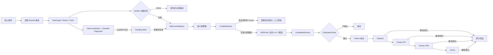
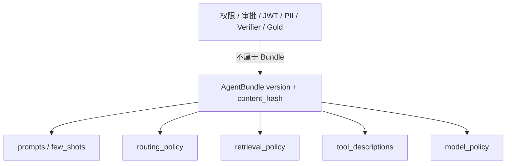
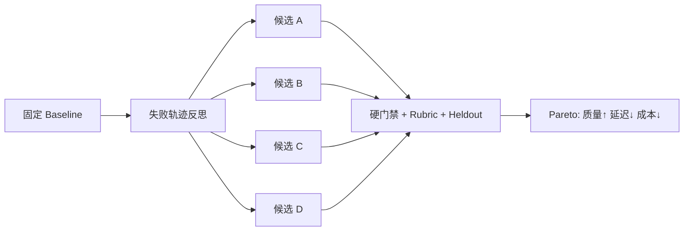
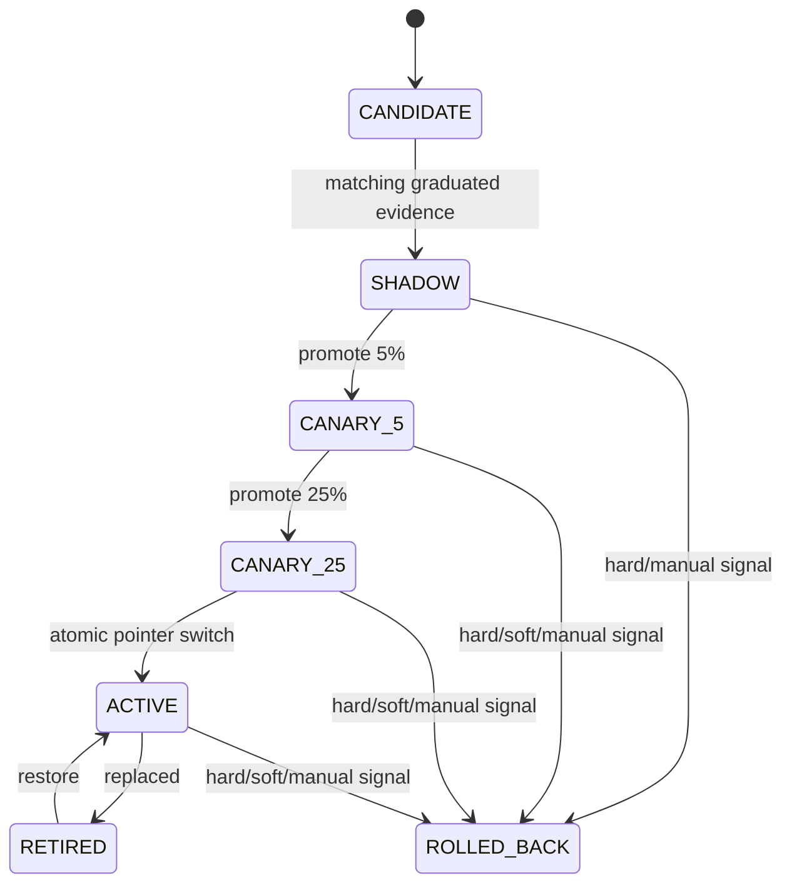

# Agent 进化闭环：从 Bad Case 到可回滚版本

> 这不是“线上失败一次，Agent 当场改 Prompt”。DialogPilot 将运行与学习分开：失败先归因，候选在离线环境生成并评测，只有通过硬门禁的不可变版本才能进入 Shadow、5%、25% 和 Active；异常时切回上一版本指针。

## 快速导航

- 想先会讲：看“为什么不能在线自改”“完整控制环”“与改造前的区别”。
- 想看代码：看“六个 Owner”“不可变 AgentBundle”“发布状态机”。
- 想应对追问：看“哪些能自动进化”“评测与 Pareto”“边界与 SOTA 对齐”。
- 想现场演示：看“管理 API 与最小操作顺序”。

<div class="dp-rollout-board" role="img" aria-label="Agent Bundle 从稳定基线经过候选、晋级、Shadow、5% 和 25% Canary 成为 Active，硬信号可立即回滚">
  <div class="rollout-lane baseline"><span>STABLE</span><strong>agent-v17</strong><small>当前用户流量</small></div>
  <div class="rollout-arrow">→</div>
  <div class="rollout-lane candidate"><span>OFFLINE</span><strong>4–8 candidates</strong><small>受限配置补丁</small></div>
  <div class="rollout-arrow">→</div>
  <div class="rollout-lane gate"><span>GRADUATION</span><strong>hard gates</strong><small>质量 / 安全 / 成本</small></div>
  <div class="rollout-arrow">→</div>
  <div class="rollout-lane shadow"><span>SHADOW</span><strong>0% publish</strong><small>真实输入副本</small></div>
  <div class="rollout-arrow">→</div>
  <div class="rollout-lane canary"><span>CANARY</span><strong>5% → 25%</strong><small>稳定用户分桶</small></div>
  <div class="rollout-arrow rollback">↩</div>
  <div class="rollout-lane active"><span>ACTIVE</span><strong>atomic pointer</strong><small>新请求使用</small></div>
</div>

## 1. 为什么不能让 Agent 在线改自己

同一个进程既服务用户又改 Prompt，会同时破坏四个合同：一次请求中版本可能漂移；一次偶发差评可能覆盖稳定配置；无法区分 Prompt、路由、检索、工具权限或代码缺陷；修改失败后也没有可复现的上一版本。

DialogPilot 的正向合同是：

```text
运行面：读取固定 Bundle → 执行 → 发布/升级 → 记录脱敏归因
学习面：聚类 → Owner 归因 → 生成候选 → 离线评测 → 晋级
发布面：Shadow → Canary 5% → Canary 25% → Active → Rollback
```

运行中的请求永远持有开始时解析出的 `AgentBundle` 对象。即使 Active 指针在请求中途切换，这个请求也不会混用两个版本；只有后来的请求读取新指针。

## 2. 完整控制环



这里的关键不是“会生成 Prompt”，而是每一步都有唯一 Owner 和有类型结果。`BadCaseRegistry` 仍拥有失败生命周期；`AgentBundleRegistry` 只拥有不可变内容；`GraduationGate` 只判断评测资格；`RolloutManager` 是状态和流量指针的唯一写入者。

## 3. 六个 Owner 与源码入口

| Owner | 源码 | 拥有的事实 | 不拥有的事实 |
|---|---|---|---|
| 失败资产 | [`services/badcase_registry.py`](../services/badcase_registry.py) | 去重、复发、状态、不可变 Intent prediction、pending 纠正与人工 annotation | 不能自动认定修复有效或把 annotation 冒充 Gold |
| 版本归因 | [`services/evolution/envelope.py`](../services/evolution/envelope.py) | Bundle/组件哈希、producer/task/tool-call ID | 不保存原始 Prompt、输出或参数 |
| 候选范围 | [`services/evolution/bundle.py`](../services/evolution/bundle.py) | 可进化字段和值域 | 不包含权限、JWT、PII、Verifier、Gold |
| 责任归因与生成 | [`attribution.py`](../services/evolution/attribution.py)、[`proposal_generator.py`](../services/evolution/proposal_generator.py) | 失败属于哪个可进化 Surface、候选补丁 | 不能发布候选 |
| 评测晋级 | [`evaluation/candidate_runner.py`](../evaluation/candidate_runner.py)、[`graduation.py`](../evaluation/graduation.py) | Gate 证据、晋级结论、Pareto 前沿 | 不能修改 Active 指针 |
| 灰度发布 | [`services/evolution/rollout.py`](../services/evolution/rollout.py) | 状态迁移、稳定分桶、指标、回滚和指针 | 不能伪造 Graduation 证据 |

`AgentBundleRegistry` 与 `RolloutManager` 共用一份 SQLite 数据库，使 rollout 状态和 Bundle 指针在同一事务里改变。当前设计适合单应用写者；多副本部署应把这份权威状态迁移到支持共享事务和一致性约束的数据库。

## 4. EvolutionEnvelope：先解决 Credit Assignment

一个“回答不好”不能直接等价为“Worker Prompt 不好”。请求完成后，失败记录附带脱敏的 `EvolutionEnvelope`：

```json
{
  "request_id": "req_x",
  "agent_bundle_version": "agent-v17",
  "prompt_hash": "sha256…",
  "router_policy_hash": "sha256…",
  "retrieval_policy_hash": "sha256…",
  "tool_registry_hash": "sha256…",
  "producer_agent_keys": ["billing_0"],
  "task_ids": ["billing_task"],
  "tool_call_ids": ["call_12"],
  "verification": "reject",
  "badcase_group": "false-refund-claim"
}
```

`CreditAttributor` 先按失败阶段做确定性归因，再允许模型反思：

| 失败阶段 | 自动候选面 | 处理 |
|---|---|---|
| Intent | Prompt、Few-shot | 只有绑定真实 prediction 且人工批准 annotation 后可生成候选 |
| Planning / Routing / Coverage | 路由阈值 | 可生成候选 |
| Retrieval / Memory | top_k、RRF 与两路权重 | 可生成候选 |
| 普通 Tool 选择 | 工具描述、Worker Prompt | 可生成候选 |
| Input Security / Infrastructure | 无 | 转代码或运维 Owner |
| 越权、timeout、cancel、`outcome_unknown` | 无 | 禁止模型改安全合同 |

这一步是整个闭环的保险丝：配置错误交给候选生成，权限和副作用终态仍由生产代码 Owner 修复。

### Intent 为什么多一道人工 Annotation

一次低置信度、点踩或用户输入的 `suggested_intent` 都不能证明分类器错了。`/chat` 因此先保存脱敏 `IntentLearningRecord(PREDICTED)`，记录 `prediction_id`、输入/分类器指纹、三路分数和固定 Bundle。`wrong_route` 反馈必须引用认证用户自己的 prediction，随后只进入 `PENDING`。

管理员通过 `/intent-feedback/{prediction_id}/review` 批准或拒绝。批准产生不可变 `annotation_id + approved_intent + dataset_version`，但接口明确返回 `active_bundle_changed=false`。`CreditAttributor` 与 `GEPALiteProposalGenerator` 都会拒绝缺少批准 annotation 的 Intent Case，避免调用者绕过其中一层。批准样本只进入候选 Prompt/Few-shot；是否发布仍由 Eval、Graduation 和 Rollout 决定。

## 5. 不可变 AgentBundle

一个 Bundle 固定一次执行真正读取的六类配置：Prompt、Few-shot、路由、检索、工具描述和模型策略。注册表只追加，同一个 `version` 若对应不同内容会报冲突；内容和各组件都生成稳定 SHA-256。



当前自动候选允许改变：

- Intent/Worker Prompt 片段与经审核 Few-shot；
- `supporting_threshold`、`clarification_threshold`；
- `top_k`、`rrf_k`、vector/BM25 权重；
- 已注册工具的模型可见描述；
- 经过启动期运行时兼容校验的模型策略。

安全关键字段即使伪装成普通键也会被合同拒绝。模型策略若与已经创建的运行时 Client 不一致，也不能直接进入 Shadow；这避免“版本写了新模型、进程却仍调用旧模型”的假发布。

## 6. GEPA-lite 候选生成与 Pareto 晋级

`BadCaseMiner` 只聚合仍可行动的同一语义组。反思模型读取基线、脱敏失败摘要、归因 Owner 和允许修改面，必须返回 4–8 个互不相同的最小 patch。`GEPALiteProposalGenerator` 在本地完成字段白名单、合并、去重、非空变化和值域校验，再注册新的不可变 Bundle；生成动作不会触碰 Active。



晋级不是把所有指标平均成一个分数。以下任一硬门禁失败都直接淘汰：security、identity isolation、tool authorization、required-task coverage 和 stateful 属性。质量侧检查 pass rate、Judge 失败和旧回归；证据侧要求 fresh heldout ID、SHA-256 与允许的 review status；效率侧限制候选相对基线的延迟和成本。

`CandidateRunner` 不接受调用者直接传入 `hard_gates=true`。每个 Gate Runner 必须实际运行并返回带 `evidence_id`、details checksum 的 `GateArtifact`，评测报告还必须绑定候选 `agent_bundle_version`，防止把基线报告重新贴上候选标签。

> 当前仓库提供完整 Runner、Rubric 和 Graduation 合同，但项目数据仍是 provisional，human-reviewed Gold 仍为 0。它证明“晋级机制可执行”，不等于某个新候选已经获得生产准确率认证。

## 7. Shadow、Canary 与自动回滚



Shadow 使用真实输入的副本运行候选意图、RAG、Context、Worker 和 Verifier，但不返回候选、不写会话记忆、不建工单、不登记 Bad Case。`execution_mode=shadow` 还会在 ToolManager Owner 边界拒绝写工具；只读调用也不更新生产缓存、熔断器或业务 Agent 统计，防止影子流量改变正式系统。

Canary 用 `SHA-256(bucket_salt + authenticated subject)` 稳定分桶：同一用户不会在请求间随机跳版本。只支持 5% 后再升 25%，达到 25% 才能成为 Active。

自动回滚分两类：

- 硬信号：`unauthorized_tool`、`privacy_leak`、`cross_user_retrieval`、`wrong_write`，一条即回滚；
- 软信号：候选和基线都达到最小样本量后，Verifier pass rate 使用 Wilson 区间判断显著退化，或 P95 延迟/平均成本超过比例预算再回滚。

回滚切换的是数据库指针，不覆盖 Bundle 文件。已开始的请求继续使用它固定的旧对象，新请求读取恢复后的稳定版本。

## 8. 管理 API 与最小操作顺序

所有 Evolution/Rollout 写接口都需要 admin scope。推荐顺序是：

```bash
# 1. 从一个已归因语义组生成 4 个候选；只注册，不发布
POST /evolution/proposals
{"semantic_group_id":"false-refund-claim","candidate_count":4}

# 2. 用 candidate bundle 跑评测，报告会写入 bundle version
POST /eval/run
{"dataset_id":"dialogpilot-500-v1","split":"dev","bundle_version":"cand-agent-v1-…"}

# 3. 提交真实 Graduation 证据后进入 Shadow
POST /evolution/rollouts/cand-agent-v1-…/shadow

# 4. 人工/自动判定 Shadow 健康后逐级放量
POST /evolution/rollouts/cand-agent-v1-…/canary  {"percent":5}
POST /evolution/rollouts/cand-agent-v1-…/canary  {"percent":25}
POST /evolution/rollouts/cand-agent-v1-…/active

# 5. 安全监控器发现闭合集合中的硬事件
POST /evolution/rollouts/signals/hard
{"bundle_version":"cand-agent-v1-…","signal":"privacy_leak","request_id":"req_x"}
```

Intent 错路由在第 1 步之前还需要：

```bash
# ChatResponse 已返回 intent_prediction_id
POST /feedback
{"request_id":"req_x","category":"wrong_route","prediction_id":"pred_x","suggested_intent":"account_security"}

# admin scope；只批准标签，不发布 Bundle
POST /intent-feedback/pred_x/review
{"decision":"approved","approved_intent":"account_security","dataset_version":"intent-dataset-v8"}
```

还可用 `GET /evolution/bundles`、`GET /evolution/bundles/active` 和 `GET /evolution/rollouts/{version}` 检查不可变版本、当前指针、状态迁移事件和证据。

## 9. 与改造前的区别

| 维度 | 改造前 | 现在 |
|---|---|---|
| Bad Case | 去重、状态、导出 dev regression | 增加 Bundle/组件哈希与生产者归因 |
| Intent 纠正 | 进程内 `learn()` 直接追加可变模板 | prediction → pending feedback → admin annotation → candidate Bundle |
| Intent 缓存 | 截断消息/历史且不绑定完整策略版本 | 完整输入 SHA-256 × 有效分类器指纹，并按风险设置 TTL |
| Prompt 优化 | 人工直接改文件，版本归因弱 | 反思只生成受限不可变候选 |
| 评测基线 | 普通 eval 可能混淆当前报告与基线 | Baseline Snapshot 只追加，显式晋级才切指针 |
| 多目标选择 | 看单一平均分 | 安全硬门禁 + 质量/延迟/成本 Pareto |
| 发布 | 改配置后全量生效 | Shadow → 5% → 25% → Active |
| 回滚 | 再改回文件/重启 | 同事务切回上一 Bundle 指针 |
| 请求一致性 | 配置可能在中途变化 | 请求开始固定 Bundle，恢复执行也保留版本 |

这个闭环建立在另外两项运行时补强之上：`TaskPlan` 已兼容升级为依赖感知、上下文隔离的 `TaskGraph`，只调度依赖成功的 ready tasks；ReAct 写操作可把 pending call、审批挑战和 checkpoint 持久化，批准后以原 task/bundle/工具参数幂等恢复。它们解决的是“运行如何可靠”，Evolution 解决的是“版本如何安全变好”，两层不能混为一个在线自改循环。

## 10. 与 SOTA 的关系和诚实边界

研究路线中，[GEPA](https://arxiv.org/abs/2507.19457) 使用轨迹级自然语言反思生成 Prompt 候选，并维护多目标 Pareto 前沿；[Agent Lightning](https://www.microsoft.com/en-us/research/project/agent-lightning/) 将 Agent 执行轨迹转成可训练 transition，并对具体 LLM step 做 credit assignment；[Anthropic 的 agent 工程指南](https://www.anthropic.com/engineering/building-effective-agents)则强调先用简单、可组合的 workflow，在评价标准清晰时采用 evaluator–optimizer。

DialogPilot **不是 GEPA 或 Agent Lightning 的完整复现**。它借鉴的是可落地的共同结构：轨迹归因、反思式候选、多目标选择、运行/学习分离和受控发布。当前没有训练模型权重、策略梯度、Replay Buffer，也没有宣称论文级实验结果。

尚需补齐的生产项：

- Gate Runner 需要接入独立人工 Gold 和新鲜、未消费 heldout；
- Shadow 会增加模型与检索成本，需要并发和预算隔离；
- 线上 `cost_units` 目前是 Agent/Tool 数量代理量，不是供应商账单金额；
- 硬信号接口已闭合，但隐私/跨用户检测器仍要由外部安全监控接入；
- SQLite 适合当前单应用写者，多副本需共享事务数据库；
- 自动候选只改已经接线的配置，不会自动修改 Python 代码或安全 Owner。

## 11. 面试连续追问

### Q1：为什么不能 Bad Case 一出现就在线改 Prompt？

因为单例失败可能是噪声，也可能来自路由、检索、权限或代码。在线覆盖配置会让在途请求版本漂移、回归证据不可复现，也没有可靠回滚点。我的设计让生产运行只读取不可变 Bundle，学习面离线产生候选，门禁通过后再灰度。

### Q2：你为什么称它 GEPA-lite？

相似点是读取失败轨迹、用自然语言反思产生多个配置候选，再按多目标选择；差异是这里没有完整论文搜索算法和跨任务实验，只对 Prompt、Few-shot、阈值、检索权重与工具描述做受限补丁，所以明确叫 lite。

### Q3：怎么防止优化器把安全规则改松？

权限、审批、JWT、PII、Verifier fail-closed 和 Gold 状态根本不在 Bundle 数据模型里；字段名还经过禁止模式校验。安全或副作用 Bad Case 在 CreditAttributor 就会被标记为不可自动进化，只能转生产代码 Owner。

### Q4：一个平均总分高的候选为什么可能不能发布？

安全失败不能被回答流畅度抵消。Graduation 先检查 identity isolation、tool authorization、coverage、stateful 等硬门禁，再比较质量、延迟和成本；Pareto 只在已经 graduated 的候选中选择。

### Q5：Shadow 为什么不只是“结果不返回用户”？

若影子请求仍写记忆、建工单、调用退款或污染缓存/熔断器，它已经改变生产事实。这里在 ToolManager 边界禁止 Shadow 写操作，并跳过记忆、工单、Bad Case、生产缓存与 Agent 统计，只有可观测指标留下。

### Q6：软回滚为什么需要最小样本和置信区间？

一次 Reject 或慢请求不足以区分真实退化和随机波动。系统先要求候选/基线都有最小样本，再用 Wilson 区间判断 pass-rate 差异；延迟和成本也按窗口聚合。越权、泄漏、跨用户召回和错误写入则无需等待统计，立即回滚。

### Q7：这项改造怎么用 STAR 讲？

**S：** Bad Case 虽可入库，但人工直接改 Prompt 会丢失版本归因，优化也可能伤害旧能力。**T：** 把线上失败转成可验证、可灰度、可撤销的 Agent 策略升级，同时禁止模型修改安全边界。**A：** 增加脱敏 EvolutionEnvelope、确定性 Owner 归因、不可变 AgentBundle、GEPA-lite 多候选、带 provenance 的 Graduation/Pareto，以及 Shadow、稳定 5%/25% 分桶和硬/软自动回滚。**R：** 请求级版本固定、候选不能绕过硬门禁、影子写操作零提交、发布和回滚都收敛为 SQLite 原子状态迁移；344 项仓库回归通过。当前数据仍非 human Gold，因此不虚构线上准确率提升。
