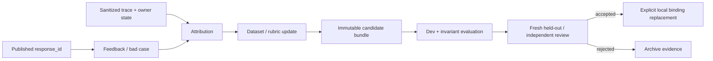

# Agent 进化闭环：从 Bad Case 到可复现候选

> 当前项目没有生产流量，也不保留已删除的 Shadow/Canary/promotion/rollback 运行时。这里的“进化”是受控离线工程闭环：绑定真实 response 与 trace，完成归因，生成不可变候选，在 Dev 上比较并用 fresh evidence 复核；是否替换本地 Active binding 是显式工程决定。

## 快速导航

- 想理解边界：读“为什么不能在线自改”和“当前支持的闭环”。
- 想看 Owner：读“事实归属”和“不可变候选”。
- 想看验收：读“分层评测”和“替换门禁”。
- 想准备面试：读“可讲与不可讲”。

## 1. 为什么不能让 Agent 在线自改

一次失败可能来自意图、路由、上下文、检索、工具、证据覆盖、生成、发布或连接器。若失败后直接改 Prompt，系统同时破坏三件事：

1. Credit assignment：不知道哪一层应负责；
2. Reproducibility：线上状态无法复现；
3. Safety：候选可能用平均质量换来越权或重复副作用。

运行链只产事实与反馈；学习链只产候选和评测证据。候选不得在处理同一用户请求时改写当前执行版本。

## 2. 当前支持的闭环

正向合同是：

- Feedback 必须绑定真实 `response_id`，不能只有一段脱离运行身份的评论。
- Trace 和 Owner state 只用于归因，不成为业务事实的新 Owner。
- 数据修改保留来源、split、review 状态和 manifest fingerprint。
- 候选配置内容寻址、不可变；一次报告固定 candidate fingerprint。
- Dev 用于开发选择；fresh heldout 和独立复核用于反驳过拟合。
- 安全与副作用是零容忍切片，不能被平均分抵消。

## 3. 事实归属与组件边界

| 关注点 | Owner | 当前边界 |
|---|---|---|
| 用户反馈 | Feedback service | 绑定 response/prediction identity |
| Bad Case 生命周期 | BadCaseRegistry | 本地持久元数据，不是生产事件平台 |
| 失败归因 | `services/evolution/attribution.py` | 输出受支持 surface；未知归因显式保留 |
| Bundle 内容 | AgentBundle / registry | 不可变、带 fingerprint；metadata 当前为本地 store |
| 执行版本引用 | Admission / active bundle selector | Invocation 固定引用；处理中不漂移 |
| Dataset 身份 | manifest + case source/review | provisional、consumed、fresh 状态不可互换 |
| 运行结果 | ChatApplication + Owner probes | 评测与服务调用相同应用边界 |
| 晋级判断 | 人工工程决策 + 可复现报告 | 当前无生产 rollout API |

## 4. Attribution：先定位权威缺口

归因不是给 Bad Case 加一个宽泛标签。至少要区分：

- `intent / request_shape`：入口理解错误；
- `route / owner / dependency`：RouteDecision 或 TaskGraph 错误；
- `context / memory`：当前任务取错历史或预算；
- `retrieval / evidence`：候选、选择、packing 或 provenance 错误；
- `tool_authority / tool_effect`：权限、receipt 或副作用状态错误；
- `generation / coverage / verification`：主张无证据或发布资格错误；
- `publication / delivery / handoff`：最终事实、ACK 或服务连续性错误；
- `harness / label / environment`：评测器、标签或环境本身错误。

只有确认 authoritative fact、producer、consumer 和被破坏的不变量后，才修改 Owner 或转换边界。为了让一个 case 过而在报告器中补特殊分支，不算修复。

## 5. 不可变候选与版本固定

一个候选至少固定：

- Prompt / policy / route registry 版本；
- 模型 profile 与关键参数；
- Tool manifest 与 authority policy；
- Retrieval generation、query、rank、packing 配置；
- Dataset/rubric 版本和代码 commit；
- 预算、超时与 fail-closed 语义。

Invocation 在 Admission 时固定引用。这样同一次请求、trace 和报告可以回答“究竟运行了哪组策略”，而不是事后读取已经变化的全局配置。

## 6. 分层评测，不用一个总分掩盖问题

| 层 | 优先事实 | 合适的判定方式 |
|---|---|---|
| Intent / Route | label、mode、owner、task graph | 确定性 grader + slice metrics |
| Retrieval | source/span、Recall、MRR、nDCG | 固定 corpus 与 manifest |
| Tool | allowlist、arguments、receipt、effect | 状态机 / invariant tests |
| Publication | publication count、kind、response seq | Owner state probe |
| Handoff / Commitment | typed transition、event、outbox | 状态机与持久集成测试 |
| Answer quality | relevance、correctness、completeness | 人工校准后的 semantic scorer |

LLM Judge 故障必须显式记录，不能回填中性分后当作通过。已参与定位和修复的 heldout 要降级为 consumed regression；再次声明泛化需要新的、未见的 reviewer evidence。

## 7. 本地替换门禁

候选替换当前本地 binding 前，应同时满足：

1. 目标 slice 在 Dev 上改善，且报告固定完整 fingerprint；
2. 身份隔离、OOS、未审批写工具、重复副作用、无证据发布等零容忍项全部通过；
3. 相关 Owner、异常路径、projection 和文档合同同步迁移；
4. fresh heldout 或独立 reviewer 没有发现同一不变量的新反例；
5. 机器报告、实现、文档和当前 binding 一致；
6. 替换后删除被取代的旧路径，保持单一运行时。

当前没有生产流量，所以这里不伪造 5%/25% 流量阶段。未来若有真实线上流量，应另立 rollout ADR，明确 cohort、指标窗口、回退条件和状态 Owner。

## 8. 当前可复现证据

- 500 条 fixture 固定 Intent、Routing、Retrieval 和 Stateful 四层，但仍含 provisional 标签。
- Service-chain v2 以 11 个执行层和确定性 rubric 检查 Owner、工具、publication、handoff 和 delivery。
- `ChatApplicationRunner` 调用与服务相同的应用边界，并采集 typed stages 与 Owner state。
- 本地 E2E 报告覆盖真实 JWT、PostgreSQL、Redis、L1/L2、Commitment、Trace 和 restore。
- pytest 覆盖 bundle fingerprint、active selector、attribution、route policy、权限和状态机不变量。

具体口径见[500 条分层评测]({{ '/evaluation-500/' | relative_url }})与[客服 RAG 全链路评测]({{ '/rag-pipeline-evaluation/' | relative_url }})。

## 9. 可讲与不可讲

可以说：

> 我把 Agent 学习闭环设计为运行与候选分离：反馈绑定真实 response，trace 支持分层归因；候选 bundle 不可变，评测调用同一 ChatApplication，并用安全不变量、Dev 和 fresh evidence 决定是否显式替换本地 binding。

不能说：

- “Agent 会在线自动改 Prompt”——没有，也不应让当前请求修改自己。
- “已上线 Shadow/Canary 自动回滚”——旧模拟已删除，当前没有生产流量。
- “500 条都是 Gold”——当前含 auto-mapped/provisional 和 consumed regression。
- “总分上升就能发布”——权限、副作用、证据和发布门禁是硬约束。
- “Langfuse 是事实库”——它是可选观测出口，PostgreSQL Owner 不变。

## 10. 面试连续追问

### Q1：为什么不能 Bad Case 一出现就改 Prompt？

因为失败层尚未确定，而且没有固定数据、版本和安全回归。应先用 response/trace/Owner state 归因，再在离线候选上验证。

### Q2：为什么 Bundle 必须不可变？

否则 Invocation、评测报告和线上复盘引用的是同名不同内容，无法复现，也无法判断回归属于模型、策略还是数据。

### Q3：怎样避免评测器偷看答案？

Runner 只接收运行请求，fixture 不暴露 expected；grader 在运行结束后读取 typed outcome、trace 和 Owner probe 与 rubric 比较。

### Q4：为何不用平均总分决定替换？

一次越权写、重复退款或无证据发布不能由许多普通问题的高分抵消。零容忍 slice 必须独立通过。

### Q5：为什么当前不用 Canary？

项目没有真实线上流量，也没有需要迁移的旧数据。直接替换并删除旧 binding 更诚实、更简单；未来生产 rollout 需要新的事实和 ADR。

### Q6：如何证明一次修复已经收敛？

用一个因果模型解释已知缺陷，在 Owner 层关闭不变量，并通过属性/状态机测试、fresh adversarial cases 和独立复核，而不是每遇到一个例子就增加一个分支。
