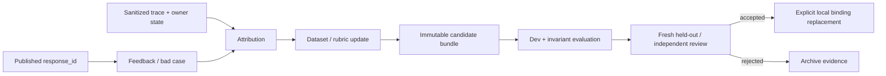

# Agent 进化闭环：从 Bad Case 到可复现候选

> 当前项目没有生产流量，也不保留已删除的 Shadow/Canary/promotion/rollback 运行时。这里的“进化”是受控离线工程闭环：绑定真实 response 与 trace，完成归因，生成不可变候选，在 Dev 上比较并用 fresh evidence 复核；是否替换本地 Active binding 是显式工程决定。

## 快速导航

- 想理解边界：读“为什么不能在线自改”和“当前支持的闭环”。
- 想看 Owner：读“事实归属”和“不可变候选”。
- 想看验收：读“分层评测”和“替换门禁”。
- 想准备面试：读“可讲与不可讲”。

## 1. 为什么不能让 Agent 在线自改

一次失败可能来自意图、路由、上下文、检索、工具、证据覆盖、生成、发布或连接器。若失败后直接改 Prompt，系统同时破坏三件事：

1. Credit assignment：不知道哪一层应负责；
2. Reproducibility：线上状态无法复现；
3. Safety：候选可能用平均质量换来越权或重复副作用。

运行链只产事实与反馈；学习链只产候选和评测证据。候选不得在处理同一用户请求时改写当前执行版本。

## 2. 当前支持的闭环



正向合同是：

- Feedback 必须绑定真实 `response_id`，不能只有一段脱离运行身份的评论。
- Trace 和 Owner state 只用于归因，不成为业务事实的新 Owner。
- 数据修改保留来源、split、review 状态和 manifest fingerprint。
- 候选配置内容寻址、不可变；一次报告固定 candidate fingerprint。
- Dev 用于开发选择；冻结官方 test 或预锁定 group-heldout，加上独立复核，用于反驳过拟合。
- 安全与副作用是零容忍切片，不能被平均分抵消。

## 3. 事实归属与组件边界

| 关注点 | Owner | 当前边界 |
|---|---|---|
| 用户反馈 | Feedback service | 绑定 response/prediction identity |
| Bad Case 生命周期 | BadCaseRegistry | PostgreSQL 事务维护去重、审核状态与审计，不是独立事件平台 |
| 失败归因 | `services/evolution/attribution.py` | 输出受支持 surface；未知归因显式保留 |
| Bundle 内容 | AgentBundle / registry | 不可变、带 fingerprint；metadata 当前为本地 store |
| 执行版本引用 | Admission / active bundle selector | Invocation 固定引用；处理中不漂移 |
| Dataset 身份 | manifest + case source/review | provisional、consumed、fresh 状态不可互换 |
| 运行结果 | ChatApplication + Owner probes | 评测与服务调用相同应用边界 |
| 晋级判断 | 人工工程决策 + 可复现报告 | 当前无生产 rollout API |

## 4. Attribution：先定位权威缺口

归因不是给 Bad Case 加一个宽泛标签。至少要区分：

- `intent / request_shape`：入口理解错误；
- `route / owner / dependency`：RouteDecision 或 TaskGraph 错误；
- `context / memory`：当前任务取错历史或预算；
- `retrieval / evidence`：候选、选择、packing 或 provenance 错误；
- `tool_authority / tool_effect`：权限、receipt 或副作用状态错误；
- `generation / coverage / verification`：主张无证据或发布资格错误；
- `publication / delivery / handoff`：最终事实、ACK 或服务连续性错误；
- `harness / label / environment`：评测器、标签或环境本身错误。

只有确认 authoritative fact、producer、consumer 和被破坏的不变量后，才修改 Owner 或转换边界。为了让一个 case 过而在报告器中补特殊分支，不算修复。

## 5. 不可变候选与版本固定

一个候选至少固定：

- Prompt / policy / route registry 版本；
- 模型 profile 与关键参数；
- Tool manifest 与 authority policy；
- Retrieval generation、query、rank、packing 配置；
- Dataset/rubric 版本和代码 commit；
- 预算、超时与 fail-closed 语义。

Invocation 在 Admission 时固定引用。这样同一次请求、trace 和报告可以回答“究竟运行了哪组策略”，而不是事后读取已经变化的全局配置。

## 6. 分层评测，不用一个总分掩盖问题

| 层 | 优先事实 | 合适的判定方式 |
|---|---|---|
| Intent / Route | label、mode、owner、task graph | 确定性 grader + slice metrics |
| Retrieval | source/span、Recall、MRR、nDCG | 固定 corpus 与 manifest |
| Tool | allowlist、arguments、receipt、effect | 状态机 / invariant tests |
| Publication | publication count、kind、response seq | Owner state probe |
| Handoff / Commitment | typed transition、event、outbox | 状态机与持久集成测试 |
| Answer quality | relevance、correctness、completeness | 人工校准后的 semantic scorer |

LLM Judge 故障必须显式记录，不能回填中性分后当作通过。已参与定位和修复的 heldout 要降级为 consumed regression；再次声明泛化需要新的、未见的 reviewer evidence。

## 7. 本地替换门禁

候选替换当前本地 binding 前，应同时满足：

1. 目标 slice 在 Dev 上改善，且报告固定完整 fingerprint；
2. 身份隔离、OOS、未审批写工具、重复副作用、无证据发布等零容忍项全部通过；
3. 相关 Owner、异常路径、projection 和文档合同同步迁移；
4. 冻结 test/group-heldout 或独立 reviewer 没有发现同一不变量的新反例；
5. 机器报告、实现、文档和当前 binding 一致；
6. 替换后删除被取代的旧路径，保持单一运行时。

当前没有生产流量，所以这里不伪造 5%/25% 流量阶段。未来若有真实线上流量，应另立 rollout ADR，明确 cohort、指标窗口、回退条件和状态 Owner。

## 8. 当前可复现证据

- 500 条 fixture 固定 Intent、Routing、Retrieval 和 Stateful 四层，但仍含 provisional 标签。
- Service-chain v2 以 11 个执行层和确定性 rubric 检查 Owner、工具、publication、handoff 和 delivery。
- `ChatApplicationRunner` 调用与服务相同的应用边界，并采集 typed stages 与 Owner state。
- 本地 E2E 报告覆盖真实 JWT、PostgreSQL、Redis、L1/L2、Commitment、Trace 和 restore。
- pytest 覆盖 bundle fingerprint、active selector、attribution、route policy、权限和状态机不变量。

具体口径见[500 条分层评测]({{ '/evaluation-500/' | relative_url }})与[客服 RAG 全链路评测]({{ '/rag-pipeline-evaluation/' | relative_url }})。

## 9. 可讲与不可讲

可以说：

> 我把 Agent 学习闭环设计为运行与候选分离：反馈绑定真实 response，trace 支持分层归因；候选 bundle 不可变，评测调用同一 ChatApplication，并用安全不变量、Dev 和 fresh evidence 决定是否显式替换本地 binding。

不能说：

- “Agent 会在线自动改 Prompt”——没有，也不应让当前请求修改自己。
- “已上线 Shadow/Canary 自动回滚”——旧模拟已删除，当前没有生产流量。
- “500 条都是 Gold”——当前含 auto-mapped/provisional 和 consumed regression。
- “总分上升就能发布”——权限、副作用、证据和发布门禁是硬约束。
- “Langfuse 是事实库”——它是可选观测出口，PostgreSQL Owner 不变。

## 10. 面试连续追问

### Q1：为什么不能 Bad Case 一出现就改 Prompt？

因为失败层尚未确定，而且没有固定数据、版本和安全回归。应先用 response/trace/Owner state 归因，再在离线候选上验证。

### Q2：为什么 Bundle 必须不可变？

否则 Invocation、评测报告和线上复盘引用的是同名不同内容，无法复现，也无法判断回归属于模型、策略还是数据。

### Q3：怎样避免评测器偷看答案？

Runner 只接收运行请求，fixture 不暴露 expected；grader 在运行结束后读取 typed outcome、trace 和 Owner probe 与 rubric 比较。

### Q4：为何不用平均总分决定替换？

一次越权写、重复退款或无证据发布不能由许多普通问题的高分抵消。零容忍 slice 必须独立通过。

### Q5：为什么当前不用 Canary？

项目没有真实线上流量，也没有需要迁移的旧数据。直接替换并删除旧 binding 更诚实、更简单；未来生产 rollout 需要新的事实和 ADR。

### Q6：如何证明一次修复已经收敛？

用一个因果模型解释已知缺陷，在 Owner 层关闭不变量，并通过属性/状态机测试、fresh adversarial cases 和独立复核，而不是每遇到一个例子就增加一个分支。

## 11. 一条 Bad Case 的实际处理链

以“用户问退款进度，系统引用退款政策后直接说已到账”为例：

```text
response_id / request_id / trace_id
→ 查 RouteDecision：mixed 还是 knowledge_qa
→ 查 FactRequirement：是否要求 refund_state
→ 查 Tool receipt：是否真的调用退款状态 Owner
→ 查 EvidencePack：政策证据是否只证明规则
→ 查 Coverage：为何缺少业务 receipt 仍 complete
→ 查 Verifier：claim-authority 是否被错误放行
→ 定位根因 Owner
→ 生成最小候选
→ owner tests + service-chain regression + fresh cases
→ 显式替换 binding 或拒绝候选
```

若 Route 被误判成纯知识，修复 RequestShape/AuthorityPolicy；若 Route 正确但 Agent 未调用工具，修复 task formation 或 tool contract；若 receipt 缺失但 Coverage 通过，修复 RequirementCoverage；若所有前序正确而 Verifier 放行无依据 claim，才修复发布门禁。不能看到“回答错”就默认改 Prompt。

## 12. Proposal 能改什么，不能改什么

候选面应是闭合白名单：

| 可候选化 | 例子 | 必须固定的证据 |
|---|---|---|
| Prompt/Few-shot | Intent 边界、Worker 表达 | base bundle、patch、case group |
| Routing policy | 阈值、领域映射 | route registry 与受影响 slice |
| Retrieval policy | weights、top-k、packing | generation、manifest、消融报告 |
| Tool description | 参数说明、返回 schema 提示 | registry/schema fingerprint |
| Model policy | 角色模型与 reasoning | 成本、延迟、质量对照 |

权限、JWT、审批规则、PII redaction、Gold 标签、Verifier hard gate、业务 receipt 定义不能由 Proposal 自动修改。需要改变这些内容时，应作为代码/治理变更由 Owner 审阅，而不是包装成“Agent 自进化”。

## 13. CandidateRunner 的逐步合同

1. 读取 immutable base bundle，验证 candidate `base_version`；
2. 应用白名单 patch，并拒绝未知字段、空变化和重复候选；
3. 生成内容 fingerprint，同名不同内容失败；
4. 固定 dataset manifest、commit、model/retrieval/tool refs；
5. 运行确定性 hard gates；
6. 运行 Intent/Route/Retrieval/Stateful/Service-chain 分层评测；
7. 记录每个 case 的原始 typed outcome，不只存聚合分；
8. 计算质量、延迟与 cost proxy 的 Pareto 关系；
9. 用 fresh evidence 或独立 reviewer 反驳候选；
10. 输出 accept/reject/insufficient-evidence，不自行改 Active。

`insufficient-evidence` 不是失败异常，而是重要结论：样本太少或 judge 不可用时不能做发布决定。

## 14. 与当前运行链的接点

Bundle 在 `/chat` 开始时解析并固定；Intent cache key 包含 Prompt/Few-shot 指纹，RAG cache key 包含 retrieval policy/generation，ReAct checkpoint 保存 bundle version，feedback 和 Bad Case 保存 producer/task/call 引用。这样候选比较不会发生“外层是新版本、缓存或 resume 仍用旧版本”。

当前本地替换是直接 binding replacement，不经过模拟的 Shadow/Canary。一次切换必须同时更新：composition root、默认 bundle、测试 fixture、机器报告和 Pages；被替代 reader/writer/config 随同删除，避免长期维护双路径。

## 15. 归因所需的最小观测字段

- request/invocation/response/trace identity；
- tenant/user/conversation 的脱敏 scope；
- bundle、model、prompt、route、retrieval、tool registry fingerprints；
- Intent source scores、RequestShape、RouteDecision；
- TaskGraph、dependency、outcome、pending signal、coverage；
- Evidence refs、claim refs、Verifier status/reason；
- tool call/effect status 与 receipt ref；
- publication kind/seq、ticket/commitment/delivery 状态；
- stage latency、token/cost proxy、异常类型。

原始密钥、完整工具参数、未脱敏用户正文不应复制进 EvolutionEnvelope。学习所需 provenance 与隐私最小化必须同时满足。

## 16. 更多面试追问

### Q7：Attribution 能不能全部交给 LLM？

不能。task 缺失、receipt 不存在、publication 重复、状态迁移非法都有确定性事实。LLM 只适合对开放文本症状做辅助分类，且输出仍需映射到受支持 surface。

### Q8：为什么报告要保存 fingerprint，而不只保存版本名？

版本名可以被误用或重复；内容 hash 能证明两次运行的 Prompt、policy、manifest 是否真的相同。

### Q9：Dev 提升、heldout 下降怎么办？

拒绝候选或判证据不足，分析 slice 差异；不能把 heldout 重新命名为 Dev 后继续调到通过。

### Q10：什么是 consumed heldout？

一旦开发者看过其失败并据此修改实现，它就不再提供独立泛化证据，只能保留为 regression。

### Q11：为什么安全指标不进加权总分？

平均值允许一次越权被许多普通成功抵消。权限、跨用户召回、未审批写和重复副作用必须零容忍。

### Q12：Pareto 比单一分数好在哪里？

它保留质量、延迟和成本之间的真实取舍，不用一个任意权重把明显更慢或更贵的候选包装为“总分最好”。

### Q13：候选生成器输出 20 个方案是否更好？

不一定。候选数会线性增加真实评测成本，并放大对 Dev 的选择偏差。当前应限制少量、可解释、彼此有差异的 patch。

### Q14：模型升级是不是一种 Agent 进化？

它是 ModelPolicy 候选。必须在相同 bundle、数据、预算和工具面上比较，而不能同时换模型、Prompt、检索后把收益全部归给模型。

### Q15：为什么进化不能修改 Gold？

Gold 是评测权威；允许候选改标签等于让考生改答案。标签修订必须走独立审阅、版本和仲裁。

### Q16：Bad Case 聚类的目的是什么？

寻找共享 Owner/invariant，而不是为每个句子建特殊规则。若多个 reopening 指向同一 authority gap，应做架构级收敛审查。

### Q17：什么时候需要线上 Canary？

只有存在真实流量、不可完全离线模拟的分布和明确 rollback Owner 时。要先定义 cohort、观察窗口、硬/软信号与在途请求版本固定。

### Q18：当前项目为什么删掉 Canary？

没有线上流量，模拟 5%/25% 不产生真实风险证据，反而维护重复执行与版本指针。当前直接切换更符合实际约束。

### Q19：替换 binding 后怎样回退？

当前开发阶段依赖 Git 历史和重新部署，不在运行时保留旧 reader/writer。未来有真实不可丢数据时另立迁移和 rollback ADR。

### Q20：如何避免 Evolution 污染生产统计？

离线 runner 使用固定执行模式和独立报告，不写生产 Memory/Ticket/Feedback；候选不更新线上 cache、breaker 或 Agent quality stats。

### Q21：如何判断是环境问题而不是候选回归？

保存 provider、模型、seed、依赖版本、数据库 generation、错误类型和重试轨迹；环境不可用标为 infrastructure/insufficient evidence，不回填成质量 0 或 1。

### Q22：什么才算闭环完成？

根因、Owner 修复、所有消费者、异常路径、持久投影、文档和验收一致；fresh/adversarial case 未出现同一不变量的新分支，才能从“实现完成”升级为“验证闭合”。
