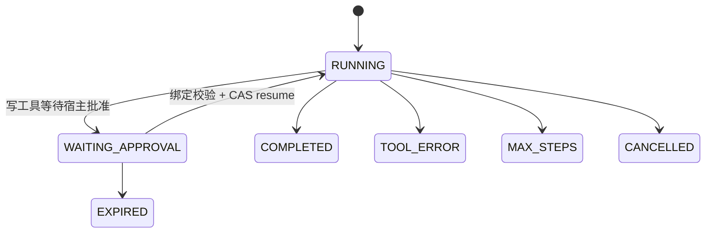
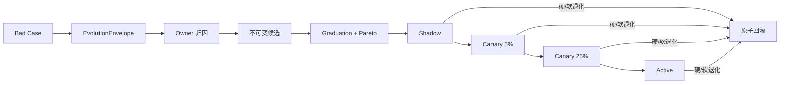

# 架构边界与职责归属

> 中文架构总览：按一次请求、一次任务图和一次版本发布，定位每个权威事实的唯一 Owner。所有 Mermaid 图均可点击放大、滚轮或双指缩放，并可拖拽查看。

DialogPilot 不是一条不断堆 Prompt 的调用链，而是按“谁拥有最终事实”划分边界。下面这张表既是仓库地图，也是面试时解释模块职责的主线。

| 关注点 | Owner（权威模块） | 权威输出 |
|---|---|---|
| HTTP 合同 | `api/main.py` | 经过校验的请求与响应模型 |
| HTTP 身份与权限范围 | `core/auth.py` | 从签名 JWT 的 `sub` 解析出的可信 `Principal` |
| Chroma 部署模式 | `core/chroma_client.py` | 明确选择远程或嵌入式物理存储 |
| 模型分层与推理策略 | `core/model_policy.py` | 按角色校验的模型、推理强度及请求级覆盖配置 |
| 意图识别 | `core/intent_recognizer.py` | 意图、置信度、紧急程度、实体、完整输入哈希和分类器指纹 |
| 意图预测与标注 | `services/badcase_registry.py` | 不可变 prediction、pending 纠正、人工 annotation 与 Bad Case 链接 |
| 业务范围处置 | `agents/agent_orchestrator.py` | `EXECUTE / CLARIFY / OUT_OF_SCOPE`，只有执行态可生成任务图 |
| 任务规划与 Agent 选择 | `agents/agent_orchestrator.py` | 带依赖、上下文范围、风险、验收条件和 Owner 的 `TaskGraph` |
| 编排合同与预算 | `agents/orchestration_contracts.py` | 任务身份、覆盖投影和共享执行截止时间 |
| 必做任务覆盖 | `services/result_synthesizer.py` | 完成、缺失、失败、重复和意外任务的证据 |
| 并行结果合成 | `services/result_synthesizer.py` | 唯一候选答案、冲突和升级决定 |
| ReAct 执行 | `agents/react_engine.py` | 有界 Worker 循环及闭合的 ReAct 结果 |
| 工具授权与可靠性 | `mcp/tool_manager.py` | Agent 白名单、审批结论、类型化结果和脱敏审计 |
| 业务知识原文与检索 | `mcp/knowledge_base.py`、`mcp/document_chunker.py` | source-offset 保真的 chunk 投影及 BM25/Dense/RRF 候选 |
| Query Transformation | `mcp/query_transformer.py` | Raw 保留、Standalone/Multi-query/HyDE 检索提示与失败降级 |
| 知识重排 | `mcp/result_reranker.py` | 经过候选 ID 校验的完整排序；失败保持 first-stage 顺序 |
| RAG Context Packing | `mcp/context_packer.py` | 不超过 Token/chunk 上限且保留 provenance 的上下文 |
| Grounded Generation | `mcp/grounded_answer_generator.py` | 同语言、引用合法、失败关闭的结构化回答 |
| 会话记忆 | `memory/conversation_memory.py` | 有序原始事件、范围摘要与检查点、情景索引和带来源事实 |
| 混合记忆排序 | `memory/hybrid_retrieval.py` | BM25、向量、时效性融合候选及检索指标 |
| 请求 Trace | `core/tracing.py` | Trace/Span 身份及进程内投影 |
| Prompt 上下文 | `memory/context.py` | Token 估算、类型化分区和有界模型输入 |
| 动态规则 | `core/skill_loader.py` | 请求级 Skill Prompt 块 |
| 发布安全 | `services/answer_verifier.py` | `PASS`、`REJECT` 或 `UNKNOWN` |
| 回答送达 | `services/response_delivery.py` | `response_id`、会话 seq 与 `SELECTED/DELIVERED/READ` |
| 人工升级 | `services/ticket_service.py` | 工单身份、状态、幂等性、事件历史和同事务 outbox |
| Bad Case 生命周期 | `services/badcase_registry.py` | 去重观察、证据门禁、复发和审计历史 |
| 在线健康度 | `monitor/performance_monitor.py` | 告警和路由惩罚 |
| 评测数据 | `evaluation/dataset.py` | 带版本、来源、审核状态、校验和及切分完整性的数据 |
| 离线质量 | `evaluation/evaluator.py`、`evaluation/benchmark.py` | 运行时意图/路由报告及确定性分层评分 |
| 评测晋级 | `evaluation/rubric.py`、`evaluation/graduation.py` | 不可变 Baseline、Rubric、硬门禁和晋级结论 |
| 任务依赖与恢复 | `agents/orchestration_contracts.py`、`agents/run_store.py` | `TaskGraph` 依赖、上下文范围、Checkpoint、审批挑战与 Resume |
| Agent 版本 | `services/evolution/bundle.py`、`registry.py` | 不可变 `AgentBundle`、内容哈希和版本指针 |
| 失败归因与候选 | `services/evolution/envelope.py`、`attribution.py`、`proposal_generator.py` | 脱敏归因、可进化 Owner 和受限候选 |
| 灰度与回滚 | `services/evolution/rollout.py` | Shadow、稳定 5%/25% 分桶、Active 与原子回滚 |

## `/chat` 的时序合同

1. 先做用户输入安全检查，再从 RolloutManager 解析并固定本次请求的 `AgentBundle`。
2. 读取记忆，再识别当前请求；缓存身份由完整消息/最近三轮哈希与有效分类器指纹共同确定。识别后尽力把脱敏 prediction、Bundle 版本和来源分数写入质量库；成功时向客户端返回稳定 `prediction_id`，质量库故障不改变本次客服回答。
3. 意图只识别一次，知识检索和路由复用同一个结果；低置信度 `OTHER` 收敛为 `CLARIFY`，高置信度 `OTHER` 收敛为 `OUT_OF_SCOPE`，二者都是无 Worker 的 Planner 终态。
4. 从 `TicketService` 读取该用户最多三个未进入 `CLOSED` 终态的事项，作为当前处理状态的权威投影。
5. 只有 `EXECUTE` 才构建依赖感知、上下文隔离的 `TaskGraph`；无依赖任务可并发，后继任务只在依赖成功后进入 ready 集合。
6. Worker 只能看到任务声明的上下文和白名单工具，最多执行 `REACT_MAX_STEPS`；授权仍由 `ToolManager` 决定。
7. 写工具等待审批时，RunStore 持久化 checkpoint 与审批挑战；Resume 重新验证绑定信息并幂等恢复原调用。
8. 每个任务都必须转换为类型化结果，并检查必做任务覆盖率；依赖失败保留 `BLOCKED_DEPENDENCY` 证据。
9. 合成唯一候选答案，在发布前校验覆盖、证据、完整性和安全性；代码拥有的澄清/越域固定回复以 `POLICY_TERMINAL` 发布，不再调用模型 Verifier。
10. 只把校验结论归因给真正产生该候选答案的 Agent 实例。
11. 需要升级时，在一个 SQLite 事务中创建/复用工单并写入 `ticket.created` outbox；后台向外部 CRM 投递，只有成功才标记 delivered。
12. 为最终选定文本持久化 `response_id + response_seq + SELECTED`，再把它写入记忆并返回客户端；渲染/已读由认证 ACK 单调推进。
13. 将校验失败、覆盖失败和工具副作用不确定记录为 provisional Bad Case，并附加 Bundle 组件哈希归因信封。
14. `EXECUTE` 和需要保持追问连续性的 `CLARIFY` 轮次持久化真正发布的内容；`OUT_OF_SCOPE` 不写工作记忆、情景索引或画像。
15. 只有 `EXECUTE` 轮次会在同一个 Redis 事务中追加 L0 原文并更新会话级 L1 事实任务；Worker 在累计 3 轮或空闲 5 分钟后批量提取，成功才推进 fact checkpoint。
16. 客户端关闭会话时，`finalize` 补齐未覆盖范围的摘要/checkpoint 和索引 metadata，并强制尝试刷新已调度事实；原始事件不删除，事实失败则保留任务重试。
17. 请求结束记录固定 Bundle 的质量/延迟代理指标；Shadow 副本不发布、不写业务事实。

这个顺序保证记忆系统不会把“模型生成但未通过校验的答案”误认为已经展示给用户。

## 知识 RAG 的权威坐标与候选配置

知识原文的 `source_id + checksum + [start_char,end_char)` 是证据事实；chunk ID、检索排名、重排、打包上下文和回答都是配置相关投影。导入边界先形成最小 `SourceDocument`，只支持 UTF-8 txt/md/JSON；public collection 的写入需要 admin，查询需要 knowledge/chat 能力，用户订单与账户事实不得进入该索引。生产 `KnowledgeBase` 与评测共用 `DocumentChunker`，每个 chunk 固定 `scope=public` 并记录 source type/checksum/offset。复杂文档 ACL 与 PDF/OCR ParseResult 不是当前范围。

```text
Source document/span
  → SourceDocument（stable ID / SHA-256 / type / public）
  → DocumentChunker
  → Chroma Dense + persistent SQLite BM25 postings + IndexManifest
  → QueryTransformer（Raw 必保留；生成 query 不是证据）
  → BM25 / Dense stable chunk-ID rankings
  → weighted RRF
  → ResultReranker（必须是精确完整 ID permutation）
  → ContextPacker + EvidencePack（预算、来源、分数、版本、drop）
  → GroundedAnswerGenerator v5（PydanticAI segments/conflicts/abstention）
  → 纯知识直接发布；混合实时事实进入 Agent + Verifier
```

仓库当前默认已迁移到冻结候选：

| 配置面 | 当前仓库默认 |
|---|---|
| Source/Chunk | public SourceDocument + fixed 512/64，chunk v4、index schema v2 |
| First stage | BM25 .75 / Dense .25，RRF k=10，candidate 20 |
| Query | Raw .25 + Standalone .75；无历史或改写失败退回 Raw 1.0 |
| Rerank | listwise 20→5，失败保留 first-stage 顺序 |
| Packing/Generation | Top-5/2600 EvidencePack + grounded v5 typed tool output；纯知识结果不再二次改写 |

> 2026-09-01 验证更新：上表是代码责任与失败边界，不是生产达标声明。grounded v4 曾在真模型实验中大量解析/校验失败；v5 只让模型返回带 Evidence ID 的 segments，由代码派生 answer/claims/citations，同一 36 group×3 Dev 合同错误为 `0/108`。父子 Chunk 仍因 multi-condition Packing 退化而不上线，baseline 仍需 fresh Heldout/Shadow。

候选来自 Doc2Dial Dev 的 100 文档、300 case、488 个官方 grounding span；48 条多轮压力集用于有界模型评测。历史 v3 报告中 Query Recall@20 为 0.7708（Raw 0.6667），Rerank Recall@5 为 0.7500（不重排 0.5938）。v4 的大量 `ValueError/JSONDecodeError` 证伪了手写多真相合同；v5 长文档重放中合同错误 `0/108`、typed abstention `6/36`、claim support/citation correctness `.7778–.8056`。这些仍是 Dev 数字，不是线上准确率。

代码已把冻结检索配置接入 `/search` 与 `/chat`；Sparse 不再在每次查询拉全库，而是使用可从 Chroma 权威 public chunk 重建的 SQLite posting sidecar。普通 Dev 上父子 256/32→1024/128 的 multi-condition completeness `.8261→.7826`。新增 `>=8000` 字符压力集后，它在 36 个 Doc2Dial span-Gold group 上把 packed evidence recall `.5278→.5833` 且 harmful `0`，但 multi-condition 不升；WixQA article-Gold packing 也退化。因此默认仍是 512/64，父子只作为待重新设计的长文档候选。Generation Owner 的 Dev 合同已修复，下一发布门禁是 baseline fresh Heldout，完整边界见[客服 RAG 生产化审计](./customer-service-rag-production-audit/)。

## 意图识别的在线/离线边界

线上识别器只有 `recognize()`，不再提供修改模块模板的 `learn()`。内置模板使用只读映射；每个结果携带 `input_fingerprint` 与 `classifier_fingerprint`。后者覆盖实际模型配置、阈值、相似度模式、融合权重、标签定义、Pattern、模板以及固定 Bundle 的 Intent Prompt/Few-shot。缓存按两个 SHA-256 的组合寻址，因此同前缀不同后缀、旧 Bundle 与新 Bundle 都不会错误共享结果。普通结果默认一小时 TTL，低置信度和账户安全结果最多五分钟；这仍是可删除的进程内加速层，不是纠正事实的 Owner。

当前生产兼容路径仍是 LLM 0.70 + 字符 n-gram 0.20 + Pattern 0.10。这里的 n-gram 是256维词面相似度，不是训练过的语义 Embedding。Pattern Owner 输出带 span 的 `positive/negative/uncertain/quoted` 证据；常规融合中其贡献分别为 `+w×confidence / -w×confidence / 0 / 0`，同一意图同时出现相反证据时弃权。否定只作用于当前局部子句，“不是我操作的”安全事件和“退款没有到账”等业务正向表达有单独合同。细粒度纠偏只接受无矛盾的正向 Pattern。

权重最初是工程初值，随后在500条 Dev 上以五折 group-safe PAVA 校准搜索2,332个候选，并在冻结300条上游集验证。候选 `0.65/0.35/0` 在首次 test 少对2条且安全召回下降；V3 最佳候选 `0.85/0/0.15` 在 Dev 少对1条、冻结 test 仅打平，因此原权重被保留而非被证明全局最优。极性接入后复用冻结 LLM/n-gram 输出做隔离 A/B：202条冲突诊断 `167→169`、修正2条伤害0条；500条 Dev 仍466/500，300条验证仍283/300，OOS和安全召回不变。

离线另有冻结 BGE-M3 + Logistic Regression 和 Encoder→LLM 级联候选。300 条上游 test 上，纯 Encoder、97% 接受精度级联、当前 V1 分别为 281/300、283/300、283/300；85 条中文/混合诊断分别为 75/85、82/85、84/85。级联在上游只回退 LLM 4.7%，但没有同时超过 V1 的总体、OOS 与安全指标。因此这些产物属于 `offline_cascade_replay_not_production`，不改变 `/chat` 默认路由。切换条件至少包括新鲜中文留存集、独立 Gold、类别风险校准和无关键 slice 回退。

```text
在线：recognize → IntentLearningRecord(PREDICTED) → 返回 prediction_id
反馈：prediction_id + suggested_intent → PENDING Intent Bad Case
审核：管理员 APPROVED / REJECTED → 不可变 annotation
进化：仅 APPROVED 样本 → Prompt/Few-shot 候选 → Eval/Graduation/Rollout
```

`wrong_route` 反馈必须引用当前认证用户的一次真实预测，不能只提交任意消息和标签。用户建议只代表候选证据；管理员批准后，Bad Case 才获得 `approved_intent + annotation_id + dataset_version`，但这仍不是自动 Gold，也不会修改 Active Bundle。`CreditAttributor` 和候选生成器会共同拒绝未批准的 Intent Case。预测文本先经过 BadCase 脱敏且限制长度；普通聊天接口只返回 ID 和版本哈希，详细队列只对 admin scope 开放。

## 上下文预算合同

`MemoryManager` 拥有持久化记忆状态。批量写入的每轮消息获得会话内连续序号，并追加到 Redis 原始事件日志。Token 压力出现时，只选择最老、尚未覆盖且边界固定的序列范围，最近对话仍保留原文。模型只摘要这个固定范围，产物是携带 `from_seq`、`to_seq`、来源消息 ID 和来源哈希的不可变 Chunk。Redis CAS 只推进摘要检查点；后来到达的新消息位于范围之外，不会使当前摘要失效，只有竞争同一检查点的写入者可能赢得这次状态迁移。

长期情景记忆存储带重叠的原始会话 Chunk，而不是只存摘要。向量和 BM25 候选按用户隔离，并排除正在由 Redis history 承担的当前 `conv_id`；两路可以独立降级，时效性只能重排已经相关的候选。加权 RRF 生成最终排序并保留 `message_id/event_seq/role/chunk_index` 定位。最相关的两个旧会话命中会从 Redis 原始事件日志各展开命中前后两条消息，总窗口上限 1200 estimated tokens；无法展开时保留命中原文。结构化摘要服务于 Prompt 上下文和元数据，不是长期检索的唯一事实来源。

`add_messages()` 是完整轮次进入情景索引的时机 Owner：Redis 追加成功后立即用稳定 `message_id` 和确定性 Chroma ID `upsert` 原始事件。运行时索引失败不回滚已发生的 Redis 事件，压缩和显式 `finalize` 会以同一 ID 幂等补偿；只有归档成功的范围才允许推进摘要 checkpoint。会话结束操作覆盖调用开始时观察到的高水位，如果随后出现更大序号，则返回类型化并发写入结果。

长期用户状态由带来源 ID 的类型化事实组成，生命周期闭合为 `active / superseded / retracted`；Prompt 中的用户画像只是活跃事实的投影，不是每轮重建的 Persona。`EXECUTE` 轮次的 L0 追加与 Redis sorted-set 任务标记在同一事务提交，替代易随进程退出丢失的裸 `asyncio.create_task`。同一 `user_id + conv_id` 只有一个防抖任务：默认累计 3 轮立即到期，否则在最后活动 300 秒后处理。Worker 通过用户级 Redis 租约串行化同一用户跨会话的事实状态转换，每批最多覆盖 20 条事件；Chroma 事实写成功后才单调推进 `fact_checkpoint`，积压继续留队，失败按 30 秒退避。任务 score 用 CAS 删除/重排，执行期间到达的新轮次不会被旧 Worker 清掉。`source_max_seq` 只在同一会话内有序；跨会话事实新旧按服务端原始消息的 `source_observed_at` 判断，并保留 `source_conversation_id`，不能拿两个局部 seq 直接比较。

`ContextAssembler` 单独拥有“记忆数据如何转换成 LLM 输入”的职责。记忆、检索知识、画像和 `active_tickets` 放在带标签的数据分区中，真正的用户/助手历史仍然保留消息角色。活动工单 priority 为 90，高于历史画像/情景/摘要；订单、退款和账户的当前事实仍必须以实时业务工具结果为最高权威。装配器预留输出容量、从最老历史开始裁剪，并且不会伪造助手确认消息。

## TaskGraph、预算与并行结果代数

Planner 先返回闭合的 `PlanningDisposition`：

```text
EXECUTE      → 必须携带 TaskGraph
CLARIFY      → 必须无 TaskGraph，发布固定澄清问题
OUT_OF_SCOPE → 必须无 TaskGraph，发布固定业务范围重定向
```

编排器只把 `EXECUTE` 选择的能力转换成 `TaskGraph`；`TaskPlan` 只保留为旧代码导入别名。构造函数拒绝“执行却没有图”和“策略终态却携带图”的双重事实。每个必做任务都有稳定 ID、唯一 Owner、明确范围、`depends_on`、`context_refs`、副作用上界、风险和成功标准。图在执行任何 Worker 前拒绝重复 ID、悬空边和环；拓扑上同一波次可并行，后继只消费自己声明的上下文与依赖产物。`ExecutionWindow` 为全部 Worker 和合成阶段提供共享截止时间，同时限制单 Agent 超时和最大 Agent 数量。每项任务最终只能进入：

```text
SUCCESS / TIMEOUT / ERROR / BUDGET_EXCEEDED /
BLOCKED_DEPENDENCY / AWAITING_APPROVAL
```

`CoverageGate` 对比计划和结果，拒绝缺失、失败、重复或意外的必做任务证据。只有 `ResultSynthesizer` 能把有序任务结果转换为候选答案。发布校验器在调用模型之前，会先确定性拒绝覆盖不完整的候选。

## 持久 ReAct 与审批恢复

`RunStore` 是 ReAct Run、Checkpoint 和工具调用幂等账本的唯一 Owner。写工具需要审批时，执行器不是返回一个无法恢复的布尔值，而是把原始 `task_id`、认证用户、Bundle 版本、消息块、运行时状态、pending call 与过期时间写入 SQLite，并返回最小公开挑战。`POST /agent-runs/{run_id}/resume` 需要 `tool:approve` scope，重新校验用户/任务/工具/参数绑定后，以 CAS 迁移 checkpoint。



同一个 `tool_call_id` 只有一个执行声明；重放已完成调用返回相同 receipt，恢复竞争者不能重复提交写操作。恢复的是原 Worker 任务，不是整张图从头再跑；上层仍使用原 `task_id` 和 Bundle 版本继续合成。

## 路由质量反馈

Agent 调用成功只说明模型供应商返回了结果，不代表答案质量合格。因此每个 Agent 实例分别维护可用性和答案质量统计。校验器的 `PASS`、`REJECT` 更新带样本置信度的 EWMA，置信度在前 10 个样本逐步建立；`UNKNOWN` 只增加基础设施异常计数，不改变答案质量。只有直接生成候选或成功参与合成的实例会收到归因，冲突或未知合成不会错误惩罚某个 Worker。

反馈只有在同类型存在至少两个存活实例时才能改变选择。统计记录因此显式暴露 `routing_pool_size` 和 `adaptive_routing_active`；单实例池仍收集健康度，但不会声称能把流量路由到不存在的备份实例。

## 失败语义

- `OTHER` 且置信度低时返回 `CLARIFY`；高置信度时返回 `OUT_OF_SCOPE`。二者都不是攻击、失败或 GeneralAgent 任务，不触发 RAG、工具、Verifier、Shadow、工单或 Agent 质量归因。
- 普通模型调用失败可以回退到 General Agent；被拒绝、等待审批、执行失败或超预算的 ReAct 结果不得回退，避免丢失原任务的安全证据。
- 工具超时、熔断或执行失败返回受控降级结果。
- Worker 无法发现或执行白名单外工具。只读调用可以并发，潜在写操作串行执行，并在默认策略下要求宿主审批。
- 校验器失败返回 `UNKNOWN`，绝不等同于 `PASS`。
- `REJECT` 和 `UNKNOWN` 发布确定性人工转接说明，并设置 `escalated=true`。
- 工单持久化失败时不能宣称升级成功，而是要求客户端携带相同 `request_id` 重试。
- 回答返回只产生 `SELECTED`；没有认证客户端 ACK 时不能声称已送达或已读。
- 外部 CRM 投递失败时 outbox 保持 pending 并退避重试；未配置接收端不能标记 delivered。
- 压缩模型失败时，对同一固定来源范围执行有界确定性摘要；竞争的检查点迁移不能同时提交。
- Agent 超时或异常是类型化结果。部分成功可以合成但必须升级；全部失败或不可校验的结果按 fail-closed 处理。
- 请求预算耗尽仍以 `BUDGET_EXCEEDED` 绑定到原计划任务，不能从覆盖证据中静默消失。
- 账户安全任务由 `AccountSecurityAgent` 负责，而不是 Billing Agent。
- `UNKNOWN` 可观测，但不会被当作 Agent 答案质量差。
- 人工转接任务由真实、无工具的 `EscalationAgent` 执行，Task Owner 与实际响应能力一致。
- `CHROMA_MODE=remote` 下服务不可用会阻止启动；只有显式 `embedded` 模式写本地路径，避免双存储分叉。
- 对外 HTTP 投影删除被拒候选正文和原始 Agent 错误，可信内部结果只保留在服务边界内。

## 工单状态代数

`TicketService` 是唯一允许修改工单状态的 Owner。状态集合闭合为 `OPEN`、`IN_PROGRESS`、`WAITING_CUSTOMER`、`RESOLVED` 和 `CLOSED`。`CLOSED` 是终态，`RESOLVED` 可以重新进入 `IN_PROGRESS`。每次合法迁移与工单更新在同一个 SQLite 事务中写入 `ticket_events`，重复提交相同状态是无操作。

`list_active_tickets(user_id)` 只投影尚未进入 `CLOSED` 的最近事项；API 最多把三项作为 `active_tickets` 数据 section 注入所有 Worker 的声明上下文。这个投影不复制或修改状态，历史对话也不能覆盖 TicketService 的当前状态。

幂等指纹绑定稳定的客户端操作，而不是模型每次生成的措辞。因此即使模型输出不确定，重试也能安全复用第一次创建的工单。新工单、首个状态事件和 `ticket.created` outbox 在同一 SQLite 事务提交。Worker 用短租约认领并指数退避；外部接收端必须按稳定 `event_id` 幂等，因为崩溃窗口下投递语义是至少一次而不是虚假的恰好一次。

## 回答送达状态代数

`ResponseDeliveryService` 在 HTTP 发送前为选定文本分配全局 `response_id` 和会话局部连续 `seq`，初态为 `SELECTED`。认证客户端渲染后 ACK 为 `DELIVERED`，用户确实打开/阅读时可继续 ACK 为 `READ`；`READ` 隐含已经送达。重复或乱序 ACK 只取更高状态，不允许倒退。重连客户端按 `after_seq` 续取，MQ 不能替代这个终端应用层事实。

## Bad Case 状态代数

`BadCaseRegistry` 拥有另一条独立且闭合的生命周期：

```text
CANDIDATE → TRIAGED → REPRODUCED → FIXING → REGRESSION_PASS → VERIFIED → CLOSED
```

候选观察也可以进入 duplicate、not-a-bug、product-decision 或 privacy-rejected 等终态。进入 `REPRODUCED` 必须提供类型化评测层预期、Owner fixture 和证据哈希；进入 `REGRESSION_PASS` 必须提供修复提交。已关闭问题再次出现时，系统原子增加发生次数并重新打开为 `TRIAGED`。导出的样本永远只是 dev、provisional、consumed regression；运行时和导出器都无权把它声明为 Gold 或 fresh heldout。

## Agent 进化与发布边界

Bad Case 的新职责止于“提供失败资产”。`EvolutionEnvelope` 用 Bundle/Prompt/路由/检索/工具注册哈希和 producer/task/call ID 做版本归因；`CreditAttributor` 将安全、基础设施与未知副作用阻断在自动进化之外。可进化问题才会生成 4–8 个不可变 `AgentBundle` 候选。

候选必须经过带来源 ID 与 checksum 的 Gate 执行证据、Rubric、fresh heldout 合同以及质量/延迟/成本 Pareto 选择。通过后也不会直接全量：`RolloutManager` 按 `Shadow → 5% → 25% → Active` 迁移，硬安全信号立即切回基线，软指标达到最小样本后用置信区间判断。完整代码链路与面试问答见[Agent 进化闭环](./agent-evolution/)。



## 扩展点

- 新增 Agent：定义专属 Prompt 并注册到 Orchestrator 池。
- 新增 Tool：向 ToolManager 注册类型化 `Tool`。
- 新增业务行为：添加 `skills/<name>/SKILL.md`。
- 更换模型供应商：通过 Anthropic-compatible 配置边界替换。
- 多副本写入：在不改变 `TicketService` 与 `BadCaseRegistry` 合同的前提下，将 SQLite 替换为 PostgreSQL。
- 多副本发布：保持 `RolloutManager` 唯一写语义，把 Bundle/Run/Rollout 的 SQLite 事务迁移为共享数据库事务。
