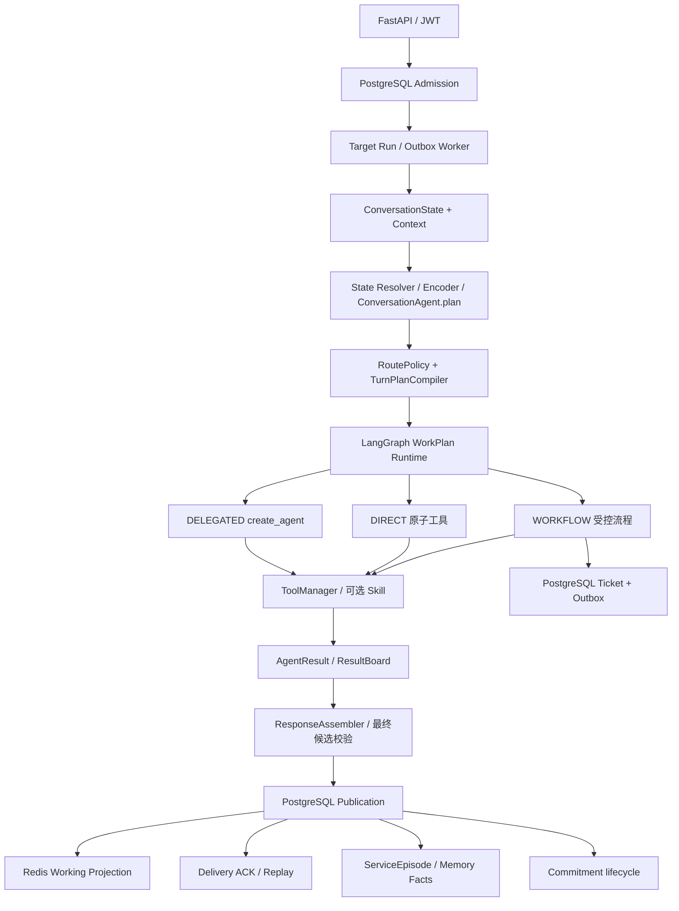
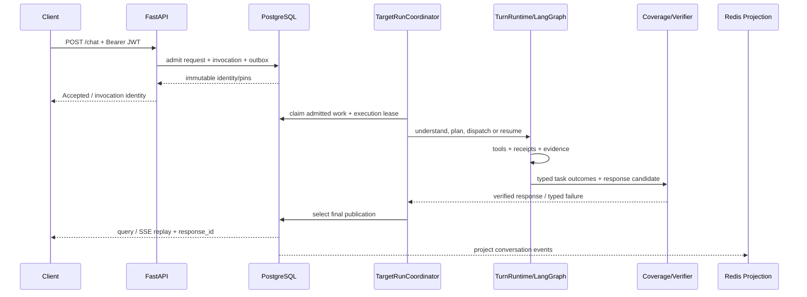

# DialogPilot 架构边界

> 本文按 2026-09-05 的 Target 装配更新（`ed6b7a5`）。当前执行以 `infrastructure/target_runtime_composition.py` 为准；旧[目标架构]({{ '/customer-service-agent-target-architecture.html' | relative_url }})和[实施计划]({{ '/customer-service-agent-implementation-plan.html' | relative_url }})保留设计演进记录，不是所有能力均已验收的声明。

## 设计原则

DialogPilot 用“唯一事实 Owner + 可重建投影”组织客服 Agent：

- PostgreSQL 拥有请求、Invocation、Conversation、回答发布、Knowledge、ServiceEpisode 和用户事实。
- Redis 只拥有当前会话的快速投影与短期任务队列，不是第二事实库。
- Agent 负责识别需求、形成任务和执行；不能直接授予工具权限或决定副作用已成功。
- ToolManager 校验执行权限并适配工具凭证；业务系统产生提交事实，OperationLedger 记录执行与对账状态；结果和候选校验决定发布资格。
- HTTP 层只做身份、输入输出合同与 outcome 映射。

## 总体结构



## 权威边界

| 关注点 | Owner | 正向合同 |
|---|---|---|
| HTTP 身份 | `core/auth.py` | 签名 JWT 产生 Principal；请求体不能改写 subject |
| 请求准入 | `infrastructure/postgres_admission.py` | 先持久化请求、Invocation 与 start outbox，再执行 Agent |
| 应用主链 | `application/target_chat_application.py` | 从固定 identity 到唯一 ChatOutcome |
| 全局理解 | `application/conversation_agent.py` | plan 吸收上下文、指代、多目标与澄清；确定性续接及 Encoder 快速路径可绕过模型 |
| 计划合法性 | `application/turn_planning.py` | Registry 约束候选命令，编译 WorkPlan，不靠意图标签授权 |
| 调度与恢复 | `application/orchestration_runtime.py` | LangGraph 派发依赖就绪任务，合并结果，interrupt/resume |
| 开放式领域循环 | `infrastructure/target_framework_agent.py` | 六个领域共用 create_agent，领域配置决定 Prompt 和能力范围 |
| 工具授权 | `mcp/tool_manager.py` | 白名单、风险、审批、typed result 与脱敏审计 |
| Knowledge | PostgreSQL retrieval modules | 唯一 active generation，source revision 可追溯 |
| 证据覆盖 | ResultBoard / authority modules | 记录 requirement 已满足、缺证据或受阻；等待输入不是业务失败，也不是成功覆盖 |
| 结果与表达 | `application/result_board.py`、`application/response_assembly.py` | 归并事实与缺失项；简单结果直接组织，复杂结果按需 compose，再校验最终候选 |
| 回答与送达 | PostgreSQL publication/delivery | 正式回答交付前提交 publication；准入 Accepted 可先返回，ACK 单调且可重放 |
| 会话控制状态 | `infrastructure/postgres_target_runtime.py` | ConversationState 事件、Workstream、审批与目标版本由 CAS 约束；Redis 只是投影 |
| 跨会话记忆 | ServiceEpisode / MemoryFact | PostgreSQL 记录来源、revision、有效状态 |
| 人工升级 | `infrastructure/postgres_ticket_service.py` | PostgreSQL 事务内的幂等 ticket、合法状态迁移、event 与 outbox |
| 服务承诺 | `infrastructure/postgres_commitment_service.py` | 显式来源、版本 CAS、自动违约、receipt 履约与 Handoff 风险引用 |

## `/chat` 时序



关键不变量：

1. 不存在“先执行 LLM、后补 Invocation”的请求。
2. 相同请求身份只能得到同一 publication，重试不能生成第二份业务事实。
3. Run、连接和业务流程是不同生命周期；SSE 断开不等于取消目标。新消息经目标级 `control_id + revision` 控制受影响工作。
4. 投影异步应用在 Redis 客户端所属事件循环，不能跨 loop 共享连接。
5. 最终回答持久化失败时返回 typed failure，不伪装成功。

## Knowledge 数据流

```text
SourceRevision
  → structure-aware chunks
  → pgvector + PostgreSQL FTS
  → Raw / Standalone query variants
  → weighted RRF
  → optional rerank
  → ContextPacker
  → EvidencePack(source revision/checksum/span/ranks/manifest)
  → GroundedAnswer
  → Coverage + Verifier
```

Knowledge 的物理身份由 `storage_backend` 暴露，当前 engine 为 `postgresql+pgvector+pg_fts`。本地 embedding 是确定性的 384 维 feature hashing，避免下载大型模型；它是可复现本地基线，不宣称语义模型效果。

公共知识只回答政策与说明。订单状态、退款办理结果、账户安全事件等私有事实必须由业务工具返回 receipt，Knowledge Evidence 不能替代。

## Context 与记忆

模型上下文由 ContextPolicy 组装，而不是把数据库内容直接拼进 Prompt：

- Redis working window：最近会话消息的快速投影。
- PostgreSQL Conversation：事件与 turn 的权威来源。
- ServiceEpisode：经验证的跨会话服务经历。
- MemoryFact/Profile：带来源的用户事实。
- ActiveCase/Ticket：未完成事项，高于普通历史相似性。

Redis 投影失败不会改写 PostgreSQL 事实；后台 outbox 会重试。删除与重建也围绕权威事件执行。

## 工具、副作用与恢复

模型可以直接选择允许的原子工具，也可以调用复合 Skill；不是每个工具都需要包装成 Skill，也不是每个请求都派发多个 Agent。当前支持的业务写操作进入 Registry 定义的流程，审批条件由 Action 决定，不要求每次写入都追加一次确认。

ToolManager 统一校验能力范围、参数和身份。业务写入以 `operation_key`、OperationLedger 和 Receipt 记录提交结果；结果未知时对账，不能把本地取消当成远端撤销。模型前后、工具边界检查目标版本；Publication 事务内拒绝过时回复。无关并行目标不因其他任务被修正而取消。

LangGraph PostgreSQL checkpoint 保存执行状态及 Agent 工作消息；ConversationState、业务数据库和 Receipt 保存权威业务状态。没有自写 ReAct/SQLite checkpoint fallback。摘要和局部压缩不覆盖公开 Transcript 或原始凭证。

运行结果区分成功、部分结果、失败、依赖阻塞、等待输入／审批及取消。用户通过新消息提出修正或取消，由理解与策略层绑定目标；过时执行停止新增动作。Coverage 不把部分返回冒充完整任务完成。

## 本地可观测性与评测

- HTTP 与内部边界传播 TraceId。
- Prometheus 暴露 Agent、Tool 和健康指标。
- TraceRecorder 保留进程内快速投影，同时把脱敏 span 写入 PostgreSQL；配置凭据后通过 OTel-native Langfuse v4 SDK 导出 Agent/Generation/Tool/Guardrail。
- `/eval/run` 和离线脚本生成确定性报告；provisional 数据不包装为 Gold。
- `scripts/run_local_e2e.py` 验证健康、Knowledge 后端和真实鉴权对话。
- `scripts/run_local_vlm_e2e.py` 验证真实 DeepSeek Vision L2 与回答消费。
- `scripts/run_local_trace_e2e.py` 验证 HTTP span 跨进程内存后仍可从 PostgreSQL 查询。
- `scripts/rehearse_x_t01_restore.py` 验证空库 schema 的本地 dump/restore。

## 已删除的旧路径

- Chroma Knowledge、raw episodic writer/reader 和用户事实存储。
- SQLite 持久化实现、自写 ReAct 引擎、旧 Orchestrator/Command/Flow 状态链及其 fallback。
- Knowledge/Route/Agent shadow 双算。
- Canary、promotion、rollback pointer 与 `/evolution/rollouts/*`。
- 生产签署、双盲仲裁、非劣门禁和空 corpus backfill。

## 多模态单路径

- `/assets/upload` 将图片/PDF 与认证用户、本轮 turn 绑定，安全扫描本身不调用模型。
- Agent 是唯一 MediaRequirementDecision producer；无关附件停在 L0，字符读取进入 Tesseract L1，外观/位置/关系进入 DeepSeek Vision L2。
- ParseResult 与 EvidenceNode 保存 asset checksum、page/bbox、producer/model/version；WorkItem 上下文只传递相关证据。DIRECT 与框架 Agent 使用同一 Fact 转换，媒体结果保持 `MEDIA_OBSERVED`。
- 媒体文字和视觉观察始终标为不可信派生数据，不能冒充订单、资格、根因或指令。

## 验证边界与部署注意

- 不在本次实现范围：生产级 OpenTelemetry Collector、Tempo/Jaeger fan-out 与 tail sampling；本地 PostgreSQL Trace 和可选 Langfuse 已实现。
- BadCase、Bundle 与业务状态已使用 PostgreSQL；当前 schema head 为 `20260905_0035`，data-location Registry 为 `v8`。`0035` 会删除旧 `conversation_flow_state` 表；非测试环境执行前先备份旧表，不自动迁入 Target 状态。
- 待独立验收：冻结公开 test 和 80 条合成合同真实 E2E；不能由运行时迁移测试推导其质量结论。
- LangGraph/create_agent 主链已实现；复杂文档摄取和生产级容量治理不能由这一事实推导为完成。

实现、集成测试、模型质量和生产容量是不同证据层次。运行时统一与旧链退役已在干净代码提交 `25000c8` 上通过 PostgreSQL 全量回归：1164 通过、1 个不适用的内存变体跳过。真实模型质量仍需单独验收；历史 SGD、旧 Command Gold 与合成评分不直接证明当前 Agent 的业务完成率。详细适用范围见仓库 `plans/framework-agent-unification-2026-09-05.md`。

---

## 代码与行为检查入口

- 装配：`infrastructure/target_runtime_composition.py`。
- 会话理解与恢复：`tests/test_conversation_agent.py`、`tests/test_target_persistence_and_manager.py`。
- 框架循环与进程重启：`tests/test_target_framework_agent.py` 及 PostgreSQL checkpoint 测试。
- 原子工具／框架事实一致性：`tests/test_target_result_conversion.py`。
- HTTP、业务写入与发布：`tests/test_target_http_postgres_e2e.py`。
- schema 退役、CAS 与删除边界：`tests/test_target_state_retirement.py`。

旧 `current-runtime-deep-dive.md` 是重构前材料，不再嵌入当前架构页；其中旧 Owner、路径和数值不应作为现行合同引用。
