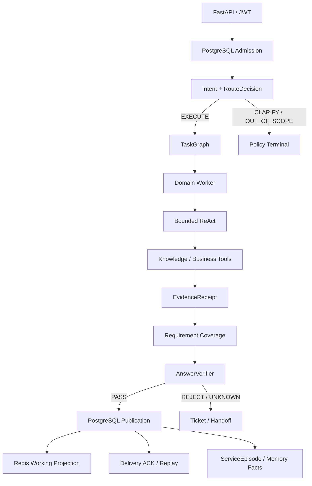
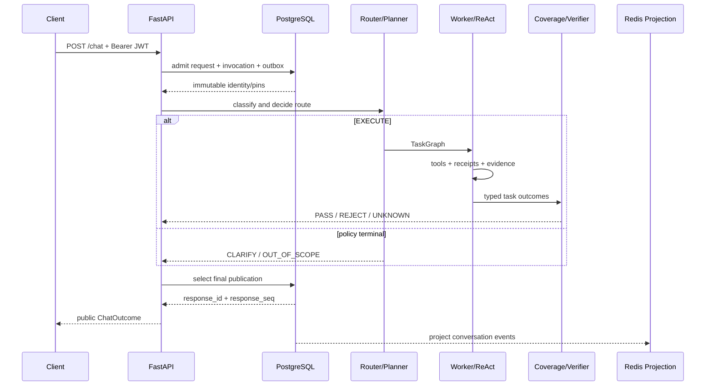

# DialogPilot 架构边界

本文描述当前代码，而不是未来路线图。完整目标与分阶段任务分别见[目标架构](customer-service-agent-target-architecture.zh-CN.md)和[实施计划](customer-service-agent-implementation-plan.zh-CN.md)。

## 设计原则

DialogPilot 用“唯一事实 Owner + 可重建投影”组织客服 Agent：

- PostgreSQL 拥有请求、Invocation、Conversation、回答发布、Knowledge、ServiceEpisode 和用户事实。
- Redis 只拥有当前会话的快速投影与短期任务队列，不是第二事实库。
- Agent 负责识别需求、形成任务和执行；不能直接授予工具权限或决定副作用已成功。
- ToolManager 拥有授权与 receipt；Coverage/Verifier 拥有发布资格。
- HTTP 层只做身份、输入输出合同与 outcome 映射。

## 总体结构



## 权威边界

| 关注点 | Owner | 正向合同 |
|---|---|---|
| HTTP 身份 | `core/auth.py` | 签名 JWT 产生 Principal；请求体不能改写 subject |
| 请求准入 | `infrastructure/postgres_admission.py` | 先持久化请求、Invocation 与 start outbox，再执行 Agent |
| 应用主链 | `application/chat_application.py` | 从固定 identity 到唯一 ChatOutcome |
| 路由 | `application/route_decision.py`、Agent policy | 一个不可变 RouteDecision，未知状态类型化失败 |
| TaskGraph | `agents/orchestration_contracts.py` | 唯一 task id、无悬空依赖、无环、闭合 outcome |
| ReAct | `agents/react_engine.py` | 有界步数、checkpoint、审批恢复、同一 tool call 防重 |
| 工具授权 | `mcp/tool_manager.py` | 白名单、风险、审批、typed result 与脱敏审计 |
| Knowledge | PostgreSQL retrieval modules | 唯一 active generation，source revision 可追溯 |
| 证据覆盖 | authority/coverage modules | 每个 requirement 恰好由合法 authority 满足或明确失败 |
| 发布资格 | `services/answer_verifier.py` | `PASS / REJECT / UNKNOWN`，只有 PASS 正常发布 |
| 回答与送达 | PostgreSQL publication/delivery | publication 先于 HTTP 返回，ACK 单调且可重放 |
| 当前会话 | Redis projection | 从 PostgreSQL 事件重建，不反向成为事实 Owner |
| 跨会话记忆 | ServiceEpisode / MemoryFact | PostgreSQL 记录来源、revision、有效状态 |
| 人工升级 | `services/ticket_service.py` | 幂等 ticket、合法状态迁移、outbox |

## `/chat` 时序



关键不变量：

1. 不存在“先执行 LLM、后补 Invocation”的请求。
2. 相同请求身份只能得到同一 publication，重试不能生成第二份业务事实。
3. Route `execute` 在 publication 边界映射为 `normal`；`clarify/out_of_scope/approval` 保持显式语义。
4. 投影异步应用在 Redis 客户端所属事件循环，不能跨 loop 共享连接。
5. 最终回答持久化失败时返回 typed failure，不伪装成功。

## Knowledge 数据流

```text
SourceRevision
  → fixed-token chunks
  → pgvector + PostgreSQL FTS
  → Raw / Standalone query variants
  → weighted RRF
  → optional rerank
  → ContextPacker
  → EvidencePack(source revision/checksum/span/ranks/manifest)
  → GroundedAnswer
  → Coverage + Verifier
```

Knowledge 的物理身份由 `storage_backend` 暴露，当前 engine 为 `postgresql+pgvector+pg_fts`。本地 embedding 是确定性的 384 维 feature hashing，避免下载大型模型；它是可复现本地基线，不宣称语义模型效果。

公共知识只回答政策与说明。订单状态、退款办理结果、账户安全事件等私有事实必须由业务工具返回 receipt，Knowledge Evidence 不能替代。

## Context 与记忆

模型上下文由 ContextPolicy 组装，而不是把数据库内容直接拼进 Prompt：

- Redis working window：最近会话消息的快速投影。
- PostgreSQL Conversation：事件与 turn 的权威来源。
- ServiceEpisode：经验证的跨会话服务经历。
- MemoryFact/Profile：带来源的用户事实。
- ActiveCase/Ticket：未完成事项，高于普通历史相似性。

Redis 投影失败不会改写 PostgreSQL 事实；后台 outbox 会重试。删除与重建也围绕权威事件执行。

## 工具、副作用与恢复

模型可以请求工具，但不能授权自己。ToolManager 根据 Agent allowlist 和风险策略决定执行方式。写调用在审批前保存 checkpoint；批准时重新验证 user/task/tool/arguments 绑定。相同 tool call 复用 receipt，不重复提交副作用。

运行结果闭合为成功、超时、错误、预算耗尽、依赖阻塞或等待审批。Coverage 不把部分返回冒充完整任务完成。

## 本地可观测性与评测

- HTTP 与内部边界传播 TraceId。
- Prometheus 暴露 Agent、Tool 和健康指标。
- TraceRecorder 当前为进程内存，不是持久 OTel backend。
- `/eval/run` 和离线脚本生成确定性报告；provisional 数据不包装为 Gold。
- `scripts/run_local_e2e.py` 验证健康、Knowledge 后端和真实鉴权对话。
- `scripts/run_local_vlm_e2e.py` 验证真实 DeepSeek Vision L2 与回答消费。
- `scripts/rehearse_x_t01_restore.py` 验证空库 schema 的本地 dump/restore。

## 已删除的旧路径

- Chroma Knowledge、raw episodic writer/reader 和用户事实存储。
- SQLite ResponseDelivery 及 freeze/backfill/cutover 状态机。
- Knowledge/Route/Agent shadow 双算。
- Canary、promotion、rollback pointer 与 `/evolution/rollouts/*`。
- 生产签署、双盲仲裁、非劣门禁和空 corpus backfill。

## 多模态单路径

- `/assets/upload` 将图片/PDF 与认证用户、本轮 turn 绑定，安全扫描本身不调用模型。
- Agent 是唯一 MediaRequirementDecision producer；无关附件停在 L0，字符读取进入 Tesseract L1，外观/位置/关系进入 DeepSeek Vision L2。
- ParseResult 与 EvidenceNode 保存 asset checksum、page/bbox、producer/model/version；TaskGraph 显式声明 `media_observations` 后 Worker 才能读取。
- 媒体文字和视觉观察始终标为不可信派生数据，不能冒充订单、资格、根因或指令。

## 尚未实现

- 持久 OpenTelemetry Collector、Tempo/Jaeger 或 Langfuse。
- Ticket/BadCase/ReAct metadata 的 PostgreSQL 最终收敛。
- human-reviewed Gold 和未消费的 fresh heldout。

这些条目是后续实施节点，不属于当前能力声明。
