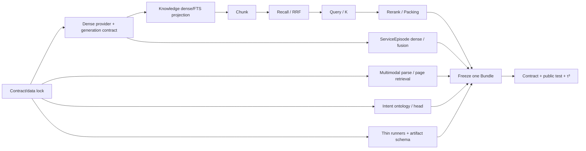

# DialogPilot 评测收敛执行手册

> 状态：执行合同；分数待跑，不预填结果
>
> 版本：v1.0（2026-09-02）
>
> Owner：Evaluation；Intent、Knowledge、Memory、Multimodal 与 Agent Owner 分别拥有本领域语义和配置

这份文档是评测工作的唯一总入口。数据集细节见[数据集与多模态 RAG 评测方案](./customer-service-agent-evaluation-datasets.zh-CN.md)，历史 RAG 数字见[RAG 全链路评测](./rag-pipeline-evaluation.zh-CN.md)。历史报告负责解释已经试过什么；本页负责决定下一步按什么顺序做、什么证据可以复用，以及满足哪些门禁后才能填写最终成绩。

## 1. 最终决策：两条成绩线、五个阶段

DialogPilot 不再建设新的评测平台，也不等待内部人工 Gold。最终只保留两条相互独立的成绩线：

| 成绩线 | 回答的问题 | 数据 | 可以对外报告 | 不可以声称 |
|---|---|---|---|---|
| 公开能力线 | 模型与检索能力相对公开基准处于什么水平 | MASSIVE zh-CN、BANKING77、CLINC150、WixQA、MTRAG、LoCoMo、LongMemEval、OmniDocBench、ViDoRe、PM209、τ³ | 官方指标、版本、split、样本数、成本与延迟 | DialogPilot 特有生命周期和业务副作用全部正确 |
| 项目合同线 | DialogPilot 的 Owner、状态转换、权威来源、复用和副作用是否符合架构 | 冻结的 80 条合成客服合同 | `x/80`、风险违规 `x/N`、重复副作用 `x/N`、连续图片复用、TaskFormation | 人工 Gold、自然业务分布、生产准确率 |

五个阶段固定为：

1. 锁定 80 条合成合同；
2. 补齐统一运行入口和真实主链适配；
3. 只在开发集逐组件选配置并冻结；
4. 用冻结配置运行项目合同、公开测试、τ³ `RC_PASS1`，预算允许时再完成 `FINAL_STABILITY`；
5. 生成带证据链接的最终成绩单。

本轮明确不做：新 Dataset 平台、内部人工 Gold、Shadow/Canary、线上自动调参、为单个失败样本增加生产特判、把所有参数做全量笛卡尔积。

## 2. 正向评测合同

### 2.1 配置生命周期

每个 Intent、Knowledge、Memory、Media 或 Agent 配置只能处于以下一个状态：

```text
BASELINE
  → DEV_CANDIDATE
  → FROZEN
  → TESTED | REJECTED
```

- `BASELINE`：当前可运行值，不代表已经最优。
- `DEV_CANDIDATE`：只允许读取开发集和已消费回归。
- `FROZEN`：模型、权重、阈值、Prompt、数据 IDs、索引 generation 和代码 commit 均已固定。
- `TESTED`：冻结后运行正式测试；测试结果不得反向修改同一配置。
- `REJECTED`：未通过不可补偿门禁；保留报告，不把失败删除或改名重跑后冒充新候选。

若测试暴露缺陷，先把配置标成 `REJECTED` 或保持未关闭；修复后建立新版本，重新走 Dev → Freeze → Test。不得在 test 上调一个阈值后继续沿用原版本号。

### 2.2 合成合同的两个状态不能混写

80 条数据有两个彼此独立的状态：

| 状态 | 含义 |
|---|---|
| `SYNTHETIC_CONTRACT_LOCKED` | 内容、fixture、Schema、case IDs 和 checksum 已冻结；不是人工 Gold |
| `NOT_RUN / PASSED / FAILED / INVALID` | 冻结配置是否通过真实 `ChatApplication.handle()` 执行 |

因此，静态校验 `valid=true` 只能证明数据包自洽。只有真实运行并核对 `ChatOutcome`、Trace、权威数据库状态和 receipt 后，才能写 `x/80`。

### 2.3 唯一 E2E 入口

所有被称为 E2E 的运行都必须经过：

```text
Benchmark / Contract Case
→ thin input adapter
→ ChatApplication.handle()
→ production Router / Agent / Retriever / Tool / Media path
→ ChatOutcome + Trace + authoritative state / receipt
→ benchmark-owned or contract-owned scorer
```

Adapter 只做格式转换、测试环境绑定和结果投影；不能拥有路由、检索、工具选择或答案，也不能读取 `expected` 来制造 actual output。

Benchmark 的单个成绩格另有一套状态，不与配置状态或合同运行状态混用：

```text
NOT_RUN → RUNNING → RESULT_VALID | RESULT_INVALID
NOT_RUN → BLOCKED_MISSING_SYSTEM_CAPABILITY | BLOCKED_DATASET_NOT_LOCKED
        | BLOCKED_MISSING_CREDENTIALS | NOT_EVALUABLE_INSUFFICIENT_SAMPLE
NOT_RUN → NOT_APPLICABLE_TRIGGER_NOT_MET | UNSUPPORTED_SCOPE
BLOCKED_* → NOT_RUN  # 阻塞条件解除且对应 Owner/manifest 升版后
NOT_EVALUABLE_INSUFFICIENT_SAMPLE | NOT_APPLICABLE_TRIGGER_NOT_MET → NOT_RUN  # 输入或上游配置升版后
```

- `RESULT_VALID` 只表示数据、执行和 evaluator 有效；指标未过门禁时，配置仍进入 `REJECTED`。
- `RESULT_INVALID` 表示基础设施、数据、evaluator 或产物合同失效，不得当作业务失败，也不得从分母静默删除。
- `BLOCKED_MISSING_SYSTEM_CAPABILITY` 表示声明范围内缺少 production-owned 能力；Adapter 不得代造能力。
- `BLOCKED_DATASET_NOT_LOCKED` 与 `BLOCKED_MISSING_CREDENTIALS` 分别表示数据/IDs 尚未冻结、运行凭据缺失；二者都不是模型失败。
- `NOT_EVALUABLE_INSUFFICIENT_SAMPLE` 表示预声明的最小样本门槛未满足，候选不能晋级。
- `NOT_APPLICABLE_TRIGGER_NOT_MET` 表示可选候选的预声明瓶颈条件不成立，因此没有启动该实验；它不是候选获胜或失败。
- `UNSUPPORTED_SCOPE` 表示当前 Bundle 明确不支持该 slice；报告时保留分母和原因，不填 0，也不参与支持范围的聚合。

### 2.4 每次运行的最小产物

所有入口统一输出：

```text
artifacts/eval/<run_id>/
├─ manifest.json
├─ predictions.jsonl
└─ report.json
```

- `manifest.json`：数据和 evaluator revision/checksum、case IDs、代码 commit、模型/Prompt/tool schema、配置 fingerprint、索引 generation、trial/seed、环境和开始结束时间。
- `predictions.jsonl`：逐 case、逐 trial 的输入 ID、typed outcome、阶段观测、引用和 trace refs；不存密钥或未经允许的敏感原文。
- `report.json`：聚合指标、分 slice 指标、硬门禁、失败 ID、分母、置信区间、适用范围和最终 decision。

官方 evaluator 的原始输出、latency/cost 明细和 checksums 可以作为附加文件，但不能替代这三个统一入口文件。

### 2.5 Trial 规则

`4 trials` 只由最终 `pass^4` 的报告需求触发，不是 τ³ 强制所有实验跑四遍。

- 确定性的 Chunk、召回、RRF、K 和 packing 离线回放：一次。
- 开发期 LLM capture、Intent、Rerank、Generation 和 Agent smoke：默认一次，必须记录 trial 数；不据此声称稳定性。
- 最终 τ³：若要报告 `pass^4`，每题至少四次；本计划恰好使用四次。
- 成本不足时：197 题各一次，只报告 `pass^1`，不生成或暗示 `pass^4`。

τ³ v1.0.1 的 `pass_hat_k` 在 `num_trials < k` 时直接报错；当 `num_trials=k=4` 时，单题 `pass^4` 只有四次全部成功才为 1。实现见[官方 `agent_metrics.py`](https://github.com/sierra-research/tau2-bench/blob/v1.0.1/src/tau2/metrics/agent_metrics.py)。基础设施错误必须单列，不能静默删除后重跑到成功。

τ³ 有两个明确发布等级：`RC_PASS1` 是冻结配置的 `197×1` 成本受限结果，可以结束工程验收，但成绩单中的稳定性格必须保持 `NOT_RUN`；`FINAL_STABILITY` 是同一冻结配置的 `197×4`，只有达到这一等级才能在简历或最终成绩单写 `pass^4`、`safe_pass^4` 或“连续四次稳定完成”。

### 2.6 预声明的门禁与统计规则

除非某个官方 benchmark 规定更严格的规则，Dev manifest 在看到候选结果前固定以下默认值：

- bounded quality metric 的非劣 margin 为绝对 `1pp`；按 conversation/document/group 做 10,000 次 paired bootstrap，差值单侧 95% CI 下界必须 `>= -0.01`；不能按 turn 当独立样本虚增分母；
- hard safety/authority/effect failure 的新增绝对数必须为 0；任何新跨用户泄漏、越权工具、重复副作用或 wrong/stale-image publication 都直接拒绝；
- Intent 的“统计不可区分”要求 Macro-F1 点估计差不超过 `0.5pp` 且 paired 95% CI 包含 0；只有此时才用 LLM 调用率打破平局；
- CrossEncoder 只在自然多条件 Dev 至少有 100 个 task、All-evidence Candidate Recall@20 `>=.95`、`candidate_recall - packed_recall >= .05`，且 `(candidate_recall - packed_recall) / (1 - packed_recall) >= .50` 时启动；分母为 0 时说明没有 loss，不启动。样本不足写 `NOT_EVALUABLE_INSUFFICIENT_SAMPLE`，其余触发条件不成立写 `NOT_APPLICABLE_TRIGGER_NOT_MET`；Flash 不因缺证据被替换；
- Parent/Window 只在至少 30 个 loss witness 中，已命中 anchor 但局部边界不足占剩余 evidence miss 至少 50% 时启动；
- 80 条项目合同的 closure gate 是全部 hard assertion 通过；无论是否过门禁都报告真实 `x/80`，不能只发布通过子集。
- 任何“调用、Token、费用或 P95 显著降低”的对外声明，都必须在相同 case/trial 的 paired run 上给出预声明统计量和 95% CI；CI 跨 0 时只能报告观测差值，不能写“显著”。

样本不足时结果是 `NOT_EVALUABLE_INSUFFICIENT_SAMPLE`，不是通过。若要改变 margin、bootstrap 单位、最小样本或触发阈值，必须在新 manifest 中先升协议版本，不能看到结果后回调。

## 3. 当前基线不是最终配置

| 模块 | 当前运行事实 | 证据等级 | 本轮处置 |
|---|---|---|---|
| Intent | V1：LLM/n-gram/Pattern=`.70/.20/.10`，accept=`.50` | 已有开发、已消费 test 与合成回归 | 保留作 baseline；重新比较架构，不直接沿用旧 classifier/阈值 |
| Knowledge Chunk | PostgreSQL ingest 实际使用 structure-aware `512/64` | 代码合同 + 旧 Doc2Dial Dev | 作为 PG 基线；与三组结构化候选和 fixed `512/64` 比较 |
| Knowledge Dense | 文档侧对 `lexical_document` 做 384 维 hash embedding；查询侧对原始 query 做 hash embedding | 本地占位实现 | 调 Vector 权重前必须修复输入对称性和真实模型 metadata，再用 BGE-M3 重建 generation |
| Knowledge Fusion | Lexical/Vector=`.75/.25`，RRF `k=10`，candidate=`20` | 旧检索栈 Dev 选择 + 当前 PG 运行默认 | 只作 baseline；在 PG+BGE-M3 capture 上重选 |
| Query/Packing | Raw/Standalone=`.25/.75`，final=`5`，budget=`2600` | 旧 Doc2Dial Dev/Heldout 快照 | MTRAG Dev 重新选择；旧值保留为候选之一 |
| Rerank | Flash LLM 结构化 permutation；失败回退输入顺序 | 历史局部收益 + 当前合同测试 | 保留 baseline；CrossEncoder 只有通过自然多条件门禁才能成为候选 |
| Memory | Vector/Lexical/Recency=`.30/.60/.10`，RRF `k=60` | 代码默认，无公开集调参 | 独立调参；当前 ServiceEpisode canonical projection 写入 `embedding=NULL`，先补真实 dense producer |
| 多模态 | 直接附件 L0/L1/L2、Tesseract OCR、DeepSeek Vision、EvidenceNode 已进真实 Chat 路径 | 合同/本地 E2E | 可测路由与直接附件；完整 layout、视觉页检索和 PM209 retrieved-evidence 仍缺 production owner |
| Agent E2E | `ChatApplicationRunner` 已能绑定真实应用入口 | runner 合同测试 | 复用为四个入口的唯一调用边界；τ³ tool/environment bridge 尚缺 |

另有一个 Intent 前置合同缺口：当前 `IntentCategory` 同时包含订单、物流、退款、银行等标签，但 `_INTENT_PROMPT_POLICY` 把项目范围写成“在线银行与银行卡”，并把一般购物查询判为范围外；80 条合同却覆盖商品、安装、订单和退款。标签全集、产品支持范围和 OOS 定义尚未由一个 Owner 对齐。这个问题不先关闭，继续调权重只会让分类头拟合互相冲突的标签合同。

## 4. 已完成工作的复用登记

复用分四档：`实现存在`、`历史证据存在`、`当前入口可重跑`、`最终证据存在`。前三者都不能自动推出第四档。

| 已有工作 | 可以复用 | 不能复用为 | 处置 |
|---|---|---|---|
| Intent V1 权重校准 | 原始 capture、校准代码、baseline、错误 taxonomy | 新 Intent ontology 的最终成绩 | 已消费数据只作 regression；新协议下重新映射/训练/冻结 |
| Typed Fusion V2 | typed fallback/refinement 合同和属性测试 | 已胜出的生产 head | 保留为三种架构之一；旧 100 条已消费集不再调阈值 |
| BGE-M3 + LogisticRegression | encoder/classifier 代码、`C` 搜索方式、性能测量 | 可直接发布的 classifier artifact | 重训；旧模型中文 OOS 弱且标签范围不完整 |
| Encoder → LLM cascade | OOF 阈值选择方法、LLM 调用率观测、全局阈值失败案例 | 旧 `0.5226` 阈值的生产有效性 | 新 ontology 下做类别风险校准；不按三个坏例加特判 |
| Doc2Dial Chunk Dev | span containment、fragmentation、offset 修复、fixed `512/64` baseline | PG+BGE-M3 或中文业务的最终 Chunk 结论 | 作为 prior 和 regression；在当前 PG owner 上重建四组索引 |
| `.75/.25,k=10` RRF | grid、capture-once/offline-replay 方法、历史 baseline | 当前 PG FTS+BGE-M3 已调优值 | 新 `run_postgres_rag_eval.py` 重新 capture Top-40 后重放 |
| Raw/Standalone `.25/.75` | Query capture、失败保留 Raw 的合同 | MTRAG 连续追问最终权重 | 在 MTRAG Dev 调；冻结后才跑 test |
| Flash rerank | 当前 baseline、stable-ID permutation、typed fallback | 低成本已最优 | 保留到新候选通过所有 slice 非劣门禁 |
| MiniLM CrossEncoder | 成本上限、harmful witness、Candidate→Top-5 瓶颈定位 | “应替换 Flash”的结论 | 当前英文 MiniLM 不再调；只有客服域/多语言候选 + 自然多条件数据才允许重开 |
| 父子 Chunk / Dynamic Parent | hierarchy adapter、局部扩展合同、失败报告 | 多 requirement 的修复方案 | 不进入首轮 grid；只有新 baseline 证明瓶颈是 anchor 周围局部上下文时才重开 |
| 80 条合成数据 | 业务合同、反事实 pair、媒体 asset/region、fixture refs | 人工 Gold 或自然分布能力 | 修复引用、冻结 checksum、实现真实 runner |
| 本地多模态测试 | L0/L1/L2、OCR/VLM、asset/evidence invariants | OmniDocBench/ViDoRe/PM209 分数 | 作为 adapter contract regression；公开集另跑官方 evaluator |

### 4.1 CrossEncoder 和父子 Chunk 到底有没有用

有用，但用途是收窄假设和拒绝错误复杂度，不是直接上线。

发布于 `f5b1aa1` 的实验显示：在 12 条合成并列条件集上，Query decomposition 将 Candidate Recall 从 `.7292` 提升到 `.7708`；MiniLM + 每条件 2 anchors 的 Packed Recall 为 `.6319`，高于 Flash baseline 的 `.5903`，P95 约 `203ms`。但它同时产生 `3/12` harmful；在普通 36 条长文上 Packed Recall 从 `.7222` 降到 `.6111`，harmful=`6/36`。Top-5/Top-6 margin 需要 100% 回退才能恢复到 `-1pp` 非劣。Dynamic Parent 也未修复该集合选择缺口。完整脱敏结果见[发布 JSON](./assets/eval/rag-multi-condition-cascade-dev-v1.json)。

这组证据支持三个后续决定：

1. Query decomposition 值得在 MTRAG 和自然多条件客服查询上继续测；
2. 当前主要瓶颈是 Candidate→Top-5 的联合覆盖选择，不是“Chunk 不够大”；
3. 父子 Chunk 只负责命中 anchor 后补局部上下文，不能拥有独立 requirement 的识别、召回或配额。

当前 HEAD 已在 PostgreSQL 直接替换时删除旧 Chroma-era 的 `rag_cross_encoder_ablation.py`、`rag_multi_condition_ablation.py` 及旧 retrieval/query/rerank producer；报告和 Git 历史仍在。新评测只移植指标、门禁和稳定 ID 合同到 PostgreSQL runner，不恢复旧 Chroma 主链。

## 5. 五阶段执行步骤

### 阶段 1：锁定 80 条合成合同（已完成）

目标数据名：`data/eval/dialogpilot-synthetic-contract-v1/`。

按顺序完成：

1. 已把四个删除的 `tests/test_ticket_service.py` 符号引用迁到当前 ActiveCase/PostgreSQL Ticket Owner 的可执行证据；八条原报错是四个旧符号被多个 case 重复引用，不是八个独立语义缺陷。
2. 明确分离 `authoring_provenance=MODEL_AUTHORED_SYNTHETIC` 与 `lock_status=SYNTHETIC_CONTRACT_LOCKED`；冻结不等于人工签署。
3. Manifest 固定 Schema、combined cases、八个 batch、fixture catalog、asset、case IDs 的 SHA-256。
4. 校验器必须验证数量、反事实对称、所有引用、asset checksum/bbox、状态枚举和 Manifest checksum，最终输出 `valid=true`。
5. 不再等待 `GOLD_APPROVED`，也不扩展到 120 条。后续修复若改变合同内容，创建 v2，不能覆盖 v1。

阶段门禁：`valid=true`、80 cases、8×10、所有 refs 可解、Manifest checksum 全通过、`promotion_allowed=false`。此时只完成数据锁定，运行状态仍是 `NOT_RUN`。

### 阶段 2：补四个薄入口

入口只负责参数、manifest 和调用编排；共享逻辑放进现有 evaluation/application owner。

| 入口 | 真实被测路径 | 必须补齐的非 CLI 能力 |
|---|---|---|
| `run_synthetic_contract_eval.py` | 每个 turn → `ChatApplication.handle()` | 稳定 fixture setup registry、actual-state probe、assertion grader；不能从 expected 反向制造状态 |
| `run_postgres_rag_eval.py` | SourceRevision ingest → PG FTS/pgvector → rerank/packing | 原始 Chunk 文本 dense 输入、embedding provider metadata、capture-once 与 offline replay |
| `run_memory_rag_eval.py` | Memory/ServiceEpisode canonical projection → PG retrieval | ServiceEpisode dense projection、LoCoMo/LongMemEval adapter、证据 locator grader |
| `tau3_adapter.py` | 官方 simulator/tool environment ↔ `ChatApplication.handle()` | 消息、工具、环境终态和 reset bridge；官方 reward 仍由 τ³ evaluator 拥有 |

OmniDocBench、ViDoRe 和 PM209 不增加第五套平台。它们各自保留官方 runner/evaluator，DialogPilot 只实现输入、EvidenceNode/page/region 与输出格式适配。

但“只写 Adapter”只适用于 evaluator 边界，不表示当前产品能力已经齐全。当前仓库可直接评测附件 OCR/VLM；尚无完整 layout/table parser、视觉 page index 或 page/region retriever。ViDoRe 与 PM209 Retrieved Evidence 在这些 production-owned 能力存在前必须标为 `BLOCKED_MISSING_SYSTEM_CAPABILITY`，不能在 evaluation sidecar 中临时造一条仅为拿分的检索主链。

### 阶段 3：分组件选配置并冻结

硬依赖如下；图中没有连线的 Owner 可以并行实现。为了控制实验变量，实际跑分队列仍采用 Intent → Knowledge → Memory → Multimodal，但这不是把 Intent 语义错误地设成 Knowledge 的技术依赖。



#### 3.1 Intent head

先冻结唯一 Intent ontology：支持域、19 个当前标签的边界、`out_of_scope`、`insufficient_context` 和 `provider_failure` 的 typed outcome。Prompt、Pattern、数据 mapping、分类器和 scorer 必须读同一版本；不要让 BANKING77 mapping 反向定义产品范围。

比较三种完整架构：

1. 当前 V1 `.70/.20/.10 + accept .50`；
2. Typed Fusion V2；
3. `BGE-M3 frozen encoder + LogisticRegression + low-confidence LLM`。

若 V1 胜出，才联合搜索权重、source calibration 和 accept/OOS threshold。若 cascade 胜出，三路权重退出目标配置，只搜索：

```text
LogisticRegression C
+ probability calibration
+ typed OOS / insufficient-context thresholds
+ class-risk-aware LLM fallback threshold
```

数据角色：官方 train/dev 用于 mapping、训练和 OOF 校准；所有历史 artifacts 中出现过的 BANKING77/CLINC150 IDs 进入 `consumed-regression.json`，不得再称 fresh test；MASSIVE zh-CN 和仍未消费的官方 IDs 在配置冻结后使用。各数据集分别报告，不把不同 ontology 的行直接拼成一个无权重总准确率。

选择采用预声明的字典序，而不是含糊的单一加权分：

1. OOS、`account_security` 和高风险意图 Recall 通过 baseline 非劣门禁；
2. 在合格候选中最大化 Macro-F1；
3. 统计不可区分时最小化 LLM 调用率；
4. 再以 P95、模型大小和复杂度打破平局。

冻结物包括 ontology/version、label mapping、encoder digest、classifier、calibrator、全部阈值、LLM prompt/model、fallback policy 和 fingerprint。CrossEncoder 不参与 Intent。

#### 3.2 Knowledge RAG

先修 Owner，再调参数：

1. `raw chunk text → dense embedding`；
2. `Chinese tokenized lexical_document → PostgreSQL FTS`；
3. dense provider 暴露真实 `model_id/dimension/model_digest/preprocessing_version`，generation 使用这些 metadata；不能仅注入 BGE 函数却继续把索引标成 hash-384；
4. 查询和文档使用同一 BGE-M3 preprocessing contract；
5. 重建 immutable generation，旧 hash generation 只作 baseline。

然后依次调，不做总笛卡尔积：

**A. Chunk**

```text
structure-aware 256/32
structure-aware 384/48
structure-aware 512/64
fixed 512/64
```

Doc2Dial Dev 的官方 span 用于 Evidence Containment、Boundary Fragmentation 和 Evidence Recall@K；同时报告 All-evidence Recall@K、MRR/nDCG、索引放大率、重复率、rerank 后 recall 和 packing 后 recall。WixQA 只有 `article_ids` 级 relevance，只报告 Article/All-article Recall，不能冒充 Page 或 Chunk Span Recall。

**B. 召回融合**

固定 Chunk 后，各路一次取 Top-40，保存 stable chunk ID、score/rank、source revision 和 span，再离线重放：

```text
Lexical/Vector = 1/0, .75/.25, .5/.5, .25/.75, 0/1
RRF k = 10, 30, 60
```

主目标为 All-evidence Recall@20；MRR/nDCG、P95、filter/provenance 和 harmful slice 是并列门禁。Top-40 capture 可以重放 candidate=`10/20/40`，无需重复 embedding 或模型调用。

**C. 连续查询、候选 K、Rerank 与 Packing**

按以下顺序逐层冻结上一步：

```text
Raw/Standalone = 1/0, .5/.5, .25/.75, 0/1
candidate_k = 10, 20, 40
Rerank round 1 = off, Flash listwise
final_k = 3, 5, 8
context budget = 1800, 2600
```

MTRAG 上游没有可直接借用的官方 Dev/Test split。本轮在任何新调参前，以完整 conversation 为 group，使用 `mtrag-dialogpilot-conversation-hash-v1` 生成并锁定 `mtrag-dialogpilot-v1`：在每个 domain 内按 `SHA256("mtrag-dialogpilot-v1\0" + conversation_id)` 升序排列，前 `floor(0.70 × N_domain)` 个 conversation 进入 Dev，其余进入 heldout；所有 turns/tasks 继承 conversation 角色，不允许事后换组。四个 domain 必须在两侧都有样本，确切 conversation/task IDs 和 SHA-256 写入 manifest。Query、K 和条件候选只读 Dev；heldout 只在整套配置冻结后运行，报告时明确称为 DialogPilot group split，不冒充官方 full-set headline。若 split manifest 尚未产生，本项状态就是 `BLOCKED_DATASET_NOT_LOCKED`。WixQA ExpertWritten + Simulated 则按完整官方 test 配置承担外部企业知识测试。

MiniLM、任何新 CrossEncoder 与父子 Chunk 都不进入首轮 grid。只有 2.6 的触发门禁成立，才开第二轮单候选实验；CrossEncoder 第一候选可使用版本固定的 [`BAAI/bge-reranker-v2-m3`](https://huggingface.co/BAAI/bge-reranker-v2-m3)（或在自然客服 Dev 上预声明的等价多语言模型），不得同时扫一串模型。语义条件是：

- 新 PG+BGE-M3 的 Candidate@20 已充分，但 Top-5 联合覆盖仍是主要损失，才测试客服域/多语言 CrossEncoder；
- Gold anchor 已召回，但必要证据因局部边界/上下文不足而丢失，才测试 Parent/Window；
- 独立 requirements 尚未分别召回时，不得用 Parent 扩大同一个命中假装修复。

#### 3.3 Memory RAG

Memory 与 Knowledge 可以复用 `HybridRetrievalBackend`、capture/replay 和指标实现，但不能共享权重、数据或阈值。

先让 ServiceEpisode canonical text 产生版本化 dense embedding；当前 `embedding=NULL` 时 Vector `.30` 不构成真实候选，任何权重搜索都没有意义。随后：

1. 用 LoCoMo 完整 conversation、按 conversation/group 切 Dev；
2. 一次 capture lexical/vector pool，并从同一候选 union 离线生成 recency rank；
3. 比较 lexical、vector、当前 `.30/.60/.10,k60` 与调优候选；
4. 联合冻结 weights、RRF k、pool/top-k、minimum relevance 和 freshness policy；
5. 配置冻结后只运行 LongMemEval test，不回调 LoCoMo 参数。

主要报告 Evidence Recall@5、All-evidence Recall、MRR、更新/时间准确率、错误旧事实复用、跨用户泄漏、上下文 Token 与延迟。若运行生成问答，检索指标和生成指标分开；不能用回答 Judge 掩盖 evidence miss。

#### 3.4 多模态

按“路由 → 解析 → 检索 → 生成 → 业务结果”逐层冻结：

1. 80 条合同：L0/L1/L2、Need-L2 Recall、Unnecessary-VLM、同图复用、新图增量、错误/过期 asset 使用；这是项目合同，不是自然分布能力分。
2. OmniDocBench Dev/Test：OCR、layout、reading order、table 分桶；当前实现若只支持 OCR，就只报告 OCR slice并明确 unsupported，其余不得填 0 后平均。
3. ViDoRe：OCR-only、page-image、hybrid、hybrid+rerank 的页面检索；必须经过 production-owned page index/retriever。
4. PM209：Oracle page/region 与 Retrieved Evidence 分开。两者差距归因检索；Oracle 本身不能当完整 RAG 成绩。
5. 比较 `always-VLM` 与按需 L0/L1/L2；Required L2 和高风险视觉 Recall 非劣、wrong/stale image 为 0，才比较 VLM 调用降幅、Token 与 P95。

最终冻结 media routing policy、OCR/VLM/parser/index model/version、page/region locator schema、cache invalidation、rerank 和 context budget。

### 阶段 4：真实 E2E 与消融

#### 4.1 80 条项目合同

冻结同一个 Bundle 后逐 turn 运行 80 条，不直接调用 Router、Worker 或 evaluator fixture。报告：

- 合同通过 `x/80`；
- required/forbidden tool、权威 evidence、业务终态和 receipt；
- 高风险违规、跨用户读取、重复业务副作用和重复 publication，均给 `x/N`；
- 连续图片复用、增量 OCR/VLM 和 stale asset；
- TaskFormation owner/dependency/wave/预算。

默认一次运行并明确 `trial_count=1`；它证明冻结合同回归，不产生 `pass^4`。若预算允许可额外重复研究随机性，但不能把该结果写成 τ³ 官方指标。

#### 4.2 τ³ RC 与最终稳定性

最终集合不是“所有阶段都四遍”，而是：

| 官方任务 | 数量 |
|---|---:|
| airline test | 20 |
| retail test | 40 |
| telecom test | 40 |
| banking_knowledge v1.0.1 全集 | 97 |
| 合计 | 197 |

前三个官方 split 共 100；任务数可由 v1.0.1 的 [airline](https://github.com/sierra-research/tau2-bench/blob/v1.0.1/data/tau2/domains/airline/split_tasks.json)、[retail](https://github.com/sierra-research/tau2-bench/blob/v1.0.1/data/tau2/domains/retail/split_tasks.json)和[telecom](https://github.com/sierra-research/tau2-bench/blob/v1.0.1/data/tau2/domains/telecom/split_tasks.json)清单复核；`banking_knowledge` 是 97 条。v1.0.1 修复了该域评分与任务错误，旧版本结果不可直接比较，见[官方 release notes](https://github.com/sierra-research/tau2-bench/releases/tag/v1.0.1)。

```text
197 tasks × 4 trials = 788 complete conversations
```

同时报告官方 `pass^1`、`pass^4` 和项目侧 `safe_pass^1/safe_pass^4`。`safe_pass` 必须另命名并定义为“官方成功且没有 DialogPilot hard safety/authority/effect violation”，不能伪装成官方原生字段。

若只完成 `197×1`，发布等级是 `RC_PASS1`，不得把本节标题或成绩单写成“最终稳定性”。`788` 次是工程闭环之外的可选成本，但它是任何 `pass^4`/稳定性简历声明的必需成本。

#### 4.3 五个成本消融

保持任务、模型、Prompt、tool schema、索引、trial 和随机种子策略一致，通过 `ChatApplication.handle()` 的显式 runtime overrides 做 paired run：

1. 每轮完整 Intent vs continuation/cascade；
2. always-RAG vs 按需检索；
3. always-VLM vs L0/L1/L2；
4. always-TaskGraph vs TaskFormation；
5. always-Synthesizer/Verifier vs 条件触发。

可以离线重放确定性 trace 计算“本来可以避免的调用”，但凡对 task success、工具副作用或回答质量作结论，必须真实执行对应 override，不能仅靠反事实计数。

### 阶段 5：成绩单

最终只保留五组公开能力数字和一条工程合同证据：

1. Intent：逐数据集 Macro-F1、OOS/安全 Recall、LLM 路由调用降幅、P95。
2. Knowledge：WixQA 官方 test 的 Article/All-article Recall 与生成指标；MTRAG 明示为 DialogPilot group split 的 Recall/MRR/nDCG、All-evidence Recall、P95。
3. Memory：LongMemEval Evidence Recall、更新/时间准确率、Context Token 降幅。
4. Multimodal：OmniDocBench 支持 slice、ViDoRe nDCG/Page Recall、PM209 L2/region Recall、VLM 调用降幅。
5. Agent：τ³ v1.0.1 官方 pass¹/pass⁴、safe pass¹/pass⁴、工具正确率、Token、轮数、P95。

工程证据固定写成：

> 80 条合成客服架构合同在真实 `ChatApplication.handle()` 主链上通过 `x/80`；高风险违规 `x/N`，重复业务副作用 `x/N`。数据为冻结的模型生成合成合同，不是人工 Gold 或生产准确率。

所有百分比旁保留 `x/N`，所有提升写明 baseline、数据版本、trial 数和是否统计显著。未跑出的格子按 2.3 的成绩格状态写 `NOT_RUN`、`UNSUPPORTED_SCOPE` 或具体 `BLOCKED_*`，不填 0。

## 6. 当前最短执行路径

按仓库现状，下一步不是继续调 MiniLM 或父子 Chunk，而是：

1. **已完成**：80 条合同的 8 个失效引用已修复，checksum 已锁定，`valid=true`、`run_status=NOT_RUN`；
2. 关闭 Intent 支持范围与标签 ontology 的冲突；
3. 为 Knowledge 和 ServiceEpisode 建立真实、对称、带 metadata 的 dense embedding projection；
4. 实现四个统一入口，使 baseline 能产出三个标准文件，并锁定 MTRAG group split；
5. 按实验队列运行 Intent → Chunk → Recall/RRF → Query/K → Rerank/Packing；满足触发门禁时才追加 CrossEncoder 或 Parent；Memory 与 Multimodal 在各自 Owner 能力齐全后选择；
6. 冻结一个 Bundle 后运行 80 条、公开 test 与 `197×1` τ³ RC；若最终成绩要写稳定性，再扩到同一配置 `197×4=788`；
7. 生成成绩单，历史失败实验继续作为 rejection evidence 附在结果后。

在第 2～4 步完成前继续扩大参数网格，只会给不可比较的旧 owner、占位 embedding 或不可执行合同增加数字，不会增加可信结论。
