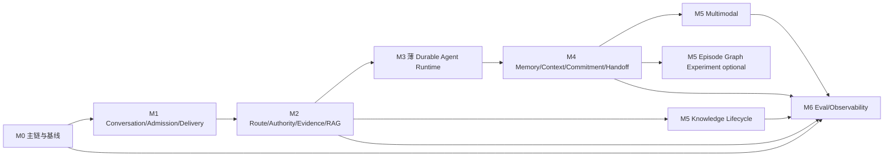

# DialogPilot 客服 Agent 颗粒度实施计划

> 状态：历史实施提案（运行时迁移步骤已替代）
>
> 运行时更新（2026-09-05）：本文的阶段状态和“保留 AgentOrchestrator/ReAct”等
> 步骤属于当时的迁移方案，不是当前待办。当前主链、职责和验证边界见
> [架构边界与职责归属]({{ '/architecture.html' | relative_url }})；当前迁移验收记录在
> 仓库 `plans/framework-agent-unification-2026-09-05.md`。开放式领域循环已统一为
> `create_agent`，持久化使用 PostgreSQL，旧执行链没有 fallback。
> 下文“当前”“现有”及状态标签均按历史提案语境阅读；冲突时以当前架构页和源码为准。
>
> 版本：v1.1
>
> 日期：2026-09-02
>
> 上游架构：[DialogPilot 客服 Agent 总体目标架构](./customer-service-agent-target-architecture.zh-CN.md)

## 1. 文档目的

本文把目标架构拆成可独立开发和验证的任务单元，解决以下问题：

- 哪些工作是阻塞全局的 P0；
- 哪些现有模块必须保留；
- 什么时候引入 LangGraph；
- Memory、RAG、Tool、Handoff、多模态如何按依赖完成并直接替换；
- 每项任务用什么性质和端到端场景验收；
- 如何避免同时存在两个状态 Owner；
- 什么时候可以在文档或简历中宣称某项能力已经完成。

本计划不假设固定团队人数或发布日期。任务规模只表示相对复杂度：

M0–M6 是**交付依赖 DAG**，不是在线请求运行时的阶段状态机。本提案当时以 Agent/TaskGraph/ReAct 为执行基线；里程碑只用于安排实现与验证，不要求恢复已删除的引擎。

| 规模 | 含义 |
|---|---|
| S | 单一 Owner、局部合同和少量消费者 |
| M | 跨 2–4 个模块，需要迁移消费者和集成测试 |
| L | 跨领域状态、持久层和异常路径，需要拆分实现与端到端验收 |
| XL | 不允许一次提交完成，必须先拆任务或做试点 |

## 2. 实施总原则

1. 先闭合完整会话和真实主链，再引入新运行时。
2. 先定义正向合同并跑通新链，再在同一交付阶段删除旧路径。
3. 一个事实只能有一个 Owner；开发过程中可以保留离线对照 fixture，但运行 composition root 不允许双写、双读或双主。
4. HTTP 服务入口与 Eval 必须调用同一个 `ChatApplication`。
5. Checkpoint 只保证可恢复，不保证业务 exactly-once。
6. 只读节点和写节点采用不同 retry 代数。
7. 任何写工具无法确认结果时进入 reconciliation，不自动重试。
8. 每个里程碑都以本地/CI contract、property、E2E、fault-injection 和适用的 heldout 结果验收。
9. 当前已验证的 ToolManager、TicketService、ResponseDelivery、Memory range summary、RAG provenance、Verifier 和 Bundle 机制优先复用。
10. 不以“新增文件”“测试全绿”或“框架接入成功”作为架构闭环证明。
11. Agent/现有 TaskGraph/ReAct 是业务编排主体；LangGraph 只做薄持久运行时，不把 route、RAG、Memory、Tool、Media、Ticket 重写成中央因果链状态机。
12. 当前项目无线上流量、无必须保留的旧运行数据：每个 Owner slice 验收后直接切换自己的唯一 binding，并在同一原子交付中删除对应旧 reader/writer/adapter/toggle/dependency；最终 Exit 只聚合这些已完成 slice，不建设旧数据迁移、流量灰度或运行时旧链回退系统。

## 3. 完成定义

完成状态分三层，避免让早期任务依赖尚未建设的 M6 设施：

### 3.1 Task `IMPLEMENTED`

单项任务只有满足以下适用项才可标记 `IMPLEMENTED`：

- 正向输入、状态、输出和 typed failure 合同已经实现；
- 所有已知 producer/consumer 已迁移；
- 正常、异常、取消、重试、并发和恢复路径按任务风险覆盖；
- 涉及持久数据时，clean schema bootstrap、fixture/source rebuild、retention、delete/restore 已定义；
- Trace/metrics 能区分成功、拒绝、降级和不可用；
- 文档与实际代码一致；
- 没有通过新增调用方特判绕过领域 Owner；
- 新行为有与风险匹配的 unit/contract/property/state-machine/integration 测试。

### 3.2 Milestone `IMPLEMENTED` 与 `VERIFIED`

里程碑的 Gate 矩阵中全部 required task 已为 Task `IMPLEMENTED`、conditional task 已完成或有经批准的 `N/A`、但尚未运行 Exit Gate 时，聚合状态可标记 Milestone `IMPLEMENTED`。

里程碑只有在以下条件满足后可进一步标记 `VERIFIED`：

- Gate 矩阵中的 required/适用 conditional 任务与 X-task prerequisite 均已 `IMPLEMENTED`；
- Exit Gate 的 E2E、故障注入、空库重建和独立复核通过；
- composition root 只解析到目标实现，且该 milestone 范围内被替代的旧 producer、consumer、fallback、toggle 与依赖已经删除；仅“列为待删除”不能通过 `VERIFIED`；
- 对应 Gate manifest 和机器可读报告已经归档。

### 3.3 当前实现状态与直接替换

当前分支已有大量能力“实现但未成为唯一 binding”。任务状态必须使用以下分类，不能把提交存在等同于
目标链已经接管：

| 状态 | 含义 |
|---|---|
| `CURRENT_ACTIVE` | 当前 composition root 正在调用 |
| `IMPLEMENTED_NOT_BOUND` | 合同、存储或 adapter 已实现且有测试，但当前入口尚未唯一绑定 |
| `PLANNED` | 尚未实现 |
| `SUPERSEDED_TO_REMOVE` | 已实现但只服务于旧数据迁移、双路径比较、流量试运行或旧链回退；不再继续建设，直接替换时删除 |

历史提案基线摘要：

- `CURRENT_ACTIVE`：`/chat` 已是调用 `ChatApplication.handle()` 的薄 HTTP adapter；其内部调用现有 AgentOrchestrator/TaskGraph/ReAct、已接入的 TaskFormation/KnowledgeRetriever 接口，以及仍由 Chroma/Redis 提供候选或记忆的兼容实现。
- `IMPLEMENTED_NOT_BOUND`：PostgreSQL/Alembic、Conversation/Admission/Publication/Delivery contracts、
  canonical Route/Authority、KnowledgeRetriever 的 PostgreSQL backend、ThreadSummary/ContextPolicy/
  ActiveCase/ServiceEpisode 目标存储与投影等当前分支实现；对应目标 binding 尚未全部激活。
- `PLANNED`：LangGraph、完整 Profile/Commitment/ServiceContinuity、完整多模态、OTel+Langfuse、最终评测闭环。
- `SUPERSEDED_TO_REMOVE`：当前已经存在的旧数据迁移、双路径比较和流量试运行辅助模块。

每个直接替换任务只走一条交付链：

```text
完成目标 Owner/Schema/Adapter
→ 从空库与 canonical source/fixture 重建
→ unit/contract/property/integration/E2E/fault/heldout 验收
→ 一次更新唯一 composition-root binding
→ 同一任务删除旧 producer/consumer/fallback/toggle/dependency
```

切换前失败则不修改 binding；切换后通过 Git revert/fix-forward 与 clean rebuild 修复，不保留第二条运行路径。

### 3.4 适用性规则

| 证据项 | 适用条件 | 合法 `N/A` 示例 |
|---|---|---|
| clean schema/rebuild | 修改 durable schema、projection 或事实 Owner | 纯接口类型别名且无持久数据 |
| state-machine/fault injection | 改变状态、恢复、副作用 | 纯文档链接修订 |
| frozen test / group-heldout | 改变模型、路由、检索、生成、视觉行为 | 确定性 DB 索引增加 |
| retention/delete | 新增或复制用户/企业数据 | 无数据写入的纯计算函数 |

`N/A` 必须记录理由和 approver，不能用来跳过本应适用的门禁。

`IMPLEMENTED` 不等于 `VERIFIED`；只有完成该任务的 direct-binding 与旧路径删除条件，目标链才可视为已替换。

## 4. 总体工作分解



该图只表示主要 build 分支；任务卡依赖与下方验证矩阵是唯一权威 DAG。M5-T08 图检索是可选实验，不阻塞主链。

任务依赖只分两种：

| 类型 | 含义 |
|---|---|
| `Build prerequisite` | 缺少它就不能正确编译或实现当前合同 |
| `Verification prerequisite` | 可以并行开发，但缺少它不能宣称 milestone verified 或执行直接 binding |

M4 的部分 projection、M5 的离线 ingest、M6 的数据标注可以并行，但不能绕过主链和状态 Owner。
每张任务卡中的“依赖”默认是 Build prerequisite。任何 direct-binding 动作都必须与旧 producer/consumer/
fallback 删除位于同一任务或紧邻 cleanup task；不存在独立流量发布阶段。

### 4.1 Milestone 验证矩阵

验证 prerequisite 使用可机器判定的 tagged union：

```text
TaskRef(id, expected=IMPLEMENTED)
ArtifactRef(id, checksum, expected=FROZEN|VERIFIED)
ConditionalRequirement(id, applicability_predicate, evidence, decision, na_reason?, na_approver?)
```

下表简写为 `T:/A:/C:`。只有 `C:` 可以经适用性判断变成 `N/A`。

| Milestone | required tasks | conditional / optional | X-task prerequisite | evidence Owner |
|---|---|---|---|---|
| M0 Exit | `T:M0-T01..T05` | 无 | 无 | Evaluation |
| M1 Exit | `T:M1-PF01,T00..T05,T03A,T04A` | 无 | `T:X-T01,X-T02` | Application |
| M2 Exit | `T:M2-PF01,M2-T01..T06,T01A,T04A,T05C,T06A,T06R` | `C:M2-AUTHORITY-ADAPTER-SET` | `T:X-T03,X-T04` | Application + Agent + Platform |
| M3 Exit | `T:M3-T01..T06,T03A,T08,T09` | `C:M3-STREAMING-CHANNEL`（适用时 `T:M3-T07`） | `T:X-T01..T04` | Agent Runtime |
| M4 Exit | `T:M4-T01..T08,M4-T03A,M4-T03B,M4-T03C,M4-T03D,M4-T03E,M4-T04C,M4-T04R,M4-T05C,M4-T07C` | 无 | `T:X-T01,X-T03,X-T04` | Memory + Product/Support Ops |
| M5 Knowledge Exit | `T:M5-T01` | 无 | `T:X-T01,X-T04` | Knowledge |
| M5 Multimodal Exit | `T:M5-T02..T07,T09,M5-T02A` | `T:M5-T08` optional | `T:X-T01,X-T03,X-T04` | Multimodal + Agent |
| M6 Exit | `T:M6-T01..T06,T05A` | `T:M6-T09` optional | `T:X-T01..T05` | Evaluation |

每个 Exit 引用冻结的 EvaluationManifest 和机器报告。已实现但被新决策废弃的迁移辅助任务不列入
required tasks，只在对应 cleanup 的删除清单中验收。

## 5. 角色 Owner

本文使用能力角色，不绑定具体人员：

| Owner | 职责 |
|---|---|
| Application | `ChatApplication`、API、发布、会话生命周期 |
| Agent | Planner、TaskGraph、Worker、ReAct、Synthesizer |
| Agent Runtime | LangGraph、checkpoint、native interrupt/resume、worker adapter；不拥有业务编排语义 |
| Domain Tool | ToolManager、业务 API、receipt、reconciliation |
| Memory | transcript projection、summary、episode、profile |
| Knowledge | source lifecycle、Retriever、EvidencePack、知识运营 |
| Multimodal | attachment、OCR/VLM、视觉检索与 rerank |
| Evaluation | 数据、runner、rubric、故障注入、EvaluationDecision |
| Platform | PostgreSQL、Redis、Object Storage、OTel、部署 |
| Security | Auth、tenant、scope、approval、threat model |
| Privacy | retention、用户控制、delete、合规例外 |
| Product/Support Ops | 工单、承诺、Handoff、合成合同语义与 KPI |

每张卡第一个 Owner 是 Accountable DRI，后续 `+` 角色是 Responsible/Consulted；只有 Accountable DRI 对合同、迁移和 Gate 证据签字。Exit Gate 的 approver 不得仅由该任务实现者担任。

## 6. M0：真实主链与基线冻结

### 目标

在改变行为之前，让 HTTP 服务入口、评测和故障注入共享一条可调用主链，并建立后续对比基线。

### M0-T01：核验并加固现有应用服务边界

- 优先级：P0
- 规模：M
- Owner：Application
- 依赖：无
- 主要代码面：已有 `application/chat_application.py`、`api/main.py`
- 当前状态：`CURRENT_ACTIVE`（`/chat` 已调用 `ChatApplication.handle()`）；本任务只补齐边界加固与验证

实施内容：

1. 核验并冻结现有 `ChatApplication.handle(ChatCommand) -> ChatOutcome`，不新建第二个 Application 入口。
2. 补齐认证后用户身份、conversation/request ID、固定 Bundle 的显式输入合同。
3. 把 HTTPException 等协议错误留在已存在的 API adapter，领域结果使用 typed outcome。
4. 用 characterization test 固定当前公开行为；本任务不同时修改 RAG 路由和 Memory 语义。
5. 保持 `/chat` 只做参数校验、认证、命令构造和 `ChatOutcome→HTTP` 映射；把仍残留在 API composition 中的业务生命周期判断迁到 Application/领域端口。

`ChatOutcome` 先冻结为 tagged union，后续里程碑只扩展版本，不以异常字符串表达业务状态：

```text
Completed(response_id, response)
Accepted(workflow_run_id, public_status)
NeedsInput(workflow_run_id, signal_id, kind, expires_at, interaction_publication_id)
HandedOff(ticket_id, handoff_id)
Cancelled(workflow_run_id, reason_code)
Expired(workflow_run_id, stage, new_request_required)
Reconciling(workflow_run_id, public_status, next_poll_after)
Rejected(code, safe_message)
Conflict(code, existing_invocation)
Failed(code, retryable, correlation_id)
```

API 默认映射：`Completed/Cancelled=200`，`Accepted/NeedsInput/Reconciling=202`，`Expired=410`，`HandedOff=200/202` 由渠道合同固定，`Conflict=409`，认证/输入 `Rejected=4xx`，内部 `Failed=5xx`。具体 response schema 在 M1-T00 版本化。

M1-T00 必须冻结以下公开投影，不允许 adapter 自行解释状态。匹配顺序是：final response/handoff/cancel/typed failure 等终局事实 → 当前 PendingSignal/WAITING → RUNNING → 仅 admission；互相冲突的终局事实 fail closed，不用 admission 覆盖 execution：

| Admission / ExecutionView / 领域结果 | ChatOutcome | HTTP | retry hint / 客户端动作 |
|---|---|---|---|
| `ExecutionView` 为空，admission=`START_QUEUED/EXECUTION_BOUND` | `Accepted` | 202 | 等待 bind/投影，使用同一 request 查询 |
| execution=`RUNNING` | `Accepted` | 202 | 使用同一 request 查询，不重建 request |
| execution=`WAITING` 且 signal producer=Principal | `NeedsInput` | 202 | 展示已幂等发布的 interaction request，按 signal schema/ID 恢复 |
| execution=`WAITING` 且等待 media receipt | `Accepted` | 202 | 仅轮询；禁止客户端伪造 service signal |
| execution=`WAITING` 且等待 reconciliation receipt | `Reconciling` | 202 | 仅轮询；禁止客户端重放写动作 |
| `COMPLETED` | `Completed` | 200 | 返回同一 response_id；Delivery 独立展示 |
| `HANDED_OFF` | `HandedOff` | 200/202 | 使用 ticket/handoff ID 继续服务 |
| `CANCELLED` | `Cancelled` | 200 | 终态；新需求使用新 request ID |
| `EXPIRED_BEFORE_START` 或 `FAILED(reason=EXPIRED)` | `Expired` | 410 | 不复活旧 run；需要时使用新 request ID |
| `FAILED(other typed reason)` | `Failed(retryable=false)` | 500 或领域固定 4xx | 显示 correlation ID/安全下一步，不盲重试 |
| auth/input/policy 在 admission 前拒绝 | `Rejected` | 对应 4xx | 修正输入/权限 |
| 同 key 异内容 | `Conflict` | 409 | 读取既有 invocation 或换新 request ID |

`DeliveryStatus`、projection lag 和可选 READ ACK 只出现在组合 public status，不改变上表的 invocation ChatOutcome。

验证：

- characterization test 对比 HTTP adapter 与直接调用 ChatApplication 的相同公开 ChatResponse；
- 所有旧 smoke 测试通过；
- 直接调用 `ChatApplication` 不需要构造 HTTP request；
- API 层不再自行选择 RAG、发布候选或写 Memory。

完成条件：

- `/chat` 和后续 Eval 均有唯一应用服务入口；
- `api/main.py` 不再是业务生命周期 Owner。

### M0-T02：定义稳定身份和值对象

- 优先级：P0
- 规模：M
- Owner：Application + Domain Tool
- 依赖：M0-T01

实施内容：

1. 定义 `TenantId/UserId/ConversationId/ContinuationId/RequestId/TurnId/WorkflowRunId`；`ContinuationId` 只关联同一有界目标的多个正常 invocation，不充当 run、Ticket 或 LangGraph thread。Application 提供稳定 `ContinuationIdFactory`：只接受 Agent Gate 已校验的 `REUSE_PRIOR_FRAME(frame_ref,version)` 或 `START_NEW`，前者读取旧 opaque ID，后者生成新 ID；模型不能直接提交 identity。
2. 定义 `TurnKey`、`InvocationKey`、`OperationKey` 的稳定构造规则。
3. 禁止业务代码临时生成第二个 request identity。
4. 所有 Trace、Tool、Delivery、Ticket、Memory metadata 携带稳定 invocation identity。

验证：

- 属性测试：相同输入构造相同 key；任一身份字段变化都会改变 key；
- 日志/Trace/DB 可由 `request_id` 关联完整链路；
- 跨用户复用相同 request ID 不发生碰撞。
- 普通追问创建新 request/run 并可继承 continuation ID；匹配 PendingSignal 的回复恢复原 run，二者不可混淆。

### M0-T03：提取真实服务链 Eval Runner

- 优先级：P0
- 规模：M
- Owner：Evaluation + Application
- 依赖：M0-T01
- 主要代码面：`evaluation/evaluator.py`、`evaluation/dataset.py`

实施内容：

1. 新建 `ChatApplicationRunner`。
2. 支持替换 model、clock、business backend、knowledge index 和 delivery adapter。
3. `full_execution` 不再直接调用 `orchestrator.run()`。
4. 保存每个阶段的 typed state/outcome，而不是只存 answer。
5. 保留现有 intent/routing/RAG 组件级 runner，用于局部诊断。

验证：

- Eval 能观察 memory load、RouteDecision、RAG、tool、Verifier、ticket、delivery 和 memory write；
- 故意让任一阶段失败，可在对应层归因；
- 一个 fixture 能同时验证公开回复和后台状态。

### M0-T04：冻结当前行为基线

- 优先级：P0
- 规模：S
- Owner：Evaluation
- 依赖：M0-T03

实施内容：

1. 冻结当前 commit、Bundle、模型策略、RAG manifest 和数据 checksum。
2. 记录各 route 的延迟、模型调用、工具调用、发布状态和失败类型。
3. 将现有数据明确标为 `provisional/auto_mapped/consumed_regression`。
4. 不生成未经配置冻结后的官方 test 或预锁定 group-heldout 支持的“最终准确率”汇总数字。
5. 另行冻结“决策策略基线”及有效指纹，不只冻结最终 Bundle：
   - Intent V1 `LLM/ngram/Pattern=.70/.20/.10`、accept `.50`；n-gram 关闭分支 `LLM/Pattern=.85/.15`；
   - Domain Router：General 先验 `.10`；意图项 General `.55`、Technical/Billing `.75`、Security `.85`；Technical/Billing 关键词 `+.45/+.10` 且封顶 `.65`，Security `+.55/+.10` 且封顶 `.75`，General 每词 `+.12` 且封顶 `.35`；`error_code/amount/order_id` 分别 `+.20/+.15/+.10`；supporting `.45`、clarify `.50`；
   - legacy Planner 最多 `4` 个领域 Task，外层实际执行 budget `20s request/15s Worker/3 executed tasks`、ReAct `4 steps`；
   - Instance selector `success/quality/latency=.35/.45/.20`；quality EWMA `alpha=.25`、prior/初值 `.50`、full-confidence samples=`10`、latency score=`1/(1+avg_ms/1000)`；成功率 penalty=`min(.50,(.90-success_rate)*2)`，延迟 penalty=`min(.40,(avg_ms-3000)/10000)`，总 penalty 最多 `.90`；并冻结当前单实例 `NOT_APPLICABLE` 事实；
   - Knowledge legacy RAG Raw/Standalone `.25/.75`、Dense/BM25 `.25/.75`、RRF `k=10`、`20→5`、`2600` Token；
   - Memory legacy RRF Vector/BM25/Recency `.30/.60/.10`、`k=60`、lexical pool `20`；
   - active ticket 仅排除 `CLOSED`（所以保留 `RESOLVED`）、上限 `3`、`updated_at DESC, created_at DESC, ticket_id ASC` 和 section priority `90`。

验证：

- 报告可从 manifest 重放；
- 中途更换 Bundle/Index 会使运行失败；
- 每条结果可追溯到请求与阶段 Trace。
- 基线重放能区分 Intent fusion、Domain routing、Instance selection、Knowledge retrieval、Memory retrieval、ActiveCase context 六类策略，不把它们压成一个总分。

### M0-T05：Evaluation Manifest Foundation

- 优先级：P0
- 规模：S
- Owner：Evaluation
- Build prerequisite：无
- Verification prerequisite：M0-T04（冻结首个 M0 manifest）

实施内容：

1. 定义通用 `EvaluationManifest/EvaluationEvidence/EvaluationDecision` 与 `EvaluationPrerequisite` tagged-union schema、lint、存储路径和签署角色；它不依赖 M6 runtime。
2. 状态固定为 `DRAFT→FROZEN→RUNNING→DECIDED`；运行开始后阈值/数据不可修改，只能新建 superseding version。
3. manifest 至少包含稳定 prerequisite ID/kind/expected status/applicability/evidence、dataset/checksum、oracle、零容忍性质、统计阈值、故障点、成本/SLO、evidence Owner 和 independent reviewer；`N/A` 只允许 ConditionalRequirement 且必须有 reason/reviewer。
4. 每个 milestone 和可选实验在执行本地验证或 benchmark 前创建冻结实例，并将 ID 写入评测报告。

验证：

- schema/property 测试拒绝缺 required prerequisite、Task/Gate/Artifact 被标 N/A、未知 kind/status、运行后改阈值和未签署 manifest；
- M0 baseline 生成第一份可重放 manifest/evidence/decision；
- 之后任务无需等待 M6 即可创建同 schema 的里程碑或实验 manifest。

### M0 Exit Gate

- `/chat` 与 Eval 共用 `ChatApplication.handle()`；
- 旧公开 API 行为没有未经批准的漂移；
- 基线报告带完整版本和数据身份；
- 后续任务可以在应用服务层注入测试后端；
- M0 Evaluation manifest 已冻结并归档 evidence/decision。

M0 完成后，后续实现只通过 `ChatApplication` 入口继续；若新实现未通过验证就继续修复当前分支，不保留第二个运行时入口。

## 7. M1：完整会话事实与幂等发布

### 目标

建立完整 transcript Owner，确保输入先于推理持久化，所有发布/恢复路径共享同一生命周期。

### M1-PF01：PostgreSQL Platform Foundation 与 clean-install ADR

- 优先级：P0
- 规模：L
- Owner：Platform + Application
- Build prerequisite：M0-T02
- Verification prerequisite：M0 Exit Gate

现状声明：PostgreSQL/Alembic foundation 与部分领域 repository 已经实现，但若干 composition binding 仍使用 SQLite/legacy 实现。本任务不迁移本地旧运行数据；它固定目标 clean-install 平台合同，并为后续任务直接替换 binding 提供基础。

实施内容：

1. ADR 固定 PostgreSQL 驱动、migration 工具、连接池、事务隔离、备份/恢复和 schema namespace。
2. 增加本地 Compose 与 CI/Testcontainers fixture；SQLite 仅可保留为与目标无关的轻量单元测试实现，不作为目标服务事实 Owner。
3. 定义空数据库逐版本建表、fixture/source seed、重建、备份/恢复与凭据轮换合同。
4. Conversation、Invocation、Outbox、Delivery、Ticket/Handoff、Ledger 等按各任务建立 PostgreSQL schema；composition root 在相应任务验收后只绑定目标 repository。
5. 不导入本地 SQLite/Chroma/Redis 旧运行数据；测试数据由 canonical fixture/source 重建。同一直接替换 slice 删除旧 binding、adapter、配置和依赖。

验证：

- 空库安装、逐版本升级、fixture seed 和 restore 演练；
- PostgreSQL 不可用时 fail closed，不退回另一套隐式主库；
- CI 能运行并发唯一键、事务 outbox 和隔离测试；
- composition-root 测试证明目标领域只解析到一个 repository；旧路径不可达。

完成产物：平台 ADR、schema migration、CI fixture、clean rebuild/restore 命令。

### M1-T00：Admission 与薄 Execution/ChatOutcome v1 合同

- 优先级：P0
- 规模：M
- Owner：Application + Agent Runtime
- Build prerequisite：M0-T01、M0-T02
- Verification prerequisite：M0 Exit Gate

Application 永久拥有 admission/dispatch；M1 只提供兼容 runtime reader 和 `ExecutionView` projector。M3 后 projector 改读 LangGraph checkpointer；`workflow_invocations` 始终只保留 admission、固定版本、不透明 `execution_pointer(runtime_kind/version/run_id)` 和终态引用，不拥有可写 execution lifecycle。

canonical admission 状态：

```text
START_QUEUED → EXECUTION_BOUND
START_QUEUED → EXPIRED_BEFORE_START
```

dispatcher 的 `claim/lease/attempt` 属于 start-outbox 消费元数据，不是 AdmissionStatus；lease 过期只释放同一 outbox claim，不新增 invocation 业务状态。

`REQUEST_ACCEPTED` 只是与 inbound/invocation/start-outbox 同事务写入的 immutable event，不是可停留的 AdmissionStatus。

M1 从兼容 runtime 只读投影 `RUNNING/WAITING/COMPLETED/HANDED_OFF/CANCELLED/FAILED`；等待原因使用 PendingSignal，route/tool/media/ticket/delivery 状态不进入中央 lifecycle。M3 后由 graph/checkpoint 与领域终态引用产生同一投影。

实施内容：

1. 定义 AdmissionStatus 的小型 CAS 合同，以及只读 ExecutionView 的投影优先级/冲突合同；Agent 节点/conditional edge 不复制成第二套中央 transition table。
2. 冻结 `InvocationRepository/StartOutbox/Dispatcher` 端口、CAS/lease 命令、稳定 key 与 typed result；本卡不创建表、不启动 worker。
3. 同 `invocation_key` 重投的合同绑定既有 run；同键异内容返回 `IDEMPOTENCY_CONFLICT`。
4. 冻结 M0 中的 `ChatOutcome` tagged union、完整状态投影、HTTP 映射、retry hint 和客户端轮询/恢复语义。
5. 定义 M3 直接替换映射：admission dispatcher 保留，LangGraph binding 验收后把 `ExecutionView` 的读取来源切到 checkpointer/领域终局引用，并在同一 slice 删除旧 execution worker/compat reader；前后都只是投影。
6. 规定 final response、outbound event、delivery outbox 原子提交后，`ExecutionView` 即投影为 `COMPLETED`；即使 graph END checkpoint 稍后补写，恢复也只能读取既有 response 并结束，不得重新生成。interaction request 不终结 execution，human reply 不复活已 `HANDED_OFF` execution；Delivery retry/unknown/failed/optional READ 不能重启 execution。

验证：

- property 测试覆盖 admission CAS、ExecutionView 投影优先级和 PendingSignal 消费幂等性，不枚举 Agent 内部业务因果链；
- fake repository/clock 下所有 state/outcome/HTTP/client-action 投影确定且未知值 fail closed；
- contract test 证明 T01/T02 实现必须复用同一 key/CAS/lease 接口；
- M3 direct-binding contract 对每个支持状态有唯一投影或 typed terminal outcome。

完成产物：`AdmissionContract v1`、`ThinExecutionContract v1`、`ChatOutcome v1`、HTTP/public-status mapping、repository/outbox/dispatcher ports、M3 direct-binding mapping。

### M1-T01：ConversationTurnStore schema

- 优先级：P0
- 规模：L
- Owner：Application + Platform
- Build prerequisite：M1-PF01、M1-T00

建议表：

```text
conversations
conversation_turns
conversation_events
workflow_invocations
response_deliveries
```

实施内容：

1. PostgreSQL migration；本地测试提供隔离数据库 fixture。
2. `conversation_turns` 以 `TurnKey` 唯一。
3. 保存 inbound、assistant、human、system-event 类型，不把内部 prompt 当 transcript。
4. turn/event 本身不可变；ResponseDelivery 以通用 `publication_id/kind/delivery_operation_key` 保存 `SELECTED→DELIVERING→DELIVERED/OUTCOME_UNKNOWN`、reconciliation、可选 READ 及确定性失败/不确定终态。
5. `workflow_invocations` 只保存 admission、pinned versions、run pointer 和终局引用；M1 过渡期也只通过兼容 runtime reader 生成 `ExecutionView`，不写入第二套 runtime status。
6. 保存内容 hash；同 key 不同内容为 typed conflict。
7. 设计 tenant/user/conversation 索引和 retention 字段。

验证：

- 并发插入相同 key 只有一条记录；
- 同键同内容返回 `ALREADY_APPLIED`；
- 同键不同内容返回 `IDEMPOTENCY_CONFLICT`；
- seq 无洞或洞有显式 abandoned event，不静默跳号；
- 跨 tenant/user 读取被拒绝。

### M1-T02：Inbound-first 事务边界

- 优先级：P0
- 规模：M
- Owner：Application
- Build prerequisite：M1-T00、M1-T01

实施内容：

1. `/chat` 认证后先做不调用 LLM 的 `InboundDisposition`：无 resume binding 才在同一事务写 inbound turn、`REQUEST_ACCEPTED`、invocation=`START_QUEUED` 与 `WorkflowStartRequested`；显式 `signal_id` 或认证渠道的 `reply_to_publication_id→signal_id` 绑定合法时，在同一事务写 inbound turn 与唯一 `ResumeRequested(existing_run,signal_id,expected_version,inbound_turn_id)` outbox，绝不创建新 invocation/start outbox；显式 binding 无权、过期、错 version/kind/schema 时写拒绝事件并返回 `RESUME_REJECTED`。
2. 事务成功后由 start 或 resume dispatcher/worker claim；API 线程不在提交前调用 Memory/RAG/LLM/Tool。无显式 binding 的自由文本始终按新 invocation admission，不能因 conversation 中“只有一个开放 signal”自动消费旧等待。
3. 请求重试先读取既有 admission、run pointer 和 terminal response。
4. 若 invocation 已完成，返回原 `response_id`；若运行中，返回投影状态；若冲突，返回 409。
5. 实现带 lease 的 start-outbox dispatcher；成功创建/读取当前 `runtime_kind` 的 run 后，以稳定 execution pointer CAS 到 `EXECUTION_BOUND`。M1 可绑定兼容执行器，M3 以后新请求绑定 LangGraph；不得在 M1 伪造 graph/thread。dispatch lease 过期后只能用同一 `invocation_key` 查询或创建同一 run，并重领同一 outbox item，不能生成第二个执行身份。`ResumeRequested` 的 schema/唯一键在 M1 固定，M3-T05 接管其消费；重投只能读取同一 PendingSignal consume 结果。

验证：

- 在 intent、RAG、LLM、tool 前注入进程崩溃，用户输入仍可恢复；
- 相同请求网络重试不创建第二个 Agent run；
- OOS/clarify 输入仍进入 transcript，但不必进入长期画像；
- 在 admission commit、outbox claim、run bind 前后故障注入后能接管同一 run；stale lease 不会重复已提交/未知 effect。
- 普通 inbound 只产生 start outbox；合法 signal reply 只产生 resume outbox；非法显式 binding 两者都不产生。inbound/resume commit、Command(resume) 与 outbox ACK 前后崩溃不会创建孤儿 run或消费 signal 两次。

### M1-T03：统一发布命令

- 优先级：P0
- 规模：M
- Owner：Application
- Build prerequisite：M1-T00、M1-T01

定义：

```python
select_final_response(invocation_key, response_id, response_text, producer, verification)
publish_interaction_request(signal_id, publication_id, challenge, resume_schema)
publish_human_reply(ticket_id, handoff_id, human_message_id, publication_id, text)
acknowledge_delivery(publication_id, channel_receipt)
```

实施内容：

1. `FINAL_RESPONSE` 以 invocation 唯一，绑定 candidate、Verifier、Evidence hash、Bundle/Index；同 invocation 不得选择不同文本，修订使用显式 revision event。
2. `INTERACTION_REQUEST` 以 signal/version 唯一；同一事务写 assistant/system outbound turn 与 delivery outbox，但 execution 保持 `WAITING`。支持 reply metadata 的渠道必须保存并签名 `publication_id→signal_id+signal_version` 映射，供 M1-T02 在下一 inbound 做确定性 resume binding；不支持该 metadata 的渠道要求客户端显式回传 signal token，不能靠自由文本猜测。
3. `HUMAN_REPLY` 以 ticket/handoff/human message ID 唯一；写 human outbound turn 与 delivery outbox，不修改已 `HANDED_OFF` execution。需要再自动处理时新建关联 invocation。
4. 三类命令统一生成 `publication_id/publication_kind/delivery_operation_key`，但不共享终态语义。
5. `select_final_response` 的原子事务成功后，`ExecutionView` 即显示 `COMPLETED`；若 graph END checkpoint 尚未写入，恢复路径只补齐 END，不再生成或发布。ResponseDelivery 独立推进 DeliveryStatus。
6. connector capability 固定为 `IDEMPOTENT_SEND/QUERY_RECEIPT/NONE`；发送后断链先进入 `OUTCOME_UNKNOWN`，只有权威 `NOT_DELIVERED` 或同 operation key 幂等发送能力才允许重发，无二者则 `DELIVERY_UNCERTAIN`。
7. 实现目标架构 canonical Delivery transition/receipt precedence；ResponseDelivery 拥有 attempt、max_attempts、next attempt、retry policy version 和 reconcile deadline，未知/非法事件 typed fail closed。
8. 在 M1-T03A 完成前这些命令只做 contract/integration 验证；M1-T03A 验收后 composition root 只绑定 PostgreSQL Delivery repository，并删除旧 writer。

验证：

- final/interaction/human publication 各提交点崩溃后重试都返回同一 publication；
- clarification/approval challenge 已送达时 execution 仍为 WAITING，resume 后只产生一份最终答复；
- 人工回复不改变已 HANDED_OFF execution；
- ACK 丢失、send 后崩溃、receipt 迟到、无幂等 connector 均不造成自动重复消息；
- property/state-machine 测试覆盖每条 Delivery transition、retry exhaustion、迟到 DELIVERED/READ 优先级、receipt conflict 与未知事件；
- 重复 ACK 单调幂等；
- READ 后迟到 DELIVERED 不回退；
- resume 后最终回答进入自己的 delivery lifecycle；
- delivery retry/unknown/failed 不重新执行 Agent，缺少 READ ACK 不阻止 invocation 终止。

### M1-T03A：ResponseDelivery PostgreSQL 直接绑定与旧迁移辅助清理

- 优先级：P0
- 规模：L
- Owner：Application + Platform
- Build prerequisite：M1-PF01、M1-T01、M1-T03
- Verification prerequisite：M0 Exit Gate
- 目标能力状态：`IMPLEMENTED_NOT_BOUND`（PostgreSQL repository 已实现）
- 剩余动作：`DIRECT_BINDING_CLEANUP (PLANNED)`
- 旧迁移辅助：`SUPERSEDED_TO_REMOVE`

目标决定：ResponseDelivery 只使用 PostgreSQL。当前已实现的 SQLite 历史迁移/对账/切换辅助代码不再作为目标架构，完成目标 binding 后一并删除。

实施内容：

1. 复用已实现的 PostgreSQL repository，并固定 publication ID、connector capability、状态转换、retention 与 schema version。
2. 从空 PostgreSQL schema/fixture 验证 final、interaction、human publication 及 ACK/reconciliation 全链。
3. 一次修改 composition binding 与 worker claim，使新请求只使用 PostgreSQL repository。
4. 同一 slice 删除 SQLite Delivery writer/reader、历史迁移/对账/切换 helper、对应配置、脚本和运行时 fallback；保留与存储无关的领域测试。
5. PostgreSQL 不可用返回 typed failure；不启用旧 repository 兜底。

验证：

- clean database 上每个状态、attempt 与 ID 合同可重建；
- 在 commit、claim、send、ACK 前后 crash，始终只有一个 writer；
- late ACK/retry 单调幂等，无重复 response/delivery；
- send 后崩溃/ACK 丢失进入 OUTCOME_UNKNOWN；无 idempotent send/receipt query 的 connector 进入 DELIVERY_UNCERTAIN 且不自动重发；
- PostgreSQL restore/forward-fix 演练通过；负向源码搜索证明旧 Delivery 运行路径不存在。

### M1-T04：统一会话写入与 projection outbox

- 优先级：P0
- 规模：L
- Owner：Application + Memory
- Build prerequisite：M1-T02、M1-T03、M1-T03A

实施内容：

1. 回答选择和 outbound conversation event 在同一事务或事务 outbox 中提交。
2. Redis working window、summary、episodic index、fact extraction 都变为 event projection。
3. 每个 projection 保存 source/projection watermark。
4. projection 失败可重试，不回滚已经发生的 conversation event。
5. 支持从 PostgreSQL event 重建 Redis/向量索引。
6. 在权威 Conversation 数据面实现 deletion fence/tombstone 原语；所有 projection/outbox consumer 写入前校验 tombstone/version。

验证：

- legacy Chroma/Redis 不可用时会话事实仍完整；
- 服务恢复后 projection 能追平且无重复；
- approval resume、OOS、clarify 和人工消息投影策略符合配置；
- 删除 tombstone 能阻止补偿任务重新写入。

### M1-T04A：DataLocationRegistry 与首次持久写围栏

- 优先级：P0
- 规模：S
- Owner：Privacy + Platform
- Build prerequisite：M1-T04

实施内容：

1. 交付版本化 `DataLocationRegistry` schema、位置 Owner、retention class、delete/de-identify adapter 接口、restore fence、proof artifact 与未知位置 fail-closed 校验。
2. 为 checkpoint、LangGraph Store 的 TaskContinuationFrame namespace、Approval/Tool ledger、ThreadSummary/MemoryAtom/ServiceEpisode/Profile、ActiveCase/ServiceContinuity projection、Commitment/Handoff、attachment/derived asset、Redis exact/embedding/perception cache、Trace/eval 等后续新增的 subject-linked durable surface 分配稳定 location ID。任何 schema migration、projection writer 或新索引创建都必须引用已批准 registration artifact。
3. 复用 M1 deletion fence/tombstone epoch；adapter 尚未实现或 proof contract 不完整时，对应 producer 在首次 durable write 前必须拒绝执行。Conversation/outbox/Delivery 等 M1 已有位置也登记其 Owner 与 adapter，不因此复制事实 Owner。
4. 本卡只建立注册与 pre-write 阻断基础，不宣称每个数据面已经完成删除；M4-T08 对已接入的全部实际 adapter、迟到写、备份恢复和部分失败做最终验证。

验证：

- 未注册位置、缺 adapter/proof、错 retention/version 的 migration/producer 全部 fail closed；
- 注册后删除围栏能阻止同一 subject 的迟到 projection 写；
- registry artifact 可被任务 DAG、schema migration 与 PR evidence 机器读取；
- M3 checkpoint/Ledger、M4 projection、M5 attachment 和 M6 Trace/Gold 的首写测试均能证明 registration 先于 durable write。

### M1-T05：会话状态与 API 投影

- 优先级：P1
- 规模：S
- Owner：Application
- Build prerequisite：M1-T00、M1-T01

实施内容：

1. `GET /conversations/{id}/turns?after_seq=` 返回完整、脱敏 transcript。
2. 保留旧 responses endpoint，标记为 assistant-only compatibility projection。
3. 支持查询 invocation 状态和当前等待原因；公开状态是 `AdmissionStatus + ExecutionView? + PendingSignal? + DeliveryStatus? + TicketStatus?` 的只读组合投影，`START_QUEUED` 尚未绑定 runtime 时 `ExecutionView` 为空。
4. M1 的 `ExecutionView` 来源是兼容 runtime reader 与领域终局引用；M3 cutover 后改读 checkpointer 与同一组领域引用。API 在两阶段都只读，不持有或推进 Agent execution。
5. 唯一决定：旧 `finalize` 在兼容期只表示“等待 projection 达到指定 watermark”，随后废弃；它不关闭 conversation。真正关闭使用独立、审计化 `close_conversation` command/event。

验证：

- 断线客户端可恢复 inbound/outbound/human 消息；
- 无 READ 回执的渠道仍显示 `ExecutionView=COMPLETED`，delivery 状态独立可见；
- `finalize` 不再暗示删除或阻止后续写入；
- 权限和分页边界有测试。

### M1 Exit Gate

- PostgreSQL foundation、备份恢复和现有 SQLite 去留 ADR 已通过；
- 所有用户输入在任何推理前 durable；
- 相同 invocation 不重复运行或发布；
- admission 后崩溃不会永久卡在“运行中”，start outbox/lease 能确定性接管；
- approval resume 与正常路径共享 transcript/delivery；
- ResponseDelivery composition root 只绑定 PostgreSQL，旧 SQLite 与迁移辅助路径已删除；
- Redis 与 legacy Chroma/SQLite sparse projection 可从权威事件重建，且未被误当事实 Owner；
- deletion fence 能阻止旧 projection/outbox 复活已删除 conversation 数据；
- DataLocationRegistry 与 pre-write fence 已启用；M3 以后新增的 subject-linked durable surface 未登记时不能首写；
- OOS、clarify、human turn 的记录策略显式且受测试保护。

故障处理：可停止新 admission/claim，已 claim invocation drain 到 terminal 或进入 reconciliation；修复后从 durable event/outbox watermark 续跑。使用 PostgreSQL restore、Git revert 或 forward-fix，不保留可重新接管的旧 runtime/repository。

## 8. M2：Route、Authority、Evidence 与统一 RAG

### 目标

让系统先决定当前任务需要哪些权威来源，再调用 RAG、Memory 或业务工具；发布由证据覆盖而不是模型自觉控制。

- Build prerequisite：M0-T01；可在不接入 composition root 时与 M1 后半段并行。
- Verification prerequisite：M0 Exit Gate。
- Direct-binding rule：完整 transcript/admission 与 M2 本地验收通过后，一次切换目标 Route/Retriever binding，并在同一组 slice 删除旧前置 RAG、旧路由 publisher、外层重复 cache 与运行时 fallback。

### M2-PF01：共享 PostgreSQL HybridRetrievalBackend（pgvector + 中文 FTS）

- 优先级：P0
- 规模：L（拆 3 个 PR）
- Owner：Platform + Knowledge + Memory + Evaluation；Platform 对 backend contract 负责，Knowledge/Memory 只对各自 corpus policy 负责
- Build prerequisite：M0-T04、M1-PF01、M1-T04A
- 当前状态：`IMPLEMENTED_NOT_BOUND`（PostgreSQL/pgvector/中文 FTS foundation 与比较 harness 已有实现；目标 consumer binding 尚未完成）

实施内容：

1. 定义 backend-neutral `HybridRetrievalBackend`，只返回 Dense/Lexical 两路稳定有序候选及
   `OK/NO_EVIDENCE/AMBIGUOUS/UNAVAILABLE/INVALID_CONTRACT/CONFLICT`。它不拥有 RRF、
   recency、rerank、packing、evidence sufficiency 或最终答案；这些继续由 KnowledgeRetriever、
   ServiceEpisodeRetriever、MediaRetriever 分别拥有。
2. 建立 `retrieval_generation_registry`，固定 `corpus/backend/schema/source_watermark/embedding_model`
   `/dimension/digest/distance_metric/vector_extension_version/index_method+params/chinese_tokenizer/`
   `lexical_ranker/manifest_hash/state/current_generation_ref`。
   每个 invocation 固定 backend/generation/policy；embedding 模型或维度变化必须建新 generation，
   禁止混维写入或原地重建 current generation。
3. retrieval schema 使用独立 database role、连接池、statement timeout、并发/资源预算与指标；
   初期可同集群部署，但不能复用 OLTP 请求池。若检索影响领域事务，先按同一 backend contract
   切 PostgreSQL read replica/独立 retrieval cluster，再进入 ES/OpenSearch 候选比较。
4. 建立分离的 `retrieval.knowledge_chunk_search`、`retrieval.service_episode_search`；M5 再注册
   `retrieval.asset_region_search`。每表都带 tenant、corpus generation、source identity、revision、
   provenance、delete-fence epoch；Knowledge 另带 scope/locale/product/source span，Episode 另带
   user/entity/verified outcome refs。严禁跨 corpus 共排或共享 generation identity。
5. Dense 使用 pgvector cosine + generation-scoped HNSW；当前 legacy MiniLM migration generation
   固定 `all-MiniLM-L6-v2/384d`，模型权重 digest 未固定前不能宣称可跨环境重放。过滤列建 B-tree，
   Episode 先做 tenant/user/entity 过滤；小集合优先 exact search，ANN filtered recall 未验证前不得
   只依赖全局 HNSW。
6. 中文 lexical 首个 candidate 为 `PG_FTS_ZH_V1`：冻结现有
   `ascii-cjk-unigram-bigram-v1` 归一化/切词，将 lexeme 写入 `tsvector('simple')` + GIN。
   PostgreSQL `ts_rank_cd` 不是 BM25；`LEGACY_BM25_V1` 与 `PG_FTS_ZH_V1` 使用不同 backend
   fingerprint，不能以“融合权重没变”宣称无损。
7. 实现唯一目标 `PostgresHybridBackend=pgvector + PostgreSQL FTS`。旧 Chroma + SQLite/Python BM25
   只保留为冻结报告/fixture 的离线比较基线，不进入目标 runtime adapter。Backend 不可用返回
   `UNAVAILABLE`，不得投影成 no match 或回落旧 backend。
8. 所有 PG retrieval row 只由 canonical SourceRevision/ServiceEpisode/Asset outbox 生成；索引是
   可重建 projection。writer 提交前同事务复查 subject tombstone/fence epoch，rebuild
   anti-join tombstone。schema migration/projection/rebuild 前必须取得 M1-T04A 中 Knowledge/Episode/
   Media retrieval locations 的 registration artifact 与 adapter/proof contract；完整删除/restore
   fault proof 再由 M4-T08 收口。
9. 暂不引入 Elasticsearch/OpenSearch。只有 PG 方案在约定调优预算后仍无法通过中文质量、
   filtered recall、P95/P99、OLTP 影响或 rebuild RTO Gate，才通过同一 port 做候选 ADR；不得长期
   形成 PG/ES 双 Owner。

验证：

- PostgreSQL adapter 通过 conformance/property suite，stable IDs、filters、status 与 source ranks 可重放；
- Knowledge/Episode 相同文本仍因 corpus/ACL 不同而不能互见；cross-tenant/cross-user 召回为零；
- 缺 source revision、receipt、generation、embedding dimension 或 delete fence 时 fail closed；
- PG FTS 与 BM25 分别报告 Recall@K/MRR/nDCG/harmful，不以 raw score 直接相加；
- ANN filtered Recall@20 与 exact baseline、index lag、rebuild RTO、PG OLTP P95/缓存命中变化有机器报告；
- 删除、迟到 projection、备份恢复和 generation rebuild 不会复活已删除 subject。

### M2-T01：RouteDecision 合同

- 优先级：P0
- 规模：M
- Owner：Application + Agent
- Build prerequisite：M0-T01、M2-T01A
- Verification prerequisite：M1 Exit Gate

实施内容：

1. 新增 `DIRECT/KNOWLEDGE_QA/AGENT_TASK/MIXED/MULTI_DOMAIN/CLARIFY/HANDOFF/OUT_OF_SCOPE`。
2. 现有 `EXECUTE/CLARIFY/OUT_OF_SCOPE` 仅作为 legacy Planner disposition 的兼容投影。
3. 输出 required authorities、risk、missing inputs、reason codes。
4. 硬规则覆盖明确转人工、安全风险、必要业务状态和不支持操作。
5. 情绪模型仅产生辅助 signal，不拥有强制业务结论。
6. 通过稳定 port 消费 M2-T01A 的 typed intent/domain decision；Application 只把任务形态、Authority/Risk 与发布路径归一为 RouteDecision，不重算 Agent 领域分数或实例分数。
7. 实现 target architecture 7.2 的 `RouterInvocationPolicy`：RouteDecision 是规则、Continuation、Intent/Domain typed output 的规范化结果，不是第二次 LLM 调用。调用顺序固定为 `PendingSignal/hard rules → ContinuationGate → request shape → optional IntentFusion → optional DomainRouting → optional InstanceSelection`。
8. 已被前层确定的组件必须返回 `SKIPPED(reason_code)`：`DIRECT/OUT_OF_SCOPE/CLARIFY/HANDOFF` 不运行 Intent/Domain/Instance；`KNOWLEDGE_QA` 不运行 Domain/Instance；`CONTINUE` 不运行完整 Intent；`EXPAND` 只对新增 requirement 选 Owner；只有 Worker route 才运行 DomainRouting，只有选定 Owner 的 pool size>1 才运行 InstanceSelection。
9. Trace 固定记录每个可选路由组件的 `INVOKED/SKIPPED/NOT_APPLICABLE`、输入 fingerprint、reason 与 policy version；Application 不得在消费 Agent typed port 后重新调用模型解释同一输入。

验证：

- 属性测试关闭 RouteMode 代数和未知值处理；
- FAQ 不启动 Worker；
- 个人状态不走知识答案；
- 混合问题同时声明 Knowledge 与业务 authority；
- 明确人工请求不被 RAG 覆盖。
- 每个 RouteMode/ContinuationMode 有 invocation-count 与 forbidden-call fixture：规则直达、FAQ、CONTINUE 不产生 Domain/Instance 调用；歧义与 SWITCH 不会错误跳过强 Router；同一 invocation 不出现第二个 Route LLM producer。

### M2-T01A：Agent-owned Intent / Domain / Instance 策略

- 优先级：P0
- 规模：M
- Owner：Agent + Evaluation + Application
- Build prerequisite：M0-T04

实施内容：

1. 在 Agent 边界建立唯一版本化 `IntentFusionPolicyRegistry` 与 `DomainRoutingPolicyRegistry`；无损迁移 V1 `LLM/ngram/Pattern=.70/.20/.10`、accept `.50`、n-gram 关闭分支 `LLM/Pattern=.85/.15` 及 M0-T04 冻结的全部领域先验/意图/关键词/实体分项。
2. 删除或明确废弃未在主链被调用的 `_INTENT_ROUTING/_route()`；`AgentOrchestrator.RouterPlanner` 是唯一 DomainDecision producer，Application 只消费 typed port。
3. 将“选领域 Owner”与“同 Owner 多实例选择”拆成两个 policy/trace surface。建立 `InstanceSelectionPolicy`，完整冻结 target architecture 7.3 的 base score、quality EWMA/先验/样本收缩、latency normalization、Monitor penalty 斜率/阈值/上限和 health snapshot。
4. 当前每领域单实例时 Instance selection 返回 `NOT_APPLICABLE`，不得宣称自适应收益；未来 pool>1 时才按冻结 snapshot 选择。
5. 三个 policy 的版本、输入分项、hard-rule reason、health snapshot 和最终 decision 写入 Trace，并进入 invocation `pinned_config_ref`；typed V2/新权重只作为候选，不能由在线反馈直接改 active。

验证：

- 同一冻结输入可重放 intent source scores、Domain 分项、hard-rule reason 和最终 Owner；调整一类 policy 不暗改另一类；
- n-gram enabled/disabled 两条 V1 分支及单实例 `NOT_APPLICABLE` 有独立 fixture；多实例候选用固定 health snapshot 可确定性复现 EWMA/收缩/latency/penalty 与选择；
- 负向搜索与 runtime trace 证明没有第二个 DomainDecision producer；Application 无法写 Agent policy binding；
- V2/新权重必须通过 group-safe Dev、冻结 test/group-heldout 与 safety/OOS hard gate 后才能成为 checked-in target version。

### M2-T02：FactRequirement 与 Authority Registry

- 优先级：P0
- 规模：M
- Owner：Application + Domain Tool + Knowledge
- Build prerequisite：M2-T01、M2-T01A

实施内容：

1. 建立版本化 `AuthorityPolicyRegistry`，定义 intent/claim/risk → minimum requirements、allowed/forbidden tools、fields、freshness、effect 和 receipt schema。
2. 订单、退款、账户、安全、知识、承诺、Memory 分别注册；领域 Owner 审核各自 entry，Application 拥有 registry engine/version。
3. Planner/TaskSpec 可以提出额外 requirements，但不能删除 registry 最低集合。
4. 非显式 `DIRECT/OUT_OF_SCOPE/CLARIFY/HANDOFF` 的空 requirement 集合 fail closed。
5. 缺少 API 时返回 `UNSUPPORTED_AUTHORITY`。
6. 补齐 `refund_status` 等当前缺失的只读权威工具，或显式声明不支持并转人工。
7. 迁移并校验所有工具 manifest：authority、read/write effect、precondition、approval、idempotency、timeout、retry、typed outcome、receipt schema 和版本。

验证：

- 生成式文本不能满足动态 requirement；
- 工具返回缺字段不能算完成；
- 过期 receipt 不能满足 freshness；
- 未实现 authority 不会被一般知识代替；
- Planner 漏报业务 authority 时 Registry 仍补齐；
- 未注册/版本错误的工具或 receipt 不能铸造有效 EvidenceReceipt。

### M2-T03：EvidenceReceipt 统一投影

- 优先级：P0
- 规模：M
- Owner：Application + Domain Tool + Knowledge + Memory
- Build prerequisite：M2-T02

实施内容：

1. 定义 canonical `EvidenceKind`：`KNOWLEDGE/BUSINESS_TOOL/ACTION_RECEIPT/MEMORY_EVENT/COMMITMENT/MEDIA_OBSERVATION/HUMAN_ASSERTION`。
2. 分别关闭 `RetrievalStatus`、`ToolCallStatus`、`ToolEffectStatus`、`RequirementStatus`；不得给所有 producer 共用一个自由字符串集合。
3. 为每类证据定义 locator、version、typed status 和过期规则。
4. EvidenceReceipt 只能由 AuthorityPolicyRegistry 注册的 adapter 构造；诊断文本不得作为 evidence item。
5. Evidence 只保存必要内容或稳定引用，敏感原文留在原 Owner。

验证：

- schema/property 测试覆盖每种证据；
- 任意未知 kind/status fail closed；
- provenance 缺失不自动填充 `legacy/public`；
- 证据可从 locator 解引用并复验 checksum/receipt。

### M2-T04：CoverageGate 升级

- 优先级：P0
- 规模：M
- Owner：Application
- Build prerequisite：M2-T02、M2-T03
- Verification prerequisite：M2-T04A（Knowledge requirement）

实施内容：

1. 从 task SUCCESS 升级为 requirement satisfaction。
2. 输出 `satisfied/missing/conflicting/stale/unsupported/invalid_evidence` requirements，逐项对应 canonical `RequirementStatus`。
3. 写 action claim 必须绑定 committed receipt。
4. 动态 state claim 必须绑定工具输出字段。
5. Knowledge claim 必须绑定 active source revision。
6. 实现 target architecture 8.3 的版本化 `VerificationProfile`，分别覆盖 `RULE_ONLY/GROUNDED_KNOWLEDGE/AUTHORITATIVE_RECEIPT/MIXED_AUTHORITY/MULTI_TASK/HANDOFF_CONTRACT`；Profile 固定必须执行的 deterministic gates、条件语义验证和 forbidden verifier。
7. LLM Verifier 只在 Profile 明确要求且 deterministic claim/evidence 检查无法判定蕴含或完整性时调用一次；不作为所有路径的统一尾节点。Profile 要求的语义验证不可用/未知时 typed fail closed、澄清或 Handoff；未要求时记录 `NOT_APPLICABLE`。
8. `DIRECT/OUT_OF_SCOPE/CLARIFY/HANDOFF`、确定性 receipt 模板呈现不运行通用 LLM Verifier；`KNOWLEDGE_QA` 只做 source/claim-citation gate及条件蕴含；`MIXED/MULTI_DOMAIN` 先按 authority 验证各 claim/outcome，只在最终 candidate 存在语义歧义时验证一次。

验证：

- Worker 纯文本回答实时状态时 coverage=false；
- 工具成功但缺所需字段时 coverage=false；
- mixed 请求只拿到政策或只拿到状态都为 partial；
- duplicate/unexpected evidence 不被静默接受。
- 未知 producer、错误 schema/version、伪造 locator 或 checksum 的 receipt 返回 `INVALID_EVIDENCE`，不能降级为 missing 或 success。
- RouteMode×VerificationProfile property matrix 证明 required gate 不被跳过、forbidden verifier 调用为零；分别报告 semantic verifier invoked/avoided、unnecessary call、false skip 与 unavailable/fail-closed。

### M2-T04A：SourceRevision v0 读合同与 clean corpus ingest

- 优先级：P0
- 规模：M
- Owner：Knowledge + Evaluation
- Build prerequisite：M2-T03

实施内容：

1. 为现有 source 建立最小 `source_id/revision_id/checksum/effective_from/effective_to/active_manifest`。
2. 原始 source/revision 可解引用；chunk/span 是由 revision 生成的 projection。
3. 从 canonical source documents 全量 ingest 到 immutable generation；不导入旧 chunk/index 运行数据。
4. 删除 `legacy-*`、空 checksum 和默认 `scope=public` 的静默补值路径；不合格记录为 `INVALID_CONTRACT`。
5. 冻结公开 Knowledge benchmark 的官方 dev/test manifest，并保留项目合成 fixture 的 checksum；Dev 只选参，test 只在配置冻结后报告，M6 不再扩充内部人工 Gold。

验证：

- 每个目标 Knowledge EvidenceReceipt 都可解引用 current revision 并复验 checksum/span；
- current manifest 只引用完整 immutable generation；
- 非 canonical source 或不完整记录不能进入 serving generation；
- 小型 heldout 独立于实现样例，且一旦参与修复即标记 consumed regression。

### M2-T05：统一 KnowledgeRetriever

- 优先级：P0
- 规模：L
- Owner：Knowledge
- Build prerequisite：M2-T03、M2-T04A、M2-PF01
- Delivery slice DAG：`M2-T05-A1(Retriever/cache port) → M2-T05-A2(key/invalidation/equivalence) → M2-T05-B(consumer migration/outer-cache removal)`；三个 slice artifact 全部 VERIFIED 后 Task 才可 `IMPLEMENTED`

实施内容：

1. 提取唯一 Retriever 服务。
2. `/search`、`KNOWLEDGE_QA`、Agent `knowledge_search` 使用相同 query、fusion、rerank、packing、manifest、cache key 和 trace。
3. Agent 工具只返回 EvidencePackResult，不生成最终答案。
4. corpus generation/version 由 Retriever 自身进入 cache identity。
5. `RetrievalStatus` 固定为 `OK/NO_EVIDENCE/AMBIGUOUS/UNAVAILABLE/INVALID_CONTRACT/CONFLICT`；诊断不可进入证据。
6. 可重放离线 `LEGACY_BM25_V1` comparison profile：Raw/Standalone `.25/.75`、Dense/BM25 `.25/.75`、RRF `k=10`、candidate `20`、final `5`、pack `2600` Token；无历史/rewrite 失败时 Raw=`1.0`。它不等价于 `PG_FTS_ZH_V1`；目标 lexical provider 必须创建新 backend/policy fingerprint并通过独立 heldout/contract tests。
7. 在 EvidencePack/Trace 记录各 query/retriever source rank、实际四路乘积质量、policy version 与 typed degradation；Rerank 是完整 permutation 合同，不虚构额外权重。
8. 视觉融合、query decomposition、cross-encoder 和新权重作为独立 candidate profile，不在本卡顺手改 checked-in baseline。
9. 用冻结 corpus/query/filter 在离线 runner 比较旧报告与 PostgreSQL 目标后端；比较结果只是评测证据，不建立第二个运行时 reader/publisher。
10. 在唯一 Retriever 内定义 `RetrievalCachePort`，以现有 Redis/redis-py 落 exact-key cache；禁止 API、`/search` 和 ToolManager 在 Retriever 外再包一层不同合同的 `knowledge_search` 缓存。
11. 分层缓存必须按“当前层已知输入”构造 exact key，禁止把尚未计算的输出反塞进上游 key：Query-transform key=`tenant+user scope+normalized current query/requirement+conversation range hash+transformer/prompt/model version`；query-embedding key=`tenant+user+deletion-fence epoch+normalized text+embedding/normalizer fingerprint`，source embedding 仅可使用经批准的 shared-corpus scope；candidate key=`tenant+user-or-approved-shared-scope+authorization-set/ACL-policy fingerprint+locale/product/filter+query-variant hash+manifest+backend/corpus generation+lexical/dense policy`；rerank key=`candidate-set hash+reranker/model/prompt/policy`；EvidencePack key 再加入 requirement signature、source revisions、packer policy 与全部上游 fingerprint。ACL 命中后过滤不能补回因另一权限集合漏召回的候选，因此 authorization-set/ACL-policy 必须在 candidate 生成前进入 key。TTL+jitter 只管资源，manifest/generation/version/deletion epoch 才负责正确性失效。
12. embedding 直接复用 LangChain `CacheBackedEmbeddings + Redis ByteStore`，包在版本化 `EmbeddingProvider` adapter 后；Python v1 的 `langchain-classic` import/version 必须固定并做 compatibility test，业务层不直接引用其路径。query namespace 固定 tenant/user/deletion epoch，只有 canonical source embedding 可使用批准的 tenant/corpus shared namespace。并发同 fingerprint 使用 Redis `SET NX`/single-flight。缓存不可用时旁路执行同一 Retriever，不能变成 `NO_EVIDENCE`。
13. cache hit 必须重新验证 source revision、ACL、freshness 与 required-field coverage。首版不启用 semantic final-answer cache；混合、个性化、实时状态、高风险和动作问题只复用证据，最终回答按本轮 Context/receipt 重新生成。

验证：

- 三个入口同输入同版本得到相同 stable evidence IDs；
- 知识更新后所有入口同时失效旧缓存；
- rewrite/rerank 不会只在某一路缺失；
- no evidence/unavailable 在 API 与 Agent 中语义一致。
- 相同 capture 重放能复现旧权重排名；任一权重/K/packing 变化都产生新 policy fingerprint，并在冻结 test/group-heldout 和 harmful gate 通过前不能成为目标默认版本。
- 强制 miss/full recompute 与各层 cache hit 的 stable evidence IDs、Coverage 和安全结果等价；Redis 全丢或超时只增加延迟，跨 tenant/user 命中和 stale EvidencePack reuse 均为零。
- 任一 SourceRevision、manifest、backend generation、transformer/embedding/reranker/packer version 变化只使受影响层 miss，旧缓存不能遮蔽 `UNAVAILABLE/CONFLICT`。

### M2-T05C：Knowledge PostgreSQL 直接绑定与旧检索路径清理

- 优先级：P0
- 规模：S
- Owner：Knowledge + Platform + Application
- Build prerequisite：M2-PF01、M2-T04A、M2-T05
- Verification prerequisite：M0-T05、M2-PF01、M2-T04A、M2-T05 的冻结本地证据
- 目标能力状态：`IMPLEMENTED_NOT_BOUND`（PostgreSQL backend/foundation 已实现，在线 candidate source 尚未唯一绑定）
- 剩余动作：`DIRECT_BINDING_CLEANUP (PLANNED)`
- 旧检索比较/试运行辅助：`SUPERSEDED_TO_REMOVE`

实施内容：用 M2-T05 的冻结离线报告和真实 `ChatApplication` 集成测试验证 PostgreSQL
`backend_generation_ref + KnowledgeRetrievalPolicy`。通过后一次修改三个 consumer 的 composition
binding；同一 slice 删除 Chroma/SQLite/Python BM25 runtime adapter、旧前置 RAG、外层 cache、环境
toggle 与 fallback。请求固定当前 generation；目标后端不可用返回 typed failure，不逐请求回落。

验证：中文口语、短 query、订单/SKU/error-code 精确词、同义表达、scope/locale/product filter、
no-evidence/unavailable/conflict、cache freshness 与 clean rebuild 均通过；真实入口只解析到
PostgreSQL backend，旧检索实现的运行时负向搜索为零。

### M2-T06：自适应 RAG 发布路径

- 优先级：P0
- 规模：M
- Owner：Application + Knowledge + Product/Support Ops
- Build prerequisite：M2-T01、M2-T04、M2-T05、M2-T06A
- Verification prerequisite：M1 Exit Gate

实施内容：

1. `KNOWLEDGE_QA`：Retriever → GroundedAnswerGenerator → citation/claim gate → publish。
2. `AGENT_TASK`：不前置生成 Grounded answer；Agent 按需要调用 Retriever。
3. `MIXED`：Tool + Knowledge evidence → 单一 candidate generation。
4. `MULTI_DOMAIN`：调用 M2-T06A 拥有的 TaskGraph 编排，只执行 TaskFormation 后仍必要的 Task/Owner；Coverage 后按 `SynthesisInvocationPolicy` 直接发布、确定性拼装或至多调用一次 LLM Synthesizer。Application 只选择路径和提交发布，不拥有 Planner/TaskGraph/Worker 语义。
5. `DIRECT`：规则回答，不检索、不运行通用 Verifier。
6. `CLARIFY`：只发布明确缺失字段并进入 `NeedsInput`，禁止写工具。
7. `HANDOFF`：M2 冻结与目标 `HandoffContract` 同 schema 的 typed result，禁止发明残缺 `Envelope`；在 M4-T07 完成前返回明确 `UNAVAILABLE`/安全人工入口，不生成替代性知识答案。M4-T07C 完成后直接使用唯一 PostgreSQL Ticket/Handoff path。
8. `OUT_OF_SCOPE`：规则化范围说明；不检索、不调业务工具，但仍记录 turn。
9. 删除通过 tool audit 反推 knowledge final 的候选选择逻辑。
10. 每条路径必须绑定 M2-T04 的 `VerificationProfile`，禁止在 route-specific gate 后再无条件追加通用 Verifier；`MIXED` 只有一份 candidate，Knowledge/Tool claim 分权威验证。

验证：

- FAQ 只有一份模型最终答案；
- 退款状态先查询业务工具；
- 混合问题回答能逐 claim 绑定两种 authority；
- 不发生重复知识检索；
- 八种 RouteMode 均有 expected outcome、forbidden calls 和 E2E fixture。
- Handoff result 与 canonical schema 一致，M4-T07C 之前不会误报“已交接”。

### M2-T06A：保留并收紧现有 Multi-Agent TaskGraph

- 优先级：P0
- 规模：M
- Owner：Agent
- Build prerequisite：M2-T01、M2-T01A、M2-T02、M2-T03、M2-T04

实施内容：

1. 保留现有 `Planner → TaskGraph → Worker/ReAct → CoverageGate → conditional synthesis`，不将其改写成 Application workflow 或 LangGraph 业务节点链。
2. 实现版本化 `TaskFormationPolicy`：先按 Owner、Authority、risk、effect、dependency、permission/context 与 interrupt boundary 对 FactRequirements 做 coalesce/split，再生成最小可独立验收的 immutable TaskPlan。相同 Owner、相同风险/权限、无独立依赖且可在一个 ReAct 预算内完成的 requirements 默认合并。
3. 同一 Owner 的多个只读需求按 `batch API → 单 Worker parallel-safe tool calls → 多 Task Worker 并发` 选择；只有不同 Owner、明确数据依赖、读写/审批/interrupt/权限隔离，或冻结评测证明并发有稳定收益时才拆 Task。拆出的同 Owner Task 可并发，但 `multi_agent` 只表示 `distinct_owner_count>1`。
4. TaskFormation 后以 `len(tasks)>1` 进入 TaskGraph；`len(tasks)=1` 走 Single Worker。同 Owner 的多个确有必要的拆分 Task 不得丢失，raw requirement 数也不得直接触发 fan-out。coalesce key、split reason、Task 顺序和 policy version 进入 plan fingerprint/Trace。
5. 建立版本化 `MultiAgentExecutionPolicy`：legacy Planner 最多形成 `4` 个领域 Task；把当前 `max_agents=3` 正名为 `max_executed_tasks_per_request=3`，并独立定义 `max_planned_tasks=4` 与 `max_parallel_workers=3` 的迁移基线，固定 request/Worker timeout=`20s/15s`、Worker ReAct=`4 steps`。无损执行选择严格复现 `execution_waves()`：稳定拓扑分层、wave 内保持 immutable `TaskPlan.tasks` 原顺序、展平后取前 3 个；其余按同一顺序写 `BUDGET_EXCEEDED`。超过 plan 安全边界则 typed `PLAN_TOO_LARGE`，不得截断。
6. 为 TaskSpec 补充 typed `dependency_inputs(upstream_task_id, artifact_kind, receipt_schema)`；运行时把匹配的 `artifact_ref/evidence_receipt_refs` 绑定进下游 scoped context。下游不仅等待上游 `SUCCESS`，还必须消费声明且 schema 有效的权威结果。
7. TaskSpec 增加 `may_interrupt`。同波次只有 `READ_ONLY && may_interrupt=false` 且无依赖冲突的 Task 可按 `max_parallel_workers` 并行；潜在写操作、审批、可能等待用户/媒体/人工的 task 和依赖 task 保持 effect-aware 串行/阻塞。漏标后出现第二个并发 interrupt 时返回 `UNSUPPORTED_CONCURRENT_INTERRUPT` 并停止 wave。
8. 每个 required Task 最终都有唯一 terminal outcome：`SUCCESS/TIMEOUT/ERROR/BUDGET_EXCEEDED/BLOCKED_DEPENDENCY/CANCELLED/EXPIRED`。等待外部输入不写伪 outcome，由 native `PendingSignal(kind, signal_id, task_id, version)` 投影 `AWAITING_SIGNAL(kind)` 并阻止发布；legacy `AWAITING_APPROVAL` 只作兼容投影。CoverageGate 使用 M2-T04 的 requirement/evidence 语义，任何合并器无权将非成功/等待状态编辑成“已解决”。
9. 实现版本化 `SynthesisInvocationPolicy`：0 个可用 outcome 或 required 未满足时不 synthesis；1 个成功 outcome 直接使用其 candidate；多个 outcome 可固定模板拼装时调用 DeterministicAssembler；只有多个 typed outcome 需要跨来源组织表达且无权威冲突时才调用一次 LLM Synthesizer。权威冲突保持 `CONFLICT` 并澄清/复核/Handoff，模型不得自行消解。
10. `MultiAgentExecutionPolicy/TaskFormationPolicy/SynthesisInvocationPolicy` 与 immutable TaskPlan fingerprint 一起进入 `pinned_config_ref`；长运行、重试和 resume 全程复用同一预算、并行度、timeout、ReAct step、TaskFormation 和 synthesis 配置。
11. 为 M4-T03E 提供 `PriorOutcomeBinding`/delta-plan 输入端口：旧 outcome 只作为带 requirement/evidence/receipt/version 的只读输入，本轮 Planner 仍生成新的 immutable、dependency-closed TaskPlan；只有未满足、新增或失效 requirement 形成新 Task，旧 terminal outcome 不得复制成当前 Task 终态。

验证：

- 单 Task、跨 Owner 多 Task、同 Owner 多 Task、依赖 Task、超预算 Task 都有 plan→outcome→coverage 完整性测试；
- timeout、error、依赖阻塞、等待任一 signal、预算超限、cancel 和 expire 分别有 typed outcome/Coverage 测试，未知 outcome fail closed；
- 上游 receipt ref 确实进入下游 scoped input，缺失/错 schema 时下游不执行；
- 同波次只读任务有有界并发，写操作不因 fan-out 重复；
- 同 Owner 可合并需求只启动一个 Worker；batch/tool-level parallelism 可用时不额外拆 Worker；确需拆分的同 Owner 只读 Task 可并发但 `multi_agent=false`；跨 Owner 才投影 `multi_agent=true`。
- 两个可能 interrupt 的 task 不会进入同一并行 wave；漏标/竞态时只有一个 signal claim 成功，另一个 typed fail closed；
- 关闭 `distinct owner = 1, task count > 1` 的回归，不再只执行 primary task。
- 4-task、同 wave tie、跨 wave dependency 和不同原始 task 顺序的 fixture 可精确重放“执行哪 3 个”；选中集合始终 dependency-closed，plan fingerprint 顺序变化必产生新 fingerprint。
- continuation delta plan 的旧 TaskPlan 保持不可变；同 Owner 续接不 fan-out，新领域 requirement 只增加对应 Worker，旧写动作不会因 outcome reuse 再执行。
- 0/1/多个可模板拼装/多个需语义组织/权威冲突五种结果形态分别证明 Synthesizer 调用次数为 0/0/0/1/0；缺失 requirement 和冲突不能被流畅文本覆盖。

### M2-T06R：路由 Bundle 直接绑定与旧 publisher 清理

- 优先级：P0
- 规模：S
- Owner：Application + Evaluation
- Build prerequisite：M2-T06、M0-T05
- 目标能力状态：`IMPLEMENTED_NOT_BOUND`（Route/Authority/TaskFormation contracts 已实现但 canonical publication 尚未唯一绑定）
- 剩余动作：`DIRECT_BINDING_CLEANUP (PLANNED)`
- 旧 publisher/rollout 辅助：`SUPERSEDED_TO_REMOVE`

实施内容：

1. 新 Bundle 经过兼容性检查并作为 checked-in 版本；同一请求固定 Bundle，不在运行中切版本；pinned refs 同时包含 Knowledge backend/generation、corpus manifest 与 retrieval policy。
2. 用真实 `ChatApplication` 跑 route/authority/forbidden-call/E2E/fault fixtures。
3. 验收后一次把新请求的唯一发布权绑定到目标 Route/Bundle。
4. 同一 slice 删除旧 publisher、旧 routing toggle、compat adapter、RolloutManager/profile/cohort/promotion API、caller 自报 Gate 证据入口、active/previous pointer 与运行时 fallback；保留 `CandidateRunner` 的离线执行/评分能力。已开始 run 继续按自身 pinned Bundle 完成或 typed fail closed。
5. 修订目标 Bundle 必须提交新版本并重新运行相同评测，不在运行时维持 previous pointer。

验证：binding 前后故障、pinned in-flight 与写工具 unknown effect 均不产生双 publisher、重复 effect 或丢失 transcript；负向搜索证明旧 publisher 不可达。

### M2 Exit Gate

- 所有 route 都有闭合、类型化决策；
- 实时事实和动作 claim 受 deterministic requirement gate 约束；
- KnowledgeRetriever 只有一个 Owner；
- query/embedding/candidate/rerank/EvidencePack exact cache 均在 Retriever 内使用同一版本化 key/失效合同；Redis 故障旁路、强制重算等价、跨租户与 stale reuse hard gate 已通过，外层重复 cache 已删除；
- `HybridRetrievalBackend` conformance、generation registry、PostgreSQL pgvector/中文 FTS schema、
  delete fence、clean corpus ingest 与 Knowledge heldout 已通过；
- 最小 SourceRevision/current manifest 与 knowledge heldout 已通过；
- 纯知识、实时工具、混合、越域和人工路径都有 E2E fixture；
- RouterInvocationPolicy、VerificationProfile、TaskFormationPolicy 与 SynthesisInvocationPolicy 均有 per-route invocation-count/forbidden-call 报告；无歧义快路径不会启动未使用的 Router、Worker、Verifier 或 Synthesizer；错误跳过为 safety hard fail；
- 旧前置完整 RAG、audit-based final selection、旧 routing publisher 与相关 toggle/fallback 已删除；真实入口只有目标路径。
- `HANDOFF` 的分类/合同已验证；存储写路径在 M4-T07C 完成前明确返回 unavailable，而不是假装已交接。

故障处理使用 pinned version、checkpoint/receipt、Git revert 或 forward-fix；不把同一 invocation 交给已删除的旧路重跑。

## 9. M3：LangGraph 薄 Durable Agent Runtime

### 目标

在不丢失现有 Agent 编排与领域安全合同的前提下，为 Agent execution 增加 checkpoint history、native interrupt/resume、节点 retry、stream 和故障恢复；Conversation、Delivery、Ticket 等服务链环节继续由各自 Owner 运行。

### M3-T01：LangGraph 技术试点与 ADR

- 优先级：P1
- 规模：S
- Owner：Agent Runtime
- Build prerequisite：M1 Exit Gate、M2 Exit Gate、M1-PF01

实施内容：

1. 记录选择 LangGraph Graph API、版本、序列化和 Postgres checkpointer 的 ADR。
2. 建立最小 `hydrate_context → agent_loop → deterministic_gate → finalize` 图，现有 Router/TaskGraph/ReAct 位于 `agent_loop` 内。
3. 验证 sync/async durability、checkpoint history、interrupt、state migration，以及并行 super-step 中部分 child 成功/部分 child 失败时的 native pending-write 恢复语义。
4. 明确不采用全量 LangChain agent abstraction。
5. 以官方 [Persistence](https://docs.langchain.com/oss/python/langgraph/persistence)、[Checkpointers](https://docs.langchain.com/oss/python/langgraph/checkpointers)、[Interrupts](https://docs.langchain.com/oss/python/langgraph/interrupts) 和 [Time Travel](https://docs.langchain.com/oss/python/langgraph/use-time-travel) 为能力基线并锁定实测版本。
6. 使用不含 PII、长度受控的 opaque `langgraph_thread_id`；在 `workflow_invocations` 中映射到业务身份，不直接拼接 tenant/user/conversation。
7. 同一 ADR 评估并锁定官方 `AsyncPostgresStore` 作为 M4-T03E 的跨 thread exact-key projection；Saver/Store 使用独立 schema/namespace 和明确连接配置，Store 不替代 Conversation、Memory、Ticket 或服务债务 Owner。

验证：

- 进程重启后用相同 thread/request 恢复；
- 可列出状态历史；
- checkpoint 内容经过 PII 审计；
- `thread_id` 满足 PostgresSaver 长度约束且不能反推出用户身份；
- 验证 interrupt 所在节点会从开头重跑，写副作用隔离在幂等 task 中；
- 验证同一 wave 中已成功 child 的 pending write 在 sibling 崩溃后仍可恢复且不会重跑；若锁定版本不能保证该性质，M3-T03A 必须把 child 拆成独立 checkpoint task，不能用 wave-end 内存聚合冒充 durable outcome；
- graph 版本不兼容时 fail closed。
- `AsyncPostgresSaver` 与 `AsyncPostgresStore` 的 migration/setup、连接池、序列化 allowlist、namespace/tenant isolation 与备份恢复在 CI fixture 中通过；两者数据不可相互冒充。

### M3-T02：薄 `AgentRunState` 与 PostgreSQL Checkpointer

- 优先级：P0
- 规模：M
- Owner：Agent Runtime + Application
- Build prerequisite：M1-T04A、M3-T01

实施内容：

1. 实现目标架构的最小字段：invocation/inbound/pinned config refs、受控 step-message/context refs、typed `AgentWorkspace`、receipt refs 和 final result ref；`AgentWorkspace` 仅含有界 Task refs、plan fingerprint、每 task 唯一 terminal outcome ref、dependency receipt refs、child run refs 与 synthesis refs。等待状态只存在于 native PendingSignal/checkpointer，不复制成 outcome 或 AgentRunState 字段；terminal outcome 写入后不可改写。
2. `next/tasks/interrupt/checkpoint history` 完全使用 LangGraph/checkpointer；不在业务表保存可写 ExecutionStatus。
3. 只为 messages、receipt refs 和 agent workspace 中确需并行合并的字段定义 reducer；route、tool、media、delivery、ticket、commitment 仅保存 typed ref。
4. 保存 Bundle、Knowledge manifest 和 Agent graph code version，并提供 state schema migration registry。
5. 公开 `ExecutionView` 由 checkpointer + response/ticket/cancel/error facts 投影；投影服务无推进权。
6. M3 只保证 `context_refs` 能保存 opaque media decision ref，不实现或解释多模态 schema；`MediaAdmissionPolicyDecision` 与 Store 在 M5-T02 建立，Agent-owned `MediaRequirementDecision` canonical schema/port 在 M5-T02A 建立，M5-T07 只实现当前 Agent 对该 port 的唯一 producer。未启用多模态时不形成 M3 前置依赖。

验证：

- property test 验证仅有 reducer 的结合律/幂等性；
- 并行节点结果不会丢失；
- 未知 schema version 不执行写节点；
- state serialization round-trip；
- 重复 task ID/outcome、悬空 dependency、超固定 task budget 和开放字典字段均 fail closed；
- AgentRunState 无法用 delivery/ticket event 改写领域状态；
- ExecutionView 投影冲突/未知 schema fail closed；v1 第二个并发 blocking signal 返回 `UNSUPPORTED_CONCURRENT_INTERRUPT` 或由子图串行化，不偷偷建立自研 barrier FSM。

### M3-T03：薄 Runtime 封装当前 Orchestrator

- 优先级：P1
- 规模：M
- Owner：Agent + Agent Runtime
- 依赖：M3-T02
- Verification prerequisite：M2 Exit Gate

实施内容：

1. runtime 只建 `hydrate_context → agent_loop → deterministic_gate → finalize`，以及真正需要的 tool-effect/interrupt 边界；delivery/projection 不作为 graph 节点等待。
2. 将当前 Orchestrator（含 Route、TaskGraph、Worker、ReAct、Synthesizer）整体作为 `agent_loop`，在本地真实 composition fixture 验证 adapter；Multi-Agent/interrupt 必须先完成 M3-T03A 的局部恢复适配。
3. `DIRECT/KNOWLEDGE_QA` 可由 agent_loop 内现有 Router 选择短路径；是否拆子图由 Eval 证明，不以框架美观为由拆分。
4. `hydrate_context` 只加载已由 M1 admission 写入的 turn/refs，不再次写输入。
5. 节点返回 typed delta；领域写入通过 Owner command/receipt，不直接篡改其他数据库。
6. HTTP 生命周期与 graph worker 解耦；M3-T09 在 M3 验收后执行唯一 runtime binding 与旧 wrapper 删除。
7. 子 Worker/ReAct 的 durable wave/outcome/resume 由 M3-T03A 实现；禁止只 checkpoint 一个 child 后让它单独发布。
8. `pinned_config_ref` 引用有效 Intent/Domain/Instance/MultiAgentExecution/Knowledge/Memory/ActiveCase policy snapshot，不将这些权重展开成 LangGraph 业务状态。

验证：

- 所有 RouteMode 走预期节点；
- 每个节点入口/出口有 checkpoint/trace；
- HTTP 断开后 durable run 继续；
- 同 request 并发 invoke 只有一个活动执行；
- publish commit 后 graph 终止，delivery retry 或无 READ ACK 不重开 graph。
- opaque wrapper 与局部恢复 adapter 的 Trace 可区分；未完成 M3-T03A 时不得切换目标 runtime binding。

### M3-T03A：现有 TaskGraph 的 Agent 局部持久恢复

- 优先级：P0
- 规模：M
- Owner：Agent + Agent Runtime
- Build prerequisite：M2-T06A、M3-T03

实施内容：

1. 不改 Planner/Worker/ReAct/Coverage/conditional synthesis 业务语义，只把既有执行边界映射成最小局部子图：`plan_once → execute_ready_wave → persist_typed_task_outcomes → next_wave | native_interrupt | conditional_synthesize`。
2. Planner 只运行一次并产生包含全部 required task 的 immutable TaskPlan fingerprint；plan 只受 `max_planned_tasks` 安全边界约束，执行配额单独由 `max_executed_tasks_per_request` 决定。每个 task 使用稳定 `(workflow_run_id, task_id)` 幂等键，执行超额项在同一 checkpoint 记录 `BUDGET_EXCEEDED`。
3. 每个 child 终结时立即以稳定 task ID 写入 LangGraph 原生 task pending write/独立 checkpoint terminal outcome；wave barrier 只在所有需要的 child 有 terminal outcome 后聚合 checkpoint delta。若所锁版本不保证 pending-write 恢复，则将 child 映射为独立 checkpoint task。重入跳过已有任一合法 terminal outcome；存在该 task 的 PendingSignal 时保持 native interrupt 等待，不写 outcome，也不重新调度。
4. 下游 wave 按 TaskSpec 的 `dependency_inputs(upstream_task_id, artifact_kind, receipt_schema)`，解析并验证上游 terminal outcome 的 `artifact_ref/evidence_receipt_refs` 后才可运行；仅有上游 `SUCCESS` 文本不算满足数据依赖。
5. 只读 task 保留现有有界并行；写动作、审批和依赖 task 保留 effect-aware 串行/阻塞。外部副作用继续由 ToolExecutionLedger 与领域 receipt 管理，Agent checkpoint 不宣称 exactly-once。
6. child interrupt 绑定 parent run/task/signal/version；匹配 resume 先由 native interrupt 消费不可变 signal event，再继续原 task。task 真正结束时才写 terminal outcome；decline/unsupported 映射 `ERROR + reason_code`，expire/cancel 分别映射 `EXPIRED/CANCELLED`。随后回到 parent 重新计算 ready wave，最后只运行一次全图 Coverage/Synthesis/Gate。
7. 该子图只记录 Agent TaskGraph 的局部进度引用，不新增订单、退款、Ticket、Memory、RAG、Delivery 或 Commitment 状态，也不建立跨领域中央状态机。

验证：

- 在每个 wave、非 primary child、审批前后、单 child outcome pending-write 前后、wave barrier 前后和 dependency receipt 边界注入 crash；同 wave 已完成 task 不重复执行，未完成 task可继续；
- 同 Owner 多 task 与跨 Owner 多 task 恢复后都有且只有一个 outcome，parent coverage 不会被 child 局部成功伪造；
- plan/policy fingerprint 漂移、重复 outcome、未知 outcome、悬空 receipt ref 均 fail closed；
- 重复、过期、错 task/signal/version 的 resume 不能消费 PendingSignal、追加 outcome 或推进 wave；合法 signal 只消费一次，task 终结后只写一个 terminal outcome；
- DIRECT/KNOWLEDGE_QA/单 Worker 短路径无需被展开为多节点业务链。

### M3-T04：节点 Retry、Timeout 与 Error Handler

- 优先级：P1
- 规模：M
- Owner：Agent Runtime + Domain Tool
- 依赖：M3-T03A

实施内容：

1. 建立异常分类：transient、permanent、invalid contract、unknown effect。
2. LLM、Retriever、只读工具按节点配置指数退避和最大次数。
3. 写节点只查询稳定 receipt；不确定时进入 reconciliation。
4. request deadline 与 node timeout 进入薄 AgentRunState/trace，不扩展为跨领域中央状态链。
5. retry exhaustion 通过 conditional edge 进入 fallback/handoff。

验证：

- transient 第 N 次成功不会重复前置成功节点；
- permanent error 不重试；
- timeout 不泄漏未 checkpoint state；
- 写工具 timeout 不出现第二次业务提交。

### M3-T05：统一 PendingSignal / Interrupt / Resume

- 优先级：P0
- 规模：L
- Owner：Agent Runtime + Security
- 依赖：M3-T03A

支持 signal：

```text
APPROVAL
USER_INPUT
HUMAN_RESULT
MEDIA_RESOLVED
RECONCILIATION_RESULT
```

前三类由 authenticated Principal 产生，后两类由 authorized service 产生；它们都恢复同一个 LangGraph run，但使用不同鉴权入口。`MEDIA_RESOLVED` 必须携 `decision_id/generation/resolution_set_hash/aggregate_status=READY|DEFICIT`，只表示当前媒体 binding 集合已形成不可变 terminal snapshot，并不宣称全部成功。execution 只投影 `WAITING`，具体原因保存在 PendingSignal。直接交接成功后 execution=`HANDED_OFF`；只有明确约定等待专家结果后继续原 run 时才使用 `HUMAN_RESULT`。

实施内容：

1. signal payload 只包含脱敏 challenge/receipt ref、required scope 和版本；媒体 signal 只携 sealed resolution ref/hash/status，恢复后必须从 PerceptionJobStore 回读逐 binding 结果。
2. Principal resume 绑定 authenticated Principal、thread、request、task 和 signal ID；service resume 绑定 mTLS/service identity、producer version 和业务 receipt/asset event。
3. 审批 actor/decision 写不可变 ApprovalEvent。
4. resume 返回原完整 Agent run，而不是临时构造单任务 coverage；匹配 task/signal/version 时只消费 native PendingSignal，不直接铸造成功 outcome。已有 terminal、重复、过期、错 version 或无权 signal 一律拒绝；decline/expire/cancel 由 Agent task 关闭为合同指定 terminal outcome。
5. interrupt 节点前的副作用拆为独立幂等 task。
6. v1 每个 run 同时只支持一个 blocking signal；第二个并发 signal 必须由子图串行化或返回 `UNSUPPORTED_CONCURRENT_INTERRUPT`，不自研 ID-map/barrier 状态机。
7. consume/decline/expire 写不可变 event；无权、过期、重复、错 schema 返回 `RESUME_REJECTED` 且不恢复 graph。
8. InteractionRequest 在 native interrupt 前通过 M1-T03 幂等发布；它不是 final response，也不让 execution 提前完成。
9. 消费 M1-T02 的 durable `ResumeRequested`：以 `signal_id+signal_version+inbound_turn_id` 幂等校验 principal、thread/request/task、kind/schema 后调用 `Command(resume=...)`；checkpoint/consume event 已存在时返回原结果。该 outbox 永不创建新 invocation 或 start run，显式 binding 失败也不得降级为普通追问。

验证：

- 重启后批准/拒绝都能恢复；
- 跨用户、过期、重复、错 signal ID 或伪造 service signal 被拒绝；
- Agent workspace 在一次 blocking interrupt 前后不丢失已完成 task outcome；并行多 interrupt 明确不属于 v1；
- 每个 signal 只被消费一次，每个 task 只写一个 terminal outcome；approval/user/media/human/reconciliation 的重复或迟到 signal 不产生第二个 outcome；
- resume 后经过原 synthesis、verification、delivery 和 memory projection。
- inbound/ResumeRequested 提交后、Command(resume) 前，以及 checkpoint 成功后/outbox ACK 前的 crash 均恢复原 run且不产生第二个 run、第二次 consume 或孤立 start outbox。

### M3-T06：ToolExecutionLedger 收缩迁移

- 优先级：P1
- 规模：L
- Owner：Domain Tool + Agent Runtime + Security
- Build prerequisite：M1-PF01、M1-T04A、M3-T05

实施内容：

1. 将现 RunStore 的 tool intent/claim/lease/binding/attempt/reconciliation/receipt-ref 通过独立 `ToolExecutionLedger` 接口暴露；允许首期复用原表，不允许继续混入 Agent 执行位置，也不得让 Ledger 自行铸造业务 effect fact。
2. 建立不可变 `ApprovalEventStore`；终态保留 actor、decision、scope、interrupt 和时间。
3. 实现 M1-T00 的 ExecutionView projector/runtime-reader mapping；Application 继续拥有 AdmissionStatus，`workflow_invocations` 不新增 runtime status writer。
4. 不导入本地旧 RunStore 中的等待 run；LangGraph 目标 binding 从空 durable state/fixture 开始，旧开发数据可清理。
5. 为长时间 `executing` claim 增加 lease/reconciliation，而非永久 `in_progress`。
6. replay/time-travel effect guard：写工具默认硬阻断；只有授权 Principal 在 dry-run/sandbox 可重放，且仍使用稳定 operation key。
7. runtime 重试 opaque ReAct node 时必须复用 `child_run_id/task_id/operation_key`，禁止生成新 child run。
8. 精确实现架构 `ToolOperationStatus` transition table；进入过 `INVOKING` 的 stale claim 必须先查权威 receipt/对账，只有 `NOT_COMMITTED` 才能复用 operation key 重试。
9. 用 fixture 在 PostgreSQL Ledger/EventStore 验证稳定 run/task/operation/interrupt ID；M3-T09 直接切换后删除 RunStore workflow/resume/status/approval writer 与迁移辅助代码。业务 effect 仍必须由领域 receipt 证明。

验证：

- 负向搜索确认没有第二个 Agent execution Owner；
- ledger terminal result 可重复读取；
- stale executing 不会被盲重试；
- `SUCCEEDED` 必有可验证业务 receipt，Ledger 文本/本地状态不能替代 effect fact；
- 目标审批 run 可完成、拒绝、过期并在 crash 后恢复；
- 负向测试证明 LangGraph、workflow_invocations 和旧 RunStore 不会同时推进同一 Agent run；
- replay/write、跨用户 resume 和未授权 sandbox 均被拒绝。
- Domain Tool 对 ledger/effect/reconciliation 合同签字，Security 对 ApprovalEvent/resume scope 签字；Workflow 只消费并调度这些事实。
- clean database seed、restore/forward-fix 与故障演练通过，旧 writer 不会复活。

### M3-T07：运行时流式 API

- 优先级：P2
- 规模：M
- Owner：Agent Runtime + Application
- 依赖：M3-T03A

实施内容：

1. `POST /chat` 支持同步短路径和 `202 workflow_run_id` 长路径。
2. 提供 SSE/WebSocket：status、safe task progress、answer tokens、interrupt、terminal outcome。
3. 不向客户端暴露 full graph values/debug/private state。
4. 客户端断线使用 event cursor 恢复。

验证：

- 断线重连无重复 token/terminal event；
- 私有 Prompt、tool raw result、approval secret 不泄漏；
- 短 FAQ 不因 graph stream 显著增加复杂度。

### M3-T08：故障注入矩阵

- 优先级：P0
- 规模：L
- Owner：Evaluation + Agent Runtime
- 依赖：M3-T04、M3-T05、M3-T06

注入位置：

```text
input commit 后
route 前后
retrieval 前后
LLM 前后
tool claim 后
业务提交后/receipt 前
receipt 后/checkpoint 前
synthesis 前后
response selection 前后
delivery outbox claim/ACK 前后
projection 前后
```

必须验证：

- 同 invocation 最终最多一个 selected response；
- 写副作用至多一次；
- 成功只读节点不重复运行或重复结果安全；
- unknown effect 进入 reconciliation；
- 恢复保持原 Bundle/Index/TaskGraph；
- cancel、expire 和 late resume 状态合法。
- Agent execution terminal 与 delivery terminal 相互独立；无 READ ACK、delivery retry 或 terminal delivery failure 都不重新生成 response。
- 在非 primary child 的审批、timeout 和 receipt/checkpoint 间隙注入崩溃，不会伪造单任务 coverage complete，且全部 required Task 最终都有且只有一个 typed outcome。

### M3-T09：LangGraph Runtime 直接绑定与旧执行 wrapper 清理

- 优先级：P0
- 规模：S
- Owner：Agent + Agent Runtime + Application
- Build prerequisite：M3-T03A、M3-T06、M3-T08
- Verification prerequisite：M3-T01..T06、M3-T03A、M3-T08 的冻结本地证据
- 目标能力状态：`PLANNED`（LangGraph runtime 尚未实现）
- 当前兼容执行：`CURRENT_ACTIVE`
- 旧 runtime release/migration 辅助：`SUPERSEDED_TO_REMOVE`

实施内容：在本地停止新 Agent admission，清理开发态 in-flight 数据，原子把新 invocation 的 runtime binding 切到 LangGraph。被删除的是 legacy API/direct-executor/RunStore workflow-resume wrapper、相关配置与 fallback，不是现有 `AgentOrchestrator`：后者继续作为 `agent_loop`。请求一旦 admission 就固定 runtime；不允许两种 wrapper 驱动同一 invocation。

验证：切换前后各 crash point、HTTP 重试、native interrupt、write-tool unknown effect 均只有一个 Agent executor/最终 publisher；composition-root 和负向源码搜索证明旧 execution wrapper 不可达。

### M3 Exit Gate

- 完整 `/chat` 可跨进程恢复；
- 普通错误与审批都能从原图继续；
- Agent 局部 TaskGraph 在 wave/child/interrupt 边界可恢复，且不持久化或推进任何领域状态；
- 真实本地 composition 中 LangGraph 是唯一 Agent checkpoint/runtime Owner，M3-T09 完成唯一 binding；
- `workflow_invocations` 仅拥有 admission/pointer/pinned versions，公开 ExecutionView 可从 runtime/checkpoint/领域终态引用重建；
- Agent Runtime 与 Delivery 各守边界，公开 API 只做组合投影；
- Tool ledger 保留稳定 operation key、claim 与权威 receipt 引用；业务 adapter 的幂等/对账证明写副作用至多一次，不能把 checkpoint 宣称为 exactly-once；
- 全部故障注入性质通过；
- 写节点 replay/time travel 默认受禁。

故障处理：停止新 graph admission；pinned in-flight 在 LangGraph 中完成、Handoff 或 reconciliation。使用 checkpoint restore、Git revert 或 forward-fix，不重新启用已删除的旧 runtime。

## 10. M4：Memory、Context、Commitment 与 Handoff

### 目标

把完整会话、当前工作现场、长期偏好、服务经历和企业责任分别建模，并确保正确时刻读写。

M4-T04～T07 在 M1-T04A foundation 后可以并行 build；任何新 durable Episode/Profile/Commitment/Handoff 写路径在首次写入或重建前都必须先注册数据位置、delete-fence adapter 和 proof contract，完整删除故障证明由 M4-T08 收口。M4 验收后直接绑定目标读写路径并删除旧实现。不能先写派生数据、以后再补删除。

本里程碑的 Memory 梯级是**语义投影，不是 LLM 压缩状态机**：

| 层/视图 | Producer | PostgreSQL Owner/表 | 何时写 | 明确不负责 |
|---|---|---|---|---|
| `MEM_L0 ConversationEvent` | ChatApplication/ConversationRepository | `conversation_events` | 每个认证 inbound 在任何推理前；已发布 assistant/human 追加 outbound | 不由 Memory worker 补写，不存候选回答 |
| Thread range summary（非 level） | `ThreadSummaryProjector` + 可替换 LangMem/LLM adapter | `thread_summary_chunks/checkpoints` | Token/消息阈值、idle、finalize/Handoff；固定连续 range | 不成为 L1/L2/L3 的唯一来源 |
| `MEM_L1 MemoryAtom` | `AtomProjector`；LangMem 只产 typed candidate | `memory_atom_revisions` | 内容资格 + durable debounce + source refs；validator 通过后 | 不保存订单状态、即时位置、当前情绪等动态业务事实 |
| `MEM_L2 ServiceEpisode` | `EpisodeProjector` | `service_episode_revisions` | v1 仅在 Case resolved/closed 且 Case Owner 接受权威 outcome verification 后 | 无 Case 自助对话留在 L0；未结束事项不提前压缩成历史案例 |
| `MEM_L3 CustomerServiceProfile` | `ProfileViewProjector` | `profile_fact_revisions` + read view | 只消费 `status=ACTIVE` 的 supported preference Atom | 不生成 Persona/风险/性格画像 |

ActiveCase、Commitment、Handoff、unknown Tool effect 和 awaited material 的领域 Owner 只提供
typed ref/version/status；Application 的唯一 `ServiceContinuityReader` 将其组合成
`ServiceContinuityBrief`。Brief 不是 L1/L2/L3，也不参与向量排名。多 Agent Worker 只读
task-scoped context，并只可返回 `MemoryWriteProposal(ATOM_CANDIDATE|EPISODE_CANDIDATE)`；
它们、Synthesizer 和 LangGraph checkpoint
都不能直接写长期 Memory。LangMem 以进程内 adapter 方式复用摘要/typed extraction primitive，
不部署 sidecar、不截获模型流量、不拥有存储或晋升判断。

### M4-T01：MemoryProjectionResult

- 优先级：P0
- 规模：M
- Owner：Memory
- 依赖：M1-T04

实施内容：

1. 所有 Memory 读取返回 `READY/LAGGING/DEGRADED/UNAVAILABLE`。
2. 返回 source/projection watermark、included/omitted ranges、conflicts。
3. 区分 `NO_MATCH` 和存储不可用。
4. Context Router 根据状态决定降级、原始事件回读或澄清。

验证：

- Redis/legacy Chroma/target PostgreSQL retrieval 故障不再表现为空 Memory；
- projection lag 可被监控；
- omitted ranges 可在 Trace 和 Eval 中断言。

### M4-T02：Summary 完整性与重建

- 优先级：P0
- 规模：M
- Owner：Memory
- Build prerequisite：M1-T04A、M4-T01

实施内容：

1. 新建唯一 `ThreadSummaryProjector`，通过 Conversation outbox 从 `MEM_L0` 增量消费；摘要
   adapter 可使用 LangChain `SummarizationMiddleware`、LangMem `summarize_messages` 或现有模型，
   但只产 candidate，不拥有 range/checkpoint/存储。
2. 建立 PostgreSQL `thread_summary_chunks`：tenant/user/conversation、`from_seq/to_seq`、
   `source_hash`、summary、included/omitted ranges、summarizer/schema version；建立
   `thread_summary_checkpoints`：source/projection watermark、last summary、state、expected version。
   schema migration 与首个 durable write 必须引用 M1-T04A 已批准的 location/delete-fence artifact；
   未注册、adapter/proof 缺失或 fence epoch 不匹配时 producer fail closed。
3. 冻结版本化 `ThreadSummaryPolicy`，按 Token/消息阈值、idle、显式 finalize/Handoff 触发；
   不是每轮都调用摘要模型。job key 为 conversation/range/source hash/producer/schema version。
4. 一个 job 只摘要固定连续 `[from_seq,to_seq]`；摘要提交与 expected-version CAS 推进 watermark
   同事务。失败不推进 watermark、不改 L0；默认从 L0 重建，禁止不可追源 summary-of-summary。
5. 校验 range 连续性、checkpoint 指向、source hash 和 raw 可用性；损坏 chunk 自动从 event
   store 重建或返回 degradation。
6. 移除最新 200 条造成未覆盖旧事件静默丢失的路径；summary view 明确列出省略范围。

验证：

- 随机删除/损坏 chunk 的 property test；
- checkpoint 越界/断层不隐藏原始事件；
- 并发摘要仍保持单调高水位。
- 相同 range/版本重复 job 幂等，不同 source hash 返回 conflict；进程崩溃后不跳过未提交 range；
- LangMem/模型不可用只造成 summary projection degraded，L0 与当前轮仍可读。

### M4-T03：ContextPolicy 与逐调用预算

- 优先级：P0
- 规模：L
- Owner：Memory + Agent
- 依赖：M2-T01

实施内容：

1. ContextPolicy 按 node/task/route 选择 section。
2. 将 Token budget 移至 `create_message`/provider adapter 前。
3. 计入 system、bundle、few-shot、skills、entities、tool schema、累积工具结果和 output reserve。
4. 工具结果先结构化压缩，保留 receipt/locator。
5. 每个 ReAct step 重新装配。
6. 先以现有 section 裁剪基线作兼容比较：active tickets `90`、Knowledge `85`、Profile `75`、Relevant History `65`、Summary `55`；数值迁入版本化 ContextPolicy，不继续散落在 API 常量中。
7. 在统一 ProviderAdapter 暴露 `PromptCacheCapability(implicit|explicit, ttl, multimodal, usage_fields)` 与版本化 `ProviderCachePolicy(tenant, region, allowed_data_classes, retention/ttl, no_training_or_zero_retention, deletion_handling)`；只有 provider 能力与租户/地区/隐私合同全部匹配时，才把稳定 system/profile/tool-schema/few-shot 放前缀并直接使用原生 prompt/context cache。当前用户输入、ServiceContinuity、实时 Tool 结果默认放后缀；不允许的数据类别不进入缓存。缓存 miss/不支持时正常推理，不自研 KV cache，也不把 provider cache 当 Evidence/Memory/结果缓存。

验证：

- 用真实 tokenizer 或 provider count 校准估算误差；
- 任意工具数量/结果长度下不超 provider limit；
- mandatory 超限 typed fail；
- 摘要、历史、知识和工具结果优先级符合 ContextPolicy。
- 旧冻结 fixture 与新 ContextPolicy 在离线 paired runner 中输出可对账的选取/截断原因；任务无关工单不再因为全局 `90` 被无差别投递。
- provider cache 开关、tenant/region/retention/no-training/deletion capability、TTL、prefix breakpoint、图片增删与 tool-schema/version 变化有 conformance test；策略不匹配时 provider cache 必须关闭。hit/miss 在回答/Coverage/安全语义上等价，并记录 cache read/write token，不能因追求命中把实时事实放进稳定前缀。

### M4-T03A：WorkingContext 临时视图与按需 Memory 检索

- 优先级：P0
- 规模：M
- Owner：Memory + Agent
- Build prerequisite：M4-T01、M4-T03、M4-T03B、M4-T03D、M4-T04

实施内容：

1. WorkingContext 由 ContextPolicy 在每个 Agent step 从 conversation、episode/profile projection、领域 receipt 和 AgentRunState refs 临时组装；不创建中央持久表或第二套 reducer。
2. 复用 canonical 字段 `current_goal/current_intent_candidates/user_assertions/confirmed_facts/unresolved_questions/entities/media_observations/tool_receipts/pending_actions/pending_approval/emotion_signal/urgency/open_commitment_refs/next_owner`，逐字段定义 source、冲突、TTL 与选取优先级；checkpoint 只缓存 source refs/当前 workspace。跨 invocation 的 `open_pending_signal_refs` 来自 M4-T03D，和本次运行的 `current_run_unresolved_questions` 使用不同 namespace。
3. `confirmed_facts` 只接受可解引用 EvidenceReceipt；模型文本不能写入。
4. 当前会话窗口固定、按范围读取；跨会话 episode 检索由 ContextPolicy/Agent 单一决策点触发。
5. 关闭 Memory retrieval outcome：`NOT_NEEDED/NO_MATCH/HITS/UNAVAILABLE/CONFLICT`，并删除“每轮前置检索 + Agent memory_search”双调用路径。
6. Agent 结束时只可返回带 source/evidence refs 的
   `MemoryWriteProposal(ATOM_CANDIDATE|EPISODE_CANDIDATE)`，由对应 Projector 重新验证后写入；
   Profile 只能由 `status=ACTIVE` 的 supported preference Atom 经 ProfileViewProjector 派生，没有 direct profile
   proposal。Commitment 只能通过 CommitmentLedger Owner command 创建或
   推进，并绑定人工记录或业务 action receipt。不得把整个 WorkingContext 永久化为 Memory。
7. 在 Router/Planner 前消费 M4-T03D 的 typed `ServiceContinuityBrief`（其中 ActiveCase refs 来自 M4-T03B）；ContextPolicy 只选择 ref/section，不重新解释 Ticket、Commitment、Handoff、Tool effect 状态或排序权重。
8. 对每个 route/task 分别产出 context selection trace，说明 ActiveCase、Knowledge、Episode、Profile、History 被选择、裁剪或判定不需要的原因。

验证：

- 相同 source refs 与 pinned policy 组装结果确定；冲突字段 fail closed；
- 旧 assistant 文本不会进入 `confirmed_facts`；
- 同一 invocation 的跨会话检索至多一次，除非显式新 requirement；
- WorkingContext 可由 conversation events、AgentRunState refs 和 evidence locators 重建；
- terminal/cancel/handoff 后临时 emotion、pending action 和 media observation 按合同清理或归档引用；
- schema 中每个字段都有来源、重建与终结测试，新增/未知字段 fail closed。
- 当前轮“昨天已经找过/这个工单还没好”能在意图 fan-out 前命中正确 ActiveCase；TicketService 不可用时 `UNAVAILABLE` 不会被当作无历史继续回答。

### M4-T03B：ActiveCaseProjection 与未结工单选择策略

- 优先级：P0
- 规模：M
- Owner：Product/Support Ops + Agent + Memory
- Build prerequisite：M1-T04A、M2-T01、M4-T03
- Verification prerequisite：M4-T07

实施内容：

1. 由 TicketService/ServiceCaseStore 产出 typed read projection：`case_id/ticket_id/issue_summary/intent_or_topic_tags/product_order_entity_refs/status/business_priority/SLA_and_commitment_refs/assignee/created_at/updated_at/version`；ContextPolicy 不成为这些事实的 Owner。
2. 冻结 legacy compare profile：仅排除 `CLOSED`（因此 `RESOLVED` 仍包含）、最多 `3` 张、`updated_at DESC, created_at DESC, ticket_id ASC`，section 裁剪优先级 `90`。
3. 精确 ticket 引用、已违约 SLA/承诺和 critical/security case hard include；剩余 case 超预算时才由版本化 `ActiveCaseContextPolicy` 按任务相关度、业务 priority/SLA 与 recency 排序。未经 heldout 校准不写新数值。
4. projection 关闭输出为 `NO_ACTIVE_CASE/CASES/UNAVAILABLE/CONFLICT`；读取失败不得伪装成“没有工单”。旧 `published_response` 只作为已发布文本引用，不能进入 `confirmed_facts`。
5. 用旧 selection 的冻结 fixture 做离线 paired compare；本卡实现目标 `ActiveCaseContextPolicy + projection adapter`。M4-T03C 负责直接 consumer binding 与旧 selection path 删除。`RESOLVED` 是否继续进入当前事项是显式 policy/version 变化，不随存储替换暗改。
6. Router 只读取有界摘要/ref；Worker 只接收 task-scoped case evidence，不再把所有未结工单广播给所有 Agent。

验证：

- `RESOLVED`、相同 `updated_at`、精确 ticket、SLA breach、critical/security、无工单、存储不可用和冲突均有确定性 fixture；
- 旧 profile 在相同 fixture 上逐 ID/顺序离线对账；本卡完成连续性 heldout，consumer 唯一 binding 由 M4-T03C 执行；
- projection 字段逐一可追溯 Ticket/Commitment Owner，ContextPolicy 不可改写状态；
- 任务无关工单不会因 section priority `90` 被投递给无关 Worker。

### M4-T03C：ActiveCase consumer 直接绑定与旧选择路径清理

- 优先级：P0
- 规模：S
- Owner：Product/Support Ops + Agent + Application
- Build prerequisite：M4-T03B、M4-T07、M4-T08
- Verification prerequisite：M4-T03B、M4-T07、M4-T08 的本地合同证据
- 目标能力状态：`IMPLEMENTED_NOT_BOUND`（ActiveCase projection/policy 已实现，目标 consumer 尚未唯一绑定）
- 剩余动作：`DIRECT_BINDING_CLEANUP (PLANNED)`
- 旧 shadow/rollback binding 辅助：`SUPERSEDED_TO_REMOVE`

实施内容：冻结 fixture、连续性 heldout 与真实 ChatApplication 集成测试通过后，将
`ActiveCaseContextPolicy + projection adapter` 设为唯一 consumer binding；同一 slice 删除 API 中旧
top-3 selection、全量广播、toggle 与 fallback。该任务不切 Ticket writer；M4-T07C 负责目标
ServiceCase repository。请求固定 policy version，读取失败返回 typed status。

验证：同 request 重试固定同 policy；`RESOLVED`/tie-break/SLA/critical heldout 与
unavailable/conflict 均通过；负向搜索证明旧 selection path 不可达且 Ticket 事实未被 ContextPolicy 改写。

### M4-T03D：ServiceContinuityReader（服务债务只读组合）

- 优先级：P0
- 规模：M
- Owner：Application + Product/Support Ops + Agent；Application 只拥有组合 read port，领域事实仍由原 Owner 持有
- Build prerequisite：M1-T04、M3-T05、M3-T06、M4-T03B、M4-T06、M4-T07

实施内容：

1. 实现 typed `ServiceContinuityBrief`：active case refs、open commitment refs（含
   `SCHEDULED/BREACHED/ESCALATED` 与 due/breach risk）、prior-invocation
   `open_pending_signal_refs`、typed awaited-material refs、active handoff ref、
   `OUTCOME_UNKNOWN/RECONCILING` tool-operation refs、repeat/reopen count、current owner、source watermarks 与
   `obligation_status=OPEN|NO_OPEN_OBLIGATION`、
   `read_status=READY|LAGGING|DEGRADED|UNAVAILABLE|CONFLICT`。只有
   `READY + NO_OPEN_OBLIGATION` 才表示确定无债务。
2. v1 使用有界 PostgreSQL/领域 repository snapshot 直接组合，不建立新的可写服务债务表、状态机或
   Agent。若后续为性能增加 materialized read projection，它只能保存 refs/watermark，并须先通过
   M1-T04A registration/delete-fence；动态 claim/动作前仍回读领域 Owner 当前 version。
   启用时由 Application 的单一 `ServiceContinuityProjectionUpdater` 消费领域 outbox，保存
   source/projection watermark、pinned policy 与 fence epoch；`LAGGING/UNAVAILABLE/CONFLICT` 不能
   变成空债务。未达到性能阈值时继续 bounded direct read，不预建 projection。
3. Conversation、Ticket/ServiceCase、CommitmentLedger、HandoffContract、ToolExecutionLedger 与
   Agent Runtime `PendingSignalReadPort` 各自返回 typed result；`awaited_material_refs` 只可来自尚未
   consume/decline/expire/cancel 的 `USER_INPUT` signal challenge，或 `WAITING_CUSTOMER` Case 的结构化
   missing-material field。raw transcript/summary/LLM 推断不得创建 open item；signal event 或 Case
   transition 是唯一闭合依据。部分来源失败不得变成空列表。版本不一致或同一责任归属冲突返回
   `DEGRADED/CONFLICT`，由 Authority/Route policy 决定澄清、重试或 Handoff。
4. 在 Router/Planner 前固定一次 bounded brief snapshot/ref；M4-T03B 的
   `ActiveCaseContextPolicy` 唯一决定 case hard include 与有界软排序；领域 Authority/Commitment/
   Handoff/Tool-effect policy 标记其他 mandatory refs。Reader 只执行这些 pinned policy 并组合
   `mandatory_refs/optional_refs`，不维护第二套排序。精确 ticket、critical/security、breached/
   escalated 或 near-due commitment、active handoff、unknown effect 和刚提交的 awaited material
   是 mandatory；尚未到期的 `SCHEDULED` 仍保留在 brief，按任务相关性/期限装配，不能从服务债务
   事实面消失。
5. Planner 只用 brief 选择 existing Worker/TaskGraph；Worker 只拿 task-scoped refs，执行时仍用
   Tool/API 查询实时状态。ServiceEpisodeRetriever 只找已验证历史案例；任何 service debt 都不进
   pgvector/FTS 或 L1/L2/L3 压缩。
6. 本 Reader 是跨 invocation 服务连续性 refs 的唯一组合 provider：Router 与 ContextPolicy 消费
   同一 brief/ref；本次 run 新产生/闭合的问题仍由 Agent workspace 以独立 namespace 管理，只有
   durable PendingSignal/ServiceCase blocker 才能在下一 invocation 进入 brief。
   ContextPolicy 只做 task scope 与 Token 装配，不并行回查领域 Owner、不重新计算 current owner、
   case ranking 或 mandatory 标记。mandatory refs 超预算返回 typed overflow，不得软裁剪。

验证：

- “昨天已提交材料/承诺今天回访/退款 effect 未知/仍有人工接管”在 Router 前命中正确 Owner；
- open USER_INPUT signal、signal consume/expire 与 `WAITING_CUSTOMER→IN_PROGRESS` 的 material
  fixture 证明待收材料能进入并按权威事件移出，不能由 transcript 关键词伪造；
- 尚未到期的 `SCHEDULED` 保留为 optional open obligation，`ESCALATED` 为 mandatory，
  `FULFILLED/CANCELLED/ARCHIVED` 从当前 brief 移出；
- `READY+NO_OPEN_OBLIGATION`、单 source `UNAVAILABLE`、projection `LAGGING`、跨 source
  `CONFLICT` 可区分且没有虚假空集；
- source version/watermark 固定，resume 可按 ref 重建；动态 claim 会回读 Owner，旧 brief 不能授权动作；
- hard include 不被 top-k、向量分数或 Context Token 软裁剪挤掉；超预算返回 typed mandatory overflow；
- 单 Worker 与 multi-Agent 都只接 task-scoped refs，Synthesizer/ContextPolicy 无法修改领域状态。

### M4-T03E：连续对话续接与增量 TaskGraph

- 优先级：P0
- 规模：L（必须拆分为 Frame/Decision/DeltaPlan 三个有界 slice）
- Owner：Agent + Application；Agent 拥有 TaskContinuationProjector/ContinuationGate/DeltaPlanner，Application 只拥有 admission、稳定 identity、FrameReader/storage adapter 和端口调用
- Build prerequisite：M0-T02、M1-T02、M1-T03、M1-T04A、M2-T01A、M2-T02、M2-T05、M2-T06A、M3-T03A、M3-T05、M4-T03A、M4-T03D
- Delivery slice DAG：`M4-T03E-A(Frame contract/projector/store) → M4-T03E-B(Decision/invalidations) → M4-T03E-C(DeltaPlan/E2E)`；Task 只有三个 slice artifact 全部 VERIFIED 后才可 `IMPLEMENTED`

实施内容：

1. 直接消费 M1-T02/M3-T05 的 durable admission 分叉：只有显式 `signal_id`，或认证渠道 `reply_to_publication_id→signal_id` 可确定性解引用，且 principal/thread/request/task/expected version/kind/schema 全匹配时，才由 `ResumeRequested` dispatcher 使用 LangGraph native `Command(resume=...)` 恢复原 run。缺少 binding 的自由文本是普通新 invocation；显式 binding 非法返回 `RESUME_REJECTED`，不得猜唯一开放 signal或降级启动新 run。
2. 普通追问始终创建新 request/workflow run。Agent-owned Gate 只输出 `ContinuationTarget=REUSE_PRIOR_FRAME(frame_ref,frame_version)|START_NEW`；Application 的 M0-T02 `ContinuationIdFactory` 校验 frame scope/version 后沿用旧 opaque ID 或创建新 ID。模型不能生成/接受 identity，也不得用一个长期 LangGraph thread 承载完整 conversation。
3. 定义只含 refs/version/watermark/fingerprint 的 `TaskContinuationFrame`：`frame_ref/frame_version/tenant_id/user_id/conversation_id/continuation_id/through_event_seq/prior_invocation_ref/prior_route_ref/goal_ref/primary_owner_hint/entity_refs/covered_requirement_refs/prior_task_outcome_refs/EvidencePack_refs/fresh_read_receipt_refs/media_artifact_refs/source_watermarks/policy_and_producer_fingerprints/valid_until`。Frame 不复制 Ticket、Commitment、图片、工具 blob 或回答文本。
4. Agent-owned `TaskContinuationProjector` 是唯一 producer：只消费 Coverage 已完成、publication/handoff 已确定且写入 durable `InvocationFinalized` outbox 的 invocation；只投影明确可复用且 Coverage-valid 的 refs。直接采用 `AsyncPostgresStore.put/search` 支持的不可变 append，不假设 Store 提供 CAS：namespace 固定为 `(tenant_id,user_id,conversation_id,continuation_id)`，item key 固定为 `through_event_seq:prior_invocation_id:source_hash`；同 key 同内容幂等，同一逻辑身份异 hash 返回 `CONFLICT`，从不原地覆盖。迟到旧 invocation 可保留为历史 item，但不能成为较新 Frame；无可复用产物时写可审计 skip，不制造空成功 Frame。
5. `FrameReader` 返回 `READY|NO_FRAME|STALE|CORRUPT|UNAVAILABLE|CONFLICT|DELETED`。只有 READY 可进入 Gate；带认证 Frame ref 时做 exact lookup，否则只在同 conversation 中选择 `through_event_seq < current inbound seq` 的最大序号 item；最大序号下存在不同 `prior_invocation_id/source_hash`，或同一逻辑身份出现异 hash 时返回 `CONFLICT`，不得靠写入时间、版本号或最后写入覆盖解决。其他状态带 reason 后完整路由；Store 与权威 source 同时不可重建时返回 UNAVAILABLE。`valid_until` 不得越过任何 referenced outcome/artifact retention，删除/清理/fence 前移立即 STALE/DELETED。
6. 直接复用 LangGraph `AsyncPostgresStore` 的上述 exact namespace 保存可重建 Frame，Redis 只作同键热缓存；Saver 继续只保存 graph checkpoint。Store/Redis eviction、timeout 或重启不得改变 FrameReadStatus/ContinuationDecision，不建立自研 continuation 数据库、reducer 或会话状态机。
7. 实现 Agent-owned `ContinuationGate`，输出 `CONTINUE|EXPAND|SWITCH|AMBIGUOUS`、typed target/delta、非媒体 per-ref reuse 与 `candidate_media_artifact_refs`。先跑确定性 hard invalidation，再仅对剩余歧义调用现有 Intent/Domain 模型；`AMBIGUOUS` 使用现有强 Router 或澄清，不新建 ContinuationAgent。Gate 不对媒体 candidate 输出 `REUSE_VALID/RECOMPUTE` 等最终 mode。
8. hard invalidation 至少覆盖用户纠正/切题，order/SKU/device/account/ticket 实体改变，Authority/风险/权限/Handoff 变化，ServiceContinuity mandatory ref 或 read status 变化，SourceRevision/manifest/backend generation/policy/producer 变化，read receipt 过期，tool effect unknown，以及 asset checksum/region/task schema 变化。owner stickiness 或缓存分数不能抵消这些规则；媒体变化只形成 requirement/candidate delta，最终复用由 M5-T03 的 `MediaReusePolicy` 判定。
9. 每个旧非媒体 outcome/evidence/receipt 产生闭合的 `PerRefReuseDecision(reuse_binding_id, ref_id?, requirement_id, necessity=REQUIRED|OPTIONAL, mode=REUSE_VALID|RETRIEVE_MISSING|RECOMPUTE|NOT_APPLICABLE|INVALID_CONTRACT|UNAVAILABLE, reused_refs, missing_input_refs, invalidated_refs, omission_ref?, reason_codes)`。Agent-owned `ReuseBindingIdFactory` 对 canonical `(requirement_id,subject_kind,subject_ref,scope_key,authority_policy_version)` 取稳定 hash；Knowledge、Tool receipt、TaskOutcome 与 Media 分别使用自己的稳定 subject ref，同 key 异内容返回 `INVALID_CONTRACT`。Knowledge 复用需 requirement/scope/entity/manifest/policy/source revision 全匹配；业务 read receipt 需字段覆盖与 freshness，否则 RECOMPUTE；写动作永不缓存重放，只引用 `operation_key + COMMITTED receipt`，unknown effect 进入 reconciliation。invalid/unavailable 不得被投影成 miss 或 success，optional omission 不得冒充 required evidence。
10. 为 M5 暴露唯一媒体扩展顺序：`ContinuationGate candidate refs → 当前 Agent/RouterPlanner MediaRequirementDecision.bindings → MediaReusePolicy → 既有 readiness aggregator/omission policy → MediaBindingResolution → Agent-owned MediaReuseBindingAdapter → DeltaPlanner`。Decision 必须显式绑定 `requirement_id+asset_id+region_key?+necessity+required_stage`，不允许从平铺列表推导。Adapter 逐 media binding 固定映射 `SATISFIED_BY_REUSE→REUSE_VALID`、`NEEDS_DELTA→RETRIEVE_MISSING`、`NEEDS_RECOMPUTE→RECOMPUTE`、`OMITTED_OPTIONAL→NOT_APPLICABLE+omission_ref`、`BLOCKING_INVALID→INVALID_CONTRACT`、`BLOCKING_UNAVAILABLE→UNAVAILABLE`，以 `media_binding_id` 作为 subject ref 调用同一 factory，并保留 necessity。另由 Agent-owned `MediaCandidateBindingAdapter` 对 Gate 候选逐项输出 `USED_BY_BINDINGS|NOT_APPLICABLE|INVALIDATED|INVALID_CONTRACT`；每个候选恰好一项。`NO_MEDIA_REQUIRED` 将全部候选闭合为 `NOT_APPLICABLE`，不伪造 requirement/binding，也不触发 Policy/OCR/VLM/job/signal。
11. Planner 消费 M2-T06A 的 `PriorOutcomeBinding` 端口与 typed `GoalDelta/FactRequirementRef/EntityDelta/PerRefReuseDecision`，先应用同一版本的 `TaskFormationPolicy`，再生成新的 immutable delta TaskPlan。只为新增、RETRIEVE_MISSING、RECOMPUTE 或未满足 requirement 建 Task；同 Owner 可合并缺口不 fan-out，旧 TaskPlan 不修改、旧 outcome 不冒充当前 terminal outcome，Coverage 仍逐本轮 requirement 验收。primary owner 在 Authority/实体/风险不变时可沿用，只有 TaskFormation 后确有新增独立 Task/Owner 才增量 fan-out。
12. `ServiceContinuityBrief` 仍只组合 ActiveCase/Commitment/Handoff/PendingSignal/ToolLedger refs并回答“企业还欠什么”；Frame 只回答“上一轮产物能否复用”，从不进入 Brief，也不让普通 continuation 自动创建工单或改写领域生命周期。
13. 记录 `continuation.project/frame.load/continuation.decide/ref.reuse/delta.plan` observation，包含 FrameReadStatus、mode/target、hard rule、policy/frame version、carried/invalidated requirement refs、avoided Router/Worker/retrieval/VLM 计数；不在 span 中写 raw transcript、图片或工具结果。

验证：

- 正常 terminal follow-up 创建新 invocation；只有显式 signal/reply binding 全字段匹配才 resume 原 run，同一 signal 重复/过期/错主体 fail closed，且无孤儿 start outbox；
- `CONTINUE` 不运行完整 Router，`EXPAND` 只执行缺口 Task，`SWITCH` 必跑完整 Router；实体、Authority、安全和用户纠正 slice 的 false-continue 为 hard failure；
- cache/Frame 命中与强制 full recompute 在 Evidence IDs、Coverage、权限和安全 outcome 上等价，允许 latency/token 不同；非媒体与媒体 `reuse_binding_id` 在重试/重建后稳定，同 key 异内容 fail closed；媒体 candidate 在 M5 启用后必须经过唯一 policy/mapping，每个显式 media binding 恰好一个 canonical PerRefReuseDecision，且每个 Gate candidate 恰好一个 candidate disposition；
- 多附件 property test 覆盖同一 decision 中 `REUSE_ARTIFACT + PROCESS_DELTA + INVALID_ARTIFACT/UNAVAILABLE` 混合结果、required/optional 差异、重复/遗漏 binding、多 candidate/少 binding、零 binding、多 binding 共享同 artifact；每个显式 binding 恰好一项、每个 candidate 恰好一项 disposition，不能做 asset/region 笛卡尔积或折叠成单个总 outcome；optional omission 必须带 policy/ref 且不能满足 required Coverage；
- Frame immutable append/content-address identity、幂等重复写、同逻辑身份异 hash、迟到 invocation、最大 eligible sequence 选择、最大序号冲突、所有 FrameReadStatus 与 source retention/fence 通过 property/fault test；Redis/Store 全丢、eviction、timeout 或进程重启仍返回正确结果，跨 tenant/user 复用为零；
- SourceRevision/policy/generation/producer/receipt freshness/media checksum 任一变化只使对应 ref 失效，旧 Frame 不能遮蔽 `ServiceContinuityBrief=UNAVAILABLE|CONFLICT`；
- carried outcome 不被复制或改写，新 TaskPlan immutable/dependency-closed；同一写 operation 不因续接、retry 或 cache 重复 effect；
- 单 Technical 安装追问保持单 Worker；加入退款 requirement 时只新增 TaskFormation 后确有必要的 Billing/Knowledge/Order Task，仍通过全图 Coverage，并按 `SynthesisInvocationPolicy` 决定直接发布、模板合并或一次语义综合；
- Frame、Store namespace、Redis key 和所有引用通过 tenant/ACL、retention、delete-fence、late-write 与重建 property test。

### M4-T04：ServiceEpisode

- 优先级：P1
- 规模：L
- Owner：Memory + Product/Support Ops
- Build prerequisite：M1-T04、M1-T04A、M2-T03、M2-PF01、M4-T01

实施内容：

1. 定义问题、产品/版本、症状、材料、动作、权威结果、解决、根因和 outcome verification。
   `service_episode_revisions` 与 retrieval projection 在首次 schema/write/rebuild 前必须引用
   M1-T04A 已批准的 location/delete-fence artifact；没有 registration 时 producer fail closed。
2. v1 只有 Case resolved/closed **且**Case Owner 已接受权威 outcome verification 时才形成 episode；
   `episode_id=case_id`。无 Case 的自助对话仍留在 L0/评测数据，普通 EvidenceReceipt、用户反馈、
   单个工具成功、生成文本或“已发布回答”均不能自动晋升为 ServiceEpisode。
3. 原始 conversation event 保留来源链接。
4. canonical episode revision 写 PostgreSQL；`retrieval.service_episode_search` 只是由 canonical
   outbox 生成的 pgvector/中文 lexical projection，建立独立 relevance/freshness threshold。
5. assistant 文本与用户原话分开索引和权重。
6. 首个离线 comparison profile 沿用当前 Memory RRF 参数 Vector/BM25/Recency=`.30/.60/.10`、`k=60`、lexical pool=`20`；它固定的是 `MemoryRetrievalPolicy` 参数，不宣称把 raw conversation chunk 换成 ServiceEpisode、或把 BM25 换成 PG FTS 后排名“无损”。`PG_FTS_ZH_V1` 使用独立 fingerprint 与 heldout。
7. 初始 ServiceEpisode corpus 为空；只从 canonical conversation、resolved/closed Case 与 Case Owner 接受的 outcome-verification refs 生成。旧 raw-memory/Chroma 只可导出为脱敏 regression fixture，不导入 serving corpus。
8. 用相同 query capture 做离线 paired compare，分别报告 relevant continuity、provenance、freshness、unavailable 和 conflict；语料差异与权重差异分开归因。
9. 建立单一 `MemoryRetrievalPolicy + backend generation + corpus generation` binding；M4-T04C 在本卡与 M4-T08 验收后直接启用 PostgreSQL Episode retrieval 并删除旧跨会话 raw-memory retrieval。Conversation Event Store 不因该替换退役。

验证：

- 未验证回答不能形成 resolution；
- 相似故障能召回正确 episode；
- current user/tenant 隔离；
- role/provenance 进入 EvidenceReceipt。
- 离线重放记录每路 source rank 和 policy fingerprint；recency 不能独立引入 Vector/BM25 都未召回的无关 episode。
- canonical fixture count/hash/provenance、离线 paired 差异与 clean rebuild 均有机器报告；删除 tombstone 不会在索引重建时复活。

### M4-T04C：ServiceEpisode retrieval 直接绑定

- 优先级：P0
- 规模：S
- Owner：Memory + Application + Platform
- Build prerequisite：M4-T04、M4-T08
- Verification prerequisite：M4-T04、M4-T08
- 目标能力状态：`IMPLEMENTED_NOT_BOUND`（ServiceEpisode schema/writer/read contracts 已实现，consumer 仍 disabled）
- 剩余动作：`DIRECT_BINDING_CLEANUP (PLANNED)`

实施内容：不改变 Conversation Event Store；在真实 ChatApplication 测试通过后，将
`corpus=SERVICE_EPISODE` 的 `PostgresHybridBackend generation + MemoryRetrievalPolicy + corpus generation`
设为唯一跨会话 Episode retrieval binding。请求固定 generation；不可用返回 typed failure。同一 slice 删除
旧 raw-memory Episode reader/writer、toggle 与 fallback；M4-T04R 只负责所有检索消费者切换后共享
Chroma/SQLite/Python BM25 基础和依赖的最终清理。

验证：generation pin、clean rebuild、delete/restore fence、no-match/unavailable/conflict 和重复请求均通过；没有把未验证 assistant 文本升级为 ServiceEpisode resolution。

### M4-T05：User Profile revision、TTL 与用户控制

- 优先级：P1
- 规模：L
- Owner：Memory + Privacy
- Build prerequisite：M1-T04、M1-T04A

实施内容：

1. 建立唯一 `AtomProjector`，通过 Conversation outbox 增量读取固定 L0 range；可嵌入 LangMem
   `create_memory_manager`/项目 LLM adapter 生成 Pydantic typed candidate，但该 library 不存储、
   不判真、不直接修改 Profile。
2. 建立 PostgreSQL `memory_atom_revisions`：tenant/user、canonical key/value、explicitness/confidence、
   source event/range、extractor/schema version、`ACTIVE/SUPERSEDED/RETRACTED/EXPIRED/REJECTED`、
   TTL 与 revision。`ACTIVE` 唯一表示 validator 已接受且当前有效；candidate 不使用另一个
   `ACCEPTED` status。job key 包含 subject/range/schema version；validator 与 atom revision 提交成功后
   才 CAS 推进 atom watermark，失败/冲突可从 L0 重放。
3. `ProfileViewProjector` 只消费 `status=ACTIVE` 的明确、未来重复有用的 supported preference Atom，
   例如语言、沟通渠道、无障碍与是否愿意电话联系；按字段 revision/CAS 更新 PostgreSQL profile
   read view，不做整份 LLM JSON overwrite。
4. `current_location/order_reference/current_issue/order_status` 等活动事项或动态业务事实禁止进入
   Atom/Profile；临时值留在 WorkingContext，验证后的服务历史进入 ServiceEpisode。
5. source ID 缺失时拒绝写入，不自动绑定全部消息；设置 explicitness/confidence/TTL 门槛，
   默认不抽取 Persona、性格、风险或长期情绪标签。
6. 提供查看、修改、retract、delete API；用户命令与 projector 使用同一 field revision/CAS，
   deletion fence 阻止迟到 extraction job 复活记录。
7. 偏好提取由内容资格 + durable debounce 触发，不绑定 `EXECUTE` disposition；显式“以后用英文”
   可以立即排队，普通对话不必每轮调抽取模型。

验证：

- 多实例并发更新不丢失或分叉 active fact；
- 过期 fact 不进入 Context；
- 动态订单/退款/账户状态和当前事项即使带 TTL 也不能写入 Profile；
- “以后用英文”在澄清轮也可进入候选；
- 用户删除后索引和后台任务不重建。
- 同一 range 重放不重复 atom；同 canonical key 并发更新按 revision/CAS 收敛，multi-value 字段按规范化 value 保留；
- extractor 不可用或返回未知字段只造成 candidate job degraded/rejected，不覆盖已有 Profile；
- Worker/Synthesizer/在线 Agent 无法绕过 validator 直接写 atom/profile 表。

### M4-T05C：Profile PostgreSQL 直接绑定与旧 Profile writer 清理

- 优先级：P0
- 规模：M
- Owner：Memory + Privacy + Platform
- Build prerequisite：M1-PF01、M1-T04A、M4-T05、M4-T08
- Verification prerequisite：M4-T05、M4-T08
- 目标能力状态：`PLANNED`（完整 PostgreSQL Profile Owner 尚未完成）

实施内容：

1. 不导入 legacy Chroma `user_facts_v1/user_profile` 或 Redis 旧 Profile 数据；使用 canonical
   Conversation fixture 重新运行 Atom/Profile projector，并报告拒绝原因。
2. 对同一 fixture 验证 field/revision/source/TTL、用户 view/change/retract/delete 与 deletion fence。
3. 一次切换 Profile command/read binding 到 PostgreSQL；同一 slice 删除 legacy Profile writer/reader、
   兼容 projection、toggle 与 fallback。
4. PostgreSQL 不可用返回 typed failure；不得恢复旧 Profile path。

验证：fixture count/hash/reject reasons、field CAS、TTL、concurrent retract、delete/late-worker、
binding crash points和旧 command/read path 负向搜索均有机器证明。

### M4-T04R：删除旧 Chroma/SQLite BM25 检索实现

- 优先级：P1
- 规模：M
- Owner：Platform + Knowledge + Memory + Privacy
- Build prerequisite：M2-T05C、M4-T04C、M4-T05C、M4-T08

实施内容：确认 Knowledge/Episode/Profile 各 Owner slice 已原子完成目标 binding 与自身旧 reader/writer
删除，且 delete/restore/rebuild tests 已通过后，删除已不可达的共享 Chroma collections 初始化、
SQLite/Python BM25 基础、环境变量、脚本和 `chromadb` dependency。旧数据无需保留；删除仍服从本地
privacy/deletion proof，防止 restore 或迟到 worker 重建旧 projection。

验证：空库 rebuild、进程重启、旧 worker 迟到、backup restore、删除重试与 dependency removal 后，
真实 composition root 只存在 PostgreSQL retrieval path，且负向源码搜索没有隐藏逐请求 fallback。

### M4-T06：CommitmentLedger

- 优先级：P0
- 规模：L
- Owner：Product/Support Ops + Application
- Build prerequisite：M1-T01、M1-T04A、M3-T05
- 目标能力状态：`IMPLEMENTED`（本地简历版：PostgreSQL owner、自动违约、receipt 履约、只读 Agent tool 与 Handoff 风险联动）

直接实现架构 canonical `CommitmentStatus`：

```text
SCHEDULED → FULFILLED
SCHEDULED → CANCELLED
SCHEDULED → BREACHED
BREACHED → LATE_FULFILLED | ESCALATED
ESCALATED → LATE_FULFILLED
FULFILLED/LATE_FULFILLED/CANCELLED/ESCALATED → ARCHIVED
```

实施内容：

1. 定义 commitment kind、due_at、owner、ticket/invocation、source receipt、版本、`archived_at` 和 `retention_class`。
2. 承诺只能由人工记录或业务动作创建；禁止从模型话术静默提取。
3. 到期 worker 和告警；履约必须有 receipt。
4. Working Context 只保存当前承诺引用和状态。
5. 产品不支持主动回访时，在 capability registry 中明确禁止承诺。
6. 每次状态变更产生版本化 receipt，并投影为可解引用 `COMMITMENT` EvidenceReceipt；归档/删除服从 retention registry。

验证：

- 重复创建幂等；
- 到期/履约使用同一 version CAS；到期先赢后收到权威 receipt 必须成为 `LATE_FULFILLED` 并保留 breach/escalation 时间，履约先赢则不得再标违约；
- 模型不能生成未落账承诺并通过 Verifier；
- breached commitment 自动提高 Handoff/SLA 风险。
- 全部合法/非法 transition、receipt locator、归档与保留例外通过 state-machine/property 测试。

### M4-T07：HandoffContract v1

- 优先级：P0
- 规模：L
- Owner：Product/Support Ops + Application
- Build prerequisite：M1-PF01、M1-T04A、M2-T03、M2-T06、M4-T06

实施内容：

1. 直接实现目标 schema：`handoff_id/reason_codes/target_queue_or_owner/problem_summary/user_goal/verified_facts/user_assertions/actions_attempted/action_receipts/missing_materials/media_evidence/emotion_and_user_request/commitments_and_sla/risk/recommended_next_action`。
2. TicketService 保存结构化 contract 及版本，而非只保存 reason 文本。
3. CRM outbox 携带 contract ID/hash。
4. 人工接管产生的新事件继续写原 conversation。
5. 本次自动 invocation 在 ticket/contract receipt 成功后进入 `HANDED_OFF`；人工 Ticket/Service Case 使用独立状态机，不隐式复活原 run。
6. 实现架构 canonical `ServiceCaseStatus` transition table、typed `INVALID_TRANSITION` 与 reopen 审计版本。
7. 为测试 fixture 提供旧 `OPEN` 等状态到目标枚举的确定性转换，仅用于 regression import；目标运行库从新 schema 开始，不导入本地旧 Ticket 数据。
8. human reply、status、commitment、resolution 和重新启动的 Agent invocation 全部绑定 `handoff_id/ticket_id/conversation_id`。
9. 在 PostgreSQL clean fixture 上验证 Ticket/Outbox stable ID 与事件顺序；M4-T07C 负责目标 binding，并删除当前 SQLite writer 与既有迁移辅助代码。

验证：

- schema 完整性与敏感字段脱敏；
- 人工 reader test 能回答发生了什么、已查什么、还缺什么、谁负责；
- 转接后无需重新请求已提交材料；
- contract 更新保留 revision history；
- 全部合法/非法 ServiceCase transition、旧 OPEN 映射、reopen 与并发接单通过 state-machine/property 测试；
- 目标 binding 前不会误报 HandedOff；测试环境证明运行时只有一个 Ticket writer；
- Ticket/Outbox count/hash/event-order、clean rebuild、binding switch 和 restore 通过。

### M4-T07C：Ticket/Handoff PostgreSQL 直接绑定与旧路径清理

- 优先级：P0
- 规模：S
- Owner：Product/Support Ops + Application + Platform
- Build prerequisite：M4-T07、M4-T08
- Verification prerequisite：M4-T07、M4-T08
- 目标能力状态：`IMPLEMENTED`（Ticket/Event/Outbox 已直接绑定 PostgreSQL；结构化 HandoffContract 仍由 M4-T07 单独完成）

实施内容：在 clean PostgreSQL fixture 与 Handoff E2E 通过后，原子切 repository/worker binding 并启动
PostgreSQL writer；同一 slice 删除 SQLite Ticket/Outbox reader/writer、旧导出/迁移/对账 helper、
toggle 与 fallback。随后启用 M2 HANDOFF 目标路径。PostgreSQL 故障只使用 restore/forward-fix。

验证：binding switch、worker start、CRM ACK 各 crash point 下均只有一个 Ticket generation；human reply 使用独立 publication，不复活已 HANDED_OFF Agent run；旧路径不可达。

### M4-T08：Retention/Delete/Tombstone

- 优先级：P0
- 规模：L
- Owner：Privacy + Platform
- Build prerequisite：M1-T04、M1-T04A、M4-T05
- Verification prerequisite：M3 Exit Gate、M4-T03E、M4-T04、M4-T06、M4-T07

实施内容：

1. 收口并冻结 M1-T04A 的版本化 `DataLocationRegistry`，覆盖 transcript/outbox、working/thread/episode/profile、TaskContinuationFrame/Store namespace、commitment、approval、tool ledger/receipt refs、ticket、delivery/feedback、eval、Redis exact/embedding/perception cache、index、checkpoint、Trace、backup/restore、运行中 Agent invocation 和外部 processor；显式登记目标 `retrieval_generation_registry` 与 PG Knowledge/Episode retrieval 表；M5 注册 attachment/derived asset adapter。旧 Chroma/SQLite 仅在清理任务中登记删除证明，不作为目标 data surface。
2. 分别定义每个位置的 Owner、retention class、删除/去标识 adapter、外部处理合同、restore fence 与 proof；未知位置 fail closed。
3. 复用 M1-T04 的权威 deletion fence/tombstone；实现 canonical `DeletionJobStatus`，包括 `RETAINED_EXCEPTION→RETENTION_REVIEW_DUE→RETAINED_EXCEPTION|FENCED`，复核释放后沿用 subject/fence epoch 并递增 purge generation。
4. 删除开始后停止/屏蔽对应 worker/outbox 写入；in-flight task 通过 tombstone version 拒绝迟到写。
5. Ticket/财务/安全记录按独立合规策略去标识或隔离，记录 retention exception，不被普通 Memory 删除误删。
6. 每个 adapter 返回 watermark/proof；`VERIFIED` 要求所有适用 proof，`RETAINED_EXCEPTION` 保存法律依据、隔离/去标识证明与复核期限。
7. 备份通过 restore fence、密钥销毁或到期证明防复活；外部 OCR/VLM/model processor 必须有 no-retention 合同或删除回执。

验证：

- 删除过程中到达旧 projection job 不会复活数据；
- 跨存储 deletion watermark 对齐；
- 权限、审计和保留例外有测试；
- 权威 PostgreSQL payload、outbox、Trace artifact 和 active Agent run 均有明确处理证明；
- working memory 不再无限 `PERSIST`；
- Registry 中每个数据面均通过删除、迟到写、恢复备份和 adapter 部分失败故障注入；未登记新存储阻断 schema/release gate。
- retention exception 到期会进入 review；续期有新依据/期限，释放后沿原 fence epoch 继续 purge，不能永久悬空或复活数据。

### M4 Exit Gate

- L0 ConversationEvent、Thread Summary、L1 Atom、L2 Episode、L3 Profile、Commitment 各有明确 producer/Owner/source/watermark；WorkingContext 明确是无独立 Owner 的临时组合视图；
- WorkingContext canonical 每个字段都有来源、重建和终结证据，Profile 不含活动事项或动态业务事实；
- 跨会话 Memory 检索有唯一触发点和闭合 outcome；
- Memory 不可用和没有命中可区分；
- ServiceEpisode canonical projector、PostgreSQL retrieval、离线 paired evaluation、clean rebuild 与唯一 consumer binding 已通过；参数沿用不得被表述成语料或 lexical provider “无损”；
- Profile 的 Atom/Profile schema、source/validator/CAS、用户控制、delete fence 与 PostgreSQL 唯一读写 binding 已通过；旧 Profile path 已删除；
- ActiveCase 冻结基线能确定性复现 `status != CLOSED`（含 `RESOLVED`）、max `3` 与完整 tie-break；目标 policy 通过工单连续性 heldout 并成为唯一 binding，Ticket/Context 权威不混淆；
- ServiceContinuityReader 在 Router 前从 Ticket/Commitment/Handoff/Tool ledger/Conversation 生成同一份 typed brief；`NO_OPEN_OBLIGATION/UNAVAILABLE/CONFLICT` 可区分，服务债务 hard include 不被向量或 Token 软裁剪，ContextPolicy 不成为第二个组合 Owner；
- 正常追问与 PendingSignal resume 可确定性区分；ContinuationGate/Frame/delta TaskPlan 在 `CONTINUE/EXPAND/SWITCH/AMBIGUOUS`、hard invalidation、Store/Redis 全丢和跨租户场景通过，且未引入 Continuation/ServiceDebt Agent 或全局会话状态机；
- M4-T03C/T04C/T05C/T07C 完成目标 binding，M4-T04R 删除旧检索实现；真实 composition root 不保留旧 reader/writer/toggle/fallback；
- summary 损坏不静默丢上下文；
- 每次 provider 调用实际受预算；
- Handoff 能传递证据、材料和责任；
- M4 已接入的数据有可验证删除生命周期；M5 附件/派生产物必须注册并通过同一 Coordinator Gate。

故障处理：可停止新 projection/读取；已写入的 profile、episode、commitment、handoff 和 tombstone 由 PostgreSQL restore、checkpoint 重放或 forward-fix 处理，禁止恢复已删除的旧异步任务越过 deletion fence。

## 11. M5：Knowledge Lifecycle 与多模态

### 目标

建立可审核的知识发布流程，并支持商品图、说明书、截图和安装/维修场景的多模态证据链。

### M5-T01：SourceRevision 与知识发布状态机

- 优先级：P1
- 规模：L
- Owner：Knowledge + Product/Support Ops
- Build prerequisite：M2-T04A、M2-T05
- Verification prerequisite：M0-T05、M2-T04A、M2-T05 的冻结本地证据
- 目标能力状态：`IMPLEMENTED_NOT_BOUND`（SourceRevision/lifecycle contracts 已实现，最终唯一知识 manifest binding 随本任务验收）
- 剩余动作：`DIRECT_BINDING_CLEANUP (PLANNED)`
- 旧 scoped/global pointer 与 runtime rollback 辅助：`SUPERSEDED_TO_REMOVE`

实施内容：

1. 在 M2 SourceRevision v0 上扩展 owner、scope、locale、product、region、review、supersedes 和运营审计。
2. 精确复用 canonical 状态机：`DRAFT→REVIEWED/REJECTED`、`REVIEWED→STAGED`、`STAGED→ACTIVE/REJECTED`、`ACTIVE→SUPERSEDED/RETRACTED`；未知或未列 transition 返回 `INVALID_TRANSITION`。
3. staging generation 通过本任务冻结的知识生命周期、检索、引用和修订测试后，由 Knowledge Publication Owner 原子设为唯一 current manifest；请求固定 manifest。这里的 `ACTIVE/SUPERSEDED/RETRACTED` 是知识内容生命周期，不是软件流量灰度。
4. active revision 冲突时 Retriever 返回 `CONFLICT`。
5. 点踩/工单/zero-hit 只生成 candidate，不自动发布。

验证：

- 同逻辑文档只有合法 active revision；
- 原子切换期间请求只看到旧或新完整 generation；
- 过期政策不再被引用；
- 错误版本通过新 revision、retract/supersede 修复；in-flight 按 pinned manifest 完成；
- reject/retract/supersede 与全部非法迁移有 property/state-machine 测试，retracted revision 不能继续产生 EvidenceReceipt。

### M5-T02：多模态 ChatRequest 与附件存储

- 优先级：P1
- 规模：L
- Owner：Multimodal + Security
- Build prerequisite：M1-T01、M1-T02、M1-T04A、M3-T05、M5-T02A
- Verification prerequisite：M4-T08
- Delivery slice DAG：`M5-T02A(canonical Agent media-binding contract) → M5-T02-A(attachment/admission implementation) → M5-T02-B(storage/security/readiness aggregation + terminal service signal)`
- Direct-binding rule：本任务及其 M5 依赖的冻结本地证据通过后，附件/媒体能力直接接入唯一目标链；若旧占位路径存在，在同一 slice 删除。M5 Multimodal Exit 随后聚合验证该事实，不作为反向前置依赖。

实施内容：

1. `ChatRequest` v1 支持 `TextPart/ImagePart/DocumentPart`，保留单一 message 兼容 adapter；Audio/Video 返回 `UNSUPPORTED_MODALITY`。
2. 建立 attachment metadata、Object Storage 和 checksum。
3. MIME sniffing、大小/数量限制、恶意内容扫描、EXIF/PII 处理。
4. tenant/user/turn 绑定和短期上传 token。
5. 上传状态与失败代数。
6. 向 M4 `DeletionCoordinator` 注册 object/derived-asset adapter 与 retention class。
7. `AssetStore` 拥有 identity/checksum/storage/retention 与 `UPLOADED→SCANNING→SCANNED|FAILED|QUARANTINED`；`SCANNED` 即 L0 就绪，不自动创建 parse/index job。`PerceptionJobStore` 独立拥有按需 OCR/layout/VLM/index job、producer version、decision 与聚合 readiness；AgentRunState 只持 opaque asset/decision refs。
8. 实现与业务 RouteMode 正交的 `MediaNeed=L0_TEXT_ONLY|L1_TEXT_EXTRACTION|L2_VISUAL_REASONING`；默认 L0，`attachment_present != vision_required`，它只是现有 Agent 的 typed skill 参数，不创建 Vision Agent 或中央媒体状态机。
9. 实现 `MediaAdmissionPolicyDecision`：在 Agent loop 前按 tenant/channel、ContentPart、MIME、安全等级和 capability version 固定每个 asset 的安全扫描/可用性阶段；admission 本身禁止调用 OCR/VLM。L0 且附件不被模型/工具读取时可按 channel policy 让文本任务继续、扫描异步完成；pre-acceptance policy 或 L1/L2 真正读取 asset 时才阻塞等待。
10. 只为 `MEDIA_TARGETS` 实现版本化 aggregation record：`policy_version/decision_id/media_binding_keys/required_binding_keys/optional_binding_keys/required_stage_by_binding/resolution_by_binding/omissions/aggregate_status/sealed_at/resolution_set_hash`。每个 binding 必须先进入 terminal resolution：required 为 `READY|BLOCKING_*`，optional 为 `READY|OMITTED_OPTIONAL|BLOCKING_*`；全 optional 不能因 required 集为空提前完成。全部 terminal 后用 CAS 冻结不可变 snapshot：无 blocking 为 `READY`，否则为 `DEFICIT`，并恰好发送一次 `MEDIA_RESOLVED(decision_id,generation,resolution_set_hash,aggregate_status)`。Agent 校验 hash 后继续回答或进入澄清/降级/Handoff；失败分支不能永久等待。Optional omission 必须引用版本化 policy 并写入 `omission_ref/reason`。`NO_MEDIA_REQUIRED` 只保存 decision/candidate-disposition refs并同步继续，不创建 aggregation/job/PendingSignal/`MEDIA_RESOLVED`。
11. 闭合局部 Perception job 合同：`QUEUED→RUNNING→SUCCEEDED|FAILED`、`QUEUED/RUNNING→CANCELLED`；每个 attempt 保存 `job/decision/generation/asset/stage/target_media_binding_ids/attempt/input-fingerprint/producer-version`。`target_media_binding_ids` 在 claim 时冻结且 retry 继承；回调只能在 locator/region/stage coverage 逐 binding 校验后推进这些 key，部分覆盖不准按 asset/stage 重新猜关系。失败重试创建 `attempt+1`，新 decision 用 CAS 递增 generation；seal 后迟到结果与旧 generation signal不得更新当前 resolution 或唤醒 Agent。

验证：

- 假扩展名、超限、恶意文件、跨用户 asset 被拒绝；
- 相同 checksum/idempotency 不重复上传；
- 删除/retention 能级联对象和派生产物；
- 文本客户端保持兼容。
- Audio/Video 被稳定拒绝，不能静默按文本或图片处理。
- inbound/attachment bind 与 start outbox 各崩溃点重试后只产生同一 asset/turn/run；旧媒体或 projection job 不能越过 deletion fence 复活附件。
- 多附件乱序、全 optional、required-ready 但 optional-running、optional omission、required/不可省 optional 失败和 quarantine 均只在所有 binding terminal 后 seal；`READY/DEFICIT` 都恢复一次，不能提前或永久等待。
- admission policy/version 和聚合 record 可重建；共享 job 的 immutable target mapping、逐 binding coverage 与部分覆盖测试证明不会错推 readiness，同一 job 满足多个 binding 也不产生重复 signal。
- producer 重复回调、retry、decision supersede、cancel-vs-late-success 和旧 `MEDIA_RESOLVED` 乱序 property test 只能让当前 `decision_id+generation+resolution_set_hash` 唤醒一次；seal 后迟到 optional success 不改 snapshot，attempt 耗尽进入 `DEFICIT`；删除 fence 后结果不会进入缓存或复活 asset。
- 纯文本请求和带无关图片的订单/政策请求均保持 L0，安全扫描不被计作 OCR/VLM 调用。
- 允许异步扫描的 channel 中，无关附件不会延迟 L0 文本回答且不会被送入模型；要求 pre-acceptance scan 的 channel 会等待同一授权 signal，不绕过 quarantine。

### M5-T02A：Agent-owned MediaRequirementDecision 合同

- 优先级：P1
- 规模：S
- Owner：Agent + Multimodal
- Build prerequisite：M1-T01、M1-T02、M2-T06A
- Verification prerequisite：M0-T05、M2-T06A 的 canonical contract/evidence；M5-T02 负责后续 producer/runtime 集成验证
- 目标能力状态：`IMPLEMENTED_NOT_BOUND`（canonical decision contract 已实现，完整媒体 producer/runtime 尚未完成）

实施内容：

1. 由 Agent Owner 发布唯一 canonical `MediaRequirementDecision(mode, bindings, decision_reason_codes, task_schema_hash, policy_version)` schema 与 producer port；其语义是“当前业务 requirement 需要何种媒体能力”，不属于 Multimodal runtime 或 Application。`mode=NO_MEDIA_REQUIRED` 时 bindings 必须为空，并给出版本化 `MEDIA_IRRELEVANT|TEXT_EVIDENCE_SUFFICIENT|NO_RELEVANT_ASSET` 等 reason；`mode=MEDIA_TARGETS` 时 bindings 非空，每项为 `MediaRequirementBinding(media_binding_id, requirement_id, asset_id, region_key?, necessity=REQUIRED|OPTIONAL, required_stage=L1_TEXT_EXTRACTION|L2_VISUAL_REASONING, reason_code, omission_policy_ref?)`。media binding ID 由规范化字段确定性生成且 decision 内唯一；禁止使用平铺 asset/region 列表或推导笛卡尔积。
2. Multimodal Owner 只实现 validator、持久化 consumer 与 opaque decision ref；它不得因为存在附件、cache hit 或 parser 能力而自行创建、升降或改写该 decision。Validator 必须将 binding 对照本轮 `FactRequirementRef + AuthorityPolicy + risk policy`：required requirement 不能标 OPTIONAL，OPTIONAL 必须携该 Authority 允许的版本化 `omission_policy_ref`，风险策略要求 L2 时不能降为 L1。M5-T07 以后只接这个 port 实现 Agent producer，不重新定义 schema。
3. 未知字段/版本、越权 asset、无效 region、缺失 task schema、requiredness/stage 降级或非 Agent producer返回 typed `INVALID_MEDIA_REQUIREMENT`；合法 decision 才可进入 M5-T03 `MediaReusePolicy` 与 M5-T02 readiness aggregation。

验证：

- schema/port artifact 在 M5-T03-C 与 M5-T07 build 前已 VERIFIED；
- contract/property test 覆盖未知版本、越权 asset、无效 region、缺 task schema、重复 media binding、空/非空 mode 不一致、required→optional/L2→L1 降级、缺/越权 omission policy 与伪造 producer；`NO_MEDIA_REQUIRED` 的 job/signal 调用计数恒为零；
- Multimodal/Application 不能成为第二个 requirement decision producer，Agent 也不能绕过 Asset ACL、Security scan 或 Multimodal validator。

### M5-T03：ParseResult 与 EvidenceNode

- 优先级：P1
- 规模：L
- Owner：Multimodal + Knowledge
- Build prerequisite：M5-T02、M5-T02A
- Delivery slice DAG：`M5-T03-A(canonical schema) → {M5-T03-B(producer adapters), M5-T03-C(artifact repository/reuse policy)}`；B/C 可并行，但 A/B/C artifact 必须 all-of VERIFIED 后 Task 才可 `IMPLEMENTED`

实施内容：

1. 定义 page/block/figure/table/step/part 和唯一 `MediaLocator(asset_id/asset_checksum/page_index/coordinate_space/bbox/crop_artifact_id/crop_transform_version)`：`page_index` 固定 zero-based，`coordinate_space` 只能是 `ORIGINAL_PAGE_PIXELS|NORMALIZED_0_1`，bbox 合法，crop artifact 与 transform version 可逆回原页。
2. OCR、layout、VLM 均作为带版本 producer；每个按需 job 使用 `QUEUED|RUNNING|SUCCEEDED|FAILED|CANCELLED`，不能借 AttachmentStatus 强制串成全量解析流水线。
3. 保存 parser/model version、confidence、checksum 和 parent structure。
4. 原始 asset 与 derived observation 分离。
5. Parser failure/partial/conflict typed 化。
6. 建立 `PerceptionCacheKey(tenant_scope, asset_checksum, MediaLocator, media_need, preprocessing_version, producer/model/version, task_schema_hash?, normalized_task_input_hash?)`；OCR/layout/通用 observation 可复用，问题相关 L2 只有 task schema 与规范化任务输入都相同才复用；缺 fingerprint 时禁止复用 task-conditioned 结果。
7. 原始附件、crop 与派生产物使用相同 deletion fence；EvidenceNode 不能只存 caption，必须保留 asset/page/bbox/crop 与 producer version。
8. 在现有 PerceptionJobStore 内增加 `PerceptionArtifactRepository`，不创建 Vision Agent 或 sidecar：Object Storage 保存原图/crop/OCR/layout/较大 observation，PostgreSQL 保存 fingerprint、locator、producer/version、artifact ref、source/deletion watermark，Redis 只保存 lookup。
9. 对完整 fingerprint 建 PostgreSQL unique claim；并发相同 job 只有一个 producer，其余等待或复用同一结果。lease/Redis 丢失不得产生两份 current artifact；旧 decision generation/迟到结果按 M5-T02 合同处理。
10. 允许逐层复用：新视觉 requirement 先复用已有 asset、OCR/layout、crop/embedding，只创建缺失的目标 region L2 job；新图片只为新 checksum 创建 artifact，旧手册/实体/步骤 refs 由 M4-T03E 决定是否继续有效。
11. 在 Multimodal Owner 内实现无模型、无状态的 `MediaReusePolicy`：输入只能是 Agent 已产出的 `MediaRequirementDecision.bindings` 与当前可见 artifact refs；对每个 `media_binding_id` 恰好输出一条 `MediaArtifactReuseDecision(decision_id, media_binding_id, requirement_id, asset_id, region_key?, artifact_ref?, necessity, required_stage, outcome, missing_stage_or_regions, invalidated_artifact_refs, reason_codes)`。`outcome` 只能是 `REUSE_ARTIFACT|PROCESS_DELTA|RECOMPUTE|INVALID_ARTIFACT|UNAVAILABLE`，artifact reason 只能是 `SAME_TASK|NEW_VISUAL_REQUIREMENT|NEW_MEDIA`；`NO_MEDIA_REQUIRED` 使用空 bindings 和 decision-level reason 并跳过 Policy，不能伪造 artifact outcome。Policy 只能选择 artifact 复用/缺失处理，不能升降 MediaNeed、改变 Authority、新增 requirement 或成为第二个 Agent/Graph node；重复、遗漏、未知 binding 或回传字段与输入不一致返回 typed `INVALID_CONTRACT`。
12. 扩展 M5-T02 既有 readiness aggregator，而不增加新服务/Agent/node：它把每条 raw outcome 与 `necessity/omission_policy_ref` 归一成 `MediaBindingResolution(media_binding_id, requirement_id, necessity, status=SATISFIED_BY_REUSE|NEEDS_DELTA|NEEDS_RECOMPUTE|OMITTED_OPTIONAL|BLOCKING_INVALID|BLOCKING_UNAVAILABLE, artifact_or_job_refs, omission_ref?, reason_codes)`。Optional non-success 只有经版本化 omission policy 才能成为 `OMITTED_OPTIONAL`；required invalid/unavailable，以及 policy 不允许省略的 optional failure，必须保持 blocking deficit。Multimodal 只产该 resolution；固定映射、通用 reuse ID 与 candidate closure 由 M4-T03E 定义，并由 M5-T07 的 Agent receiving adapter 接入；ContinuationGate 不再对同一媒体 ref 独立裁定。

验证：

- PDF 页码、字符 span、bbox 可回到原文件；
- `asset_id`、asset checksum、zero-based page、坐标空间、bbox 边界与 crop transform contract/property test；缺 `asset_id`、任一 locator 字段不完整或 crop 不可逆时均 fail closed，不能进入 EvidencePack。
- parser version 变化产生新 projection generation；
- OCR/VLM 冲突保留而非覆盖；
- EvidenceNode 无 provenance 不能进入目标 retrieval index。
- 同 fingerprint 并发、producer retry、Redis eviction/timeout 与 PostgreSQL commit 前后崩溃只产生一个 current artifact；cache unavailable 旁路读取/计算但不改变 observation 语义。
- 删除、ACL、producer/schema/preprocessing/version 变化必 miss；旧 artifact 不会越过 deletion fence 复活，强制重算与 cache hit 的 locator/observation coverage 等价。
- `MediaReusePolicy` 对相同 requirement/artifact snapshot 确定；unknown/缺字段返回 INVALID_ARTIFACT，backend 故障返回 UNAVAILABLE，均不会被改写成“无需视觉”或擅自改变 Agent requirement。
- property test 穷举 Continuation media candidate、五种 artifact outcome、六种 binding resolution 与固定映射；DeltaPlanner 对每个 binding 只能看到一个 canonical 媒体 reuse decision，不能出现 Gate=REUSE 与 policy=RECOMPUTE 的双判定。
- 多附件 mixed fixture 同时包含可复用旧图、需局部处理新图、不可用 optional asset 与失败 required asset；输出保持逐项 cardinality，optional omission 只由 readiness policy 处理，required deficit 不被其他 asset 的 REUSE 覆盖。

### M5-T04：复杂文档摄取 Pilot

- 优先级：P2
- 规模：M
- Owner：Multimodal + Knowledge
- 依赖：M5-T03

实施内容：

1. 选择一组真实说明书 PDF、安装图和故障表格。
2. 比较 Tika/MinerU/OCR/layout parser 的结构与成本。
3. 构建 text block 与 page image 双索引。
4. 保留 section/step/figure parent-child 关系。
5. 形成 parser selection report，不因工具知名度直接成为默认 parser binding。
6. 按页执行条件级联：native parser → 仅文本缺失/扫描页 OCR → 仅复杂表格/阅读顺序 layout → 仅图示语义或前序不足 VLM；禁止全量文档默认调用 VLM。

验证：

- 页面/步骤 containment、表格字段和图示引用指标；
- 解析错误分类；
- 冻结输入与 producer 版本可重放。
- 报告每类页面的 producer 选择率、质量、延迟与成本；纯文本页的 VLM 调用率必须为零。

### M5-T05：视觉商品识别服务

- 优先级：P2
- 规模：L
- Owner：Multimodal + Domain Tool
- Build prerequisite：M5-T02、M2-PF01

实施内容：

1. 以 `retrieval.asset_region_search` 的独立 catalog/media generation 构建目录图片、SKU、型号、外观属性 pgvector 投影；不与 Knowledge chunk 或 ServiceEpisode 共排。
2. 输出 top candidates 和 calibrated confidence，不直接输出唯一事实。
3. 用订单、序列号、条码或用户确认完成 product grounding。
4. 建立多候选接近时的追问模板。

验证：

- product/model/variant 分层 accuracy、Recall@K、校准和 abstention；
- 光照、角度、遮挡、相似型号和低清图 slice；
- 错商品时不会检索另一个版本说明书。

### M5-T06：视觉文档检索与多模态 Rerank

- 优先级：P2
- 规模：L
- Owner：Multimodal + Knowledge
- Build prerequisite：M5-T03、M5-T04、M2-PF01、M2-T05

实施内容：

1. 在 `retrieval.asset_region_search` 独立 media generation 中评估 pgvector page/image embedding、
   multi-vector/ColPali 类候选与 PostgreSQL 中文 OCR lexical baseline；provider/model 变化必须新
   generation，不把图像向量塞入 Knowledge text generation。
2. 候选按 stable EvidenceNode ID 融合。
3. product/version/locale/region 在召回或融合前过滤。
4. 多模态 reranker 同时读取 query text/image 和 candidate text/image。
5. EvidencePack 保留 page/bbox/modality/producer。
6. 先用 OCR 文本、缩略图/低分辨率页面做召回，只把 Top 1–3 个相关页面的局部高清 crop 交给 VLM；重复 asset/crop 优先命中 Perception cache。

验证：

- page Recall@K、bbox/step grounding、nDCG、latency/index size；
- text-only、visual-only、fusion、rerank paired ablation；
- reranker 返回未知/重复/遗漏 ID 时整体回退；
- 模态失败能独立降级。
- VLM 输入可回溯到 selected EvidenceNode/crop，未入 Top 1–3 的页面不会被整本文档打包发送。
- asset/media generation 只有通过 M5 Multimodal Gate 才能成为目标 binding；它可复用 PG backend，但不会因 Knowledge/Episode 已切 PG 而自动启用视觉路径。

### M5-T07：安装、故障截图和维修 Agent Skills

- 优先级：P2
- 规模：L
- Owner：Multimodal + Agent + Product/Support Ops
- Build prerequisite：M5-T02A、M5-T05、M5-T06、M2-T02、M4-T03E、M4-T07

实施场景：

1. Agent 先执行 L0 文本/业务证据路径；只有显式视觉指代、文本/OCR evidence deficit 或任务本身要求外观/位置/关系时，才通过 M5-T02A 已发布的 canonical port，作为唯一 producer 输出带显式 `MediaRequirementBinding(media_binding_id,requirement_id,asset_id,region_key?,necessity,required_stage)` 的 typed decision 请求 L1 OCR/layout 或 L2 visual catalog/VLM；不需要媒体时输出 `NO_MEDIA_REQUIRED + bindings=()`。PerceptionJobStore 持久化 decision/aggregation，AgentRunState 只持 ref；本任务不重新定义第二份 schema。
2. 商品图 → 型号候选 → 用户/工具确认 → 对应文档。
3. 安装图 → 部件观察 → 当前步骤 → exact manual step。
4. 故障截图 → OCR error code + UI state → troubleshooting。
5. 损坏照片 → observation + order/warranty + repair skill path。
6. 安全风险 → deterministic handoff。
7. 严格按 `FrameReader → ContinuationGate(candidate only) → 当前 Agent/RouterPlanner MediaRequirementDecision.bindings → M5-T03 MediaReusePolicy → readiness/omission aggregation → Agent receiving adapters → DeltaPlanner` 消费 continuation/media refs。Agent 侧实现 M4-T03E 定义的 `MediaReuseBindingAdapter + MediaCandidateBindingAdapter`：前者调用 `ReuseBindingIdFactory` 固定映射逐 binding resolution，后者保证每个 Gate candidate 都成为 `USED_BY_BINDINGS|NOT_APPLICABLE|INVALIDATED|INVALID_CONTRACT` 之一。“装好了，下一步”若不需要再看图则输出 `NO_MEDIA_REQUIRED` 并把全部旧候选闭合为 NOT_APPLICABLE；若旧视觉 evidence 仍是本轮 requirement 则返回逐 binding `REUSE_ARTIFACT`，两者都不重复 OCR/VLM；“这个孔歪吗”只为目标 region 的 binding 返回 PROCESS_DELTA；用户发新图时只处理新 checksum 所需 binding；转问退款时由 delta TaskGraph 增加 Billing/Knowledge/Order requirements，而不是让 Media policy 或 Vision 决定资格。

验证：

- 型号不确定时不猜；
- 遮挡、冲突、OCR 失败时有正确澄清；
- 电气/燃气/结构安全 slice 强制升级；
- 回答引用准确页面和区域；
- 视觉 observation 不被写成长期 confirmed fact。
- 第二阶段 decision 的 schema/version、显式 binding、sealed all-binding terminal snapshot 与 `MEDIA_RESOLVED(READY|DEFICIT)` 消费通过 Agent E2E；`NO_MEDIA_REQUIRED` candidate closure、缺失或未知 decision 均有 typed 结果并 fail closed。
- 发票/单号/简单错误码在 L1 证据充分后停止；“红框这里”、损坏、按钮位置和复杂布局才命中 L2；历史消息存在图片不能成为升级理由。
- 混合退款案例分别绑定视觉 observation、订单 Tool receipt 与政策 EvidencePack；VLM 不能单独决定退款资格。
- 同图连续安装 5 轮不会每轮重跑视觉；旧图覆盖不足、现场变化、低置信/无 locator 或高风险 policy 时会定向重验/索要新图，而不是错误复用。

### M5-T08：ServiceEpisode 图检索实验

- 优先级：P3
- 规模：M
- Owner：Knowledge + Evaluation
- Build prerequisite：M4-T04、M0-T05
- Verification prerequisite：冻结 `EPISODE_GRAPH_EXPERIMENT` EvaluationManifest；未冻结不得跑 benchmark

实施内容：

1. 定义 Issue/Product/Symptom/RootCause/Step/Outcome 图 schema。
2. 先从 verified ServiceEpisode 构建，禁止从任意聊天自动建权威事实。
3. 比较 text hybrid、structured filtering、graph retrieval。
4. 测试相似故障、复发问题和多跳根因 slice。
5. 只有 paired heldout 增益、延迟和运维成本通过验证，才提交为可选目标实现；否则删除实验代码/依赖。

验证：

- 报告含 MRR/Recall/nDCG、answer support、延迟和构建成本；
- 图结果保留原 episode/receipt provenance；
- 无增益时明确关闭候选，不把实验依赖留在目标路径。

### M5-T09：多模态 Eval v1

- 优先级：P1
- 规模：M
- Owner：Evaluation + Multimodal + Security
- Build prerequisite：M5-T03；各场景随 M5-T05/T06/T07 增量接入

实施内容：

1. 冻结文本/图片/文档输入、asset checksum、producer/model version 和 human label。
2. 分层记录 perception、catalog match、page/image retrieval、rerank、evidence grounding、answer claim 和 safety outcome。
3. 建立商品相似型号、遮挡/低清、OCR 冲突、错误版本、敏感截图、电气/燃气/结构风险和恶意附件 slice。
4. zero-tolerance gate 覆盖跨租户 asset、unsafe advice、无 bbox/page provenance 和不确定时强答。
5. M6 扩展成熟公开集、自建 Gold、统计置信与本地/CI 归因，不再补基本评测 schema。
6. 增加 L0/L1/L2 Gold slice：纯文本、带无关图的文本任务、OCR 足够、必须视觉理解；报告 media-level confusion matrix、unnecessary-VLM rate 与 L1→L2 upgrade precision/recall。
7. 按意图报告 VLM 调用率、cache-hit、输入 pixel/token、延迟、成本、相对 L0/L1 baseline 的解决率增益和每解决工单增量视觉成本；没有质量/安全增益的意图不得启用 L2。
8. 增加跨轮 media delta slice：同图下一步、同图新 region、新图新 checksum、图片无关、现场已改变、producer/schema 升级和 deletion fence；分别标注 expected artifact reuse 与 OCR/VLM 调用数。

验证：

- 同一 case 可区分 perception、retrieval、rerank、generation 和 safety 失败；
- fixture 可重放且不依赖在线 mutable asset；
- text-only、visual-only、fusion/rerank 支持 paired ablation；
- 未实现 Audio/Video case 得到 `UNSUPPORTED_MODALITY`。
- 无关附件不触发 VLM、OCR 足够不升级、真正视觉任务不漏升；`reason_code` 与实际调用可由 Trace 对账。

### M5 Exit Gate

M5 不设置一个强迫两条产品线同时完成的总 Gate；按 §4.1 独立出具两份 EvaluationDecision：

- **M5 Knowledge Gate**：知识有 draft/review/reject/stage/active/supersede/retract 生命周期，非法迁移、原子 manifest 选择与修订路径通过；
- **M5 Multimodal Gate**：附件安全、租户隔离和删除闭环；默认 L0、无关附件不触发 VLM、OCR 足够停在 L1；L2 证据可回到 asset/page/bbox/crop/version；型号不确定时会澄清；安装/维修安全规则通过；同图下一步为 0 次 OCR/VLM、新视觉 requirement 只处理目标 region、新图只处理新 checksum，artifact cache 与强制重算等价；Eval 能区分 media-level route、perception、retrieval、rerank 和 generation 错误，并证明启用意图的解决率/安全增益与成本；M4 DeletionCoordinator 可证明附件及派生产物删除完成。

M5-T08 图检索是可选离线实验，不阻塞 Knowledge 或 Multimodal 主链；是否采用由实验决定，而非架构先验。

故障处理：知识错误通过新 revision、retract/supersede 修复；多模态依赖不可用时返回 typed degradation、文本澄清或 Handoff。已上传附件、ParseResult 与 deletion request 按 pinned producer/version 处理，不能绕过安全扫描或删除证明。

## 12. M6：服务链评测、可观测性与直接绑定验收

### 目标

把组件评测升级为服务链评测，并建立可归因的本地/CI 观测闭环，为目标 composition binding 提供证据。

### M6-T01：Dataset v2 与 Rubric v2

- 优先级：P1
- 规模：L
- Owner：Evaluation + Product/Support Ops
- 依赖：M0-T03、M2-T04

新增层：

```text
perception
route_mode
context_memory
retrieval
tool_authority
tool_effect
generation_claims
publication
handoff
delivery_feedback
service_outcome
```

Rubric 支持：

- required/forbidden tool；
- 调用顺序与参数；
- required receipt fields；
- claim-evidence binding；
- state transition；
- handoff fields；
- no duplicate side effect/publication；
- 语义 Judge 和人工评分作为补充；
- RAGAS-compatible scorer adapter（faithfulness、answer relevancy、context precision/recall），固定 scorer/model/version，不把它作为服务链唯一裁判。
- 决策策略分层 Gold：Intent source fusion、Domain Owner/supporting Agent、Instance selection applicability、Knowledge RRF、Memory RRF、ActiveCase inclusion/ranking 分开标注，不只标最终 RouteMode。
- Multi-Agent 结构 rubric：应有 tasks/owners/dependencies、应并行 wave、必需 dependency receipt refs、预算超限 outcome 和全图 coverage；“多调了几个模型”不是得分项。
- PostgreSQL retrieval backend slices 分开评测：Knowledge 中文口语/短 query/SKU/错误码/同义词/
  scope filters，ServiceEpisode 的 tenant/user/entity/历史连续性，Media 的 asset/page/region；每个 corpus
  独立报告 Recall@K/MRR/nDCG、provenance、filtered exact-vs-ANN，不用一个总分掩盖失败。

验证：

- 通用 Judge 不能覆盖确定性失败；
- RAGAS/语义分数再高也不能覆盖 required-tool、receipt、安全、重复发布或 Handoff 合同失败；
- fixture schema 关闭未知层/状态；
- 每个 case 可声明 authoritative backend state。
- 同一 raw signal/query capture 可离线重放多组权重，参数选择只使用 group-safe Dev，冻结 test/group-heldout 不反向调参；OOS、account-security、wrong-owner、harmful retrieval 和必需工单遗漏先作不可补偿 gate。
- cache hit 与强制重算在 observation locator、Evidence/Coverage 和安全 outcome 上等价；跨 tenant、stale region、旧现场和 unnecessary-VLM 为 hard regression。

### M6-T02：多轮服务链模拟器

- 优先级：P1
- 规模：L
- Owner：Evaluation
- 依赖：M3-T08、M4 Exit Gate

覆盖：

- 状态查询后追问政策；
- 用户修改意图或纠正事实；
- 用户说“昨天已经找过”；
- 承诺到期/违约；
- 审批暂停、进程重启、重复 resume；
- 工具 timeout、unknown effect；
- 强烈负面情绪和连续未解决；
- Handoff 后人工继续；
- delivery ACK 与断线恢复；
- Memory projection lag/unavailable。
- 退款政策→“那 VIP 呢”、同 SKU 参数追问→切换 SKU、用户纠正实体、Knowledge revision 在两轮间切换；
- Redis/Store eviction/outage、read receipt 过期，以及 ServiceContinuity mandatory ref 在两轮间新增/冲突；
- 同图安装“下一步”、同图新增局部问题、新图、图片无关，以及安装途中转问退款触发增量 Multi-Agent。

验证基于 backend state 和 invariant，不只比较回答文本；每轮同时断言 ContinuationMode、完整 Router 是否应执行、复用/失效 refs、Retriever/OCR/VLM/Worker 调用数、Task/Coverage 与副作用次数。

### M6-T03：80 条合成合同与冻结公开测试

- 优先级：P1
- 规模：L
- Owner：Evaluation + Product/Support Ops + Privacy
- Build prerequisite：M1-T04A、M2-T04A、M6-T01

实施内容：

1. 将现有 80 条模型生成数据定位为 `SYNTHETIC_CONTRACT_LOCKED`，不再等待 `GOLD_APPROVED`，也不扩展到 120 条。
2. 修复失效 fixture 引用，冻结 Schema、case IDs、八个 batch、fixture/media 与文件 checksum；静态 `valid=true` 和 E2E `PASSED/FAILED` 分开记录。
3. 通过 `run_synthetic_contract_eval.py` 逐 turn 调用真实 `ChatApplication.handle()`，actual state 只来自 production Owner、数据库、receipt 与 Trace；禁止读取 expected 构造结果。
4. 公开能力使用官方 train/dev/test：Dev 选参，配置冻结后运行 test；已用于修复或挑参的 IDs 进入 consumed regression manifest。
5. 单独报告 invalid、OOS、安全、复合、多轮、Handoff、Memory 和 multimodal slice；不拼成生产准确率。

验证：

- 合成合同 manifest/checksum/provenance 与所有 refs 完整，`promotion_allowed=false`；
- 80 条真实主链报告给出 `x/80`、风险违规和重复副作用 `x/N`；
- 公开测试报告绑定官方 revision、evaluator、split、case IDs 和配置 fingerprint；
- evaluation 报告保存分母、置信区间、error slice 与 consumed-data 声明。

### M6-T04：持久 OTel + Langfuse AI Observability

- 优先级：P1
- 规模：L
- Owner：Platform + Evaluation
- Build prerequisite：M0-T02、M1-T04A、M3-T03
- 目标能力状态：`PARTIAL`（本地简历范围已实现 PostgreSQL 脱敏 Trace、正确 AI observation 类型与可选 Langfuse v4；生产 Collector/W3C/outbox link 不在本轮范围）

采用一个全局 `TracerProvider`、W3C context 与 Collector fan-out。Span/observation 至少包含：

```text
chat.request / application.admit / context.assemble /
agent.orchestrator / continuation.decide / frame.load / ref.reuse /
route / plan / worker / react.step / generation / retriever / rerank /
tool / approval / guardrail /
coverage / synthesis / publication / delivery / projection

按需：media.admission / media.ocr / media.visual_retrieval /
      media.vlm / media.multimodal_rerank
```

实施内容：

1. 新建唯一 observability bootstrap；全进程只有一个 provider/propagator 和一个指向 OTel Collector 的 OTLP exporter。Langfuse SDK 复用 provider 产出 AI observation，但不得在进程内另装 exporter。
2. 同步 API/worker 注入与提取 W3C `traceparent/tracestate`；outbox、resume 和 human reply 保存 producer context，并在长延迟场景以 span link + `workflow_run_id/event_id` 关联。
3. Collector 是 exporter routing/filter/tail-sampling 唯一 Owner：Tempo/Jaeger/APM 接收基础设施 span；Langfuse 只接收 allowlisted `agent/generation/retriever/tool/guardrail` observation；Prometheus/领域表保留未采样 KPI 分母。禁止应用与 Collector 双路导出同一 span。Evaluation 后续可按 observation ID 写 Langfuse score，但 score client 不安装 tracer/exporter。
4. 统一 low-cardinality span name；只保存 opaque IDs、hashes、enum、状态、latency、token/usage/cost 和 Bundle/Prompt/Model/Index/Retrieval/Context/Tool-schema/producer version。Prompt、回复、OCR、图片和 Tool raw payload 进入带 ACL/retention/deletion 的受控 artifact。
5. 服务端生成内部 trace/correlation identity；外部 `X-Trace-Id` 只能作为不可信 `client_request_id`，只有受信任服务边界才 extract W3C context。
6. 应用不做会提前丢弃未知结果链路的 head sampling；先发送低内容 span，Collector 在完成/超时窗口做版本化 tail sampling：普通成功流可抽样，error、安全、write/approval、unknown effect、handoff、feedback/eval 和多模态安全 100% 保留。队列溢出/超时形成 drop metric/alert 并阻断可观测性验收，但不反压或改变客服结果。采样 Trace 不用于计算评测分母。
7. `create_message`/统一模型 adapter 产出 generation observation 与运行 token/usage/cost；不能只在局部 Eval collector 中统计。
8. 媒体 observation 记录 requested/executed level、reason code、asset/page/bbox 受控引用、producer/model/version、cache hit、pixel/token/cost、candidate/crop 数与 deficit/fallback/abstention；Retriever observation 记录各 exact cache layer、key fingerprint、hit/miss/bypass 与重验结果。
9. 进程内 `TraceRecorder` 降为开发兼容投影；ToolAudit/receipt、Conversation、Ticket、Memory、Delivery 继续由各领域 Owner 持有。
10. continuation observation 只记录 mode/reason/policy/frame version、carried/invalidated ref IDs 与 avoided/executed Router/Task/Worker/Retrieval/Media 计数，不导出 raw transcript、图片、OCR 或工具 payload。

验证：

- 任一响应可重建完整服务路径；
- API→worker→outbox/resume 跨进程重启仍可关联，长延迟路径没有伪造超长 parent-child；
- Langfuse 中 Agent/Generation/Retriever/Tool 类型和父子关系正确，基础设施噪声未重复导出；
- 同一进程多次初始化不会出现双 provider、重复 span 或丢 context；
- 应用只有一个 OTLP 出口；Collector fan-out 后相同 span ID 在各后端不重复，tail-sampling heldout 能保留全部晚到 critical outcome，溢出时有 typed telemetry degradation 与告警；
- exporter 前 PII/secret property scan，受控 artifact 的 ACL/retention/delete proof 完整；
- critical path 保留率为 100%，sampled trace 与未采样业务计数可对账；
- 纯文本请求没有 media VLM span；媒体 `reason_code` 与实际 L0/L1/L2 调用一致。

### M6-T05：Feedback 绑定 response_id

- 优先级：P1
- 规模：M
- Owner：Application + Evaluation
- 依赖：M1-T03、M6-T04

实施内容：

1. 客户端只提交 `response_id + category + optional comment`。
2. 服务端读取真实 question/answer/route/evidence/tool/verification/version。
3. 用户不能伪造别人的 response 或内部 trace。
4. 自动归因只生成 candidate root cause；人工审核后进入 Bad Case 状态机。

验证：

- 跨用户 response 被拒绝；
- 缺失/过期 trace 有 typed degradation；
- 知识缺失、漏召回、过期、无依据、工具缺失、路由错误和冗长可区分。

### M6-T05A：Trace 分析与 Failure Taxonomy

- 优先级：P1
- 规模：M
- Owner：Evaluation + Product/Support Ops
- Build prerequisite：M6-T03、M6-T04、M6-T05

实施内容：

1. 建立 `FailureObservation(stage, failure_code, evidence_refs, owner, retryable, user_visible, safety_class, effect_status, detection_source/confidence, version_refs)`；观察到的失败与 root-cause candidate 分开保存。
2. 失败层至少覆盖 perception、route/authority、context/memory、retrieval/rerank、tool selection/parameter/effect、generation/grounding、publication、handoff/delivery 和 service outcome。
3. 执行代表性分层抽样 → 30–50 条 open coding → 聚类/稳定 label → 定量分布；模型只提候选，人工 triage 确认 owner/root cause。
4. 将 OTel/Langfuse observation 与权威 receipt/event、response-bound feedback 和延迟服务结果关联；Trace 本身不能证明业务已提交或用户问题已解决。
5. 经复现和归因的脱敏 FailurePacket 才能进入 BadCase/regression；已参与修复的 case 标为 consumed regression，不能进入同一配置的冻结 test。
6. score 分层：required-tool/receipt/duplicate effect/claim coverage 等由确定性 scorer；语义 Judge 固定 prompt/model/version，并只作为官方 evaluator 或现有校准样本之外的补充。Judge 失败返回 typed invalid score，不能用中性分参与平均。Langfuse score adapter 只按服务端 observation ID 追加带 scorer/version 的评测投影，不成为合同或 Gate 的事实 Owner。

验证：

- 同一失败可从 response_id 回到 observation、权威 evidence 和 pinned versions；
- sampled trace 不能冒充未采样服务总量，candidate root cause 不能覆盖 verified fact；
- 人审前的数据不会进入 Gold/优化器；group leakage、PII、删除和 consumed-regression 检查 fail closed；
- held-out 失败案例能分别定位到 media route、OCR、视觉召回、rerank、VLM、Tool effect、publication 或 service outcome。

### M6-T06：评测 KPI、性能预算与观测健康

- 优先级：P1
- 规模：M
- Owner：Platform + Product/Support Ops
- 依赖：M6-T04

按 RouteMode 记录：

- volume、P50/P95/P99；
- model/tool/retrieval 次数和成本；
- unnecessary/duplicate retrieval；
- continuation mode、false-continue/false-switch、full-router avoided、delta-task execution 和 unnecessary Worker；
- query-transform/embedding/candidate/rerank/EvidencePack cache hit/bypass、stale-evidence reuse（必须为零）与 follow-up P50/P95；
- required-tool compliance；
- citation/claim coverage；
- retry/interrupt/resume/reconciliation；
- Handoff precision、转后重复提问；
- 24/72h repeat contact、reopen、confirmed resolution；
- Knowledge freshness、Memory lag、deletion backlog。
- Knowledge/Episode/Media 各自的 active backend+generation、PG FTS/pgvector QPS、P95/P99、
  filtered ANN recall audit、index lag、rebuild RTO、connection-pool saturation 与 PG OLTP 影响；
  旧 backend/fallback 调用必须为零。
- Multi-Agent fan-out rate、必需 Task coverage、same-owner multi-task completeness、parallel efficiency、budget-exceeded rate 和 parent-run resume success。
- ActiveCase hard-include recall、无关工单注入率、`UNAVAILABLE`误当空集率，以及重复联系/reopen 与 case 选取的关联。
- 每个决策记录 intent/domain/instance/knowledge/memory/active-case policy version，评测指标可按策略版本归因。
- media-level confusion、unnecessary-VLM、L1→L2 upgrade precision/recall、VLM/cache 调用率、pixel/token、每意图解决率增益与每解决工单增量视觉成本。
- 同图 continuation 的 OCR/VLM artifact hit、局部 L2 升级、新 checksum 增量处理和强制重算等价率。
- Trace 完整率、W3C 跨进程关联率、critical sampling 保留率、Langfuse exporter drop/error 与未采样业务计数差异；这些观测健康指标不替代服务 KPI。

这些指标由本地/CI runner、故障注入与多轮模拟器产生；24/72h repeat contact、reopen 和 confirmed resolution 使用模拟时钟/业务终态，不宣称线上业务数据。

验收：

- Prometheus counter 实际在主链递增；
- SLO 报警对应可行动 Owner；
- 自动解决率必须包含无重复联系窗口，而非仅有一条回复。

### M6-T09：GEPA-inspired 离线 Candidate Optimizer

- 优先级：P2
- 规模：M
- Owner：Evaluation + Agent + Knowledge + Memory + Domain Tool
- Build prerequisite：M0-T05、M6-T01、M6-T03、M6-T05A
- 适用性：实验性、默认关闭；优化器不进入 `/chat` 或 Agent graph，只产离线候选

保留当前 `GEPALiteProposalGenerator` 作为兼容 adapter，但对外能力名改为 `ConstrainedCandidateOptimizer` / `GEPA-inspired bounded offline candidate optimizer`，不得宣称完整 GEPA 或在线自进化。

实施内容：

1. 优化输入改为脱敏、可删除、版本化的 `OptimizationExample/FailurePacket`；重构 `BadCaseMiner` 输入资格，必须满足 `REPRODUCED + verified root_cause + owner_module + replay fixture + one typed policy surface`，禁止 candidate/triaged 未复现 case、原始 Langfuse Trace、图片、Tool payload 或冻结 test/group-heldout 进入。
2. 重构 `CreditAttributor`，只把 case 交给真正的 Policy Owner。Knowledge RAG 与 Memory retrieval 分开；Memory failure 在有独立 Memory policy surface 前 fail closed，不能改 Knowledge BM25/Dense/RRF 权重。这里只保留当前类/端口兼容，不保留错误归因语义。
3. 继续生成 4–8 个不可变候选，但只返回 owner-scoped typed patch；权限、approval、tenant、PII、Verifier、Gold、业务 receipt、安全规则和 Agent graph 不能成为优化面。
4. Prompt/Tool description 即使通过字段 allowlist，也必须再经过 injection、越权、required-tool 和 safety adversarial gate；字段白名单不等于语义安全。
5. proposal/Dev 与冻结 test/group-heldout 按 user/order/product/time/semantic group 隔离；optimizer 永远看不到最终测试标签，候选报告固定 dataset/runner/judge/scorer/model/prompt 版本。
6. 复用迁入 M6-T01 的 `CandidateRunner`、EvaluationManifest、deterministic scorer 与 Pareto report；optimizer 没有提交、覆盖或解释评测证据的接口。
7. 优化器只注册 candidate；领域 Policy Owner 与独立 reviewer 根据不可变 EvaluationDecision 选择是否把某个版本提交到代码/配置；未通过则不绑定。
8. 手工 Bundle 与优化器 Bundle 使用同一离线评测合同，不增加第二套生命周期；优化器关闭时也不得恢复旧 caller-self-attestation 路径。
9. 同步修订 `docs/agent-evolution.md`，使其证据描述与离线候选边界一致。

验证：

- `/chat`、TaskGraph 和 LangGraph checkpoint 不调用 optimizer；关闭 optimizer 不影响任何客服路径；
- 未复现、归因模糊、跨 Owner、含 PII、Memory→Knowledge 错归因、试图修改安全面或读取 heldout 的 case 被拒绝；
- caller 伪造 Gate 布尔值、重贴别的 candidate report、总体分掩盖 route/safety 退化均不能晋级；
- 候选生成、评测、人工选择与 checked-in version 全链绑定 candidate hash 与不可变证据；
- 与冻结 baseline 做 paired evaluation，报告质量、风险、延迟和成本的 Pareto front；无增益时安全关闭，不在目标主链留下依赖。

### M6 Exit Gate

M6 对已实现能力分别出具 EvaluationDecision；可选多模态/图检索/GEPA 不阻塞核心文本链。共同验收：

- Eval 真实执行目标 ChatApplication 和相应 Agent 路径；
- 80 条合成合同真实主链结果与配置冻结后的公开 test；
- 可从 response_id 定位失败层；
- 所需 crash/retry/memory/handoff/multimodal 生命周期与不变量案例通过；
- 本地/CI 指标按 route 可观测；
- EvaluationManifest 的 hard/soft 条件满足后，才可对外声明相应离线评测质量和量化提升。

M6-T09 是非阻塞离线优化工具：未启用不影响主链；一旦启用，它只能提出候选，不能降低上述评测标准或获得独立 binding 权。

## 13. 跨里程碑专项任务

### X-T01：数据库与 schema 版本治理

- 优先级：P0
- 规模：L
- Owner：Platform + Application
- Build prerequisite：M1-PF01

交付：schema/version registry、migration/forward-fix、snapshot restore runbook；checkpoint 与 domain schema 独立版本；旧 Agent run 恢复前验证 code/schema compatibility。

验证：空库/逐版本/跳版本/fixture seed、并发写入、失败恢复、restore 后 count/hash。没有可证明 downgrade 时必须明确 forward-fix，不伪造可逆 migration。

### X-T02：并发与多副本

- 优先级：P0
- 规模：L
- Owner：Platform + Agent Runtime + Domain Tool
- Build prerequisite：M1-T00、M1-T04

交付：conversation invocation 单写者/CAS、可续租 projection lease、tool claim expiry/reconciliation、PostgreSQL/Redis failover runbook、immutable index generation + current generation reference。

验证：多进程 property/stress test、lease owner crash、网络分区/failover、迟到 worker、双 active worker 负向测试；任何结果不得产生双主、重复 response 或重复业务 effect。

### X-T03：安全威胁模型

- 优先级：P0
- 规模：L
- Owner：Security + Domain Tool + Multimodal
- Build prerequisite：M2-T02

覆盖：

- prompt injection via Memory/RAG/tool/media；
- attachment malware/polyglot；
- cross-tenant asset/memory/tool access；
- approval/replay privilege escalation；
- checkpoint/trace PII 泄漏；
- VLM 对二维码、屏幕文本和隐式指令的误执行；
- replay 写副作用。

交付：资产/信任边界、abuse case、control mapping、security test corpus、incident/disable runbook。

验证：跨租户与越权测试、恶意附件/polyglot、prompt injection、审批/replay 权限提升、checkpoint/trace secret scan、write-node replay hard block；零容忍失败阻断对应 Gate。

### X-T04：成本预算

- 优先级：P1
- 规模：M
- Owner：Platform + Application
- Build prerequisite：M0-T03

交付：每 RouteMode 的模型/工具/retrieval/token 上限；离线 ingest 与在线 query 独立预算；typed budget exhaustion；真实 provider usage 采集。

验证：超预算进入预定义降级/澄清，不静默走更昂贵路径；实际 usage 与账单抽样对齐；成本回归进入 release manifest。

### X-T05：文档与简历事实门禁

- 优先级：P1
- 规模：S
- Owner：Evaluation + Product/Support Ops
- Build prerequisite：M0-T04

每个可对外陈述的能力必须链接：

```text
代码 Owner
+ 自动化测试
+ 数据 manifest
+ 运行报告
+ commit/version
+ 限制与适用范围
```

禁止：

- 把组件测试写成端到端成功率；
- 把 provisional 数据写成 Gold；
- 把接入 LangGraph 写成 exactly-once；
- 把 OCR/VLM 接入写成多模态 RAG 已完成；
- 把技术选型写成质量提升；
- 复制其他项目的 28.5%、90% 等数字。

交付：claim registry、证据链接模板、review checklist；验证时随机抽取声明，必须能回到代码、测试、manifest、报告、commit 和适用范围。缺证据的声明删除或标为目标/实验。

## 14. 可领取的 Pull Request / Delivery Slice

下表每行是不超过 M 的最大可领取 slice，不是把整张 L 卡塞进一个 PR。实际提交可以更小，但不能把相邻行重新合并为跨两个事实 Owner 的大改。**任务卡是 Build/Verification DAG 的唯一来源**；CI 从任务卡/manifest 生成 PR 检查，本表不重复维护前置关系。目标 binding 与旧路径删除属于相应 Owner 的显式 delivery slice。

任务卡含多个 delivery slice 时，每个 slice 使用稳定 `SliceRef(task_id,slice_id,requires)` 并产出不可变 `SliceArtifact`；任务的 `TaskCompletionArtifact` 是卡内全部 SliceArtifact 的 all-of 聚合，缺任一项或依赖未满足都不能把 TaskRef 标成 `IMPLEMENTED`。卡内未声明顺序的 slices 在共同 Build prerequisite 后可并行；声明 `Delivery slice DAG` 的任务必须按该 DAG 执行。下表中的 PR 名只映射 SliceRef，不反向发明依赖。

| Slice | 对应任务 | 有界交付 |
|---|---|---|
| PR-01 | M0-T01 | existing ChatApplication boundary hardening + characterization tests |
| PR-02 | M0-T02 | IDs/value objects + property tests |
| PR-03 | M0-T03 | service-chain Eval runner |
| PR-04 | M0-T04 | baseline manifest/report |
| PR-04A | M0-T05 | EvaluationPrerequisite/EvaluationManifest schema + linter |
| PR-04B | M0-T05 | 首个冻结 M0 manifest/evidence/decision |
| PR-05A | M1-PF01 | PostgreSQL/CI fixture/migration runner |
| PR-05B | M1-PF01 | clean-install/fixture seed + backup/restore ADR |
| PR-06 | M1-T00 | Admission ports + ExecutionView/ChatOutcome projector |
| PR-07A | M1-T01 | Conversation/event schema + immutable/sequence invariants |
| PR-07B | M1-T01 | Invocation/Delivery schema + indexes/concurrency migrations |
| PR-08 | M1-T02 | admission/start-outbox repository + lease dispatcher |
| PR-09 | M1-T02 | inbound-first transaction + crash/direct-binding tests |
| PR-10 | M1-T03 | final/interaction/human publication + delivery safety commands |
| PR-10A | M1-T03A | PostgreSQL Delivery composition binding + clean-fixture integration |
| PR-10B | M1-T03A | SQLite Delivery/migration-helper/config removal + restore drill |
| PR-11A | M1-T04 | conversation projection outbox/watermarks |
| PR-11B | M1-T04 | deletion fence + projection rebuild |
| PR-11C | M1-T04A | DataLocationRegistry schema + pre-write registration/fence gate |
| PR-12 | M1-T05 | conversation/invocation composite read API + finalize deprecation |
| PR-13 | M2-T01 | RouteDecision + RouterInvocationPolicy + invoked/skipped trace contract |
| PR-13A | M2-T01A | Agent-owned Intent/Domain/Instance policy registries, trace and replay |
| PR-14 | M2-T02 | AuthorityPolicyRegistry + validated tool manifests |
| PR-15 | M2-T03 | EvidenceReceipt adapters/contracts |
| PR-16 | M2-T04A | SourceRevision v0 + canonical-source ingest/heldout |
| PR-17 | M2-T04 | CoverageGate/RequirementStatus + route-specific VerificationProfile |
| PR-18P-A | M2-PF01 | HybridRetrievalBackend contract + generation registry + PostgreSQL migrations |
| PR-18P-B | M2-PF01 | pgvector Dense + versioned Chinese FTS adapter/conformance tests |
| PR-18P-C | M2-PF01 | canonical outbox projection + clean rebuild/delete-fence proof |
| PR-18A1 | M2-T05 | `M2-T05-A1`：KnowledgeRetriever/cache port + Redis adapter + CacheBackedEmbeddings wrapper |
| PR-18A2 | M2-T05 | `M2-T05-A2`：layered key/invalidation/single-flight + cache/full-recompute equivalence tests |
| PR-18B | M2-T05 | `M2-T05-B`：API/Agent/search consumers + outer-cache/old-path removal + offline PG report |
| PR-18C | M2-T05C | Knowledge PG direct binding + legacy retrieval removal |
| PR-19 | M2-T06 | eight route-specific execution/publishing paths + forbidden-call/verification binding |
| PR-19A | M2-T06A | Agent-owned TaskFormation/TaskGraph/Synthesis invocation policies + budget/dependency/coverage invariants |
| PR-19B | M2-T06R | target Bundle direct binding + old publisher/rollout/profile/cohort/toggle removal |
| PR-20 | M3-T01 | LangGraph ADR/spike/version lock |
| PR-21 | M3-T02 | thin AgentRunState + Postgres checkpointer/projector |
| PR-22 | M3-T03 | thin hydrate/gate/finalize graph shell |
| PR-23A | M3-T03 | opaque orchestrator node + stable child IDs |
| PR-23B | M3-T03 | graph worker + HTTP adapter integration（not yet bound） |
| PR-23C | M3-T03A | Agent-local TaskGraph plan/wave/outcome/resume checkpoint adapter |
| PR-24 | M3-T04 | retry/timeout/error algebra |
| PR-25A | M3-T05 | native interrupt payload schema/auth binding + immutable signal events |
| PR-25B | M3-T05 | single blocking native interrupt/resume/restart integration |
| PR-26A | M3-T06 | ToolExecutionLedger/ApprovalEvent interfaces + clean-fixture contracts |
| PR-26B | M3-T06 | direct owner binding/replay guard/old RunStore removal |
| PR-27A | M3-T08 | deterministic crash/fault harness |
| PR-27B | M3-T08 | full cut-point matrix + Gate evidence |
| PR-27C | M3-T09 | LangGraph direct runtime binding + old execution wrapper removal |
| PR-28 | M3-T07 | optional SSE/WebSocket cursor stream |
| PR-29 | M4-T01 | MemoryProjectionResult |
| PR-30A | M4-T02 | ThreadSummaryProjector/schema/policy + embedded summarizer adapter |
| PR-30B | M4-T02 | range/CAS/rebuild/degradation property tests |
| PR-31A | M4-T03 | ContextPolicy/budget estimator |
| PR-31B | M4-T03 | provider/ReAct boundary enforcement |
| PR-32A | M4-T03A | WorkingContext view builder + adaptive cross-session retrieval consumer |
| PR-32B | M4-T03B | ActiveCase projection/frozen baseline/selector + paired tests |
| PR-32C | M4-T03C | ActiveCase direct consumer binding + old selection removal |
| PR-32D | M4-T03D | ServiceContinuityReader typed adapters/brief + Router/ContextPolicy scoped integration |
| PR-32E-A | M4-T03E | `M4-T03E-A`：TaskContinuationProjector/FrameReader + continuation identity + AsyncPostgresStore/Redis adapter |
| PR-32E-B | M4-T03E | `M4-T03E-B`：Agent-owned ContinuationGate + hard invalidation/property tests |
| PR-32E-C | M4-T03E | `M4-T03E-C`：ReuseBindingIdFactory + receiving-adapter ports + PriorOutcomeBinding/delta TaskGraph/fault E2E |
| PR-33A | M4-T04 | ServiceEpisode schema/verified writer |
| PR-33B | M4-T04 | episode hybrid retrieval/provenance |
| PR-33C | M4-T04 | canonical Episode projection + offline paired retrieval report |
| PR-33D | M4-T04C | ServiceEpisode PostgreSQL direct binding |
| PR-33E | M4-T04R | Chroma/SQLite BM25 reader/writer/config/dependency removal |
| PR-34A | M4-T05 | MemoryAtom schema + durable AtomProjector/LangMem adapter + validator |
| PR-34B | M4-T05 | ProfileView projector + field revision/CAS/supported preference policy |
| PR-34C | M4-T05 | user view/change/retract/delete APIs + deletion-fence tests |
| PR-34D | M4-T05C | Profile PostgreSQL direct binding + legacy Profile path removal |
| PR-35A | M4-T06 | Commitment state/store/receipt |
| PR-35B | M4-T06 | due worker/evidence/archive |
| PR-36A | M4-T07 | Handoff schema + ServiceCase clean schema/fixture |
| PR-36B | M4-T07 | CRM outbox/human publication links + E2E tests |
| PR-36C | M4-T07C | Ticket/Handoff PostgreSQL direct binding + SQLite removal |
| PR-37A | M4-T08 | Deletion coordinator/state + registered adapters |
| PR-37B | M4-T08 | all-surface proof/fault/backup-restore tests |
| PR-38A | M5-T01 | SourceRevision review/reject lifecycle |
| PR-38B | M5-T01 | stage/activate/retract/current-manifest selection |
| PR-39A | M5-T02 | `M5-T02-A`：attachment/asset/admission schemas |
| PR-39B | M5-T02 | `M5-T02-B`：storage + scan/security + job-binding mapping + sealed readiness/`MEDIA_RESOLVED` + delete adapter |
| PR-39C | M5-T02A | Agent-owned `MediaRequirementDecision` canonical schema/producer port + Multimodal validator contract |
| PR-40A | M5-T03 | `M5-T03-A`：ParseResult/EvidenceNode canonical schema |
| PR-40B | M5-T03 | `M5-T03-B`：producer adapters/provenance validation |
| PR-40C | M5-T03 | `M5-T03-C`：Perception artifact PG metadata/Object Storage/Redis lookup + unique fingerprint claim + MediaReusePolicy |
| PR-41A | M5-T04 | parser producer adapters/fixtures |
| PR-41B | M5-T04 | complex-document ingest pilot/eval |
| PR-42A | M5-T05 | visual catalog candidate service |
| PR-42B | M5-T05 | confidence/abstention/user confirmation |
| PR-43A | M5-T06 | text/image retrieval + stable-ID fusion |
| PR-43B | M5-T06 | multimodal reranker/fallback |
| PR-44A | M5-T07 | `MediaRequirementDecision` Agent producer + media/candidate receiving adapters + install/error-screenshot Skills |
| PR-44B | M5-T07 | repair/safety deterministic escalation |
| PR-45 | M5-T09 | multimodal Eval v1 |
| PR-46 | M5-T08 | optional episode graph paired experiment |
| PR-47A | M6-T01 | dataset schema/splits/provenance/versioning |
| PR-47B | M6-T01 | rubric/scorers/service-chain runner integration |
| PR-48A | M6-T02 | simulator state/backend/clock contracts |
| PR-48B | M6-T02 | multi-turn scenarios/generative failure matrix |
| PR-48C | M6-T02 | continuation/cache/invalidation/media-delta/service-debt scenarios |
| PR-49A | M6-T03 | annotation workflow/double-review/adjudication |
| PR-49B | M6-T03 | frozen-test/group-heldout lifecycle/leakage audit |
| PR-50A | M6-T04 | single OTel bootstrap + W3C API/worker/outbox propagation |
| PR-50B | M6-T04 | Collector redaction/tail sampling + filtered Tempo/Jaeger/Langfuse routes |
| PR-50C | M6-T04 | Agent/Generation/Retriever/Tool/Media observations + usage/cost |
| PR-51 | M6-T05 | response-bound feedback |
| PR-51A | M6-T05A | FailureObservation taxonomy + trace/receipt/service-outcome join |
| PR-51B | M6-T05A | triage/annotation + trace-to-regression/score adapters |
| PR-52 | M6-T06 | route KPI/performance-budget reports |
| PR-55A | M6-T09 | GEPA-inspired offline optimizer + owner-scoped typed PolicyPatch |
| PR-55B | M6-T09 | optimizer-to-candidate registry adapter + owner/heldout boundary tests |
| PR-X01A/B | X-T01 | schema registry；再做 migration/restore matrix |
| PR-X02A/B | X-T02 | concurrency model；再做 multi-replica/failover tests |
| PR-X03A/B | X-T03 | threat model/control map；再做 adversarial corpus/tests |
| PR-X04 | X-T04 | route cost instrumentation/budget gates |
| PR-X05 | X-T05 | claim registry/evidence review gate |

`A/B` 表示必须独立领取和审查的连续 slices，不是一个合并 PR。任何 slice 不得同时改变 Agent execution Owner、业务 receipt 语义、RAG 路由和 Eval；若实际 diff 跨超过 4 个模块或两个事实 Owner，领取前继续拆分。

## 15. 关键验收场景

### 15.1 纯知识

```text
用户：退款申请期限是多久？
期望：KNOWLEDGE_QA
断言：无业务工具、唯一 Retriever、active revision、claim citation、一次最终生成。
```

### 15.2 实时状态

```text
用户：我的退款什么时候到账？
期望：AGENT_TASK
断言：必须 refund_status；无该工具则 UNSUPPORTED_AUTHORITY/HANDOFF；一般政策不能冒充个人状态。
```

### 15.3 混合问题

```text
用户：为什么还没到账，正常要多久？
期望：MIXED
断言：refund receipt + active policy evidence；两类 claim 分别绑定对应 authority。
```

### 15.4 历史连续性

```text
用户：我昨天已经找过你们，说 48 小时处理。
断言：读取 conversation/service episode/commitment；先确认已发生事项和承诺状态，不要求用户重述。
```

### 15.5 审批恢复

```text
退款申请 → LangGraph native interrupt(PendingSignal=APPROVAL) → 进程重启 → approve → tool commit → 再次崩溃 → resume
断言：一次副作用、原 TaskGraph 继续、原 Evidence/Bundle 保留、一次 response selection、Memory 可见最终结果。
```

### 15.6 Handoff

```text
用户明确找人工，且之前两次处理失败。
断言：直接 HANDOFF；contract 包含历史、actions、receipts、missing materials、emotion/request、SLA；人工不重复问已知信息。
```

### 15.7 商品图片与安装

```text
用户上传相似型号商品照片并问安装。
断言：返回多个型号候选并要求标签/订单确认；确认后只检索对应版本说明书；引用正确页/区域。
```

### 15.8 维修安全

```text
用户上传烧焦电气部件照片。
断言：VLM observation 不直接诊断；停止继续操作建议；进入安全 Handoff；保留图片 bbox 和模型版本。
```

### 15.9 数据删除

```text
用户删除 Profile/Conversation，同时旧 projection job 正在运行。
断言：tombstone 阻止重建；Redis/vector/object/checkpoint 最终对齐；依法保留的 ticket 单独处理。
```

### 15.10 送达与已读解耦

```text
渠道不提供 READ 回执，首次 delivery 失败一次后重试成功。
断言：response/outbound event/delivery outbox 原子提交后 `ExecutionView=COMPLETED`；
ResponseDelivery 独立从 SELECTED→DELIVERING→OUTCOME_UNKNOWN/RECONCILING→DELIVERED；只有权威 NOT_DELIVERED 或幂等 send 才重试，不重新生成回答，也不因缺少 READ 卡住 invocation。
```

### 15.11 分层 Memory 与服务债务

```text
场景：用户说“以后用英文回复。我昨天已经提交照片，你们承诺今天回访，为什么还没处理？”
断言：
- 原句先成为唯一 MEM_L0 ConversationEvent；
- “以后用英文”由 AtomProjector 形成带 source 的 L1 candidate，再进入 L3 Profile revision；
- 昨日已结束案例只有在 Case/receipt 已验证时才能形成 L2 ServiceEpisode；
- 当前未结 Ticket、待收材料、到期/违约承诺由 ServiceContinuityBrief hard include，不能靠向量召回；
- Thread Summary 损坏时回读 L0，不要求用户重复解释，也不让子 Agent 直接改 Profile/Commitment。
```

### 15.12 Chroma/BM25 → PostgreSQL pgvector/中文 FTS

```text
用同一 frozen Knowledge/Episode corpus 与 query capture 在离线 runner 中分别执行当前基线和 PostgreSQL backend；二者不同时进入服务 composition root。
断言：
- Knowledge/Episode/Media 分 corpus、generation、policy 和 ACL，不跨库共排；
- LEGACY_BM25_V1 与 PG_FTS_ZH_V1 使用不同 fingerprint，分别评分；
- 从 canonical source/fixture clean rebuild 后，真实 ChatApplication 集成测试只连接 PostgreSQL generation；
- 通过本地检索、引用、权限、删除、恢复、重建和故障测试后，一次绑定唯一 PostgreSQL reader/writer；
- 同一交付阶段删除 Chroma/SQLite/Python BM25 reader、writer、fallback、toggle、脚本和依赖；PostgreSQL `UNAVAILABLE` 不静默回落或伪装成 no-match。
```

### 15.13 连续追问、增量检索与按需视觉

```text
场景 A：退款政策 → “那 VIP 呢？”
断言：EXPAND；只新增 VIP 条件 requirement/检索，不复用普通用户结论，不重跑无关 Worker。

场景 B：同一 SKU 商品参数 → “有多重？” → “另一款呢？”
断言：前者 CONTINUE 并复用同 manifest EvidencePack 中已覆盖证据或只检索缺失字段；后者因 SKU 改变 SWITCH，旧实体证据失效。

场景 C：用户发安装图 → “装好了，下一步？” → “这个孔歪吗？” → 发新图
断言：首轮按需分析；第二轮 0 次 OCR/VLM；第三轮仅目标 region L2；第四轮只处理新 checksum，旧手册/步骤按 validity 复用。

场景 D：安装过程中说“不想装了，能退吗？”
断言：EXPAND/SWITCH reason 可追踪；新 plan 增加 Billing/Order/Knowledge requirements，Technical 旧 observation 仅在相关且有效时 carry；VLM 不决定退款资格。

场景 E：两轮之间政策 revision、read receipt freshness、Commitment/unknown effect 或权限变化
断言：hard invalidation 先于相似度/owner stickiness/cache；ServiceContinuity mandatory ref 不能被旧 Frame 遮蔽。

故障：清空 Redis 与 LangGraph Store 后重放全部场景
断言：结果、Evidence IDs/Coverage/安全/副作用与强制重算等价，只允许延迟和 Token 变化；跨 tenant/user 命中为零。
```

## 16. 里程碑状态看板模板

```markdown
### Milestone Mx

- Status: NOT_STARTED | IN_PROGRESS | IMPLEMENTED | VERIFIED | BLOCKED
- Owner:
- Target contract version:
- Current implementation status: CURRENT_ACTIVE | IMPLEMENTED_NOT_BOUND | PLANNED | SUPERSEDED_TO_REMOVE
- Implemented tasks:
- Open tasks:
- Clean schema/source rebuild:
- Target composition binding:
- Replaced path deletion:
- Unit/property/state-machine tests:
- E2E/fault injection:
- Frozen test/group-heldout paired evidence:
- Observability dashboard:
- Known limitations:
- EvaluationDecision:
```

`IMPLEMENTED` 不等于 `VERIFIED`。没有适用的冻结 test/group-heldout、故障注入、独立复核、唯一目标 binding 和旧路径删除证据时，只能标记实现完成，不能宣布架构闭环。

## 17. 简历成熟度对齐检查表

### 可以在完成对应 Gate 后陈述

| 能力表述 | 最低证据 |
|---|---|
| 混合检索与 Rerank | 冻结 corpus/queries、baseline、paired heldout、manifest |
| 自适应 RAG/Tool 路由 | RouteMode Gold、required-tool compliance、真实主链报告 |
| Durable Agent Runtime | Agent loop crash/restart、interrupt/resume、幂等副作用、Postgres checkpoint |
| 分层 Memory | transcript/working/episode/profile/commitment 合同和删除测试 |
| 多模态 RAG | 真实 PDF/图片集、page/bbox grounding、视觉 abstention/safety |
| Agent paired/heldout 评测 | ChatApplication runner、冻结公开 test 或项目合成合同、冻结 baseline、paired report、置信区间 |
| Durable/可观测性 | 单一 OTel 上下文、Langfuse AI observations、本地/CI 性能预算、故障演练、恢复/重复发布指标 |
| GEPA-inspired 优化 | M6-T09 完成，脱敏 FailurePacket、typed patch、冻结 EvaluationManifest 与 frozen-test/group-heldout 证据齐全；只能表述为离线受限候选优化 |

### 不应复制的表述

- 未在本项目测得的百分比；
- 只因安装依赖就声称拥有该能力；
- 把本地 SQLite checkpoint 称为分布式 durable runtime；
- 把进程内 Trace 称为完整可观测平台；
- 把图片 caption + 文本搜索称为完整多模态 RAG；
- 把 Agent 输出 SUCCESS 称为业务任务解决。
- 把当前一次性受限候选生成称为完整 GEPA、在线自进化或自动根因分析。

## 18. 最终交付物清单

完成本计划后，仓库至少应包含：

```text
application/chat_application.py
application/contracts.py
application/inbound_disposition.py
agents/runtime/customer_support_graph.py
agents/runtime/state.py
agents/runtime/migrations.py
agents/continuation/contracts.py
agents/continuation/projector.py
agents/continuation/reader.py
agents/continuation/gate.py
agents/continuation/delta_planner.py
core/providers/prompt_cache.py

services/conversation_turn_store.py
services/commitment_ledger.py
services/tool_execution_ledger.py
services/handoff_contract.py

memory/projections.py
memory/thread_summary_projector.py
memory/atom_projector.py
memory/service_episode.py
memory/profile_view.py
memory/service_continuity.py
memory/context_policy.py
memory/continuation_frame_store.py

knowledge/retriever.py
knowledge/source_revision.py
knowledge/publication.py
knowledge/retrieval_cache.py

retrieval/contracts.py
retrieval/generation_registry.py
retrieval/postgres_backend.py
retrieval/chinese_lexical.py
retrieval/projectors.py

multimodal/contracts.py
multimodal/ingestion.py
multimodal/perception.py
multimodal/artifact_repository.py
multimodal/media_reuse_policy.py
multimodal/retrieval.py

evaluation/chat_application_runner.py
evaluation/service_chain/
evaluation/fault_injection/
evaluation/manifests/
evaluation/trace_analysis.py
evaluation/failure_taxonomy.py
evaluation/langfuse_adapter.py

observability/bootstrap.py
observability/schema.py
observability/redaction.py
observability/sampling.py
services/evolution/failure_packet.py
migrations/
docs/runbooks/
docs/runbooks/postgres-clean-rebuild.md
```

目录名称可以根据仓库风格调整，但每个权威语义必须有一个明确 Owner，不能因为文件位置变化而重新落回 API、adapter 或 test fixture。

## 19. 按当前分支状态继续实施的顺序

不是从零重做已提交能力，而是按四类状态继续：

1. 用 M0-T01/T02/T03/T04/T05 冻结当前 `ChatApplication` 真链、稳定身份、baseline 与 EvaluationManifest；`/chat` 已是薄 adapter，这一步补齐验证，不重复抽取入口。
2. 对 M1 已实现的 PostgreSQL/Conversation/Admission/Publication/Delivery 合同补齐集成与故障测试；M1-T03A 一次绑定 PostgreSQL Delivery，并在同一变更删除 SQLite migration/cutover helper。
3. 在已实现的 Route/Authority/TaskFormation 与 PostgreSQL retrieval foundation 上完成 M2 consumer；用离线 paired/frozen-test-or-group-heldout 证明后，M2-T05C/M2-T06R 一次绑定 Knowledge 与 Route/Bundle，并删除 Chroma/旧前置 RAG/旧 publisher/toggle/fallback。
4. 实现 M3 LangGraph 薄 runtime，保留现有 AgentOrchestrator/TaskGraph/ReAct；checkpoint、interrupt、child outcome 与副作用故障测试通过后，由 M3-T09 一次绑定 runtime 并删除旧 execution wrapper/RunStore workflow-resume 路径。
5. M4 让 Thread Summary、L1 Atom、verified L2 Episode 分别从 L0/Case/receipt 构建独立投影；L3 Profile 只从 `status=ACTIVE` 的 supported preference Atom 派生，并接入 ActiveCase、ServiceContinuity、Commitment 与 Handoff 的确定性读取。
6. 在 transcript、统一 Retriever、TaskGraph 局部恢复和 ServiceContinuity 可用后实现 M4-T03E 的 TaskContinuationFrame/ContinuationGate/immutable delta TaskPlan；不用新增 Continuation、Vision 或 ServiceDebt Agent。
7. M4-T03C/T04C/T05C/T07C 各自在同一 slice 完成目标 binding 与本领域旧 reader/writer/toggle/fallback 删除；M4-T04R 只清理此后已不可达的共享 Chroma/SQLite BM25 基础和依赖。开发数据从 canonical source/fixture clean rebuild，不导入旧运行数据。
8. M5-T01 保留知识 SourceRevision 内容生命周期；M5 多模态按 L0/L1/L2 需求执行和 artifact 复用，只在本地多模态评测通过后接入唯一目标路径。
9. M6 完成真实 ChatApplication 服务链、故障注入、OTel/Langfuse 和简历指标；GEPA-inspired 只产离线候选，经人工选择后提交新版本并重新运行同一 EvaluationManifest。

在 M1/M2 核心合同验收之前，不建议先进行：

- 全量 LangGraph 重写；
- ReAct 引擎替换；
- 多模态检索上线；
- 图数据库建设；
- 自动知识写入；
- 大规模 Prompt 重构。

原因是这些工作都依赖完整会话身份、主链 Runner、RouteMode 和 Authority 合同。先做它们会把现有生命周期缺口复制进新框架。

## 20. 实施计划总结

本计划的关键路径不是“先上框架”，而是：

```text
统一应用入口
→ 完整会话事实
→ Route/Authority/Evidence
→ 为现有 Agent 增加 LangGraph 薄 durable runtime
→ Memory/Commitment/Handoff
→ Knowledge/Multimodal
→ 真实服务链评测与目标绑定
```

目标数据面统一为 PostgreSQL：领域表保存 transcript、Memory 与服务责任事实，pgvector +
版本化中文 FTS 保存 Knowledge/Episode/Media 的可重建检索投影；它们共享成熟基础设施，但按
Owner/corpus 分表、分 policy、分 EvaluationManifest。当前分支只保留一个运行后端：从 canonical
source/fixture clean rebuild，离线 paired/frozen-test-or-group-heldout 与真实 ChatApplication 测试通过后一次绑定
PostgreSQL；同一 milestone 删除 Chroma/SQLite reader、writer、fallback、toggle、脚本和依赖。这里不把
旧 Chroma 变成 sidecar，也不为了存储替换改写现有 Agent/TaskGraph 编排。

完成后的判断标准不是目录里是否出现了 `langgraph`、`vlm` 或 `LightRAG`，而是以下性质是否成立：

> 用户说过的话不会因崩溃或转接消失；企业承诺有状态；实时事实有权威回执；高风险动作可审批且不重复；图片结论可追溯且会在不确定时拒答；每次失败能定位到服务链中的具体 Owner。

同时必须能证明：原多 Agent `TaskGraph/Worker/ReAct/Coverage/Synthesizer` 未被框架迁移削除；未结工单、意图/领域/实例路由、Knowledge RAG 与 Memory RRF 均有独立 Owner 和版本；调权重不会把 Agent 编排变成一张跨领域中央状态机。
