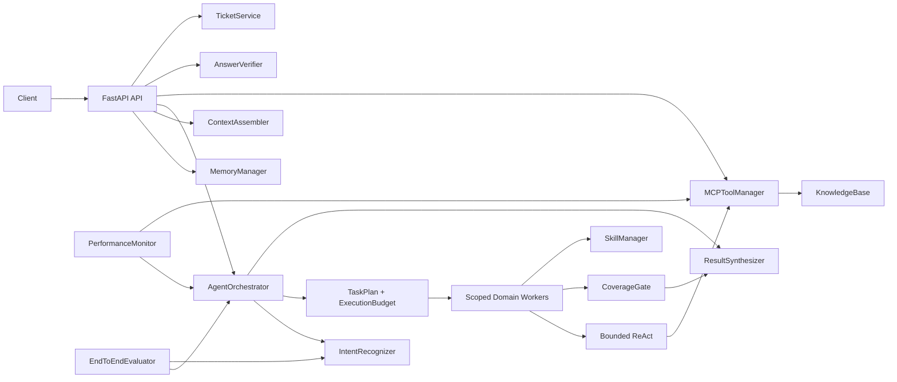
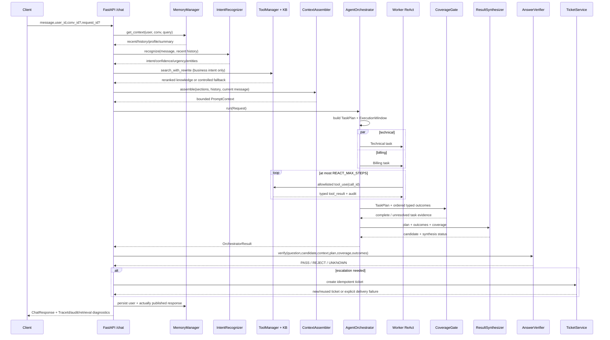
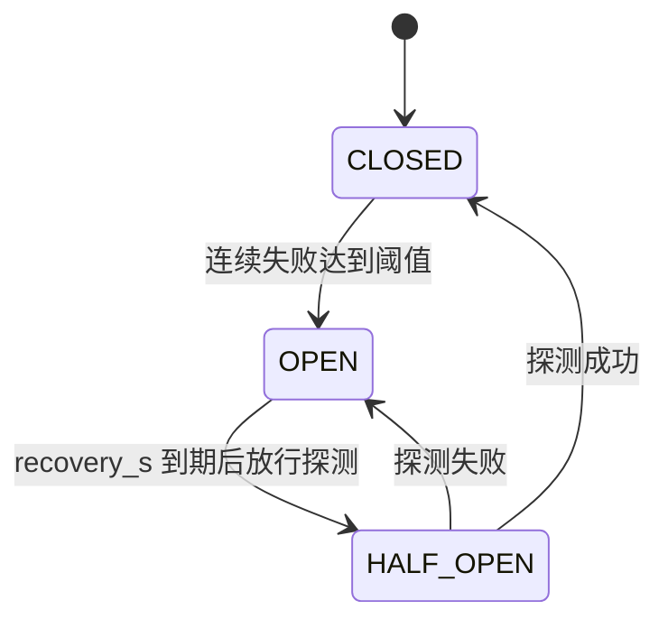
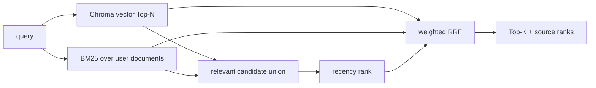
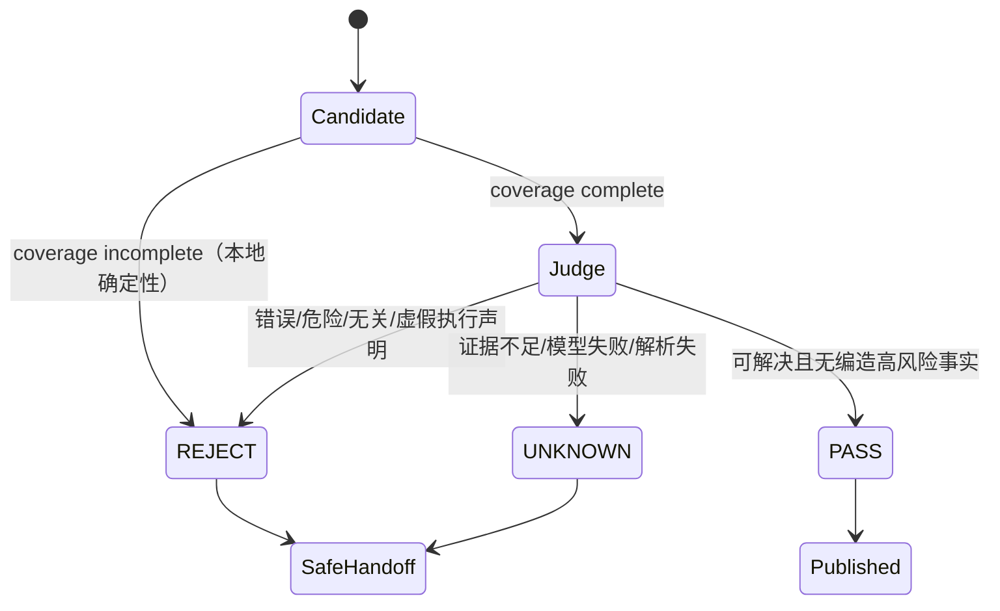
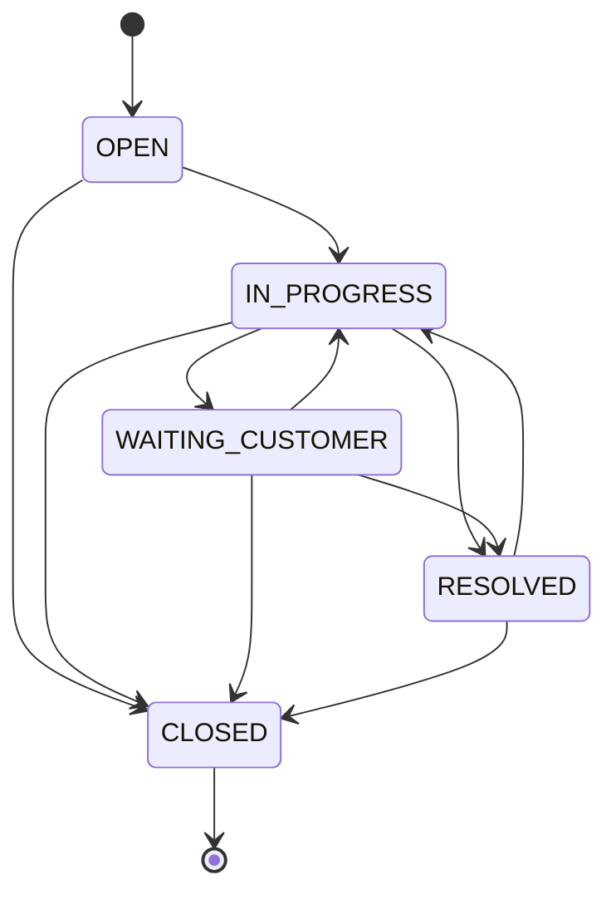
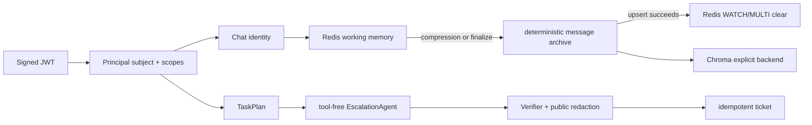
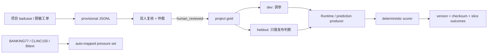
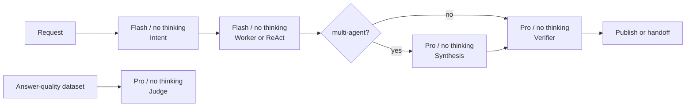

# DialogPilot 完整架构教程：从一次请求到可验证交付

> 目标：读完这一页，你应该能独立画出仓库架构，沿一次 `/chat` 请求讲清每个状态变化，解释主要设计取舍、失败路径、测试证据和当前边界，并能回答连续追问。

## 快速导航

- 想先会讲：读第 0、3、5、19、20、22、26、27、28 章；
- 想吃透 Agent：读第 6、9、10、11、12、14、25 章；
- 想吃透 Context/Memory：读第 8、25 章；
- 想吃透后端可靠性：读第 7、13、17、18、21 章；
- 想把评测跑起来：读第 15、27 章；想讲模型选型：读第 28 章；
- 面试前速查：读第 22、25、27 章连续追问、第 23 章闭卷自测，再用第 24 章做真实性审计。

## 0. 先把项目说准确

DialogPilot 是一个 Python 3.12 + FastAPI 的异步多 Agent 客服后端。它把单提示词聊天机器人中容易混在一起的职责拆开：

- `IntentRecognizer` 判断用户想做什么；
- `KnowledgeBase` 和 `MCPToolManager` 提供受控知识/记忆工具；
- `ReActExecutionEngine` 在单个领域 Worker 内执行有限工具循环；
- `MemoryManager` 拥有工作记忆、滚动摘要、情景记忆和用户画像；
- `ContextAssembler` 把这些数据装进有 Token 上限的模型输入；
- `AgentOrchestrator` 生产 `TaskPlan`，为子任务分配 General、Technical、Billing、AccountSecurity 或 Escalation Owner；
- `CoverageGate` 判断每个必需任务是否真的得到闭合 outcome；
- `ResultSynthesizer` 合并并行 Agent 的有类型结果；
- `AnswerVerifier` 决定候选回答能否发布；
- `TicketService` 把需要人工确认的结果持久化为可追踪工单；
- `PerformanceMonitor` 与 `EndToEndEvaluator` 分别负责在线健康和离线质量。

必须同时说明三个边界：

1. 外层仍是**由应用代码控制的 TaskPlan 工作流**；只有单个领域 Worker 内部有最大 4 步的 ReAct 工具循环。它不是开放式 Planner，也不允许 Worker 自由委派或互聊。
2. [`MCPToolManager`](../mcp/tool_manager.py) 是项目内部的工具注册、超时、熔断、缓存和降级层；它目前没有实现远程 MCP 的 transport、server、session 或协议握手。名字表达的是工具抽象方向，不等于已经实现网络 MCP Server。
3. Trace 和工具审计目前是进程内有界记录；默认策略会阻止高风险/写工具，但还没有“用户点击批准后恢复原调用”的持久审批接口。

### 30 秒版本

> DialogPilot 是一个 Python/FastAPI 多 Agent 客服后端。请求先用 BM25、向量与时间信号融合检索长期记忆，再识别意图和按需 RAG。Orchestrator 将复合问题拆成带 task_id、Owner、风险和完成标准的 TaskPlan；领域 Worker 在自己的任务范围内执行最大 4 步 ReAct，并且只能看到 allowlist 工具。所有 Worker 共享 deadline 和并发预算，每项收敛为有类型结果。CoverageGate 证明必需任务覆盖后，Synthesizer 才融合候选回答；Verifier 只有明确 PASS 才发布，其余情况幂等落成 SQLite 人工工单。TraceId 把 HTTP、ReAct step 和 Tool audit 串起来。

### 3 分钟版本的顺序

面试或演示时按这个顺序讲，不要朗读技术栈：

1. 问题：单提示词客服把路由、知识、记忆、安全和升级混成黑盒。
2. 合同：一次请求必须得到可诊断的路由结果；只有明确 `PASS` 的回答能发布；需要人工时同步尝试创建持久工单，并把建单成功或失败明确返回。
3. 主链：Memory → Intent → RAG → Context → TaskPlan → Workers → Coverage → Synthesis → Verification → Ticket → Persist published messages。
4. 六个最值得深挖的改动：Token 驱动且并发安全的压缩、混合长期记忆、TaskPlan/CoverageGate、有界 ReAct 与权限、请求预算下的结果代数、校验质量反馈闭环。
5. 证据：111 个测试，覆盖身份/公开投影、归档幂等/CAS、显式存储模式、真实 Escalation Owner、路由基数、混合召回、工具权限、Trace、分层模型策略和版本化评测合同。
6. 边界：已有 JWT/scope 基线；多租户 IdP/ABAC 未完成，SQLite 只适合单应用写者，Trace/审计重启丢失，审批不能交互恢复；已有 500 条分层候选集，但尚无 human-reviewed gold，不能声称生产准确率。

## 1. 如何学习这个仓库

推荐按四遍阅读，而不是从第一行顺序读到最后：

### 第一遍：只记主链

先读 [`api/main.py`](../api/main.py) 的 `lifespan()` 和 `chat()`。你只需要回答：组件何时创建？一次请求按什么时序调用它们？

### 第二遍：按 Owner 读

对每个模块问五个问题：

1. 它拥有哪个权威事实？
2. 输入是什么？
3. 输出是什么？
4. 失败时输出什么有类型结果？
5. 哪些消费者依赖这个合同？

### 第三遍：只读失败路径和测试

从 [`tests/`](../tests) 倒推设计。成功路径只能证明 Demo 能跑；超时、并发写、非法状态、模型坏 JSON、重试和部分成功更能证明你理解系统。

### 第四遍：自己复述

不看本文，手画一张图并讲一次“登录失败后又重复扣款”的请求。能讲到最终 `ticket_events`，才算真正掌握。

## 2. 仓库地图与依赖方向

```text
DialogPilot/
├── api/main.py                      # HTTP 入口、生命周期、主流程编排
├── core/
│   ├── intent_recognizer.py         # 三路意图识别、实体和紧急度
│   ├── auth.py                      # JWT Principal 与 scope 授权
│   ├── chroma_client.py             # 显式 remote/embedded 存储边界
│   ├── skill_loader.py              # 动态业务 Skill 加载/匹配/热更新
│   ├── tracing.py                   # Trace/span 身份与进程内投影
│   └── llm_utils.py                 # 供应商响应文本归一化
├── memory/
│   ├── conversation_memory.py       # Redis/Chroma 记忆状态与压缩提交
│   ├── hybrid_retrieval.py          # BM25/vector/recency 加权 RRF
│   └── context.py                   # Token 估算与 Prompt 输入装配
├── mcp/
│   ├── knowledge_base.py            # Chroma 知识文档摄取与检索
│   └── tool_manager.py              # 工具注册、校验、超时、熔断、缓存、降级
├── agents/agent_orchestrator.py     # Agent 池、路由、并发执行、质量反馈
├── agents/react_engine.py           # Worker 内有界 tool_use/tool_result 循环
├── agents/orchestration_contracts.py # TaskPlan、风险、Coverage、执行预算
├── services/
│   ├── result_synthesizer.py        # 并行结果的唯一融合 Owner
│   ├── answer_verifier.py           # 回答发布边界
│   └── ticket_service.py            # 工单身份、状态、幂等、审计
├── monitor/performance_monitor.py   # 在线指标、告警、路由 penalty
├── evaluation/evaluator.py          # 离线意图/对话评测和基线
├── skills/*/SKILL.md                # 运营可热更新的领域规则
├── tests/                            # 关键不变量的回归证据
├── Dockerfile / docker-compose.yml  # 运行镜像与服务拓扑
└── .github/workflows/ci.yml         # compileall + pytest 门禁
```

依赖方向可以简化成：



API 层负责**时序编排**，但不应该成为各领域事实的 Owner。例如 API 可以请求创建工单，却不能自己判断某个状态转换是否合法；这个意义属于 `TicketService`。

## 3. 权威事实、生产者和消费者

| 事实/状态 | 唯一 Owner | 主要生产者 | 主要消费者 | 正向合同 |
|---|---|---|---|---|
| HTTP 输入输出 | `api/main.py` 的 Pydantic 模型 | Client/API | 所有内部模块/Client | 非法结构在边界拒绝 |
| 意图、置信度、紧急度、实体 | `IntentRecognizer` | 三路识别器 | RAG gate、Orchestrator、Ticket | 返回闭合 `IntentCategory` |
| Prompt 可裁剪部分预算 | `ContextAssembler` | Memory/RAG/API | Domain Agent | section/history 有界，最近历史优先 |
| 子任务、Owner 与完成标准 | `AgentOrchestrator` 的 `TaskPlan` | Intent、实体、关键词、统计 | Worker、CoverageGate、API | task_id 唯一，每个 required task 恰有一个 Owner |
| 请求执行预算 | `ExecutionBudget/ExecutionWindow` | 启动配置、单调时钟 | Worker、Synthesizer、API | 共享 deadline、per-Agent 上限、max-agents |
| 单任务执行状态 | Worker + Orchestrator 包装 | Provider/ReAct/预算 | CoverageGate、Synthesizer、Monitor | `SUCCESS/TIMEOUT/ERROR/BUDGET_EXCEEDED`；保留 ReAct 证据 |
| ReAct 循环终态 | `ReActExecutionEngine` | LLM + ToolResult | AgentResponse、AgentOutcome | `COMPLETED/BLOCKED/TOOL_ERROR/MAX_STEPS` |
| 工具授权与审批 | `MCPToolManager` | 注册合同 + 可信宿主输入 | ReAct、审计/API | allowlist；写/高风险默认不批准即不执行 |
| 长期记忆排序 | `HybridMemoryRetriever` | 用户内 BM25/vector 候选 + recency | MemoryContext/API | weighted RRF + source ranks；时间不引入无关候选 |
| TraceId/span | `core/tracing.py` | HTTP middleware/contextvars | Agent、Tool、API | 并行 Task 继承同一 TraceId；投影有界且脱敏 |
| 必需任务覆盖 | `CoverageGate` | TaskPlan + outcomes | Synthesizer、Verifier、Evaluator | 缺失、失败、重复、越界均不能 complete |
| 并行候选回答 | `ResultSynthesizer` | Agent outcomes | Verifier/API | `SUCCESS/PARTIAL/CONFLICT/FAILED/UNKNOWN` |
| 是否可发布 | `AnswerVerifier` | Candidate + context + plan/coverage/outcomes | API、质量反馈、Ticket | coverage 缺口本地 REJECT；其余只有 `PASS` 可发布 |
| 选定发布文本 | `/chat` 发布边界 | Verifier/API | Memory、Client、Ticket | 只持久化选入 HTTP 响应的文本 |
| 工单身份与状态 | `TicketService` | Chat/manual API | 人工流程/API | 幂等创建、合法迁移、同事务事件 |
| Agent 可用性/质量统计 | 每个 `AgentStats` | 执行结果、Verifier verdict | Router、Monitor | 可用性与回答质量分离 |
| 离线质量报告 | `EndToEndEvaluator` | Cases + Judge + orchestration evidence | 开发者/发布决策 | 同时度量文本质量、Owner、覆盖、预算和 fan-out |

这个表是整个仓库最重要的“所有权地图”。连续追问时，只要回到 Owner，答案通常不会乱。

## 4. 应用启动和关闭

入口是 [`api/main.py`](../api/main.py) 的 `lifespan()`：

1. `_anthropic_cfg()` 读取 API Key、模型和可选兼容 Base URL；Key 缺失时启动失败。
2. 创建 `IntentRecognizer`。
3. 扫描 `skills/`，加载 Markdown/JSON/TXT 业务规则。
4. 创建 `AgentOrchestrator`、`AnswerVerifier`、`TicketService` 和 `ContextAssembler`。
5. 创建 `MemoryManager`：Redis 保存短期状态，ChromaDB 保存情景记忆和画像。
6. 创建共享 `TraceRecorder`、`MCPToolManager` 和 `KnowledgeBase`，注册只读且有 Agent allowlist 的 `knowledge_search`、`memory_search`，再把 ToolManager 注入所有领域 Worker。
7. 启动 `PerformanceMonitor` 后台采集循环。
8. 创建 `EndToEndEvaluator`。
9. `yield` 后服务开始接请求；退出时停止 Monitor 并关闭 Redis 连接。

为什么使用 FastAPI lifespan，而不是 import 时直接创建？

- 初始化顺序明确；
- 可在服务真正 ready 前完成依赖检查；
- 测试可以替换模块级组件；
- 关闭时能取消后台任务、释放连接。

当前不足：组件以模块级变量保存，适合这个单进程项目，但更大的系统可以改成显式依赖容器，减少测试 monkeypatch 和隐藏全局状态。

这里实际有两个 `IntentRecognizer` 实例：Orchestrator 内部实例服务 `/chat`，lifespan 还单独创建一个给 Evaluator。它们代码合同相同，但 cache/learn 状态不共享；生产版应明确是否合并为同一依赖，或保持评测隔离并给出版本一致性检查。

## 5. `/chat` 主链时序

下面用请求“订单 #A123 登录失败后又被扣款了”走一遍：



### 5.1 请求身份

- `Authorization: Bearer <JWT>` 由 `JWTAuthenticator` 校验 HS256 签名、issuer、audience、`sub/iat/exp`；
- `Principal.subject` 是记忆和工单用户身份的唯一来源；请求体旧 `user_id` 若与它冲突直接 403；
- `chat`、`knowledge:read`、`admin` scope 控制不同 HTTP 能力；admin 可显式越过细分 scope；
- `conv_id` 标识一次会话；调用方不传时生成 UUID。
- `request_id` 标识一次客户端操作；不传时生成 UUID。
- 自动人工工单的幂等键是 `chat:{request_id}:handoff`。

如果客户端会重试，应该自己生成并复用 `request_id`。否则每次服务端都生成新 ID，无法识别为同一个操作。

### 5.2 先读记忆，再识别当前意图

`MemoryManager.get_context()` 会顺序读取：

- 当前会话 Redis 消息；
- 基于当前 query 检索的跨会话情景记忆；
- 用户画像；
- 已有滚动摘要。

API 只取最近 5 条真实消息作为意图识别 history。这样“它还是没到”可以借前文判断是物流问题。

### 5.3 意图结果只计算一次

API 先调用 `recognize_intent()`，随后把同一个 `IntentResult` 同时用于：

- 判断是否需要知识检索；
- 构造 Orchestrator Request；
- 路由和优先级；
- 最终响应元数据；
- 工单中的 intent。

避免 RAG gate 和 Agent Router 各自识别一次、得到相互矛盾的结果。

### 5.4 知识是数据，不是假对话

RAG 结果作为 `ContextSection(tag="knowledge", data_only=true)` 进入 system context。真实历史仍保持 `user/assistant` message。系统不会伪造一句 assistant “我已了解背景”，因为伪造历史会改变模型对真实交互的判断。

### 5.5 执行和发布是两个边界

`OrchestratorResult.response` 只是**候选回答**。`AnswerVerifier` 才拥有“能否选入 HTTP 响应”的决定：

- `PASS`：发布候选回答；
- `REJECT`：coverage 缺口、本地空回答或 Judge 明确拒绝，替换为固定人工确认话术；
- `UNKNOWN`：模型失败、坏 JSON 或未知状态，也替换并升级。

### 5.6 先确定发布文本，再写记忆

Memory 保存的是服务端选入 HTTP 响应的 `response_text`，不是未经校验的 candidate。服务端无法证明客户端最终收到了字节，因此这里的 “published” 是响应选择事实，不是用户实际阅读 receipt。即便如此，也不能让下轮模型把已被拒绝的 candidate 当成历史事实。

### 5.8 工单投递失败不是成功

如果 `TicketService.create_ticket()` 失败，API 当前保持 `escalated=true`、`ticket_id=null`，返回明确“工单创建失败，请用相同 request_id 重试”的文本。也就是说，系统拥有“需要升级”和“已持久化 ticket”两个不同事实；当前没有 outbox/可靠队列保证升级最终必达。

### 5.7 用户画像异步更新

`asyncio.create_task(update_profile(...))` 避免阻塞响应。代价是进程在任务完成前崩溃时，本次画像更新可能丢失。生产环境应交给有重试、幂等和可观测状态的队列。

## 6. 意图识别：三路信号如何融合

代码：[`core/intent_recognizer.py`](../core/intent_recognizer.py)

### 6.1 输出合同

`IntentResult` 包含：

- `intent`：闭合枚举，如 `refund`、`technical_login`；
- `intent_group`：细粒度意图映射到 query/billing/technical 等大类；
- `confidence`：融合置信度；
- `urgency`：LOW/MEDIUM/HIGH/CRITICAL；
- `entities`：订单号、日期、金额、错误码；
- `source_scores`：LLM、embedding、pattern 各自分数；
- `reasoning` 和延迟。

### 6.2 三条识别路径

1. LLM：理解复杂语义和最近三轮历史，优先输出细粒度意图。
2. 本地向量：把字符 1/2/3-gram 哈希到 256 维，做余弦相似度。它不是训练过的语义 Embedding，但可作为无远端 embedding 时的确定性近似。
3. Pattern：对退款、发票、401、500、转人工等高精度表达做同步匹配。

LLM 与 embedding 并行，pattern 同步执行。官方 Anthropic SDK 没有 embeddings 资源时，本地字符向量是实际兜底；配置第三方兼容 Base URL 时代码会禁用 embedding 分支，使用 LLM 0.85 + pattern 0.15。

### 6.3 投票和细粒度纠偏

默认权重为 LLM 0.7、embedding 0.2、pattern 0.1。若 LLM 失败，直接选择有效 fallback，不让一个 0 分 `OTHER` 稀释结果。

如果融合结果是泛化类 `billing/technical/query`，但 pattern 高置信命中了 `refund/technical_login/...`，代码会在条件满足时细化结果。这解决“模型说大类，规则知道具体子类”的问题。

### 6.4 缓存和在线学习

- cache key 同时覆盖 message 和 history；同一句话在不同上下文中不会误用同一结果。
- 内存缓存最多约 1000 条，满后删除前 500 条；这是简单近似 LRU，不是严格 LRU。
- `learn()` 能把纠正样本加入进程内模板并清理对应向量缓存，但没有持久化，重启会丢失。

### 6.5 面试中要主动承认

- 字符 n-gram 是轻量相似度，不应声称为生产语义模型；
- 三路权重是工程初始值，尚未通过大规模标注集校准；
- cache 和 learn 都是进程内状态，多副本不共享；
- 更成熟方案应记录混淆矩阵、按类别阈值和 calibration error。

## 7. RAG 与工具可靠性链

代码：[`mcp/tool_manager.py`](../mcp/tool_manager.py)、[`mcp/knowledge_base.py`](../mcp/knowledge_base.py)

### 7.1 为什么先做 Intent Gate

问候、反馈、转人工不检索知识库。业务意图或业务关键词才进入 RAG，减少：

- 无关知识污染；
- 查询改写和重排的模型成本；
- Chroma 查询延迟；
- 简单寒暄被“政策文档”带偏。

### 7.2 检索数据流

```text
原始问题
  -> LLM 改写为最多 3 个不同角度 + 保留原问题
  -> 每个子查询并行调用 knowledge_search
  -> 每路 Chroma Top-K
  -> 按完整 item 哈希去重
  -> LLM 输出相关性索引顺序
  -> 取最终 Top-K
  -> 作为 data_only ContextSection 注入
```

### 7.3 Tool 调用合同

`Tool` 除名称、handler、Schema、缓存和超时外，还声明 `allowed_agents`、`risk`、`read_only` 与 `requires_approval`。ReAct 必须走 `execute_for_agent()`，不能直接碰 handler。完整顺序是：

1. 先按 Agent allowlist 过滤模型能看到的 tool schema；
2. 执行时再次检查注册表与 allowlist，抵御模型编造/越权工具名；
3. 按宿主 `ApprovalMode` 和工具风险判断是否需要批准；`approved` 不在模型参数 Schema 内；
4. 获准后才进入 TTL cache、CircuitBreaker、Schema 校验、timeout/handler、可选重排和 fallback；
5. 结果回写模型前限制字符数；
6. 以 `trace_id/call_id/agent/tool/status` 记录脱敏审计，只保存参数哈希和 shape 摘要。

ReAct 同一轮请求多个工具时，只有全部 `read_only=True` 才通过 `asyncio.gather` 并行；只要存在潜在写操作就按模型给出的稳定顺序串行，避免不可控副作用竞争。

### 7.4 熔断器状态



默认连续 5 次失败打开，60 秒后进入 HALF_OPEN。注意当前 HALF_OPEN 没有并发探测闸门，恢复瞬间多个请求可能同时穿透；生产版应只允许一个 probe。

### 7.5 Fallback 的语义

知识库 fallback 返回一条 `fallback=True, score=0` 的受控说明，而不是抛异常。但 `ToolResult.success=True` 表示“调用方拿到了可消费的降级数据”，不表示知识检索真的成功。消费者如果需要区分真实结果，必须检查 item 的 `fallback` 或设计更明确的 `DEGRADED` 状态。

### 7.6 KnowledgeBase

- collection 名为 `knowledge_base`；
- 首次为空时导入默认客服文档；
- 文档默认按 360 Token 估算上限切片、48 Token overlap，优先段落/句末边界；
- corpus `document_id` 是父身份，`document_id::chunk-N` 是向量/BM25/RRF 候选身份；
- Chroma 提供向量候选，KnowledgeBase 再用 BM25 + RRF 融合；最终按父文档去重；
- `CHROMA_MODE=remote` 连接失败时启动失败；只有显式 `embedded` 才使用 PersistentClient，因此不会产生两套无自动合并的物理存储。

### 7.7 有界 ReAct，而不是开放式自治

现在每个领域 Worker 会收到自己的工具 Schema，并执行 Anthropic `tool_use → tool_result` 循环；`call_id` 必须配对，默认最多 4 步。自然结束为 `COMPLETED`，权限拒绝或待审批为 `BLOCKED`，工具失败为 `TOOL_ERROR`，持续循环为 `MAX_STEPS`。后三种都让任务非成功并触发升级，而且不会被 GeneralAgent 静默替换。

外层 TaskPlan、Agent fan-out、CoverageGate 和发布校验仍是确定性 Python 控制。这是刻意的两层设计：Planner 拥有“哪些工作必须完成”，ReAct 只拥有“当前 Worker 为完成自己的任务应调用什么工具”。它还缺持久 checkpoint、取消/恢复、交互审批和真实写操作 receipt，因此不能称为通用自治 Agent 平台。

## 8. 记忆系统：状态、压缩和并发安全

代码：[`memory/conversation_memory.py`](../memory/conversation_memory.py)、[`memory/hybrid_retrieval.py`](../memory/hybrid_retrieval.py)、[`memory/context.py`](../memory/context.py)

### 8.1 四类上下文不要混淆

| 类型 | 存储 | 生命周期 | 用途 |
|---|---|---|---|
| Working memory | Redis list | TTL 24h | 当前会话原始消息 |
| Rolling summary | Redis string | TTL 24h | 被压缩历史的结构化摘要 |
| Episodic memory | Chroma `episodic` | 持久 | 跨会话检索的原始重叠片段；摘要只作 metadata/背景 |
| User profile | Chroma `user_profile` | 持久 | 偏好和关键实体 |

Knowledge Base 也在 Chroma，但使用独立 collection。知识文档是业务事实投影，用户记忆是个人交互状态，不能混为一类。

画像现在使用 `profile_<sha256(user_id)>` 作为每用户唯一权威 ID，写入带 `version/observed_at/updated_at`，读取按精确 ID，不依赖 Chroma 返回顺序。进程内按用户加锁并比较 observation time，避免慢请求覆盖较新的画像；多副本部署仍需把同一 CAS/版本条件迁到共享数据库。

### 8.2 Redis 消息顺序

写入使用 `LPUSH`，Redis 中最新消息在前。读取时 `_decode_messages()` 对列表 `reversed`，恢复为从旧到新的真实时序。

### 8.3 为什么按 Token，不按消息数

一条消息可以是 2 个字，也可以是 2 万字。固定 20 条压缩无法控制模型输入。`TokenEstimator` 用中文约 1.5 字/token、其他字符约 4 字/token 加元数据开销做快速估算。

它不是精确 tokenizer，所以它拥有的是“预检预算估算”，不是供应商计费事实。配置中仍应留安全余量。

### 8.4 压缩触发和保留

默认：

- memory budget 6000；
- 达到 70% 即触发；
- 最近原文最多保留 5 条、至少 2 条；
- 最近原文额外受约 30% memory budget 约束；
- summary 最多 1200 estimated tokens。

摘要是滚动替换，不是把每次摘要继续无限 append。Schema 固定为：

```json
{
  "user_goal": "",
  "confirmed_facts": [],
  "pending_questions": [],
  "entities": {},
  "decisions": [],
  "user_preferences": []
}
```

LLM 失败时，用旧摘要加最近事实生成确定性 fallback；随后 `_bounded_summary()` 从最长列表开始删除旧项，直到落入 Token 上限。

### 8.5 并发写为何会丢消息

最危险的时间窗口：

```text
T1 读取 Redis 快照
T1 调 LLM 生成摘要（慢）
T2 在这期间 LPUSH 新消息
T1 删除原列表并写回保留消息
```

如果 T1 无条件提交，T2 的新消息会被删除。

修复使用 Redis optimistic transaction：

1. 保存原始 list 和 old summary 快照；
2. 生成摘要；
3. `WATCH` 消息 key 和 summary key；
4. 重新读取并逐值比较；
5. 只在完全未变化时 `MULTI`，同一事务重写列表、TTL 和 summary；
6. 发生 `WatchError` 或值变化就放弃本次压缩，不覆盖任何新状态。

这条正向不变量是：**压缩可以延后，但不能删除压缩快照之后到达的消息。**

### 8.6 为什么不能只检索压缩摘要

旧实现把 summary 当作 Chroma document。摘要能控制 Prompt，但会删掉订单号、错误码和原话；一旦只剩摘要，后续向量检索无法恢复丢失细节。新合同把被压缩对话切成原始重叠片段作为 document，summary 只留在 metadata 和 Prompt 背景。v1 历史记录仍兼容读取其 `full_text` metadata。

查询在同一个 `user_id` 边界内走三路信号：



默认权重为 vector 0.30、BM25 0.60、recency 0.10，RRF 常数 `k=60`。时间只对 BM25/向量已经召回的候选排序，不能让“最新但无关”的记忆进入候选集。向量库和词法路径用 `gather(return_exceptions=True)` 独立降级：一路故障时另一路仍可工作；两路都空则确定性返回空结果。

为什么 BM25 权重更高？客服记忆常含订单号、错误码等精确 token，词法信号应优先保护它们；这只是当前可解释基线，不是已证明最优。`evaluate_retrieval()` 已提供 Recall@K、MRR、nDCG，后续应在版本化 query/relevant-id 数据集上做权重和 chunk overlap 消融。

归档顺序是先用稳定 `message_id` 和确定性 Chroma ID `upsert` 原始消息，再用 Redis WATCH/MULTI 提交压缩。Chroma 写失败时不删除 Redis 原消息；CAS 冲突后的重试仍写同一批 ID，不制造重复情景记忆。短会话还可调用 `POST /conversations/{conv_id}/finalize`，归档全部剩余消息后再 CAS 删除 working/summary；并发新消息会得到可重试的 409 并完整保留。

### 8.7 Prompt Context 和持久记忆是两层

`MemoryManager` 拥有持久状态；`ContextAssembler` 拥有“怎样转换为本次 LLM 输入”。后者：

- 先预留模型输出和固定 system prompt 容量；
- 默认给数据 sections 55% 可用预算；
- 按 priority 高到低选择/截断 section，但最终恢复原 section 顺序；
- history 从最新往前装，空间不足时丢最旧消息；
- history 有剩余预算时返还给被截断 section；
- 当前 user message 永远单独保留。

`ContextSection.render()` 会 HTML escape 内容并标注 `data_only=true`，降低检索内容或旧记忆被模型当指令执行的风险。它是信任边界提示，不是完整 Prompt Injection 防御；真正安全仍需要权限和工具边界。

精确的数据投递关系：

| 来源 | Prompt 位置 | Agent 可见 | Verifier 可见 |
|---|---|---|---|
| recent Redis messages | `messages` 中真实 user/assistant history | 是 | 否 |
| rolling summary | system `conversation_summary` section | 是 | 是 |
| episodic retrieval | system `relevant_history` section | 是 | 是 |
| user profile | system `user_profile` section | 是 | 是 |
| RAG evidence | system `knowledge` section | 是 | 是 |
| Skill | Domain Agent 基础 system prompt | 是 | 否 |
| entities | Agent 调用时额外 system section | 是 | 否 |

预算还有一个必须诚实说明的边界：`ContextAssembler` 只裁剪 sections 和 history，当前 user message 完整保留；Domain Agent 的基础 system prompt、Skill 和 entities 又在 assembler 之后追加。因此 `estimated_tokens` 不是所有 HTTP 输入的硬上限。`ChatRequest.message` 当前也无长度约束，生产版需要 HTTP 长度限制、完整 preflight 计数和 typed `context_too_large` 失败。

## 9. Skill：业务规则怎样与代码解耦

代码：[`core/skill_loader.py`](../core/skill_loader.py)、[`skills/`](../skills)

Skill 适合放：客服话术、所需字段、退款/发票规则、排障 SOP、必须转人工的条件。它不适合拥有账户余额、订单状态或权限决策等动态权威事实。

### 9.1 加载

- 优先发现任意子目录的 `SKILL.md`；
- 也支持普通 `.md/.txt/.json`；
- 单个文件解析失败只进入 errors，不阻断其他 Skill；
- 简单 front matter 不依赖 PyYAML；
- `POST /skills/reload` 可在不重启进程时重扫。

### 9.2 匹配

- `enabled=false` 仍会被解析并出现在 `/skills` 摘要，但匹配时不会注入；
- `agents` 限制 General/Technical/Billing；
- `keywords` 为空表示全局；否则命中任一关键词；
- 单 Skill 和总 prompt 都有字符上限。

### 9.3 注入位置

每个 Domain Agent 在 `_build_system_prompt()` 中按当前 message 和 agent type 选 Skill，再拼进该 Agent 的 system prompt。

### 9.4 当前边界

- 匹配是 substring，不是语义路由；
- 热更新没有版本号、审批、回滚和多副本同步；
- 字符截断可能在一条规则中间切断；
- Skill 内容仍是 Prompt，不是强制 Policy。高风险要求必须在代码/权限/业务服务再次校验。

## 10. Multi-Agent 编排

代码：[`agents/agent_orchestrator.py`](../agents/agent_orchestrator.py)、[`agents/orchestration_contracts.py`](../agents/orchestration_contracts.py)、[`agents/react_engine.py`](../agents/react_engine.py)

<div class="dp-task-ledger" role="img" aria-label="DialogPilot 任务账本：规划、并行 Worker、覆盖检查、融合和发布校验">
  <div class="ledger-stage ledger-plan"><span>01 · PLAN</span><strong>3 required tasks</strong><small>task_id · owner · risk · criteria</small></div>
  <div class="ledger-workers"><span>02 · WORKERS</span><strong>Security ╱ Technical ╱ Billing</strong><small>shared deadline · max 3 agents</small></div>
  <div class="ledger-stage ledger-coverage"><span>03 · COVERAGE</span><strong>2 complete · 1 unresolved</strong><small>fail closed, never silently drop</small></div>
  <div class="ledger-stage ledger-verify"><span>04 · VERIFY</span><strong>REJECT_INCOMPLETE</strong><small>safe handoff + ticket</small></div>
</div>

这张 Task Ledger 是代码实际合同的缩影：Agent 列表只说明谁运行，TaskPlan 才说明用户要求中的哪些工作必须完成。

### 10.1 Agent 角色

- `GeneralAgent`：通用接待、澄清、分流；
- `TechnicalAgent`：错误诊断、配置、排障步骤；
- `BillingAgent`：账单、退款、发票、订阅；
- `AccountSecurityAgent`：账号被盗、异常登录、身份验证和敏感资料保护；
- `EscalationAgent`：真实、无工具的人工交接 Worker，整理诉求、风险、已知证据和待核实项，不承诺后台动作已完成。

五个真实 Agent 共用 `BaseAgent.handle()`：计时、选择普通模型调用或 ReAct、累计执行统计、识别回答里的转人工关键词、把异常转成 `AgentResponse(success=False)`。AccountSecurity 有单独 Skill 和高风险完成标准；Escalation 覆盖 `_new_react_engine()`，确定性禁止工具。

### 10.2 路由不是只看单一 intent

`_domain_scores()` 仍用可解释的确定性证据选能力：

- 意图大类：例如技术类 +0.75；
- 领域关键词：每个命中增加分数并设上限；
- 实体：错误码给 Technical，金额给 Billing，订单号给 General；账号被盗、陌生设备、身份验证等证据给 AccountSecurity；
- General 初始 0.1，承接普通请求。

得分最高的能力成为 primary，其他非 General 能力达到 0.45 成为 supporting。随后 `_build_task_plan()` 不只返回 Agent 名单，而是为每项生成 `TaskSpec(task_id, owner, instruction, required, risk, success_criteria)`。当前 Planner 是代码控制的可解释启发式，不是另一次 LLM 自主规划；这是刻意保留的生产确定性边界。

例子“账号被盗、登录失败、又重复扣款”会形成 AccountSecurity、Technical、Billing 三项任务。每个 Worker 的 system prompt 注入自己的任务范围，明确禁止替其他领域下结论。

### 10.3 何时先澄清

当 intent 是 `OTHER`、文本不是极短输入且 confidence < 0.5，Orchestrator 直接返回澄清问题，不执行领域 Agent。这里对应 Agent 的 `ASK` 决策，而不是硬猜。

### 10.4 同类实例如何选择

Agent 池允许每类多个实例。`_best_agent()` 取 `routing_score()` 最大者：

```text
latency_score = 1 / (1 + avg_ms / 1000)
base = availability * 0.35 + verified_quality * 0.45 + latency * 0.20
routing_score = base * (1 - monitor_penalty)
```

当前默认每类只有一个实例，所以 `get_stats()` 明确输出 `routing_pool_size=1`、`adaptive_routing_active=false`。Monitor 仍采集健康，但不会施加“能改变选择”的 penalty；只有同类型至少两个候选时才启用在线质量选优。

### 10.5 Specialist 降级

普通 provider 异常仍允许专属 Agent 降级到 GeneralAgent。ReAct 的 `BLOCKED/TOOL_ERROR/MAX_STEPS` 则设置 `allow_fallback=False`，因为另一个 Agent 生成流畅文字不能证明原工具任务已经完成，更不能抹掉权限拒绝。结果会记录：

- `agent_type`：原本选择的领域；
- `responding_agent_type`：最终实际回答的 General；
- `agent_key`：真实生产者实例。

这样反馈不会错误记到失败的 specialist 上。

### 10.6 请求级预算与并行执行

`ExecutionBudget` 默认配置为请求 20 秒、单 Agent 15 秒、最多 3 个 Agent。一次 `run()` 创建一个基于单调时钟的 `ExecutionWindow`，所有 Worker 和 Synthesizer 共享同一个绝对 deadline；每个 Worker 实际 timeout 是 `min(agent_timeout, remaining_request_time)`。

超过 `max_agents` 的任务不会从计划中消失，而是得到 `BUDGET_EXCEEDED` outcome；请求时间在 Worker 前或执行中耗尽也收敛到该状态。并发仍用 `asyncio.gather`，结果再按 `TaskPlan.ordered_tasks` 恢复稳定顺序。

### 10.7 CoverageGate：完整性不能由回答观感决定

`CoverageGate` 用 task_id 比较计划和 outcomes，输出：

- `completed_task_ids`：明确 SUCCESS；
- `failed_task_ids`：TIMEOUT、ERROR 或 BUDGET_EXCEEDED；
- `missing_task_ids`：计划存在但完全没有 outcome；
- `duplicate_task_ids`：同一 task 重复生产结果；
- `unexpected_task_ids`：计划外结果；
- `unresolved_required_task_ids`：所有未成功的必需任务。

只有 required tasks 全部成功且不存在重复/越界结果，`coverage.complete` 才为 true。这样“技术回答很完整，但账务任务没执行”不能被误标成整体成功。

### 10.8 两级控制流到底怎么分工

```text
主 Orchestrator（确定性）
  └─ TaskPlan: task_id / owner / risk / criteria / deadline
       ├─ Technical Worker ─ ReAct(max 4) ─ allowlisted tools
       └─ Billing Worker   ─ ReAct(max 4) ─ allowlisted tools
  └─ CoverageGate / Synthesizer / Verifier
```

这与“主 Agent 自由 plan、线程池跑子 Agent”不同：外层任务完整性和风险是代码合同，适合固定客服域；`asyncio` 用于 I/O 并发，只有同步 handler 才放线程池，避免把线程池误当 Agent 架构。ReAct 只补足 Worker 内“观察工具结果后继续行动”的能力，不改变任务 Owner。

## 11. 并行结果代数和融合

代码：[`services/result_synthesizer.py`](../services/result_synthesizer.py)

### 11.1 两层闭合状态

每个计划任务：

```text
SUCCESS | TIMEOUT | ERROR | BUDGET_EXCEEDED
```

真正进入 `ResultSynthesizer` 的并行整体融合：

```text
SUCCESS | PARTIAL | CONFLICT | FAILED | UNKNOWN
```

单 Agent 和澄清路径不调用 Synthesizer，API 外层使用 `synthesis_status="single"`。因此“五态”是并行融合器的闭合代数，`single` 是编排层的旁路状态，不应混成第六种融合结果。

闭合状态的价值是：调用方不需要根据空字符串、异常文本或缺失字段猜发生了什么。

### 11.2 状态转换

| Task outcomes / coverage | Synthesis | Candidate | 是否升级 |
|---|---|---|---|
| 全部失败/超时/预算耗尽 | `FAILED` | 固定人工话术 | 是 |
| 只有一个成功，无失败 | `SUCCESS` | 原回答 | 继承 Agent 决定 |
| 只有一个成功，其余失败或 required 未覆盖 | `PARTIAL` | 保留成功回答 | 是 |
| 多个成功且一致 | `SUCCESS` 或有失败时 `PARTIAL` | LLM 去重融合 | 视失败/Agent 标志 |
| 多个成功但冲突 | `CONFLICT` | 融合回答 + conflicts | 是 |
| 融合模型失败/坏 JSON | `UNKNOWN` | 按路由顺序确定性拼接 | 是 |

关键不变量：**有一个有效答案时，不能因为另一个超时就把它降成“所有失败”；但 CoverageGate 仍将缺失的 required task 标为不完整，避免把部分回答伪装成整体成功。**

### 11.3 为什么需要唯一 Synthesizer Owner

如果 API、Orchestrator 和各 Agent 都能拼接回答，会出现：

- 顺序不稳定；
- 重复内容；
- 冲突没人负责；
- 某个失败路径丢掉成功结果；
- 反馈不知道应该归因给谁。

因此只有 `ResultSynthesizer` 能把 outcomes 变成 candidate。

### 11.4 Producer 归因

只有 `SUCCESS`/`PARTIAL` candidate 的成功生产者 Agent keys 会进入 `producer_agent_keys`。`CONFLICT` 和 `UNKNOWN` 不给个体 Agent 记 PASS/REJECT，因为整体结果无法可靠归因。

## 12. 回答校验与发布安全

代码：[`services/answer_verifier.py`](../services/answer_verifier.py)

### 12.1 正向合同

不是“发现坏答案就拒绝”，而是：**只有受支持的明确 `PASS` 才可发布。**



Verifier 现在接收 `task_plan + coverage + agent_outcomes`。如果 `coverage.complete=false` 或仍有 unresolved required task，它在调用 Judge 前直接 `REJECT`，原因码为 `incomplete`；模型不能通过流畅措辞覆盖确定性的任务缺口。

### 12.2 解析失败为何是 UNKNOWN

模型可能返回 Markdown、空串、未知 status 或非法 JSON。如果异常时默认 true，校验边界等于不存在。代码捕获所有异常并生成：

```text
status=UNKNOWN, grounded=false, need_escalation=true
```

机器可读 `reason_code` 进一步区分 `passed/empty_answer/incomplete/ungrounded/unsafe/irrelevant/model_rejected/verifier_unavailable`；API 和工单无需解析自然语言 reason 来决定后续动作。

### 12.3 校验器不是事实引擎

Coverage 缺口和空回答是本地确定性检查；其余语义判断仍由同类 LLM 基于 question、candidate、system context 和编排证据完成。`publishable` 只要求 `status=PASS`，不会额外要求 `grounded=true`，因为问候等回答可能无需外部知识。它能减少明显错误，但不等于确定性事实证明。资金、账户变更等高风险操作最终必须查询业务系统 receipt，不能只靠第二次模型调用。

## 13. 人工工单：从布尔标志到持久状态

代码：[`services/ticket_service.py`](../services/ticket_service.py)

### 13.1 为什么 `escalated=true` 不够

布尔值只表达请求当下的建议，不保证：

- 人工真的收到；
- 重试不会重复创建；
- 当前由谁处理；
- 客户是否补充信息；
- 是否解决/关闭；
- 谁在何时改变了状态。

`TicketService` 把升级变成有身份、有状态、有审计历史的持久对象。

### 13.2 状态机



- 相同状态重试是幂等 no-op；
- `CLOSED` 是终态；
- `RESOLVED` 可以回到 `IN_PROGRESS`，用于问题复现；
- 不支持的迁移抛 `InvalidTransitionError`，API 映射为 409。

### 13.3 创建幂等

`idempotency_key` 有数据库唯一约束。第一次创建时还生成 request fingerprint，只覆盖稳定的客户端操作字段：

- idempotency key；
- user_id；
- conv_id；
- request_id；
- question。

它故意不覆盖模型生成的 `published_response` 和 reason。重试时模型措辞可能变化，但只要还是同一个用户操作，就必须返回第一次工单，而不是冲突或重复创建。

如果同一个 key 搭配不同稳定字段，抛 `IdempotencyConflictError`。

### 13.4 SQLite 事务

- `BEGIN IMMEDIATE` 先获得写锁；
- ticket insert 和第一条 `OPEN` event 在同一事务；
- transition 的 ticket update 和 event insert 也在同一事务；
- WAL + busy timeout 改善单机并发；
- 进程内 `RLock` 避免同一实例的线程竞争。

正向不变量：**不存在状态已经变化但审计事件没写入的已提交结果。**

### 13.5 优先级

- CRITICAL urgency → critical ticket；
- verifier REJECT/UNKNOWN → high；
- 其他升级 → normal。

### 13.6 生产迁移

SQLite 适合单应用写者和作品集部署。多副本要把同一服务合同迁到 PostgreSQL，并用唯一约束和事务保留幂等/状态不变量；不能简单让多个副本各写自己的本地 db。

还要处理跨模块原子性：当前 ticket 创建、两条 Redis message 和 HTTP response 不在同一事务。ticket 成功后 memory 失败、只写入 user message 等情况没有 request-result ledger。生产版可用 operation record/outbox 把状态显式化，而不是假装跨 SQLite、Redis 和网络存在全局事务。

## 14. 在线质量反馈和路由闭环

代码：[`agents/agent_orchestrator.py`](../agents/agent_orchestrator.py)、[`monitor/performance_monitor.py`](../monitor/performance_monitor.py)

### 14.1 为什么 execution success 不等于 answer quality

供应商返回 200 且生成了文本，只能说明执行可用；回答仍可能胡编。项目把两者分开：

- availability：`success / total`；
- verified quality：Verifier 的 PASS/REJECT；
- verifier infrastructure：UNKNOWN 单独计数。

### 14.2 Sample-aware EWMA

PASS 作为 1，REJECT 作为 0，alpha=0.25：

```text
quality_ewma = 0.25 * observation + 0.75 * old_ewma
```

前 10 个样本还会向 0.5 prior 收缩：

```text
confidence = min(1, samples / 10)
quality_score = 0.5 * (1-confidence) + ewma * confidence
```

这样一个早期 PASS 不会立即把新实例推到满分。UNKNOWN 只增加计数，不改变质量，因为校验基础设施失败不是 Agent 自身错误。

### 14.3 Monitor 闭环

Monitor 每隔 N 秒：

1. 拉取 Agent/Tool 统计；
2. 用滑动窗口 Z-score 检测突变；
3. 按固定阈值生成 Alert；
4. 暴露 Prometheus Gauge/Histogram；
5. 根据成功率和延迟计算 `monitor_penalty`；
6. 回写 Orchestrator；
7. 生成优化建议；
8. 可选异步发 Webhook。

### 14.4 当前观测边界

- 指标和 EWMA 都在进程内，重启归零；
- Histogram 当前每次采集 observe 一个累计平均延迟，而不是每次真实请求延迟，统计语义不够严格；
- 已有 HTTP/ReAct/Tool 的 TraceId/span 和脱敏审计，但记录只在单进程内，尚未覆盖 Intent、Synthesis、Verifier、Ticket，也没有 token/cost/exporter；
- label 应保持低基数，不能把 user_id/request_id 直接作为 Prometheus label。

## 15. 离线评测

代码：[`evaluation/dataset.py`](../evaluation/dataset.py)、[`evaluation/evaluator.py`](../evaluation/evaluator.py)、[`evaluation/benchmark.py`](../evaluation/benchmark.py)、[`evaluation/stateful_runner.py`](../evaluation/stateful_runner.py)、[`evaluation/retrieval_runner.py`](../evaluation/retrieval_runner.py)

### 15.1 两条评测路径不能混为一谈

1. **运行时路径**：Intent 计算 accuracy/Macro-F1；Dialog 真实调用 Orchestrator，再用 LLM Judge 评 relevance、accuracy、completeness、helpfulness；Orchestration 从 TaskPlan/outcome 计算 Owner exact、Jaccard、task coverage、budget 和 fan-out。
2. **确定性预测路径**：版本化 JSONL 为 intent、routing、retrieval、stateful 四层定义期望结果，`evaluation.benchmark` 对完整 prediction 文件计算固定指标，不让主观 Judge 代替过程合同。

`EndToEndEvaluator` 实际覆盖 **Intent + Orchestrator candidate + orchestration evidence**，没有经过 `/chat` 的完整 Memory、RAG、ContextAssembler、Verifier、Ticket 和最终持久化。名称不能被用来夸成完整发布面 E2E。

### 15.2 四层数据与指标

| 层 | 期望字段 | 确定性指标 | 主要失败问题 |
|---|---|---|---|
| Intent | `intent` | Accuracy、Macro-F1、OOS Recall | 主意图/拒识是否正确 |
| Routing | `owners/task_ids` | Owner exact/Jaccard、task exact、coverage、fan-out | 是否漏任务或乱并行 |
| Retrieval | `relevant_ids` | Recall@K、MRR、nDCG | 精确证据是否召回且排在前面 |
| Stateful | `assertions` | assertion pass、all pass | 隔离、授权、副作用等不变量是否成立 |

提交的 `dialogpilot-500-v1` 有 500 条：Intent/OOS 180、Routing 120、Retrieval 100、Stateful 100，另有 25 篇隔离 corpus。180 条外部意图样本是 `auto_mapped`，320 条项目合同是 `provisional`，**都不是 human-reviewed gold**。Stateful 的 20 条原 heldout 与 Reviewer B fresh-v2 27 条都已参与缺陷修复，只能作为回归集；现有 fixture 仍没有证明真实空闲检测或外部 IdP/JWKS 多租户边界。

### 15.3 数据身份和防污染合同

每条 case 必须有 schema version、稳定 ID、layer、split、group_id、input、expected、tags、source/license 和 review status。Manifest 固定 case/corpus SHA-256；同一语义变体共用 group_id，校验器拒绝它跨 dev/heldout。自动映射公开数据保留原 label、原 split、license、URL 和 mapping version，但状态是 `auto_mapped`，不会混进项目 gold。

### 15.4 API、基线和 Judge 边界

`GET /eval/datasets` 列出注册集和审核状态；`POST /eval/run` 可按 dataset_id/split/layers 运行 intent/routing，并把版本、checksum 和 review scope 写进报告。客户端只能选服务端注册 ID，不能传任意文件路径。retrieval/stateful 使用各自的隔离 runner 再进入统一 scorer；API 若直接请求这两层仍返回 typed 422，而不是悄悄跳过。

`EVAL_BASELINE_PATH` 仍是最近一次运行基线，共同指标下降超过 5% 记 regression，不等于版本化发布基线。Judge 异常会标 `judge_failed=True` 并给四个 0.5；过程指标不受影响，但正式门禁应单独处理 Judge failure。

### 15.5 什么能说，什么不能说

可以说：“建立了版本化四层评测合同、公开数据适配、split/checksum/review 门禁、Stateful Owner fixture 和隔离 RAG producer。”还可以报告 **provisional dev 基线**：Retrieval 80 条 Recall@5 0.9125、MRR 0.7504、nDCG@5 0.7914；以及 Stateful 80/80 dev、20/20 已消费回归、Reviewer B fresh-v2 27/27 已消费回归。不能把这些写成“系统准确率”，因为尚无 human-reviewed gold 和新的独立封存 holdout。

## 16. API 面与典型调用

| Method | Path | 作用 | 关键边界 |
|---|---|---|---|
| GET | `/health` | readiness + Agent stats | 不是深度依赖健康检查 |
| POST | `/chat` | 主链路 | JWT `chat`；只有 PASS candidate 可发布 |
| POST | `/conversations/{conv_id}/finalize` | 归档短会话 | JWT `chat`；archive-before-delete + CAS |
| GET/POST | `/skills`, `/skills/reload` | Skill 查看/热加载 | JWT `admin` |
| POST | `/search` | 改写、并行召回、重排 | JWT `knowledge:read` |
| POST | `/knowledge/add` | JSON 文档导入 | JWT `admin`；仍缺文档版本合同 |
| POST | `/knowledge/upload` | txt/md/json 上传 | JWT `admin`；10MB |
| GET | `/knowledge/stats` | chunk 计数 | JWT `admin`；数量不代表质量 |
| GET | `/monitor` | 在线统计/告警/建议 | JWT `admin`；进程内状态 |
| GET | `/metrics` | Prometheus scrape | 无业务维度高基数 |
| GET | `/eval/datasets` | 列出评测集 | JWT `admin`；显示版本、checksum、层/split/审核状态 |
| POST | `/eval/run` | 运行评测 | JWT `admin`；注册集默认只跑 gold intent/routing |
| POST/GET/PATCH | `/tickets...` | 工单 CRUD/迁移 | JWT `admin`；状态机仍由 TicketService 拥有 |

示例：

```bash
curl -X POST http://localhost:8000/chat \
  -H "Authorization: Bearer $DIALOGPILOT_TOKEN" \
  -H 'Content-Type: application/json' \
  -d '{
    "request_id":"demo-20260828-001",
    "conv_id":"demo-conversation",
    "message":"订单 #A123 登录失败后又被扣款 50 元"
  }'
```

重点观察响应里的：`trace_id`、`intent`、`primary_agent`、`task_plan`、公开 outcome 的状态/延迟、`coverage`、`tool_audit`、`memory_retrieval`、`verification_status`、`escalated` 和 `ticket_id`。公开 `agent_outcomes` 不含候选正文、原始错误、producer key 或 tool call ID，避免被 Verifier 拒绝的内容从诊断字段旁路泄漏。HTTP header 也返回同一个 `X-Trace-Id`。

## 17. 配置、部署和运行

### 17.1 本地开发

```bash
cd /path/to/DialogPilot
cp .env.example .env
# 编辑 .env，至少填写 ANTHROPIC_API_KEY
python -m venv .venv
source .venv/bin/activate
pip install -r requirements-dev.txt
python -m pytest -q
uvicorn api.main:app --reload --host 0.0.0.0 --port 8000
```

源代码模式仍需要 Redis 和 Chroma 可达。最省事的完整启动：

```bash
docker compose up -d --build
curl http://localhost:8000/health
```

### 17.2 Compose 拓扑

```text
Nginx :80
  -> DialogPilot :8000
       -> Redis :6379
       -> ChromaDB :8000 (host 映射 8001)
Prometheus :9090
```

应用容器使用非 root 用户；Chroma ONNX embedding 模型在 build 阶段预下载，避免首次请求临时下载失败；tickets/chroma/eval/skills/logs 映射为持久目录。

### 17.3 关键环境变量

| 变量 | 默认/作用 |
|---|---|
| `ANTHROPIC_API_KEY` | 必填 |
| `ANTHROPIC_MODEL` | 模型名 |
| `ANTHROPIC_BASE_URL` | Anthropic-compatible provider |
| `AUTH_JWT_SECRET/ISSUER/AUDIENCE` | JWT 身份边界；secret 至少 32 字节 |
| `REDIS_URL` | 工作记忆 |
| `CHROMA_HOST/PORT/PERSIST_DIRECTORY` | Chroma 服务或本地路径 |
| `CHROMA_MODE` | `remote` 失败即停止；`embedded` 只写本地路径 |
| `RAG_CHUNK_MAX_TOKENS` | RAG 片段估算上限 360 Token；优先段落/句末边界 |
| `RAG_CHUNK_OVERLAP_TOKENS` | 相邻 RAG 片段重叠预算 48 Token，必须小于片段上限 |
| `INTENT_SIMILARITY_MODE` | `ngram` 或 `disabled`，不再由 provider base URL 猜测 |
| `TICKET_DB_PATH` | SQLite 工单文件 |
| `CONTEXT_INPUT_BUDGET` | 完整输入预算 12000 |
| `CONTEXT_OUTPUT_RESERVE` | 为输出预留 1536 |
| `MEMORY_TOKEN_BUDGET` | 记忆预算 6000 |
| `MEMORY_COMPRESSION_THRESHOLD` | 压缩阈值 0.70 |
| `MEMORY_SUMMARY_MAX_TOKENS` | 摘要估算上限 1200 |
| `AGENT_TIMEOUT_SECONDS` | 每 Agent 15 秒 |
| `AGENT_REQUEST_TIMEOUT_SECONDS` | Worker + synthesis 共享请求预算 20 秒 |
| `AGENT_MAX_PER_REQUEST` | 单请求最多执行 3 个 Agent；其余任务产生预算终态 |
| `REACT_MAX_STEPS` | 每个领域 Worker 最多 4 次 LLM/tool step |
| `TOOL_APPROVAL_MODE` | 默认 `default`：高风险/写工具等待宿主批准 |
| `TOOL_OUTPUT_MAX_CHARS` | 工具结果回写模型前最多 4000 字符 |

## 18. 测试如何证明设计

CI 在 Python 3.12 上运行：

```bash
python -m compileall -q agents api core evaluation mcp memory monitor services
python -m pytest -q
```

当前 111 个测试按不变量分组：

### Lifespan 与 RAG boundary

[`tests/test_lifespan.py`](../tests/test_lifespan.py)、[`tests/test_knowledge_context.py`](../tests/test_knowledge_context.py)

- memory budget 只进入 `MemoryManager`，不会错误传给 Intent；
- shutdown 关闭 Memory 和 Monitor；
- RAG fallback 不作为业务知识证据注入，也不计 `knowledge_used`；
- 真实检索结果正常进入 Context。

### Answer verification

[`tests/test_answer_verifier.py`](../tests/test_answer_verifier.py)

- 只有 PASS publishable；
- REJECT 升级；
- malformed output 和 provider failure 都 UNKNOWN；
- empty answer 在不调用模型时直接 REJECT；
- unresolved required task 在不调用模型时以 `incomplete` 原因码 REJECT。

### Ticket

[`tests/test_ticket_service.py`](../tests/test_ticket_service.py)、[`tests/test_ticket_api.py`](../tests/test_ticket_api.py)、[`tests/test_chat_handoff.py`](../tests/test_chat_handoff.py)

- 跨 service instance 持久；
- 同一请求幂等复用；
- 模型措辞变化不影响重试；
- 同 key 不同稳定内容冲突；
- 所有合法迁移及 event history；
- 非法迁移、closed reopen、missing ticket typed failure；
- `/chat` 升级只创建一张工单；
- critical urgency 保持 critical priority。

### Context and compression

[`tests/test_context_memory.py`](../tests/test_context_memory.py)、[`tests/test_hybrid_memory.py`](../tests/test_hybrid_memory.py)

- Token estimator 对重复内容单调；
- Prompt 有界且不伪造对话；
- 触发依据是 Token，不是消息条数；
- 滚动 summary 始终可解析且有界；
- 并发写导致快照变化时拒绝 stale commit；
- 成功压缩替换 summary 并保留最近消息。
- 原始情景片段而不是摘要成为可检索 document；
- BM25 可找回订单号/错误码，recency 不引入无关候选；
- 向量或词法单路故障仍可降级，Recall@K/MRR/nDCG 计算可复现。

### Multi-Agent synthesis

[`tests/test_agent_orchestration.py`](../tests/test_agent_orchestration.py)

- 部分成功保留有效回答；
- 全失败 fail closed；
- model-detected conflicts 传播；
- synthesis unavailable 保持 route order 并 UNKNOWN；
- timeout/exception 转 typed outcomes；
- 缺失和重复 task 不能通过 CoverageGate；
- AccountSecurity 成为账号被盗主 Owner；
- max-agents 和共享 deadline 产生 typed `BUDGET_EXCEEDED`。
- ReAct 的权限拒绝证据能贯穿到 typed AgentOutcome。

### ReAct、工具安全与 Trace

[`tests/test_react_engine.py`](../tests/test_react_engine.py)、[`tests/test_tool_security_trace.py`](../tests/test_tool_security_trace.py)

- tool_use 与 tool_result 按 call_id 配对后才能生成下一轮回答；
- 持续工具循环在 max steps 确定性停止；
- 模型编造或越权工具名被第二道 allowlist 拒绝；
- 高风险工具无宿主批准时零副作用并进入 `AWAITING_APPROVAL`；
- 审计不保存原始敏感参数，长输出在投递模型前有界；
- 并行 asyncio Task 的工具 span 继承同一个 TraceId。

### Multi-Agent evaluation

[`tests/test_agent_evaluation.py`](../tests/test_agent_evaluation.py)

- 正确 Owner 集合、任务集合和完整覆盖得到满分编排指标；
- 额外 Agent、覆盖缺口和预算失败分别降低 route、fan-out、coverage 和 budget 指标。

### Layered evaluation data

[`tests/test_layered_eval_dataset.py`](../tests/test_layered_eval_dataset.py)、[`tests/test_eval_api_dataset.py`](../tests/test_eval_api_dataset.py)

- checksum 拒绝旁路修改，group 变体不能跨 dev/heldout；
- human-reviewed 必须带 reviewer、reviewed_at、notes；审核命令同步重算 checksum；
- 缺 prediction 不会静默缩小分母，四层指标保持确定性；
- 注册表拒绝路径穿越，API 默认 gold-only 并保留 dataset identity；
- provisional 需要显式 opt-in，retrieval/stateful unsupported runtime layer 返回 typed failure；
- Bitext 未确认 CDLA-Sharing 条款时脚本拒绝下载生成。

### Quality routing

[`tests/test_quality_routing.py`](../tests/test_quality_routing.py)

- UNKNOWN 可观测但不惩罚质量；
- PASS/REJECT 逐步改变 EWMA；
- 相同类型实例会因质量反馈改变选择；
- 只归因到真实 producer；
- 不支持的反馈状态确定性失败。

## 19. 这次仓库改造具体做了什么

先保持事实边界：这个仓库由用户提供的客服原型整理而来，原型已有功能不能表述成全部从零独立完成。仓库自己的 [`NOTICE.md`](../NOTICE.md) 也保留了来源声明。

### 19.1 初始化和更名 — `cb01521`

- 从用户提供文件中只提取源代码，不导入嵌套 Git 历史、环境、数据库和构建垃圾；
- 全局迁移为 DialogPilot 命名；
- 加入 fail-closed AnswerVerifier；
- 整理 Python-only 文档、Docker、Compose、CI、Skill、监控和评测；
- 创建私有 GitHub 仓库。

### 19.2 持久人工工单 — `715ad82`

根因：`escalated=true` 只是瞬时投影，没有可恢复的人工工作对象。

修复：由 `TicketService` 拥有 ID、幂等 fingerprint、SQLite 状态、合法迁移和同事务 event；`/chat` 用稳定 request_id 创建或复用工单。

### 19.3 Token-aware Context — `548dee1`

根因：消息数不能代表输入大小；摘要 append 会继续膨胀；LLM 压缩期间并发写可能被旧快照覆盖；把 memory 当假消息会污染历史。

修复：Token 触发、结构化有界滚动摘要、保护最近轮次、Redis WATCH/MULTI optimistic commit、typed data sections 和单独的 Prompt assembler。

### 19.4 Typed Multi-Agent Synthesis — `6f8b19f`

根因：直接 gather 文本再拼接无法表达 timeout、partial、conflict 和 all-failed，且没有唯一融合 Owner。

修复：单 Agent `SUCCESS/TIMEOUT/ERROR`、整体五态 synthesis、per-Agent deadline、部分成功保留、冲突传播、确定性 fallback 和 outcomes API 证据。

### 19.5 Quality-aware Routing — `af4c7f3`

根因：API 调用成功并不说明回答正确；只按成功率/延迟路由会奖励稳定生成错误答案的实例。

修复：将 PASS/REJECT 只反馈给真实 producer，用 sample-aware EWMA 区分回答质量；UNKNOWN 单独观测；routing score 联合可用性、质量、延迟和 monitor penalty。

### 19.6 最终收敛 — `cb1e32c`

完整运行测试、静态编译、源/secret 检查、生产镜像构建，并同步 README、架构、pitch 和计划状态。

### 19.7 教程审计触发的合同修复 — `e272fb2`、`24c581c`、`4fec4ab`、`29204ba`

- `e272fb2`：修复 lifespan 把 memory budget 误传给 Intent 的启动错误，并用生命周期测试守住配置 Owner；
- `24c581c`：让一个明确的次领域信号真正达到 supporting contract，用自然复合输入验证 Technical + Billing fan-out；
- `4fec4ab`：让单 Agent 与并行 Agent 共用 typed timeout boundary；
- `29204ba`：RAG fallback 不再被 API 当作真实业务证据或 `knowledge_used`。

这组修复说明文档审阅也可以是验收工具：先让新读者按页面预测行为，再用代码/测试寻找不一致，最后在事实 Owner 处修正，而不是只润色说法。

### 19.8 Task-aware Multi-Agent 收敛 — `2003249`、`6a7cf21`、`5bdb00b`

根因：领域 Agent 列表只能证明“谁运行过”，不能证明用户的每个必需问题都有唯一 Owner 和闭合结果；独立 timeout 也没有约束整次请求，账户安全错误归 Billing，最终 Judge 可能被流畅的部分回答误导。

- `2003249`：新增 TaskSpec/TaskPlan/CoverageReport，把路由、执行和融合迁移到 task_id 合同；CoverageGate 拒绝缺失、失败、重复和计划外结果；
- `6a7cf21`：新增 AccountSecurityAgent/Skill；引入共享 ExecutionBudget，限制 request deadline、Agent timeout 和 max-agents，新增 `BUDGET_EXCEEDED`；
- `5bdb00b`：Verifier 在模型前确定性拒绝 coverage 缺口；API 暴露计划、覆盖、预算和原因码；Evaluator 增加 Owner、task、coverage、budget 和 fan-out 指标。

这次没有引入 LangGraph 或 Swarm，也没有宣称实现 LLM 自主 Planner。当前 TaskPlan 仍由代码中的意图、关键词、实体和阈值生成；收益是任务完整性、预算和发布边界已经可验证，未来可以替换 Planner 而不改变下游合同。

### 19.9 混合记忆、工具安全和有界 ReAct — `dfdf671`、`6a010bc`、`6b2880b`

- `dfdf671`：把长期记忆事实载体从压缩摘要改为原始情景片段；新增用户隔离的 BM25/vector/recency weighted RRF、独立降级和 Recall@K/MRR/nDCG；
- `6a010bc`：ToolManager 增加 Agent allowlist、风险/读写属性、宿主审批、输出截断、参数哈希审计和 contextvars TraceId；
- `6b2880b`：在领域 Worker 内接入最大步数 ReAct，读工具可并行、潜在写工具串行；拒绝、待审批、失败、超步数均闭合为失败并贯穿到 AgentOutcome/API。

共同根因不是“技术栈不够多”，而是权威边界缺失：摘要错误兼任长期事实源，Tool handler 没有统一身份/审批合同，Agent 也不能在观察后继续行动。修复发生在各自 Owner，不是在简历或 API 外层补标签。

## 20. 三个可完整复盘的 Badcase

### Badcase A：重试创建多张人工工单

- 症状：用户只发一次问题，网络重试后人工台看到重复 ticket。
- 触发：Client 没收到响应，复用 request_id 重试。
- 立即机制：旧实现只有 `escalated=true`，每次请求都可能新建对象。
- 根因：缺少由领域服务拥有的 idempotent operation identity。
- 修复：`chat:{request_id}:handoff` 唯一键 + stable fingerprint + DB unique constraint。
- 验证：同请求返回原 ticket；不同稳定内容复用 key 返回 409；生成文案变化不影响复用。
- 代价：Client 必须稳定复用 request_id；否则系统无法知道两个请求是否同一操作。

### Badcase B：压缩删除并发到达的新消息

- 症状：高并发会话中偶发缺失最近消息。
- 触发：压缩 LLM 正在运行时同会话写入新消息。
- 立即机制：基于旧快照删除并重写 Redis list。
- 根因：压缩没有验证其读到的版本仍是当前状态。
- 修复：WATCH 两个权威 key，比较值，事务提交；冲突则放弃而非覆盖。
- 验证：测试 client 在 summary 调用期间改变 Redis，断言 commit 返回 false 且新消息保留。
- 代价：冲突时本轮不压缩，后续请求重试；正确性优先于立即节省 Token。

### Badcase C：一个 Agent 超时导致所有有效结果丢失或任务静默消失

- 症状：技术 Agent 已回答，但 Billing 超时后整体只返回失败。
- 触发：复合问题并行执行，其中一个依赖慢。
- 立即机制：把 `gather` 的整体结果当成全成或全败。
- 根因：缺少 task identity、整体预算、单任务 outcome 和 coverage 结果代数。
- 修复：共享请求 deadline；每项进入闭合 outcome；超过 max-agents 仍保留 `BUDGET_EXCEEDED`；CoverageGate 标出 unresolved required task。
- 验证：timeout + success 保留成功候选但 coverage=false，Verifier 本地 `REJECT/incomplete` 并转人工；任务不会从 API 证据中消失。
- 代价：用户可能先得到部分建议，同时人工继续处理缺失领域。

## 21. 当前限制和下一步演进

按优先级，而不是“什么都加”：

### 与当前主流 Agent 编排实践对照

以下链接于 **2026-08-29** 核对。这里的“SOTA”指可核验的设计实践，不代表 DialogPilot 在公开 benchmark 上达到最佳成绩：

- [OpenAI Agents SDK：Agent orchestration](https://openai.github.io/openai-agents-python/multi_agent/) 区分 manager-as-tools 与 handoff，并明确独立任务可并行、代码编排在速度、成本和确定性上更可控。DialogPilot 属于前者：API/Orchestrator 保留对最终回答的控制权，领域 Worker 不直接接管会话。
- [Anthropic：Building effective agents](https://www.anthropic.com/engineering/building-effective-agents) 给出 routing、parallelization、orchestrator-workers、evaluator-optimizer 等组合，并强调只有评测证明收益后才增加复杂度。DialogPilot 当前采用确定性 routing + bounded parallel workers，而不是为固定客服域强行引入开放式 LLM Planner。
- [Anthropic：How we built our multi-agent research system](https://www.anthropic.com/engineering/multi-agent-research-system) 展示 lead-agent/parallel subagent、委派合同、token budget 和覆盖广度的工程价值，也说明多 Agent 有显著 token 成本。DialogPilot 因此把 request deadline、max-agents、coverage 和 fan-out efficiency 作为一等合同。
- [Google ADK：Workflow agents](https://adk.dev/agents/workflow-agents/) 将 sequential、parallel、loop 作为确定性控制流。DialogPilot 只对互不依赖的领域任务并行；以后出现依赖任务时，应在 TaskPlan 上增加 DAG，而不是让 Worker 自由互聊。

对照后的结论是：当前实现已经补齐“任务身份、唯一 Owner、共享预算、覆盖门禁、有界 Worker tool loop、发布校验和编排评测”这条链；尚未实现动态 LLM Planner、持久化执行图、token/金额预算和可恢复人工审批节点。因此面试时应说“按主流先进实践完成了有界实现”，不要说“项目就是 SOTA”。

### P1：从本地 JWT/RBAC 基线扩展到多租户身份平台

当前已在 HTTP 边界验证 HS256 JWT，以签名 `sub` 覆盖请求体身份；chat、knowledge 和 admin scope 分离，CORS 默认只允许显式来源。生产多租户仍需外部 IdP/JWKS、key rotation、tenant claim、resource/action ABAC、撤销机制，以及跨租户数据/上传/状态变更审计。

### P0：高风险业务 receipt

模型不得声称已退款、改地址或修改账户。真正执行时需要业务服务返回 typed receipt，由业务服务而非模型拥有副作用事实。

### P1：PostgreSQL + durable queue

TicketService 迁移 PostgreSQL 支持多副本；画像更新和其他异步副作用进入可靠队列，增加幂等、重试、dead letter 和 task status。

### P1：持久化完整 Trace

当前已经用 contextvars 串联 HTTP、ReAct step 与 Tool span，并向 API 返回 TraceId/脱敏工具审计；下一步是接 OpenTelemetry exporter 和持久后端，继续覆盖 intent、retrieval、synthesis、verify、ticket，记录版本、typed outcome、token/cost，并定义采样、保留与敏感字段策略。

### P1：把 provisional seed 扩成 gold benchmark

版本化 schema、500 条四层候选集、公开集 adapter、确定性 grader、Stateful fixture 与隔离 RAG producer 已完成。下一步是 Reviewer B 在未读取现有判定的上下文中独立复核，并另写新鲜 Stateful holdout；报告继续补齐 prompt/skill/model/index 版本、关键 slice、重复运行方差、pass^k 和 cost/success。自动映射公开数据只做外部压力测试。

### P1：审批恢复与副作用 receipt

当前高风险/写工具默认 fail closed，测试可由可信宿主传 `approved=True`，但 HTTP 没有持久 pending call、批准人、过期时间和 resume endpoint。真正接退款/账户修改前，需要幂等 operation key、业务服务授权、批准事件与 typed receipt；模型文本不能拥有“退款成功”这个事实。

## 22. 项目追问题库与参考答案

本节的提问层次参考个人私有仓库 [agent-systems-atlas](https://github.com/Garrulus21yyx/agent-systems-atlas) 中“项目设计、Multi-Agent、Context、Memory、Tool Runtime、Reliability、Evaluation、Observability、Security”的题型组织；没有修改或复制那个仓库的页面。下面答案只依据 DialogPilot 当前代码。

### Q1：为什么做这个项目？为什么不是一个普通聊天接口？

**先答：** 普通聊天接口把意图、知识、记忆、生成和发布混成一次不可诊断调用。DialogPilot 的目标是让每个关键判断有 Owner 和 typed outcome：能看到为什么路由、哪个 Agent 生产、融合是否部分成功、回答是否通过、人工是否真的建单。

**追问：不用 Agent，用规则工作流不行吗？** 其实主框架就是确定性工作流；模型只放在自然语言模糊的节点。固定状态迁移、幂等、权限和发布规则仍由代码控制。项目没有为了叫 Agent 而把所有决策交给模型。

### Q2：你个人具体负责了什么？

**推荐诚实答案：** 我接手的是一个已有客服原型。我负责仓库清理和 DialogPilot 命名迁移，并完成持久工单、Token/CAS 压缩、typed synthesis、TaskPlan/CoverageGate、混合记忆、ReAct 权限/Trace，以及 JWT/公开投影、短会话归档、显式 Chroma 模式、真实 Escalation Owner、分层模型策略和分层评测合同。当前有 111 个测试、CI、Docker 验证和架构文档。原型已有功能会按 commit 划清边界，不说成全部从零原创。

**追问：去掉你的改动还剩什么？** 仍有基础 FastAPI、三路意图、Redis/Chroma 记忆、RAG、领域 Agent、Skill、监控和评测原型；会失去真实工单闭环、Token/并发压缩不变量、TaskPlan/覆盖门禁、有类型并行结果、质量反馈、混合召回、工具权限/Trace 和 Worker ReAct。

### Q3：讲一次完整请求。

**答题骨架：** 用第 5 章顺序，每一步都说 input → owner → output → failure。最后强调 candidate 与 published response 不同，Memory 只写 published response。

**追问：为何 memory 必须最后写？** 如果先写 candidate，REJECT 后下轮会读到用户从未看到的错误回答，造成状态污染。

### Q4：为什么需要多个 Agent？

**先答：** 只为存在可分离领域且能并行的复合问题，例如登录失败 + 重复扣款。Technical 和 Billing 有不同 Prompt/Skill/升级规则；简单问题仍只走一个 Agent。

**追问：多 Agent 的代价？** 多一次模型调用、上下文断裂、融合延迟、冲突和归因复杂度。因此默认不是所有请求都 fan-out，只有 supporting score 达门槛才并行。

### Q5：主 Agent 和辅助 Agent 怎么选？

**答：** intent、关键词、实体形成 domain scores；最高分为 primary，非 General 的其他领域达到 0.45 成为 supporting。随后不是直接返回 Agent 数组，而是形成 TaskPlan：每项有 task_id、Owner、风险、任务范围和成功标准。路由原因、计划和各分数都返回 API，并有自然复合请求测试。

**追问：阈值怎么来的？** 目前是工程启发式初值，不伪称离线最优。应在标注复合请求集上评 routing precision/recall、端到端成功、成本和延迟，再调阈值。

### Q6：为什么不直接拼接并行回答？

**答：** 拼接没有冲突 Owner，也无法表达任务缺失、预算耗尽和部分成功。当前先把每项收敛为 `SUCCESS/TIMEOUT/ERROR/BUDGET_EXCEEDED`，CoverageGate 对照计划检查完整性，再由 Synthesizer 统一去重、主辅排序、冲突检测和升级。

**追问：Synthesizer 自己失败怎么办？** 输出 `UNKNOWN`，按路由顺序确定性拼接成功项，保留诊断信息并升级；不会把未经验证的融合当 SUCCESS。

### Q7：一个 Agent 超时，为什么不让整个请求失败？

**答：** 因为结果代数支持 PARTIAL。成功内容仍作为候选证据保留，但缺失 required task 会让 coverage=false；Verifier 在模型前以 `incomplete` 原因码拒绝自动发布并转人工，所以“保留证据”不等于“冒充完整答案发布”。

**追问：为何不用 gather(return_exceptions=True) 就够了？** 它只给编程语言异常形态，不定义业务状态、deadline、稳定序列、生产者、candidate 和升级语义。

### Q8：什么是“质量反馈路由”？

**答：** Provider 200 是 availability，Verifier PASS/REJECT 才是 answer quality。两者分别统计，质量用带 prior 收缩的 EWMA，再与延迟和 monitor penalty 合成 routing score。

**追问：UNKNOWN 为什么不记 0？** UNKNOWN 表示校验器不可用或无法判断，不证明 Agent 答错。记 0 会把基础设施故障错误归因给生产者。

### Q9：为什么压缩按 Token？

**答：** 模型限制是 Token，不是消息数；十条长消息可能比一百条短消息大。项目使用快速估算触发，并在 Prompt assembler 再做独立输入预算。

**追问：估算不准怎么办？** 它只是 preflight，配置预留 output/fixed reserve。更严格可接 provider tokenizer 或实际 usage 反馈校准估算误差。

### Q10：摘要为什么必须结构化？

**答：** 自由文本 append 会无限增长，也难判断事实是否丢失。固定字段让目标、事实、待办、实体、决定和偏好可分别裁剪、测试和演进。

**追问：结构化摘要仍会丢信息，怎么测？** 定义必须无损字段和 query set，对压缩前后执行事实问答/实体提取/后续任务成功率比较；加入 held-out 长对话，不只测 JSON 可解析。

### Q11：并发压缩如何保证不丢消息？

**答：** LLM 生成 summary 时不持有长事务；提交前 WATCH message 和 summary 两个 key，重新比较完整快照，只在未变化时 MULTI 重写，否则放弃。

**追问：为什么不加分布式锁？** 锁会跨越慢模型调用，放大延迟和故障恢复。压缩是可重试优化，optimistic conflict-abort 更合适；正确消息写入不应该等摘要。

### Q12：Context 中为什么把知识和记忆标成 data_only？

**答：** 检索文档和历史可能包含指令文本，但它们的角色是数据，不应覆盖 system policy。XML-like tag、description、escape 和 `data_only=true` 给模型明确边界。

**追问：能彻底防 Prompt Injection 吗？** 不能。Prompt 标记是软边界。真正防线是最小权限、工具参数校验、业务服务授权、审批、sandbox、receipt 和审计。

### Q13：RAG 为什么要查询改写和重排？

**答：** 原问题可能只覆盖一种措辞，多查询改善候选覆盖；向量相似不等于对任务最有用，LLM rerank 选择最终上下文。失败时分别退回原 query 或原排序。

**追问：这一定提高效果吗？** 不一定，会增加延迟和成本，也可能 query drift。必须分别测 retrieval Recall@K、MRR/nDCG、evidence hit 和端到端答案质量，做 no-rewrite/no-rerank 消融。

### Q14：工具的可靠性设计有哪些？

**答：** 注册表、Agent allowlist、风险/读写声明、宿主审批、基础 schema 校验、TTL cache、显式 success/error/timeout/cancelled 终态、三态 breaker、sync handler 线程池、fallback、输出有界化、脱敏审计和 TraceId。调用终态与业务副作用分开：写调用没有 `ToolEffectReceipt` 时只能标 `outcome_unknown`。

**追问：缺什么？** 还没有交互式审批恢复、持久调用状态、完整 JSON Schema、生产写工具的幂等键/持久 receipt 和真正 MCP transport。当前定义了 receipt 类型合同，不等于已经拥有下游事务或补偿能力。

### Q15：为什么 Verifier 要 fail closed？

**答：** 发布是安全边界；只有明确 PASS 是受支持的可发布状态。坏 JSON、未知 status 和 provider error 都没有证明安全，所以 UNKNOWN + handoff。

**追问：会不会过度拒绝？** 会，所以要同时测 unsafe publish rate 和 unnecessary escalation rate；高风险 slice 更重视前者，低风险 FAQ 可按证据提高自动通过率。

### Q16：工单幂等 fingerprint 为什么不含回答文本？

**答：** 幂等身份描述客户端操作，不描述非确定性生成结果。同 request 重试时模型措辞变化仍是一次 handoff；把回答放进去会制造重复或冲突。

**追问：同 request_id 但问题变了呢？** stable fingerprint 包含 question/user/conv/request；同 key 不同内容抛 conflict，阻止错误复用。

### Q17：状态更新和 event 为什么同事务？

**答：** 否则会出现 ticket 已 RESOLVED 但 audit 仍停在 IN_PROGRESS，两个事实互相矛盾。同事务保证状态和事件一起提交或一起回滚。

**追问：event 是权威状态吗？** 当前 ticket row 是当前状态权威，events 是不可变审计历史；它不是用 event replay 构建状态的 Event Sourcing。

### Q18：SQLite 能抗多少并发？

**答：** 这里不虚构数字。WAL、busy timeout、BEGIN IMMEDIATE 和进程锁适合单应用写者，但横向副本和高写入应迁 PostgreSQL。容量要用目标硬件、事务大小和读写比压测 P95/P99 与 lock wait。

### Q19：在线监控和离线评测有什么区别？

**答：** Monitor 看运行中的可用性、延迟、熔断、EWMA 和异常趋势；Evaluator 在有 case/期望的受控环境测 intent 和回答质量。Monitor 不能证明答案正确，离线高分也不能证明生产依赖健康。

### Q20：怎么证明一次优化没有伤害正确率？

**答：** 同一版本化数据集做前后对照，保持 model/index/config；报告质量、延迟、token/cost 和关键 slice；dev 调参后只用 held-out 做发布判断，多次运行看方差。Context 优化特别要测压缩前后任务成功和关键事实保留。

### Q21：如果流量增长 10 倍怎么办？

**答：** 先用 trace 分解 LLM、Chroma、Redis、SQLite 和 rerank 延迟及并发，不直接猜瓶颈。然后：API 多副本；Ticket 到 PostgreSQL；在线统计外置；background task 到队列；query rewrite/rerank 做缓存和预算；按 provider limit 做并发闸门、超时和降级；tenant 数据隔离。

### Q22：这个项目最大的安全问题是什么？

**答：** 最大已关闭风险曾是调用者自报 `user_id` 和管理接口无鉴权；现在由 JWT Principal 与 scope 持有身份/能力，公开诊断也删除拒绝候选正文。剩余最大边界是多租户：本地共享密钥不是企业 IdP，仍需 JWKS/key rotation、tenant/resource ABAC、撤销和持久审计。

### Q23：为什么不用 LangChain/LangGraph？

**答：** 当前固定链路和状态量不大，直接 Python 能清楚展示 Owner、typed outcome 和失败语义，避免框架状态遮蔽。如果未来需要 durable graph、人工中断恢复、多步 tool loop，再用事实比较框架的 checkpoint、interrupt、observability 和迁移成本。

### Q24：项目最强的一个技术点是什么？

**推荐答：** 如果应聘后端，讲 Ticket owner + idempotency + state/event transaction；如果应聘 Agent Infra，讲 typed synthesis 或 Token compression optimistic commit。不要一次说十个亮点，选一个按 symptom → trigger → mechanism → root cause → contract → test 展开。

### Q25：还有哪些地方你不会过度声称？

**答：** 不把 local n-gram 叫生产 embedding；不把内部 ToolManager 叫完整 MCP Server；不把“确定性 Planner + Worker 内有界 ReAct”叫开放式自治平台；不把进程内 Trace 叫持久 OpenTelemetry；不把 16 个内置 smoke case 或 28 个 provisional case 叫生产准确率；不把异步 `create_task` 叫可靠队列。

## 23. 最后自测：不看答案能否讲出来

1. 画出 `/chat` sequence，并标出 candidate 和 published response 的分界。
2. 解释为什么 Intent 只计算一次。
3. 写出 Task outcomes 四态、CoverageGate 条件、并行 synthesis 五态，以及为什么单路使用外围 `single`。
4. 解释 PARTIAL 为什么保留回答又必须升级。
5. 写出 ticket 合法迁移和幂等 fingerprint 字段。
6. 画出压缩并发丢消息的时间线以及 WATCH 修复。
7. 解释 summary、recent history、episodic memory、profile、knowledge 的区别。
8. 解释 availability、quality、UNKNOWN 和 monitor penalty 的区别。
9. 指出至少五个生产缺口，并按 P0/P1 排序。
10. 用 30 秒、3 分钟、10 分钟三个版本讲同一个项目，事实范围保持一致。

如果这十题都能在不看页面时答出来，你就不是在背项目名词，而是在按真实架构和证据讲项目。

## 24. 项目真实性自查：7 个维度、21 个追问

这一章参考图片中“细节颗粒度、决策过程、踩坑经历”三个暴露位置，但问题和答案全部重新落到 DialogPilot 当前代码。使用方法不是背诵：先遮住答案回答，再点击展开对照；凡是只能说“教程默认如此”的位置，都应继续回到代码、测试或实验记录补证据。

### 维度一：参数颗粒度

### Q26：知识库的 chunk size 和 overlap 到底是多少？

**答：** [`KnowledgeBase._chunk_text()`](../mcp/knowledge_base.py) 默认使用估算 Token 上限 360、overlap 48。它先二分找到硬上限，再尽量回退到窗口后 40% 内最后一个段落、句末或空白边界；找不到结构边界就硬切，因此单个超长句也不会超过预算。

**为什么这样选：** 360/48 是约 13% overlap 的工程初值，解决旧版 500 字符、无 overlap 的跨边界丢事实问题；300 组生成式文档验证了预算、覆盖与重组不变量，但仓库仍没有多档参数消融，所以不能说它已经最优。

**迁移边界：** v2 参数只影响新导入文档，metadata 会记录 `chunking_version=2` 和实际预算。已有 Chroma v1 chunk 仍能按存储 chunk ID 正确投影，但不会凭空获得 overlap；要采用新切分必须从原始文档重建索引，不能把旧片段再次拼接后静默覆盖。

### Q27：一次 Prompt 的 Token 预算如何分配？

**答：** 默认完整输入上限 12000，为模型输出预留 1536，再预留 768 固定 system 开销；扣除当前用户消息后，剩余容量默认 55% 给 memory/knowledge sections、45% 给历史。section 按优先级装入，历史从最新消息向前保留；历史没用完的容量会返还给 section。

**追问：为什么不用精确 tokenizer？** 当前 `TokenEstimator` 是 provider-independent preflight：中文字符约按 `2/3 token`、其他字符约按 `1/4 token` 估算。它换取速度和无供应商依赖，但不是账单级精度；生产版应按实际模型 tokenizer 或 usage 反馈校准，并保留安全余量。

### Q28：检索、缓存和超时的具体参数是什么？

**答：** `/chat` 最终使用 Top-3 知识片段；公开 `/search` 默认 Top-5。检索会保留原 query，再尝试生成 3 个改写 query；每路至少召回 5 条，合并去重后重排到最终 Top-K。`knowledge_search` TTL 是 300 秒，通用工具默认 timeout 30 秒，单 Agent deadline 默认 15 秒。

**追问：这些数值怎么证明？** 它们是代码中的工程初值，不是离线寻优结果。面试时应指向配置 Owner 和失败语义；如果声称“最佳”，必须补 Top-K、改写数、TTL、timeout 的质量/延迟/成本曲线。

### 维度二：技术决策过程

### Q29：为什么选择 ChromaDB，而不是 Faiss 或 Milvus？

**答：** 当前原型同时需要知识库、情景记忆和用户画像三个 collection，以及持久化、metadata filter 和本地/服务端两种运行方式。ChromaDB 用一个较轻的接口覆盖这些需要，适合单仓库演示。Faiss 更接近向量索引库，持久化和 metadata 需要自行补；Milvus 更适合独立、规模化向量服务，但部署和运维成本更高。

**事实边界：** 仓库没有做三者 benchmark，因此这是一项基于项目规模和运维复杂度的取舍，不是性能结论。流量、数据量、多租户和 SLA 变化后应重新选型。

### Q30：为什么直接用 Python 编排，而不用 LangChain/LangGraph？

**答：** 当前主链固定，真正需要表达的是 Owner、typed outcome、deadline、幂等和发布边界。直接 Python 能让这些合同在 dataclass/enum/事务中显式可见，也减少框架状态与项目状态的双重语义。

**替代方案何时更好：** 如果出现可恢复的长流程、人工中断后续跑、多步自主 tool loop 或 durable checkpoint，再评估 LangGraph 等框架。选择标准应是恢复语义、可观测性、迁移成本和状态所有权，不是框架热度。

### Q31：为什么复合请求要多路路由，而不是只按最高意图选一个 Agent？

**答：** “登录失败后又重复扣款”同时包含 Technical 与 Billing 两个独立领域事实。只取最高意图会系统性漏掉另一个问题。当前路由先用 intent、关键词、实体计算领域分数，最高分为 primary，其他非 General 领域达到 0.45 才成为 supporting，并保持主辅顺序。

**代价：** fan-out 增加模型调用、延迟、冲突和归因复杂度，所以简单问题仍只走单 Agent；并行结果必须进入统一 Synthesizer，不能直接字符串拼接。

### 维度三：踩坑与根因修复

### Q32：项目里最典型的并发坑是什么？

**答：** 工作记忆压缩。旧快照交给 LLM 生成摘要期间，新消息可能写入 Redis；如果回来后直接删除并重写 list，就会把新消息一起删掉。根因不是“Redis 不可靠”，而是压缩提交没有验证读取版本仍是当前状态。

**修复与证据：** 慢 LLM 调用不持锁；提交前同时 WATCH 消息 key 和摘要 key，比较完整快照，再用 MULTI 重写。发生变化就放弃本轮压缩。`test_concurrent_write_prevents_stale_compression_commit` 证明冲突时新消息保留。

### Q33：一个 Agent 超时为什么没有让整个请求失败？

**答：** 旧式 `gather` 的全成全败语义会丢掉成功回答，也无法证明每个 required task 有结果。现在所有 Worker 共享 20 秒请求 deadline，每项最多 15 秒，并收敛为 `SUCCESS/TIMEOUT/ERROR/BUDGET_EXCEEDED`；融合层保留成功候选，CoverageGate 标出缺口，Verifier 再以 `incomplete` 拒绝自动发布。

**取舍：** 用户能先拿到有价值但不完整的建议，人工继续处理缺失领域。代价是 API 和监控必须携带失败 Agent、融合状态和生产者证据，不能只返回一段文本。

### Q34：RAG fallback 曾经有什么真假证据问题？

**答：** 工具失败时会返回“知识库暂时不可用”的降级信息；如果 API 只检查 `ToolResult.success` 或非空文本，就可能把运维提示当成真实知识，标记 `knowledge_used=true` 并注入 Prompt。

**修复与证据：** fallback 是诊断投影，不是业务证据。API 只接受真实检索结果列表；fallback 不进入知识 section，也不设置 `knowledge_used`。对应两个测试分别守住降级和真实结果边界。

### 维度四：Owner 与数据合同

### Q35：candidate answer 和 published response 为什么必须分开？

**答：** Agent/Synthesizer 只生产 candidate；AnswerVerifier 才拥有发布资格判断。只有明确 `PASS` 的 candidate 被选为 published response，`REJECT/UNKNOWN` 进入人工路径。Memory 最后只持久化用户真正看到的 published response。

**否则会怎样：** 如果先把 candidate 写入 Memory，随后校验拒绝，下轮模型会读到一条用户从未见过的错误“历史”，形成状态污染和幻觉自强化。

### Q36：工单幂等 fingerprint 为什么不包含生成回答？

**答：** 幂等身份描述客户端操作：`idempotency_key/user_id/conv_id/request_id/question`。同一请求重试时 LLM 文案可能变化，但仍应复用首次创建的 ticket；把回答放入 fingerprint 会把一次人工交接拆成多个操作。

**冲突怎么处理：** 同一个幂等键若绑定了不同稳定输入，`TicketService` 抛 `IdempotencyConflictError`。`BEGIN IMMEDIATE`、数据库唯一约束和进程锁共同保证单应用写者下的并发创建一致性。

### Q37：为什么 Agent 调用成功率不能代表回答质量？

**答：** Provider 返回 200 只证明 availability，不证明内容正确。执行成功率、延迟和 Verifier 的 PASS/REJECT 分开统计；质量使用带 0.5 prior 的 EWMA，10 个样本后才达到完整置信度，路由权重为 availability 35%、quality 45%、latency 20%，最后再乘 monitor penalty。

**UNKNOWN 怎么算：** UNKNOWN 通常表示校验基础设施不可用或无法判断，只增加观察计数，不把它当 0 分惩罚生产者。

### 维度五：评测与实验方法

### Q38：当前评测数据到底有多少，能证明什么？

**答：** 内置仍保留 11 条意图 + 5 组对话 smoke case；版本化项目集已扩展为 500 条：180 intent/OOS、120 routing、100 retrieval、100 stateful，配套 25 篇 corpus，固定 400/100 dev/heldout。外部意图是 auto_mapped，项目样本是 provisional，仍没有 human-reviewed gold。确定性测试证明状态机、身份、失败边界和 fixture 合同，不等于业务泛化准确率。

**不能声称什么：** 不能据此声称生产准确率、行业 SOTA 或泛化能力。生产发布需要版本化数据集、关键 slice、dev/held-out 分离和人工校准 Judge。

### Q39：如果要验证 chunk size，从哪组实验开始？

**答：** 固定文档集、embedding、query、Top-K 和 reranker，比较 256/500/800 字符及 0/50/100 overlap。检索层报告 Recall@K、MRR/nDCG、evidence hit；端到端报告 grounded answer、拒绝率、延迟、索引体积和 Token 成本。

**为什么不能只看召回率：** 更小 chunk 可能提高局部匹配却丢上下文，更大 overlap 可能提高召回却制造重复和重排负担。最终选择必须同时满足答案质量和资源预算。

### Q40：怎样证明 query rewrite/rerank 确实有价值？

**答：** 做四组消融：原 query；rewrite only；rerank only；rewrite + rerank。保持模型、索引和测试集一致，多次运行记录均值与方差，并单独检查 query drift、空召回和 reranker 故障降级。

**当前事实：** 代码实现了这条链和失败 fallback，但仓库没有完整消融报告。因此可以讲机制、合同和如何评测，不能讲未经记录的提升百分比。

### 维度六：生产边界与扩展

### Q41：这个项目上线前最大的 P0 是什么？

**答：** 认证授权，而不是继续调 Prompt。当前调用者可以自报 `user_id`，ticket、knowledge、skills、eval 接口也没有可信 Principal 和 tenant 边界。上线前必须增加认证、resource/action 授权、tenant filter、上传/状态变更审计和敏感数据策略。

### Q42：流量增加 10 倍，第一步会改哪里？

**答：** 先加 trace 分解 LLM、rewrite、每路检索、rerank、Agent、Verifier、Redis、Chroma 和 SQLite 的 P95/P99，不凭感觉先换组件。确认瓶颈后再做 provider 并发闸门、缓存/预算、API 多副本、在线统计外置和 durable queue。

**已知迁移点：** 多应用写者场景将 TicketService 从 SQLite 迁到 PostgreSQL；画像更新等 `create_task` 副作用进入有幂等、重试、dead-letter 和任务状态的队列。

### Q43：SQLite 能承受多少并发？

**答：** 仓库没有目标硬件上的压测数据，所以不编数字。当前 WAL、`busy_timeout=5000`、`BEGIN IMMEDIATE` 和进程锁的合同是“单应用写者、小规模工单闭环”，不是横向扩容数据库。

**怎么回答容量：** 给出压测维度：事务大小、读写比、并发 writer、P95/P99、lock wait、超时和恢复；超过 SLA 或需要多副本时迁 PostgreSQL。

### 维度七：个人贡献与事实边界

### Q44：如果原型不是从零写的，你具体负责了什么？

**答：** 已有原型包含 FastAPI、基础意图/RAG/记忆、领域 Agent、Skill、监控和评测。实际新增/收敛的是 DialogPilot 命名与仓库整理、发布校验、持久工单状态机、Token-aware 并发安全压缩、typed multi-Agent synthesis、质量反馈路由、TaskPlan/CoverageGate/ExecutionBudget、混合长期记忆、工具权限/Trace 和有界 ReAct，以及对应测试/文档/CI。用 commit 和 Owner 说明个人改动，不靠“用了某框架”充数。

**面试原则：** 可以完整讲懂已有模块，但个人贡献要按 commit、代码 Owner 和测试证据划边界，不把“理解并维护”说成“全部从零原创”。

### Q45：这个项目最难的坑应该讲哪一个？

**答：** 按岗位只选一个讲透。后端岗讲 ticket idempotency + state/event 同事务；Agent Infra 岗讲 compression optimistic commit 或 partial synthesis。使用固定结构：症状 → 触发条件 → 立即机制 → 共享根因 → 正向合同 → 测试证据 → 代价。

**不要这样答：** “最大困难是调 API、配环境、看文档”。这些可以是过程问题，但不足以证明你理解状态、并发、失败和数据一致性。

### Q46：现场追问到没有数据的参数怎么办？

**答：** 先说当前值和代码位置，再区分“工程初值”与“实验结论”。当前 RAG 入库按估算 Token 硬上限 360 切分，优先段落/句末边界，相邻片段 overlap 48；超长单句也会强制切开。`chunk_id` 贯穿向量、BM25、RRF 和证据投影，父 `document_id` 只在排名后做结果去重。这是可复现工程初值，不冒充消融最优值；正式选型还要比较 Recall@K、MRR、nDCG、证据完整率、索引体积与延迟。

**底线：** 不虚构 benchmark、线上流量、准确率或事故经历。真实感来自可验证的代码细节、取舍、失败语义和复现实验，而不是把没有发生过的经历讲得更像真的。

### Q47：这算 SOTA Multi-Agent 吗？

**答：** 不能直接声称行业 SOTA。它采用了 manager/worker、结构化任务、共享预算、覆盖检查、Worker 内有界 ReAct 和 fail-closed 发布边界，但 Planner 仍是可解释代码，执行图和审批也不持久。更准确的表述是“按先进生产实践收敛了任务、工具、预算、覆盖和评测合同”。

**追问：为什么不直接做 LLM Planner？** 客服领域能力少、风险明确，代码 Planner 更便宜、可复现、容易测试。等标注数据证明启发式无法覆盖长尾，再让 LLM 输出同一个 TaskPlan schema，并保留风险规则和 CoverageGate 作为确定性边界。

### Q48：TaskPlan 和普通 RoutingDecision 有什么本质区别？

**答：** RoutingDecision 只回答“调用谁”；TaskPlan 还回答“用户的哪项工作由谁负责、是否必需、风险多高、完成标准是什么”。下游用 task_id 对齐 outcome，所以能识别 missing、duplicate、unexpected，而不是从 Agent 数量猜完整性。

**追问：多个任务能否给同一个 Agent？** 合同允许每个任务有唯一 Owner，不要求 Owner 只能拥有一个任务。当前小型 Planner 按领域合并成一项；未来若同领域任务存在依赖，可保留多个 task_id，并由 DAG 调度决定串并行。

### Q49：请求级预算怎样避免 timeout 叠加？

**答：** `ExecutionWindow` 在 run 开始时用 monotonic clock 固定绝对 deadline。每个 Worker 获得 `min(15s, remaining)`，Synthesizer 也只能消费剩余时间；最多执行 3 个 Agent。超限任务仍产生 `BUDGET_EXCEEDED`，所以预算控制不会破坏覆盖证据。

**追问：为什么只用 wall-clock 还不够？** 当前只实现时间和 Agent 数量，尚缺真实 token、模型调用次数和金额预算。生产版应从 provider usage 聚合 token/cost，并把 reservation/refund 语义加入同一 ExecutionBudget。

### Q50：怎样证明 Multi-Agent 比单 Agent 值得？

**答：** 在同一 held-out 复合问题集比较 single、static fan-out、task-aware fan-out。报告 required-task coverage、route exact/Jaccard、unsafe publish、unnecessary escalation、fan-out efficiency、budget success、延迟、token/cost；不能只比较 LLM Judge 的语言分。

**追问：什么时候应该退回单 Agent？** 子任务强依赖同一上下文、fan-out efficiency 持续低、成本增幅大于覆盖收益，或单 Agent 在关键 slice 已达到同等终态成功率时。Multi-Agent 是受评测证明的策略，不是项目必须保留的身份标签。

## 25. 新补强：混合长期记忆 + ReAct 权限与 Trace

这一章专门回答“和之前有什么区别、代码如何证明、简历怎么用 STAR 写、面试会怎样追问”。不要只背组件名，要从旧合同的缺口讲到新合同和失败终态。

<div class="dp-evidence-board" role="img" aria-label="混合记忆与 ReAct 安全改造的前后证据图">
  <div class="evidence-axis"><span>LONG-TERM MEMORY</span><strong>摘要检索</strong><b>→</b><strong>原始片段 + BM25 / Vector / Recency RRF</strong><small>source ranks · Recall@K · MRR · nDCG</small></div>
  <div class="evidence-axis"><span>WORKER EXECUTION</span><strong>单次生成</strong><b>→</b><strong>Bounded ReAct</strong><small>tool_use ↔ tool_result · max 4 steps</small></div>
  <div class="evidence-axis"><span>SECURITY</span><strong>注册即能调用</strong><b>→</b><strong>双重 allowlist + host approval</strong><small>read parallel · write serial · fail closed</small></div>
  <div class="evidence-axis"><span>OBSERVABILITY</span><strong>日志片段</strong><b>→</b><strong>TraceId + call_id + redacted audit</strong><small>HTTP → ReAct step → Tool span</small></div>
</div>

### 25.1 混合长期记忆：STAR 拆解

**Situation：** 原实现压缩后只把 summary 作为 Chroma document。它能缩短上下文，却可能把订单号、错误码和用户原话删掉；向量检索再强也无法找回已经丢失的字符。

**Task：** 在不破坏 Token 压缩和用户隔离的前提下，让跨会话记忆同时支持语义问题、精确标识符和时间偏好，并能用离线指标回归。

**Action：** 把原始对话切成重叠片段写入 episodic collection，summary 退回 metadata/Prompt 背景；在用户边界内分别生成 Chroma vector 和 BM25 候选，用 0.30/0.60/0.10 权重做 RRF，recency 只重排相关候选；两条检索路径独立降级，并实现 Recall@K、MRR、nDCG。

**Result：** 6 个聚焦测试证明精确 ID 可修正纯向量排序、最新无关记忆不会靠时间混入、原始片段实际落库、v1 数据可读、单路故障可降级、指标确定性。这里能说“建立了可回归的召回合同”，不能虚构线上提升百分比。

**简历一行（只在你能现场解释代码时使用）：**

> 利用 BM25、Chroma 向量检索与加权 RRF 重构跨会话长期记忆，解决压缩摘要丢失订单号/错误码导致的召回失真；以原始情景片段作为事实载体，加入用户隔离、独立降级及 Recall@K/MRR/nDCG 回归评测。

### 25.2 ReAct 权限与 Trace：STAR 拆解

**Situation：** 原领域 Agent 只能单次生成文本，不能根据工具观察继续行动；ToolManager 的 handler 执行也没有统一 Agent 身份、风险审批、call_id 与审计合同。

**Task：** 在保留外层 TaskPlan、CoverageGate 和请求预算确定性的同时，为 Worker 增加工具推理能力，并保证模型不能通过 Prompt 或参数绕过权限。

**Action：** 在 Worker 内增加最大 4 步的 Anthropic tool loop；工具发现和执行共享同一 allowlist，执行边界再次校验；高风险/写工具默认等待宿主批准，读工具批次并行、潜在写工具串行；工具输出截断后按 call_id 回写，TraceId 通过 contextvars 贯穿并行 Task，审计只记录参数哈希/shape；拒绝、失败、超步数禁止 General fallback 覆盖。

**Result：** 工具/ReAct 聚焦测试和编排投影测试证明越权零副作用、审批阻断、循环停止、结果配对、输出有界、Trace 传播和失败证据贯穿；timeout/cancel 进一步区分调用终态与 `outcome_unknown` 副作用事实。连同生产边界、分层模型策略与分层评测合同测试，整个仓库 153 项测试通过。

**简历一行（只在你能现场解释代码时使用）：**

> 利用有界 ReAct、Agent 工具白名单和宿主审批门禁解决工具调用越权、死循环与不可追溯问题；实现 tool_use/result 配对、读并行写串行、脱敏审计和跨 HTTP/Agent/Tool 的 TraceId，并将拒绝/失败证据贯穿至发布校验。

### 25.3 两条合并成项目亮点时怎么写

不要写“基于 LangChain/LangGraph 设计多智能体”——仓库没有这两个依赖。也不要把九个技术名词塞进一句。推荐按“动词 + 技术 + 问题 + 可验证结果”拆成 4–5 个钩子：

1. 利用 `TaskPlan + CoverageGate + ExecutionBudget` 解决复合请求中任务静默丢失和 timeout 叠加，按 task_id 输出成功、超时、异常与预算耗尽证据。
2. 利用有界 ReAct 与工具权限合同解决 Worker 无法观察执行、越权和循环失控，默认阻断未批准的高风险副作用。
3. 利用 BM25/vector/recency weighted RRF 解决摘要压缩后的精确事实召回问题，并用 Recall@K/MRR/nDCG 建立回归门禁。
4. 利用 contextvars TraceId、call_id 和脱敏审计解决异步工具调用不可关联、不可复盘问题。
5. 利用 fail-closed Verifier 与幂等 Ticket 状态机解决不可信候选误发布和网络重试重复建单。

每一条都埋一个你能展开的钩子：参数、为什么、失败路径、测试和不足。若面试官问到代码不是你写的部分，应准确说“原型已有，我理解并维护；以下 commit 是我实际新增/收敛的部分”。

### Q51：为什么不是“向量 + 时间”，还要 BM25？

**答：** 语义相似适合意图近似，订单号 `A123`、错误码 `E401` 更依赖精确 token。BM25 提供词法召回，vector 提供语义召回，RRF 只融合排名、避免直接比较不同量纲的分数。时间是弱偏好，只能在相关候选中排序。

**追问：为什么权重是 0.30/0.60/0.10？** 当前客服数据偏精确实体，所以把 BM25 设为更强工程初值；没有宣称最优。应用 held-out query/relevant-id 集做网格或贝叶斯搜索，同时看 Recall@K、MRR/nDCG、延迟和关键实体 slice。

### Q52：为什么长期记忆事实载体必须是原始片段？

**答：** 摘要是有损投影，适合 Prompt 压缩，不适合成为唯一事实源。原始片段保留可追溯细节，summary 可重新生成；反过来无法从 summary 恢复被删原文。这是事实 Owner 与投影分离。

### Q53：为什么主编排不用 LLM Planner，Worker 却用 ReAct？

**答：** 客服域的任务类型、风险和完成条件较固定，外层用代码 Planner 可以稳定保证 Owner、deadline 和 coverage；Worker 内“查哪个工具、观察后是否继续”更依赖自然语言，因此用有限 ReAct。两层分别优化任务完整性和局部适应性。

### Q54：模型把 `approved=true` 塞进工具参数能绕过吗？

**答：** 不能。`approved` 不在暴露给模型的 input schema，由可信宿主调用 `execute_for_agent()` 时单独传递；执行边界还会重新检查工具是否存在、Agent 是否在 allowlist、策略是否要求审批。Prompt 隐藏只是第一层，运行时校验才是权威边界。

### Q55：Trace 为什么不用把完整参数和输出都记下来？

**答：** 客服参数可能含订单、账户或个人信息。当前审计用参数哈希支持同输入关联，用 shape/长度摘要支持诊断，避免把敏感正文复制进观测系统。真正生产化还要字段级 redaction、采样、保留期限、访问审计和加密。

### Q56：这两项还有什么未完成？

**答：** 混合记忆缺版本化真实数据集、权重消融和稳定 embedding；Trace 缺 OTel exporter/持久存储及全链 span；审批缺 pending-call persistence、批准人/过期时间/resume endpoint；写工具缺业务授权、幂等 key 和 typed receipt。当前代码证明的是闭合安全基线，不是完整生产平台。

## 26. 边界收敛：身份、记忆生命周期、物理存储与升级 Owner

这一轮不是在 API 外层补八个 if，而是把八个症状归并成四个权威边界：HTTP 身份/发布投影、Memory 生命周期、Chroma 部署身份、Agent 执行 Owner。每个边界都定义“谁拥有事实、失败时保留什么、怎样证明”。



### 26.1 八项差异总账

| 原问题 | 根因 Owner | 当前合同 | 失败语义与证据 |
|---|---|---|---|
| 短会话未达压缩阈值，TTL 后消失 | `MemoryManager` 生命周期 | `finalize_conversation` 归档全部剩余消息，再 CAS 清 Redis | 归档失败 503；并发写 409；Redis 原文保留 |
| `user_profile limit=1` 不保证最新 | Profile 存储身份 | 每用户一个确定性 ID，版本化合并 | 进程内 observation-order 防旧写覆盖；多副本 CAS 仍是边界 |
| `agent_outcomes.content` 泄漏拒绝候选 | HTTP 发布投影 | 公开 outcome 只保留安全状态/延迟/错误码 | candidate、raw error、agent key、tool call IDs 全部删除 |
| 请求体可伪造 `user_id` | HTTP 身份 | JWT `sub` 是唯一用户身份，scope 控制能力 | 缺失/坏 token 401；身份冲突或缺 scope 403 |
| Chroma 远程失败静默写本地 | `core/chroma_client.py` | `remote` 与 `embedded` 显式二选一，health 报实际位置 | remote 不可达启动失败，绝不产生第二套库 |
| 单实例却声称动态路由 | Orchestrator/Monitor | stats 报 pool size；≥2 才启用选择惩罚 | 单实例 penalty 为 0，健康告警不冒充替换路由 |
| `ESCALATION` Task 实际由 General 执行 | Agent pool | 注册真实、tool-free `EscalationAgent` | Owner 与 responding type 一致；失败才进入类型化 fallback |
| provider base URL 误关 n-gram | Intent 配置 | `INTENT_SIMILARITY_MODE=ngram|disabled` 独立拥有算法选择 | 非法值启动失败；兼容 API 不改变三路权重 |

### 26.2 为什么归档必须早于 Redis 删除

旧的“先提交摘要、再尽力写 Chroma”允许 working memory 已消失而长期事实未落库。新顺序是：快照消息拥有稳定 `message_id` → Chroma 以确定性 ID `upsert` → Redis 比较 list 与 summary 快照 → 只在未变化时删除或压缩。这个顺序同时满足：

1. Chroma 失败不会损失原文；
2. CAS 冲突保留并发新消息；
3. 重试 upsert 相同 ID，不复制记忆；
4. 压缩和显式 finalize 使用同一个 archive Owner。

### 26.3 HTTP 内部证据与公开诊断为什么要分开

Verifier 必须读取完整 `AgentOutcome.content/error/producer` 才能判断候选并反馈真实生产者，但这不表示浏览器也应该收到它们。API 的 `_public_agent_outcomes()` 是信任边界转换：内部合同保真，公开投影最小化。只替换顶层 `response` 不够，因为拒绝正文会从嵌套字段旁路出现。

### 26.4 面试追问与参考答案

### Q57：短会话 finalize 调两次会重复长期记忆吗？

**答：** 不会按正常合同重复。每条 Redis 消息带稳定 `message_id`，Chroma ID 由 user/conv/message/chunk 确定并使用 `upsert`；第一次成功后 Redis 已清，第二次返回 `already_empty=true`。即使第一次归档后 CAS 冲突，重试仍覆盖同一 ID。

### Q58：为什么 finalize 不直接 `DEL` Redis？

**答：** 归档调用期间可能到达新消息。删除前必须 WATCH 并比较 working list 与 summary；变化时返回 retryable 409，让新消息留下。目标不是“接口一定成功”，而是“结束会话不能删除快照之后的事实”。

### Q59：每用户一个 profile 是否就解决并发？

**答：** 解决了无序多记录读取，并在单进程内通过 user lock + observed time 防慢请求覆盖。它没有虚构多副本原子性；横向扩展时应把 version compare-and-swap 放进共享数据库或可靠串行队列。

### Q60：JWT 之后还有没有越权风险？

**答：** 仍有。当前是本地 HS256 + scope 基线，证明客户端不能自报 user identity。企业生产还需要 IdP/JWKS、密钥轮换、tenant claim、resource/action ABAC、撤销和审计，尤其是 admin scope 不能长期用共享 token。

### Q61：为什么不保留 `agent_outcomes.content` 方便排障？

**答：** 完整内容留在受信内部执行和 Trace 边界即可，不能默认发给最终用户。公开接口只给状态、延迟和类型化原因；若运营确需正文，应建立独立管理员诊断接口、访问控制、脱敏和审计。

### Q62：远程 Chroma 挂了为什么宁可启动失败？

**答：** 静默本地 fallback 会制造两个都看似成功但不会自动合并的物理事实源，恢复后读写不一致比显式不可用更危险。`remote` fail closed 让编排系统暴露依赖故障；开发者若要单机运行，明确设 `embedded`。

### Q63：Monitor 降权为什么以前没有实际收益？

**答：** `_best_agent()` 只在同类型候选内比较。每类只有 `_0` 时，0.9 和 0.1 分都只能选它。现在 API 明确报告 pool size/active；扩成 `technical_0/1` 后，质量 EWMA 和 penalty 才真正改变实例选择。

### Q64：这一轮怎样写成 STAR？

**S：** 原链路在 TTL、诊断投影和部署降级处存在“成功返回但事实丢失或泄漏”的边界。**T：** 让身份、归档、存储模式和升级执行者各有唯一 Owner，并让失败可重试、可观测。**A：** 实现 JWT Principal/scope、公开 outcome redaction、确定性消息归档 + Redis CAS finalize、单记录版本画像、显式 Chroma/intent 模式、tool-free EscalationAgent 和路由基数披露。**R：** 相关不变量由测试覆盖；全仓当前 153 项测试通过，不虚构线上提升。

## 27. 把评测数据真正跑起来：从 provisional 到 held-out 报告

这套评测设计的关键不是“找一个大数据集跑 Accuracy”，而是让 **数据身份、审核、执行和评分各有唯一 Owner**：DatasetBundle 拥有样本合同，人工审核拥有 gold 资格，运行器产生 actual，Benchmark 只做确定性比较，报告用 checksum 绑定具体数据内容。



### 27.1 第一步：校验仓库 seed

```bash
cd /home/yang/DialogPilot
source .venv/bin/activate
python -m evaluation.dataset data/eval/dialogpilot-500-v1
```

校验器会检查 schema、manifest 数量、case/corpus checksum、重复 ID、retrieval relevant ID，以及 group_id 是否跨 dev/heldout。当前输出应对应 28 cases、6 corpus、dev 19、heldout 9；审核状态全是 provisional。

### 27.2 第二步：把 provisional 复核成 gold

逐条打开 `cases.jsonl`，先判断输入是否存在唯一合理期望；有歧义就改写或删除，不要强行给标签。然后核对 expected、风险 slice、source/license 和 group_id。不要手改 status/hash，用审核命令把 required metadata 与新 checksum 一起提交：

```bash
python scripts/review_eval_dataset.py data/eval/dialogpilot-500-v1 \
  --case-id intent-dev-negation-01 \
  --reviewer reviewer-a \
  --notes 'intent、歧义和 split 已核对' \
  --confirm-human-review
```

校验器强制 human_reviewed 必须有 reviewer、reviewed_at、notes；命令只改变所选 case 的审核元数据并重封 cases checksum，corpus 若被旁路修改则拒绝执行。

推荐流程是标注者 A、标注者 B 独立判断，冲突由第三人仲裁。项目作者自己一遍标完可以做开发 seed，但不能冒充独立 gold。dev 可用于调 Prompt、阈值和 RRF 权重；heldout 标签不能反向参与这些选择。

### 27.3 第三步：生成公开压力集

```bash
python scripts/build_eval_dataset.py --source banking77 --max-per-label 20
python scripts/build_eval_dataset.py --source clinc150-oos --max-per-label 20
```

- [BANKING77](https://github.com/PolyAI-LDN/task-specific-datasets) 只映射与客服域重叠的金融意图，适合压 Payment、AccountSecurity、Login 等细粒度边界；CC BY 4.0。
- [CLINC150](https://archive.ics.uci.edu/dataset/570/clinc150) 这里只取 OOS，映射到 `other`，用于测拒识；CC BY 4.0。
- [Bitext Customer Support](https://github.com/bitext/customer-support-llm-chatbot-training-dataset) 与客服域更接近，但仓库标注 CDLA-Sharing-1.0，脚本要求显式 `--accept-cdla-sharing`，避免无意识再分发。

生成目录位于 `data/eval/generated/` 且默认 gitignore。自动标签映射只是 external pressure test；即使准确率很高，也不能写成“DialogPilot 项目准确率”。

### 27.4 第四步：通过 API 跑 intent/routing

```bash
curl http://localhost:8000/eval/datasets \
  -H "Authorization: Bearer $DIALOGPILOT_ADMIN_TOKEN"

curl -X POST http://localhost:8000/eval/run \
  -H "Authorization: Bearer $DIALOGPILOT_ADMIN_TOKEN" \
  -H 'Content-Type: application/json' \
  -d '{
    "dataset_id": "dialogpilot-500-v1",
    "split": "dev",
    "layers": ["intent", "routing"],
    "include_non_gold": true
  }'
```

当前 seed 尚未 human review，所以正式默认请求会返回 `no_eligible_eval_cases`；示例中的 `include_non_gold=true` 只验证管线。报告 metadata 固定 registry ID、dataset version、cases checksum、split、layers、review scope 和 case count。注册表只接受简单 ID，`../` 等路径输入被拒绝。

### 27.5 第五步：为四层产出统一 prediction JSONL

每个被选 case 必须恰有一条 actual；漏一条时 scorer 直接失败，不允许通过缩小分母美化指标。

```json
{"case_id":"intent-001","actual":{"intent":"other"}}
{"case_id":"routing-001","actual":{"owners":["technical","billing"],"task_ids":["technical_task","billing_task"]}}
{"case_id":"retrieval-001","actual":{"retrieved_ids":["doc-login-401","doc-noise"]}}
{"case_id":"stateful-001","actual":{"assertions":{"blocked":true,"side_effect_zero":true}}}
```

Intent/routing 已能从注册集进入 `/eval/run`。Stateful 使用 `evaluation.stateful_runner` 执行隔离 fixture；Reviewer B 发现的 expected-copy 绕过已在接口 Owner 修复：actual 生产者只收到没有 `expected` 的不可变 `FixtureRequest`。原 100 条为 80/80 dev、20/20 已消费回归，fresh-v2 27 条也已全部执行为已消费回归；它们仍不是 human Gold 或未见泛化证据。Retrieval producer 已装载隔离 corpus 并返回稳定父 `document_id` 与对齐的 `chunk_id` 证据；请求 unsupported live layer 会明确 422。

### 27.6 第六步：确定性评分与报告

```bash
# 正式口径：只选 human-reviewed gold
python -m evaluation.benchmark \
  data/eval/dialogpilot-500-v1 predictions.jsonl --split heldout

# 仅验证管线：纳入 provisional/auto-mapped
python -m evaluation.benchmark \
  data/eval/dialogpilot-500-v1 predictions.jsonl --split heldout --include-non-gold

# Stateful 真实 fixture 执行与评分
python -m evaluation.stateful_runner \
  data/eval/dialogpilot-500-v1 --split dev \
  --predictions artifacts/eval/stateful-dev-predictions.jsonl \
  --report artifacts/eval/stateful-dev-report.json
```

正式报告至少保存：git commit、dataset version/checksum、split、review scope、模型与配置版本、逐 case outcome、layer/slice 指标、日期环境。第一次合理实验不是追求一个总分，而是做消融：single vs task-aware routing、vector vs BM25+vector+recency、不同 chunk/overlap、Verifier/Skill on-off；一次只改变一个因素。

### 27.7 评测追问与参考答案

### Q65：有公开数据，为什么还要自己标项目集？

**答：** 公开集定义的是它自己的标签体系，不能证明 DialogPilot 的 TaskPlan、Owner、知识 corpus、记忆隔离或工具授权。它适合测迁移和 OOS 压力；项目 gold 才拥有本仓库业务规则的期望行为。

### Q66：500 条数据能直接报生产准确率吗？

**答：** 不能。180 条是 auto_mapped 外部压力样本，320 条项目样本仍是 provisional。Stateful 100/100 证明当前确定性安全回归成立，不证明开放回答质量或线上分布。只有独立人工复核、冻结 heldout、报告置信区间和错误 slice 后，才能使用项目 gold 口径。

### Q67：为什么 default gold-only 返回 0 case，而不是自动跑 provisional？

**答：** 审核资格是人工 Owner 的事实，运行器不能为了有数字就提升数据身份。0 eligible 是正确的 fail-closed 结果，提醒先完成审核；`include_non_gold` 只用于调试并在 metadata 留痕。

### Q68：为什么不能随机逐条 80/20？

**答：** 同一问题的改写若分到两边会造成语义泄漏。仓库按 group_id 约束变体，整组只能属于 dev 或 heldout；进一步还应按用户、工单、时间和文档来源去重。

### Q69：Macro-F1 与 Accuracy 怎么一起看？

**答：** Accuracy 容易被问候等大类主导；Macro-F1 给每类同等权重，能暴露小类崩溃。还要看账户安全/支付 false negative、OOS recall 和 confusion matrix，不能只报一个总数。

### Q70：RAG 为什么同时看 Recall@K、MRR、nDCG？

**答：** Recall@K 看 relevant 证据是否进入候选，MRR 看第一条相关证据有多靠前，nDCG 看多个相关证据的整体排序。只看 answer 文本会把模型常识和检索证据混在一起，无法归因改进来自哪里。

### Q71：LLM Judge 能不能当发布唯一门禁？

**答：** 不能。Judge 有偏差和故障；路由集合、任务覆盖、检索 ID、授权和零副作用都有确定性 truth，应先由代码评分。Judge 只补充开放文本质量，并需与人工样本校准。

### Q72：这项改造怎样写成 STAR？

**S：** 原仓库只有 11+5 内置 smoke case，无法定位路由、召回和安全错误。**T：** 建立不混淆公开数据、草稿标注和项目 gold 的评测闭环。**A：** 实现 500 条四层 JSONL、group-safe split、checksum/provenance/review 状态、分层 scorer，并为 100 条 Stateful 建立 fail-closed fixture registry，真实调用记忆、工具、ReAct、Verifier、Coverage 与工单 Owner。**R：** Stateful Dev 80/80、Heldout 20/20；首次 heldout 暴露并修复 HTML 转义后高优先级上下文被预算器丢弃的问题；仍不把 provisional 结果写成生产准确率。

## 28. DeepSeek 分层调用：Flash、Pro 与 reasoning 怎样选

原实现只有一个 `ANTHROPIC_MODEL`，Intent、记忆摘要、Worker、融合、校验和 Judge 全部消费同一个模型。配置 DeepSeek 后，供应商默认 thinking 可能让每个小调用都进入高推理，成本和尾延迟不可控；反过来全部使用 Flash 又会把跨域冲突与发布门禁一起降级。根因不是“模型不够强”，而是**模型选择没有角色 Owner**。

`core/model_policy.py` 现在拥有完整矩阵，启动时校验 provider、模型名和 reasoning 枚举，消费者只接收不可变 `ModelProfile`：

| 调用角色 | 默认模型 | reasoning | 为什么 |
|---|---|---|---|
| Intent、Worker、ReAct | `deepseek-v4-flash` | `none` | 高频、输入边界清楚，先保证延迟和成本；外层 Planner 本身是确定性代码 |
| Memory summary/profile | `deepseek-v4-flash` | `none` | 结构化压缩，不值得每轮高推理 |
| Query rewrite、rerank | `deepseek-v4-flash` | `none` | 候选生成/排序任务短，失败还有确定性降级 |
| Multi-Agent synthesis | `deepseek-v4-pro` | `none` | 保留 Pro 的跨域融合能力；实测 high 增大尾延迟，结构化输出收益未被证明 |
| Answer verifier | `deepseek-v4-pro` | `none` | 发布门禁优先保证 JSON 可解析和稳定延迟；确定性 CoverageGate 先行 |
| Offline judge | `deepseek-v4-pro` | `none` | 路由层不调用 Judge；开放文本质量评测才调用，默认先保证结构化输出稳定 |



### 28.1 配置和实际运行证据

`.env.example` 明确列出 `MODEL_<ROLE>` 与 `MODEL_<ROLE>_REASONING`。`none` 会向 DeepSeek 显式发送 `thinking.type=disabled`，避免继承供应商默认；`low/high/max` 会发送 enabled + `output_config.effort`，并移除 thinking 模式下被忽略的 temperature。`/health` 和每次评测 report metadata 都记录无密钥的实际矩阵，保证报告能回答“当时究竟跑了哪个模型”。

ReAct 默认仍用 Flash/none。若把 `MODEL_REACT_REASONING` 改为 high，执行器会按原响应顺序保存 `thinking → tool_use`，下一轮连同 `tool_result` 回传。DeepSeek 的 Anthropic 兼容协议要求 thinking + tools 的历史思考块不能丢，否则后续请求可能 400。

reasoning 模式还设置 `min_completion_tokens`。原因不是“多给点 token 更聪明”，而是 thinking 会先消耗输出预算；若预算只有 96/256，模型可能只返回 thinking 而没有最终 text/JSON。当前只有显式启用 reasoning 的角色才强制至少 256 token，默认在线矩阵全部关闭 thinking。

### 28.2 2026-08-30 实际 DeepSeek 验证

这不是大规模 benchmark，而是一轮配置选择 pilot：

| 实验 | 结果 |
|---|---|
| Verifier 3 条（安全完整回答、泄露 secret、伪造退款） | Flash/none 3/3，均值 0.90s；Pro/none 3/3，均值 1.71s；Pro/high 3/3，均值 5.73s |
| 4 条在线 E2E | Pro/high 初始矩阵均值约 28.4s、Verifier 可解析 2/4；改为 Pro/none 后均值约 13.3s、可解析 4/4 |
| 意图 provisional seed | dev 5/5、heldout 3/3 |
| 路由 provisional seed | dev 5/5、heldout 2/2；Owner Exact、Task Exact、Coverage、fan-out 均为 1.0 |

路由评测过程中还暴露了三个代码问题：routing case 的 gold intent/entities 曾在 API 转换时丢失；“不是扣款问题”曾被关键词误触发；“重复扣了”未进入账务表达表。修复后，routing 层直接验证 Planner 的 TaskPlan，不再混入 Answer Judge；澄清路径的空任务集按合法完成态评分。所有数字都来自 7 条 provisional 路由种子，只能证明回归链路可运行，不能写成生产准确率。

### 28.3 三档完整消融：Flash/off、Flash/high、Pro/high

随后在同一 8 条 intent + 7 条 routing/Agent seed 上完成三档正交对照。Flash/off 是唯一达到 Intent 8/8、Task success 8/8 的配置；Flash/high 为 7/8、7/8，Pro/high 为 7/8、3/8。Flash/high 相比 off 的 case P95 增加 25.1%、峰时成本至少增加 41.7%；Pro/high 的峰时成本下界约为 Flash/off 的 2.9 倍，并有多次 15s Worker timeout。

这里 Owner Exact 三档都是 7/7，因为它验证 Planner 分工；Task success 验证 Worker 是否在预算内完成。二者不能混为一个“Agent 准确率”。完整方法、失败 case、P50/P95、Token、峰谷成本与限制见[三档模型消融报告](./model-ablation-report.zh-CN.md)。

### Q73：为什么不全部使用 Pro high？

**答：** Intent、改写、摘要等是高频闭合任务，强推理通常把同一个简单决策做得更慢更贵；系统质量还受路由合同、检索数据和权限边界限制，升级模型不能修复这些确定性问题。先用 Flash/none 建基线，再只对高风险角色做消融。

### Q74：Flash 够不够，怎么证明？

**答：** 不能凭型号证明。Intent 看 Macro-F1、关键类 Recall/OOS；Worker 看任务完成率、覆盖、人工升级和延迟成本；rewrite/rerank 看 Recall@K/MRR/nDCG。用同一 heldout 和至少三次重复运行比较 Flash/none、Flash/low、Pro/high，选择满足质量门槛后的最低成本配置。

### Q75：为什么 Verifier 最终用 Pro/none，而不是 Pro/high？

**答：** 它控制发布资格，但“高推理”不等于“门禁更可靠”。3 条 pilot 中 Pro/high 平均约 5.73s，Pro/none 约 1.71s，二者都是 3/3；此前短输出预算还出现过只有 thinking、没有 JSON。于是默认采用 Pro/none，把 Coverage、权限和副作用交给确定性代码；以后只有 human-reviewed heldout 证明 high 显著降低 false pass 才升级。

### Q76：ReAct 要不要开 reasoning？

**答：** 当前客服工具 schema 和步骤较短，默认 none 足够，也能避免长 thinking 占用上下文。只有多工具依赖、参数推断或错误恢复的 heldout 显示明显收益时才升 low/high；一旦开启，必须完整回传 thinking blocks，本仓库已实现并测试这个协议不变量。

### Q77：为什么不是一个 Router 动态决定所有模型？

**答：** 先用静态角色策略更可复现，避免 Router 自身增加一次调用、错误路由和成本反馈环。后续可在角色内部按输入复杂度升级，但决策必须输出 reason、候选配置和实际配置，并受预算与 allowlist 约束。

### Q78：模型配置错误会怎样？

**答：** DeepSeek provider 只接受当前支持的 Flash/Pro 名称，reasoning 只接受 none/low/high/max；未知值在启动阶段抛错，而不是跑到某个请求才隐式降级。原生 Anthropic 路径保留旧模型后备，但当前通用策略不伪装支持其不同的 thinking 预算合同。

### Q79：面试怎么讲这次改造？

**答：** “原链路用同一模型处理九类调用，接入 DeepSeek 后默认 reasoning 会污染延迟和结构化输出。我把模型与推理强度收敛到按角色配置的 `ModelPolicy`：闭合任务走 Flash/none，融合、发布校验和文本 Judge 走 Pro/none；显式 reasoning 配置有最小输出预算并保留 ReAct thinking block。真实 pilot 将 4 条 E2E 均值从约 28.4s 降到 13.3s，Verifier 解析从 2/4 到 4/4，但样本很小，不包装成生产提升。”

### Q80：这部分还有什么边界？

**答：** 已完成 15 条 provisional seed 的三档消融，但它每档只有一次运行，也不是 human-reviewed gold；尚无置信区间、实时 token/cost budget、供应商 fallback、熔断后的跨模型切换和动态复杂度路由。面试时应说“当前矩阵有小样本实测依据，最终最优选择仍待 gold 数据和重复运行证明”。
