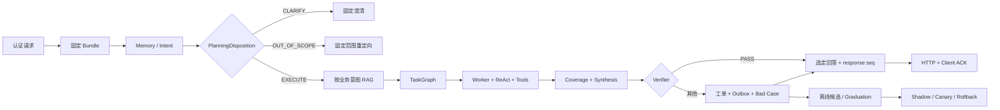

# 项目讲述与技术取舍

> 全中文项目讲述页：先说解决了什么问题，再用 Owner、合同、失败路径和证据解释技术选择；页面中的架构图可点击放大。

这页回答两个面试问题：**“你的项目到底解决什么问题？”**和**“为什么这样设计？”**。完整调用链和源码定位请看[完整架构教程](./)。

## 30 秒版本

DialogPilot 是一个使用 Python 和 FastAPI 实现的多 Agent 客服后端。我不是把所有能力塞进一个 Prompt，而是先用 LLM、本地字符 n-gram 和规则融合识别意图，再由 Orchestrator 将请求收敛为 `EXECUTE / CLARIFY / OUT_OF_SCOPE`；只有执行态才转换成带依赖、上下文范围、风险和验收条件的 `TaskGraph`，由 General、Technical、Billing、Account Security 等 Worker 分波执行。

每个 Worker 内部使用有界 ReAct，只能调用 ToolManager 暴露的白名单工具。ToolManager 而不是模型负责风险分级、写操作审批、超时、审计和结果脱敏。并行结果必须先通过 `CoverageGate`，证明所有必做任务都有闭合结果，再由 `ResultSynthesizer` 处理顺序、冲突和部分成功。最终只有 `AnswerVerifier` 明确判为 `PASS` 的候选可以发布；失败则确定性转入带幂等键和状态历史的 SQLite 人工工单。

记忆层以 Redis 原始事件日志为事实来源，每个完整发布轮次立即用稳定 ID 幂等写入 ChromaDB，Token 压缩只负责固定序列范围的摘要/checkpoint。长期召回融合 BM25、向量和时效性排名，排除当前会话，并对最相关旧会话展开有界前后消息窗口。未关闭工单直接从 TicketService 投影，结构化事实保留来源及替代/撤销状态。这样既能恢复客服事项，又不会因为只搜索摘要或孤立片段而丢失订单号、纠正语境和处理进度。

HTTP 边界从签名 JWT 中取得用户身份，不信任请求体提交的 `user_id`。请求级 `TraceId` 串联 HTTP、ReAct 和工具调用。写操作等待审批时持久化 Run checkpoint，授权后以原 Bundle 和 task_id 幂等恢复。校验失败、任务覆盖失败、工具副作用不确定以及可信用户反馈会进入独立的 Bad Case 状态机；复现和修复后的样本只作为 provisional dev regression，不冒充人工 Gold 或全新 heldout。

Bad Case 不会在线改生产 Prompt。系统先用脱敏版本信封做责任归因，只对 Prompt、Few-shot、路由、检索和工具描述生成 4–8 个不可变候选；候选经过安全硬门禁、Rubric、heldout 合同和质量/延迟/成本 Pareto 后，才按 Shadow、5%、25%、Active 灰度。越权、隐私、跨用户召回或错误写操作会原子切回上一 Bundle。

## 主链路怎么讲

```text
请求与可信身份
  → 解析并固定 AgentBundle / Rollout 版本
  → 读取记忆
  → 多信号意图识别
  → Planner 处置：EXECUTE / CLARIFY / OUT_OF_SCOPE
      ├─ CLARIFY / OUT_OF_SCOPE：固定策略回复并结束
      └─ EXECUTE：继续客服执行链
  → 按业务意图检索知识
  → 读取未关闭工单并构建 TaskGraph
  → 按依赖波次执行 Worker / ReAct / Tool
  → 必要时持久化审批 Checkpoint 并 Resume
  → CoverageGate
  → ResultSynthesizer
  → AnswerVerifier
  → 创建人工工单 + 同事务 outbox（按需）
  → 持久化 response_id / response_seq 与真实发布结果
  → HTTP 返回；客户端渲染后 ACK，断线按 seq 续取
  → Redis 防抖任务批量抽取 L1 事实，并记录 Bad Case
  → 脱敏归因 → 离线候选 → Graduation → 灰度/回滚
```



## 关键技术取舍

### 为什么融合三路意图信号？

LLM 擅长处理自然语言歧义；本地字符 n-gram 是确定性语义降级路径；规则对订单号、错误码、退款词和金额等结构化特征更稳定。三路并发控制延迟，加权投票保留各来源分数，出现误路由时能够定位到底是哪一路判断出了问题。

代价是系统比单模型分类复杂，因此合同明确规定只分类一次，知识选择和 Agent 路由必须复用同一个 `IntentResult`，避免两个识别实例或两次调用产生分叉结论。

### 为什么只对业务意图检索知识？

知识库能提升业务回答的事实性，但把检索结果塞进问候、闲聊或人工转接请求只会污染上下文、增加延迟和重排成本。因此由意图结果控制检索门，而不是每条请求都无条件执行 RAG。

### 为什么业务范围外请求不交给 GeneralAgent？

无恶意不等于属于产品范围。天气、股票、通识和写代码等请求会被识别为高置信度 `OTHER`，由 Orchestrator 返回 `OUT_OF_SCOPE` 固定回复；低置信度 `OTHER` 则返回 `CLARIFY`。这两个 Planner 终态都不能携带 TaskGraph，所以不会调用 Worker、RAG、ReAct、工具、Verifier、Shadow 或人工工单。

如果只在 GeneralAgent Prompt 里写“不要回答无关问题”，边界仍由概率模型决定；即使它完整回答了“六边形有几条边”，AnswerVerifier 也可能认为答案与问题相关而放行。类型化处置把范围策略变成可测试的代码合同。明确问候和感谢仍由 GeneralAgent 接待；`OUT_OF_SCOPE` 轮次不会写入客服工作记忆、情景索引或用户画像。

### 为什么是 TaskGraph，而不是简单选择几个 Agent？

General、Technical、Billing 和 Account Security 不只是不同 Prompt，它们对应不同业务责任与风险边界。Orchestrator 生成的不是 Agent 名单，而是 `TaskGraph`：每个必做任务都有稳定 ID、唯一 Owner、范围、依赖、可见上下文、副作用上界、风险和完成标准。旧名 `TaskPlan` 只是兼容导入别名。

Worker 共享一个 `ExecutionWindow`，最终结果只能是：

```text
SUCCESS / TIMEOUT / ERROR / BUDGET_EXCEEDED /
BLOCKED_DEPENDENCY / AWAITING_APPROVAL
```

`CoverageGate` 负责完整性，`ResultSynthesizer` 负责去重、冲突、输出顺序和部分成功证据。这样并发不会把“有 Agent 返回”误当成“用户问题已经完整解决”。

### 为什么外层确定性规划、内层有界 ReAct？

外层 `TaskGraph` 固定必做工作、依赖、上下文范围、风险、截止时间和覆盖要求，使客服流程可复现；ReAct 只负责一个任务 Owner 内部的工具选择。这样保留了 Worker 根据观察结果继续行动的能力，又防止自由委派抹掉任务身份或绕过工具授权。

### 为什么按 Token 而不是消息条数压缩？

消息数量无法准确代表模型输入长度。DialogPilot 估算 Prompt Token，保留最近原始轮次，只把最老且尚未覆盖的固定序列范围压缩成不可变 Chunk。Redis 乐观事务只推进该范围的检查点；后来到达的消息序号更大，不会让正在生成的摘要失效。

完整发布轮次写入 Redis 后会立即用确定性消息 ID 幂等写入情景记忆；压缩和会话结束 API 是补偿路径，并只在对应范围归档成功后推进检查点。原始事件日志不删除。用户画像只是活跃 L1 类型化事实的投影，不是每轮生成的 L3 Persona。`EXECUTE` 轮次把原文和一个会话级 Redis 延迟任务原子提交，默认累计 3 轮或空闲 5 分钟后批量提取；Worker崩溃后任务仍可恢复，成功才推进 fact checkpoint，显式 finalize 会立即尝试刷新。

### 为什么长期记忆使用混合召回？

摘要适合放进有界 Prompt，却可能丢掉订单号和错误码。系统因此检索原始情景 Chunk，分别得到 BM25 与向量候选，再用加权 RRF 融合并加入较小的时效性信号。当前 `conv_id` 由 Redis recent history 承担，不参与跨会话候选；命中保留事件定位，最相关的两个旧会话各展开前后两条消息，避免孤立回答脱离用户纠正语境。每条结果保留来源排名，效果可以用 `Recall@K`、`MRR` 和 `nDCG` 测量，而不是只凭一段流畅回答判断。

### 为什么工具权限不能交给模型？

模型只提出“想调用什么工具”，无权决定“是否允许调用”。ToolManager 根据 Agent 白名单、工具风险、宿主审批和执行状态机作决定；只读工具可以并发，潜在写操作串行并默认要求审批。超时、取消和未知副作用以类型化结果返回，审计记录只保存脱敏参数和结果摘要。

这能回答用户提示注入场景：即使用户要求忽略规则或伪造审批，模型也拿不到白名单外工具，写操作也无法绕过宿主授权。

### 为什么发布校验必须 fail-closed？

`AnswerVerifier` 拥有候选答案能否发布的最终决定权。如果解析失败或校验模型异常时默认放行，就等于绕过安全边界。因此结论集合闭合为 `PASS / REJECT / UNKNOWN`，只有 `PASS` 发布，其余状态进入安全人工转接。

校验结论也用于在线路由反馈，但不混淆模型可用性和答案质量。`PASS`、`REJECT` 更新真正候选生产者的样本感知 EWMA；`UNKNOWN` 只记录校验基础设施异常，不降低 Agent 质量。

### 为什么工单服务拥有独立状态机？

API 和 Orchestrator 可以申请人工升级，但只有 `TicketService` 负责工单身份、幂等、持久化、合法状态迁移和事件历史。这样 Controller 不能随意发明状态，相同 `request_id` 的重试也不会创建重复工单。

新建工单与 `ticket.created` outbox 在同一个 SQLite 事务提交；配置外部 CRM webhook 后，Worker 以稳定 event id 做至少一次投递和指数退避，成功才标记 delivered。未配置接收端时 outbox 保持 pending，不把“本地已建单”冒充“外部队列已接收”。

新请求会读取该用户最近三个未进入 `CLOSED` 终态的工单，并作为高于历史记忆的 `active_tickets` 数据 section 提供给 Worker；订单、退款和账户的实时状态仍由业务工具拥有。这样用现有工单状态承担轻量 Case Memory，不再复制一套案件数据库。

当前使用 SQLite 是为了让个人项目易部署；服务合同保持窄边界，多副本写入时可以迁移 PostgreSQL，而不用重写 Agent 主链。

### 如何证明回答真的到了客户端？

`/chat` 返回前由 `ResponseDeliveryService` 持久化 `response_id + response_seq + SELECTED`。客户端渲染后认证 ACK 为 `DELIVERED`，可选继续 ACK 为 `READ`；状态只单调上升。断线按 `after_seq` 续取。这里不用 MQ 冒充终端回执，因为 broker ACK 无法证明浏览器已经展示。

### 为什么 Bad Case 不等于 Ticket 或 Trace？

Ticket 负责用户人工处理流程，Trace 负责一次请求的诊断；二者都不拥有“工程缺陷是否复现、修复、验证或复发”的事实。`BadCaseRegistry` 因而单独持久化脱敏观察、合并重复症状，并要求 Owner、expected、fixture 和证据哈希齐全后才能进入 `REPRODUCED`，提交修复后才能进入回归验证，关闭后复发则自动重新打开。

### 为什么 Bad Case 不能直接回滚成 Agent 自我修改？

因为失败需要先做 Credit Assignment：意图错、任务拆分错、召回错、工具选错和权限漏洞的 Owner 不同。系统用 `EvolutionEnvelope` 固定请求实际使用的 Bundle 及组件哈希；安全、基础设施、timeout/cancel 和未知副作用直接阻断自动进化。只有配置 Owner 明确的问题，反思模型才可在闭合白名单中生成不可变候选。

候选不会直接覆盖 Active。`CandidateRunner` 实际运行 Gate 并产生带 provenance 的证据，`GraduationGate` 先检查不可被平均分抵消的安全合同，再比较质量、延迟和成本。发布按稳定用户分桶经历 Shadow、5% 和 25%；完整说明见[Agent 进化闭环](./agent-evolution/)。

## 业务范围改造如何用 STAR 讲

**S：** 原 Planner 把高置信度 `OTHER` 也生成成 `general_task`，例如“六边形有几条边”会进入 GeneralAgent；即使答案正确，Verifier 也只能证明它回应了问题，不能证明符合客服产品范围。

**T：** 在不把正常无关问题误判为攻击的前提下，让模糊请求可澄清、越域请求可重定向，并确定性证明没有 Worker、工具、工单和长期记忆污染。

**A：** 在 Orchestrator 增加闭合 `PlanningDisposition`，规定 `EXECUTE` 必须有 TaskGraph，`CLARIFY/OUT_OF_SCOPE` 必须无图；API 对策略终态发布固定回复并跳过模型 Verifier，`OUT_OF_SCOPE` 额外跳过 Redis/Chroma/画像写入。路由评测增加 disposition exact match，HTTP 集成测试使用会抛错的假 Worker、RAG、工具和 Verifier 证明这些路径未被调用。

**R：** 越域请求公开投影为 `agent_type=orchestrator`、空 Agent/Task/Outcome、`verification_reason_code=policy_terminal`，不创建人工工单；低置信度请求仍追问，明确问候仍由 GeneralAgent 执行，全仓 265 项测试通过。

## Agent 进化改造如何用 STAR 讲

**S：** 原有 Bad Case 能入库和导出回归，但人工直接改 Prompt 缺少版本归因，复合任务没有依赖/上下文隔离，写工具等待批准后也无法恢复。

**T：** 让运行时任务可依赖执行、写操作可恢复，同时让线上失败只能通过可验证、可灰度、可回滚的方式推动 Agent 策略升级。

**A：** 将兼容 `TaskPlan` 升级为 `TaskGraph`，增加依赖波次、`context_refs` 与阻塞状态；用 SQLite RunStore 固定 task/Bundle/工具调用并通过 CAS Resume；再实现 EvolutionEnvelope、不可变 AgentBundle、GEPA-lite 受限候选、带证据 Graduation/Pareto，以及 Shadow → 5% → 25% → Active 和硬/软回滚。

**R：** 请求内版本不漂移，依赖失败不再误调后继，审批重放不重复写，候选不能修改权限或绕过 Gate，灰度与回滚收敛为原子状态迁移；当前全仓 265 项测试通过。评测数据仍是 provisional，因此结果只表述为合同回归，不虚构生产准确率。

## 面试时应该诚实说明的指标边界

调用 `/eval/run` 得到结果时，必须同时说明数据集规模、模型、日期和运行配置。仓库目前拥有 500 条 provisional 分层评测、25 篇检索文档、公开数据适配器及确定性分层指标，但还没有获得独立人工仲裁的 Gold 数据。

因此可以说：

> 我建立了覆盖意图、路由、RAG 和 Stateful 合同的版本化回归体系，并用 Macro-F1、Owner Exact Match、Recall@K、MRR、nDCG 及 Owner fixture 验证不同层级。

不能说：

> 项目已达到生产准确率，或 500 条数据全部属于人工 Gold。

内置 11+5 条用例只是 smoke test，也不能代替代表真实业务分布的 heldout 评测。
