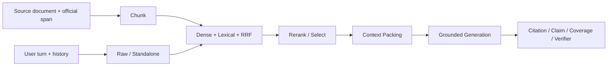

> 历史专题入口：本页保留当时的实现与实验口径，当前代码请以[2026-09-08架构手册]({{ '/architecture.html' | relative_url }})、[RAG选型与评测]({{ '/rag-study.html' | relative_url }})和[80个追问]({{ '/interview-guide.html' | relative_url }})为准。


# 客服 RAG 全链路评测：选择默认值，也保留失败实验

> 本页区分两类事实：Doc2Dial 历史实验回答“为什么选择当前默认”，当前分支的 PostgreSQL Owner 测试与本地 `/chat` 报告回答“重构后链路是否仍满足合同”。已删除的旧 ablation 模块不再作为可运行入口。

## 1. 评测对象

RAG 不是一个 Recall 指标，而是一条有损数据流：



每层都单独报告输入、输出和损失，避免 Generation 的流畅文字掩盖检索失败，也避免候选 Recall 掩盖 packing 后证据丢失。

## 2. 数据与 split

历史实验使用官方 Doc2Dial v1.0.1 的确定性小子集：

- Dev：最多 100 文档、300 case、四个服务领域、488 个官方 grounding span；
- Heldout snapshot：官方 test split 的 40 文档、48 case；
- 相关文档之外加入确定性 distractor；
- 原始第三方大语料不提交，生成物在 `artifacts/eval/`；
- group 按 dialogue 固定，避免同一对话泄漏到选择与验证两侧。

```bash
PYTHONPATH=. .venv/bin/python scripts/build_doc2dial_rag_subset.py \
  --output artifacts/eval/doc2dial-rag-mini-dev-v1 \
  --split dev --max-documents 100 --max-cases 300
```

Dev 可以选择配置；Heldout 只能报告冻结配置。被用于修复的 heldout 会降级为 consumed regression。

## 3. Chunk：先保护官方 span

Chunk 评测不调用检索器，只检查官方 evidence span 是否被完整保留、跨越多少 chunk、是否出现 offset 漂移和极端碎片。

```bash
PYTHONPATH=. .venv/bin/python -m evaluation.rag_chunk_ablation \
  artifacts/eval/doc2dial-rag-mini-dev-v1 --split dev \
  --output artifacts/eval/doc2dial-rag-mini-dev-v1/chunk-ablation.json
```

历史 Dev 在 `256/32`、`512/64`、`768/96` token 配置中选择 fixed `512/64`：它在证据保持、候选粒度和上下文成本间更平衡。实验也修复了全文 `strip()` 导致原始 evidence offset 漂移的问题。

当前 PostgreSQL SourceRevision 保留 revision/checksum 与 `[start_char, end_char)`；chunk id、dense vector 和 FTS posting 都是可重建投影。

## 4. Retrieval：Dense、Lexical 与 RRF

历史分层结果支持当前默认：

| 配置 | 结论 |
|---|---|
| Dense only | 对语义改写有帮助，但精确业务词和实体不足 |
| BM25/lexical only | 客服政策词面强，整体可靠，但语义补召回不足 |
| Dense `.25` + Lexical `.75`, RRF `k=10` | 在 Doc2Dial Dev 上取得更稳的综合排序 |

当前分支的在线实现已迁移为 PostgreSQL pgvector + 中文 FTS，候选 20、最终 5。旧 `evaluation.rag_retrieval_ablation` 和 Chroma producer 已删除，因此历史数值用于解释默认值，不应再复制旧命令声称可以在当前 head 复现。

重构后的验证重点是：

- 同一 stable chunk id 贯穿 dense、lexical、RRF、rerank、packing 和 citation；
- 唯一 ACTIVE generation 完整绑定 source/chunk/index/scope；
- 任一投影缺失或版本不一致时 fail closed；
- local E2E 的 health 暴露 `postgresql+pgvector+pg_fts`。

## 5. Query Transformation

Raw query 保留用户原话；Standalone query 只消解对话指代。当前默认按 Raw `.25` / Standalone `.75` 进入相同检索 Owner。

查询捕获仍可运行：

```bash
PYTHONPATH=. .venv/bin/python -m evaluation.rag_query_capture \
  artifacts/eval/doc2dial-rag-mini-dev-v1 --split dev \
  --max-cases 48 --concurrency 3 \
  --output artifacts/eval/doc2dial-rag-mini-dev-v1/query-capture.json
```

捕获文件固定模型和输出，后续离线重放可把 Query 影响与检索/生成随机性分开。改写必须保留否定、实体和用户约束；失败时保留 Raw 路径，而不是生成未经证明的新需求。

## 6. Rerank 与结构化排列

Rerank 的合同是候选 permutation，不是新文档或新证据。当前局部 PydanticAI ToolOutput 使用短别名，验证无缺项、无重复、无越界后再映射到 stable chunk id。

历史实验中 Flash rerank 提升部分 MRR，但也带来延迟和 Token。MiniLM cross-encoder 在 12 条合成双条件压力集上更快、平均更好，却在普通长文 36 条上退化并出现 harmful cases，所以没有替换当前默认。

“平均更好”不满足非劣门禁。若 fallback signal 与错误不单调，不能选择一个方便 margin 阈值假装风险已关闭。

## 7. Context Packing

当前默认 Top-5、2600 estimated tokens。Packing 评测检查：

- packed evidence recall；
- chunk 数和最终文本 Token；
- source header、分隔符和 HTML 转义是否计费；
- 当前问题能否完整容纳；
- citation identity 是否与输入候选一致。

```bash
PYTHONPATH=. .venv/bin/python -m evaluation.rag_packing_ablation \
  artifacts/eval/doc2dial-rag-mini-dev-v1 \
  artifacts/eval/doc2dial-rag-mini-dev-v1/rerank-report.json \
  --output artifacts/eval/doc2dial-rag-mini-dev-v1/packing-ablation.json
```

脚本按源码中的 `PACKING_CONFIGS` 比较 Top-3/Top-5、1200/1800/2600 和去重配置；在 heldout 上只允许用 `--fixed-config` 报告 Dev 已冻结的候选。它需要历史 rerank capture 作为输入，不能在当前分支凭空重建已删除的旧 rerank producer。

预算唯一事实是最终拼接文本。若当前轮次自身无法装入，返回 `ContextBudgetExceededError`，不能只截断用户问题并继续回答。

## 8. Generation 与 Citation

Generation 不能用“返回了 JSON”代替质量。评测同时检查：

- structured contract failure；
- `answered / insufficient_evidence / conflicting_evidence` typed outcome；
- claim support 与 citation correctness；
- evidence citation recall；
- 语言、相关性、准确性和完整性；
- generator/Judge failure 是否显式暴露。

```bash
PYTHONPATH=. .venv/bin/python -m evaluation.rag_generation_evaluation \
  artifacts/eval/doc2dial-rag-mini-dev-v1 \
  artifacts/eval/doc2dial-rag-mini-dev-v1/packing-ablation.json \
  --concurrency 2 \
  --output artifacts/eval/doc2dial-rag-mini-dev-v1/generation-report.json
```

grounded v4 曾暴露高比例合同失败/拒答；v5 收紧结构化输出后，历史重放中的合同错误归零，但仍保留 typed abstention。拒答不是 parser failure，也不能被当作“模型没工作”。

## 9. 历史冻结快照

Doc2Dial 小型 heldout 快照的机器摘要记录在 [rag-heldout-summary-2026-09-01.json]({{ '/data/rag-heldout-summary-2026-09-01.json' | relative_url }})。关键切片包括：

| 阶段 | 冻结快照 |
|---|---|
| First stage, 48 cases | evidence Recall@20 `.6875`，MRR `.4711` |
| Query, 9 groups | Recall@20 `.6667`；MRR `.3648 → .4537`；harmful `0` |
| Rerank, 9 groups | Recall@5 `.6667`；MRR `.4537 → .6111` |
| Packing | Top-5/2600，平均 5 chunks / 2321 estimated tokens |
| Generation, 9 groups | citation recall `1.0`；Judge grounded `1.0`；correct `.7778` |

这是小样本反证和配置快照，不是高置信生产结论。报告日期、case 数、group 数和 scope 与指标同等重要。

## 10. 长文、父子结构与多条件实验

后续实验分别检查了：

- `>=8000` 字符相关文档的长文压力集；
- 相邻 multi-span 与真正双 requirement 的区别；
- fixed parent、dynamic auto-merge 与 unique-parent aggregation；
- Flash set selector 与 MiniLM cross-encoder；
- Gold-free 条件路由在 Doc2Dial 与 WixQA 的迁移性。

共同结论：一些候选能提升 Candidate recall 或局部 packed recall，但改善没有稳定穿透 Rerank/Packing，多条件 completeness 或跨数据集 non-regression。父子拓扑和低成本 cross-encoder 因此保持“实验未晋级”，当前默认仍是 fixed 512/64。

这说明评测的价值不只在选出更复杂的方案，也在拒绝无法证明的复杂度。

## 11. 当前 PostgreSQL 主链的复核

历史配置迁移到新 Owner 后，需要用当前代码验证合同，而不是只引用旧指标：

```bash
PYTHONPATH=. .venv/bin/pytest -q \
  tests/test_hybrid_retrieval_contract.py \
  tests/test_postgres_retrieval_foundation.py \
  tests/test_postgres_retrieval_projection.py \
  tests/test_postgres_knowledge_retriever.py \
  tests/test_knowledge_retriever.py \
  tests/test_requirement_coverage.py \
  tests/test_rag_pipeline_evaluation.py
```

```bash
PYTHONPATH=. .venv/bin/python scripts/run_local_e2e.py \
  --output evaluation/reports/local-e2e-v1.json
```

E2E 报告应同时出现 PostgreSQL engine/generation/manifest、真实 JWT 请求、Evidence/Coverage/Verifier 结果和明确 `scope_limit`。只有 unit metric 或 health 字符串都不足以证明完整回答链。

## 12. 选择纪律

候选配置只有同时满足以下条件才可替换当前默认：

1. Dev 目标 slice 有清晰、可重复改善；
2. 普通问题、长文、多条件、否定与 OOS slice 无不可接受退化；
3. 延迟、Token、内存和依赖成本在预算内；
4. stable identity、scope、provenance 和 fail-closed 性质保持；
5. fresh heldout 与独立 reviewer 没有新反例；
6. 当前 PostgreSQL Owner 测试和真实 `/chat` E2E 通过。

当前没有真实线上流量，结论是显式替换本地 binding，而不是 Shadow/Canary。未来若进入生产，再单独定义 cohort、窗口、回退和迁移 ADR。

## 13. 页面间口径

- [500 条分层评测]({{ '/evaluation-500/' | relative_url }})解释项目级四层覆盖，不是当前 RAG 选型报告。
- 本页解释实验与当前默认之间的因果关系。
- [生产化审计]({{ '/customer-service-rag-production-audit/' | relative_url }})检查 Owner、安全、数据治理和 readiness 缺口。
- [完整教程]({{ '/' | relative_url }})把 RAG 放回 admission、TaskGraph、publication 与 service continuity 的总链路。

---


